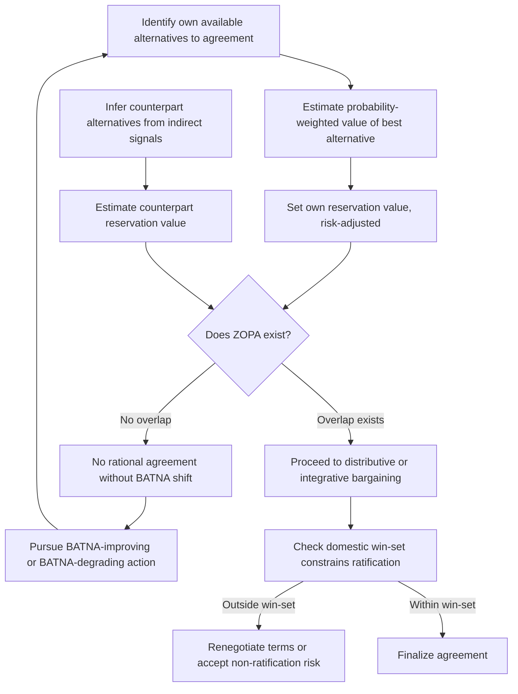

## BATNA and Reservation Value in Interstate Bargaining

### Theoretical Foundations

A **BATNA** (Best Alternative to a Negotiated Agreement) is the outcome a party would obtain by pursuing its best available course of action outside the current negotiation, should talks fail to produce agreement. The term was coined by Fisher and Ury in *Getting to Yes* (1981) as the analytic anchor for negotiation strategy: since no rational party should accept a negotiated outcome inferior to what it could secure unilaterally, the BATNA — not the opening position, and not some abstract notion of a "fair" outcome — is the correct benchmark against which any proposed deal must be evaluated.

The **reservation value** (or reservation point) is the point derived from the BATNA at which a party is indifferent between accepting the negotiated deal and walking away. Formally, if a party's BATNA yields expected value $V_{BATNA}$, the reservation value $R$ satisfies $R = V_{BATNA}$ under risk-neutral, single-issue conditions; where the negotiated outcome carries execution risk or delay, $R$ is typically discounted or risk-adjusted relative to $V_{BATNA}$, since a certain-but-delayed BATNA and an uncertain immediate agreement are not directly comparable without adjustment.

The relationship between two parties' reservation values determines the **ZOPA** (zone of possible agreement): recall that a ZOPA is the range of terms both parties would prefer over their respective BATNAs. Formally, for a buyer with reservation value $R_B$ (maximum willing to concede) and a seller with reservation value $R_S$ (minimum willing to accept) in a single-issue distributive frame, a ZOPA exists if and only if $R_B \geq R_S$; the width of the ZOPA is $R_B - R_S$. In interstate bargaining, this framework generalizes beyond price to any single dimension of concession (territorial extent, sanctions duration, troop withdrawal timeline) and, in genuinely multi-issue negotiations, decomposes into issue-specific reservation values that a party may trade off against one another (recall that this trading-off across issues, when priorities diverge, constitutes logrolling — an integrative bargaining mechanism).

### Why BATNA Analysis Differs at the Interstate Level

Interstate BATNA construction departs from Fisher and Ury's original commercial framing in several structurally significant ways:

**Multiplicity and ambiguity of alternatives.** A firm's BATNA in a commercial negotiation is often a discrete, identifiable alternative (a competing supplier's quote). A state's BATNA is frequently a bundle of non-exclusive options — continued status quo, escalation, appeal to a multilateral forum, alliance-seeking, or unilateral action — whose relative value is contested even within the negotiating state's own government. This makes interstate BATNA estimation an exercise in probabilistic and often classified intelligence assessment rather than simple price discovery.

**Asymmetric information and deliberate obscuring.** States have strong incentives to misrepresent their reservation value to shift the counterpart's perceived ZOPA midpoint favorably (recall the anchoring dynamic in distributive bargaining). Because a state's true BATNA often depends on classified military, economic, or alliance-related assessments, counterparts frequently must infer reservation values from indirect signals — troop mobilizations, economic indicators, public statements to domestic audiences — rather than from direct disclosure, a dynamic largely absent in commercial contexts where financial alternatives are more readily estimable.

**Domestic ratification constraints as a component of BATNA.** Under Putnam's **two-level game** framework (*Diplomacy and Domestic Politics: The Logic of Two-Level Games*, 1988), a state's negotiators must secure agreement both at the international table and with a domestic ratifying constituency (legislature, coalition partners, public opinion). This means a state's effective reservation value is bounded not only by its external alternatives but by the **win-set** — the range of agreements that domestic ratification processes will accept. A negotiator's reservation value can therefore be more conservative than the state's "true" external BATNA would imply, because an externally acceptable deal that falls outside the domestic win-set cannot be ratified and is therefore not a viable agreement regardless of its merits relative to the external alternative.

### Diplomatic Application: Estimating and Manipulating Perceived BATNA

**Case: Cuban Missile Crisis (1962).** The U.S. negotiating position rested on a BATNA assessment involving competing options — a naval quarantine, air strikes on missile sites, or full invasion — each carrying different escalation risk to a nuclear exchange. ExComm's internal deliberations, recall that ExComm was the U.S. Executive Committee of the National Security Council convened for the crisis, functioned substantially as an exercise in comparing the reservation value implied by each alternative against the negotiated outcome eventually reached (withdrawal of Jupiter missiles from Turkey, secret and undisclosed at the time, in exchange for Soviet withdrawal from Cuba and a public U.S. non-invasion pledge). Soviet premier Khrushchev's decision to accept the deal reflected a reservation value shaped by the USSR's inferior conventional and strategic position in a direct confrontation — a BATNA meaningfully worse than the negotiated settlement. [Inference: precise reservation-value quantification for either side is a retrospective analytic reconstruction; contemporaneous decision-makers operated under substantial uncertainty about the other side's true alternatives.]

**Case: Iran nuclear negotiations, sanctions-relief calculus.** Iran's reservation value in the P5+1 talks was shaped by the deteriorating BATNA of continued isolation under intensifying multilateral sanctions (the 2012 EU oil embargo and SWIFT exclusion measures materially worsened Iran's no-deal alternative over time), which is a documented instance of a **BATNA-shifting tactic**: escalating a counterpart's costs of walking away, thereby lowering their effective reservation value and widening the ZOPA in the escalating party's favor. Sanctions regimes function generally in interstate bargaining as a deliberate BATNA-degradation instrument rather than merely a punitive measure.

**Case: NATO enlargement negotiations and Russian reservation value (1990s–present).** [Speculation: Russian reservation values regarding NATO enlargement are frequently asserted by different analytic traditions with materially different content — some framing the relevant Russian BATNA as tied to formal Cold War-era assurances, others disputing that any binding commitment existed — and the underlying archival record remains genuinely contested; treat specific claims about a documented Russian reservation value on this question with caution rather than as settled fact.]

### BATNA-Improvement as a Strategic Objective

Because a party's negotiating leverage is a direct function of the gap between its BATNA and the counterpart's, a substantial share of pre-negotiation diplomatic activity is devoted not to the negotiation itself but to **improving one's own BATNA or degrading the counterpart's** before talks begin or resume:

- **Alliance-building** to create outside options (e.g., a state seeking security guarantees from a third party before entering territorial talks, thereby raising its own walk-away value).
- **Sanctions and economic pressure** to degrade a counterpart's BATNA (as above, Iran).
- **Fait accompli tactics**, in which a party unilaterally alters the facts on the ground (territorial occupation, settlement construction) to shift the effective reservation value of a future negotiated settlement — since undoing an established fact on the ground carries its own cost, altering both parties' calculus of the status quo alternative.
- **Multilateral forum-shopping**: threatening or pursuing adjudication before the International Court of Justice or arbitration under UNCLOS Annex VII as an outside option that raises a state's BATNA relative to bilateral negotiation, thereby increasing the settlement pressure on a counterpart preferring to avoid binding third-party adjudication.

### Diagnostic Structure

### Legal and Procedural Interface

A state's assessment of its BATNA frequently includes the alternative of formal dispute settlement rather than negotiated bilateral resolution. Where a treaty regime provides compulsory jurisdiction — for instance, **UNCLOS Article 287** (choice of procedure for dispute settlement) and **Annex VII** (compulsory arbitration as the default mechanism absent another declared choice) — the availability of binding adjudication as an outside option materially affects a state's reservation value in a bilateral maritime negotiation, since a party confident of a favorable arbitral outcome has less incentive to concede in bilateral talks. This interface is why treaty drafters negotiating dispute-settlement clauses (a **VCLT Article 33**-adjacent procedural question when multiple authentic language texts or forum clauses are at issue) are, in effect, negotiating over the future BATNA available to each party in subsequent disputes arising under the treaty.

**Key Points**

- BATNA is the benchmark alternative to agreement; reservation value is the derived indifference point, risk-adjusted where the negotiated outcome carries different certainty or timing than the alternative.
- ZOPA existence requires the buyer's/conceding party's reservation value to be at least as generous as the seller's/other party's reservation value; width of ZOPA equals the gap between them.
- Interstate BATNA estimation is complicated by multiplicity of alternatives, deliberate misrepresentation, and Putnam's two-level game constraint (domestic win-set as an added bound on effective reservation value).
- States actively invest in BATNA-improvement (alliances, forum-shopping) and BATNA-degradation of counterparts (sanctions, fait accompli tactics) as a primary category of pre-negotiation strategy.
- Formal dispute-settlement regimes (UNCLOS Annex VII, ICJ jurisdiction) function as a codified outside option that shapes bilateral reservation values even when adjudication is never actually pursued.

**Related Topics**

- Two-level games and the domestic win-set constraint on treaty ratification
- Fait accompli and unilateral action as reservation-value manipulation
- Sanctions regimes as a BATNA-degradation instrument: legal basis under UN Charter Chapter VII
- UNCLOS Annex VII compulsory arbitration and its strategic use as an outside option
- Signaling and costly signals in interstate bargaining under asymmetric information
- Distributive versus integrative bargaining in diplomatic negotiation