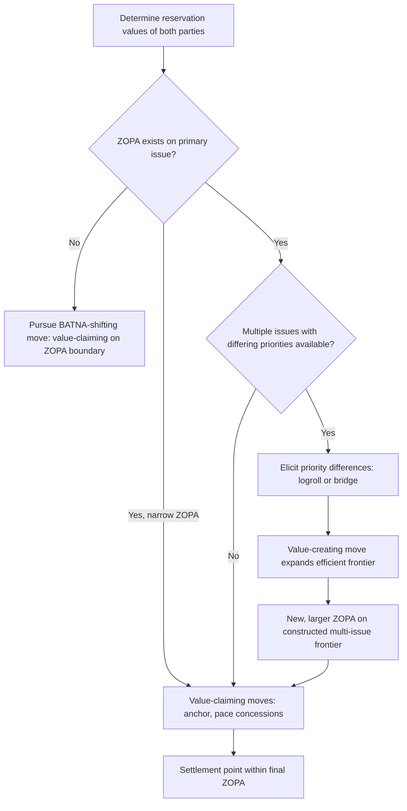

## Zone of Possible Agreement and Value-Claiming versus Value-Creating Moves

### Theoretical Foundations

A **ZOPA** (zone of possible agreement) is the range of terms along a bargaining dimension that both parties would prefer over their respective BATNAs. Recall that a **BATNA** (best alternative to a negotiated agreement) sets the reservation value at which a party is indifferent between accepting a deal and walking away. In a single-issue distributive frame, if $R_B$ denotes a conceding party's maximum acceptable concession and $R_S$ denotes the counterpart's minimum acceptable concession, a ZOPA exists if and only if $R_B \geq R_S$, with width $R_B - R_S$; any agreement point within that interval is individually rational for both parties, though the two parties will generally disagree about where within the interval the settlement should fall.

**Value-claiming** and **value-creating** are the two categories of move a negotiator can make within or around this structure, formalized by Lax and Sebenius in *The Manager as Negotiator* (1986). A value-claiming move seeks to shift the eventual settlement point toward one's own end of an existing ZOPA — it operates on the assumption that the pie (the ZOPA's width) is fixed and contested. A value-creating move instead seeks to enlarge the pie itself: to identify or construct trades that shift the *efficient frontier* of possible outcomes outward, making some new agreement point preferred by both parties to any point achievable on the original ZOPA. Formally, on a single dimension the ZOPA is a fixed interval and only value-claiming is structurally possible; value-creation requires introducing additional issues or contingent structures, converting the problem from single-issue distributive bargaining into the multi-issue integrative bargaining previously discussed, where trades across differently-prioritized issues can produce Pareto improvements unavailable on any single dimension alone.

### The Negotiator's Dilemma, Applied to Move Selection

Lax and Sebenius identify a structural tension governing which moves a rational negotiator should make and when: **value-claiming tactics** (withholding information about one's reservation value, exaggerating the cost of concessions, hard anchoring) are frequently the same behaviors that **inhibit value-creation**, because identifying integrative trades requires the mutual disclosure of priorities that value-claiming behavior is designed to prevent. A negotiator who conceals all information to maximize claiming power on a given issue simultaneously forecloses the counterpart's ability to identify a logroll (recall: trading concessions across issues valued differently by each party) that could have benefited both. This is the **negotiator's dilemma**: value-creating and value-claiming are not simply sequential phases but competing uses of the same negotiating behavior, and a negotiator must decide, move by move, how much disclosure to risk for the prospect of an enlarged pie.

### Diagnostic Taxonomy of Moves

| Move type | Mechanism | Effect on ZOPA |
| --- | --- | --- |
| Anchoring | Extreme opening offer shifts counterpart's perceived reservation value | Value-claiming: shifts perceived (not actual) settlement point within existing ZOPA |
| Concession pacing | Small, decelerating concessions signal proximity to true reservation value | Value-claiming: manages information about own $R$ |
| Log-rolling | Trading concessions across issues with divergent priority weighting | Value-creating: expands frontier by exploiting priority asymmetry |
| Bridging | Inventing a new option satisfying both parties' underlying interests | Value-creating: satisfies interests unavailable to either original position |
| Contingent contracts | Agreement terms conditioned on uncertain future events, exploiting differing risk assessments or beliefs | Value-creating: converts a disagreement about facts into a wager both sides accept |
| Threats and linkage to external costs | Raising the cost of the counterpart's BATNA (recall: BATNA-degradation) | Value-claiming: shifts the ZOPA boundary itself, not merely the settlement point within it |

### Diplomatic Application: Camp David Accords (1978)

Recall that Israel's positional demand was continued security control of the Sinai Peninsula while Egypt's positional demand was full territorial sovereignty; the underlying interests — Israeli security from cross-border attack, Egyptian sovereignty and national dignity — were not directly opposed. The Camp David negotiation illustrates the shift from a narrow, contested ZOPA on the single dimension of "territorial control" (a dimension on which the parties' positions barely overlapped, if at all) to an integrative reframing across dimensions of sovereignty, demilitarization, and phased withdrawal timing, on which a mutually preferred outcome existed. U.S. mediators' use of a **single negotiating text procedure** — recall that this is a process in which a third party drafts and iteratively revises a composite proposal rather than either principal disclosing reservation values directly — functioned specifically to enable value-creating disclosure while limiting the value-claiming exploitation risk inherent in direct bilateral information exchange (the negotiator's dilemma, managed institutionally rather than left to each party's individual restraint).

### Diplomatic Application: START I Negotiations (1991)

The U.S.–Soviet Strategic Arms Reduction Treaty negotiations combined both move types within a single framework. Value-claiming dynamics governed the core distributive dimension — aggregate warhead ceilings, where each additional permitted warhead for one side was, in first approximation, a loss of relative strategic position for the other. Value-creating moves appeared in the treaty's differentiated sub-limits and verification architecture: asymmetric treatment of different missile categories (ICBMs, SLBMs, heavy bombers) allowed each side to concentrate reductions in the categories it valued least relative to its own strategic doctrine, a logroll across weapon-category priorities rather than a uniform proportional cut, which would have been the outcome of pure value-claiming bargaining over a single aggregate ceiling.

### Diplomatic Application: EU–UK Brexit Withdrawal Agreement (2020)

Recall that Article 50 TEU (not VCLT; an EU constitutional provision) governed the procedural framework for the UK's withdrawal, but the negotiation's substantive content illustrates the move taxonomy directly. The financial settlement ("divorce bill") and the Northern Ireland protocol were negotiated on substantially different logics: the financial settlement was closer to a pure value-claiming exercise over a calculable, largely fixed quantity (accrued EU budgetary obligations), while the Northern Ireland protocol involved value-creating structure — a differentiated customs and regulatory arrangement designed to satisfy the EU's single-market integrity interest and the UK's sovereignty interest and the Good Friday Agreement's open-border interest simultaneously, rather than forcing a single-dimension trade-off among the three. [Inference: the protocol's subsequent renegotiation via the 2023 Windsor Framework suggests the original bridging solution did not fully resolve the underlying interest conflicts on implementation, illustrating that a value-creating structure at signature does not guarantee durability if the interests were imperfectly mapped.]

### Structural Diagram

### The Efficiency Frontier and Settlement Point Distinction

A precise formulation distinguishes two separate questions that are frequently conflated in casual negotiation commentary: (1) *whether the parties reach an efficient outcome* — one on the Pareto frontier, such that no alternative agreement could make either party better off without harming the other — and (2) *where along that frontier the settlement falls*, which is a purely distributive question about the division of the (now possibly enlarged) joint gains. Value-creating moves address question (1); value-claiming moves address question (2). A negotiation can produce a highly efficient, value-maximizing agreement that is nonetheless perceived as unfair by one party if that party's value-claiming performance within the resulting ZOPA was comparatively weak — efficiency and equitable division are analytically independent properties of an outcome.

**Key Points**

- ZOPA is the interval, bounded by each party's reservation value, within which any agreement is individually rational; value-claiming shifts the settlement point within the ZOPA, value-creating expands the ZOPA or the underlying frontier itself.
- Lax and Sebenius's negotiator's dilemma captures the structural tension: value-claiming behaviors (information concealment) frequently inhibit the disclosure value-creation requires.
- Logrolling, bridging, and contingent contracts are the principal value-creating mechanisms; anchoring, concession pacing, and BATNA-degrading threats are the principal value-claiming mechanisms.
- Camp David 1978 illustrates institutional management of the negotiator's dilemma via single negotiating text procedure; START I illustrates value-creating logrolling across weapon-category sub-limits within an overall value-claiming ceiling negotiation.
- Efficiency (reaching the Pareto frontier) and distribution (where on the frontier the outcome lands) are analytically separate; an efficient outcome is not automatically an equitably divided one.

**Related Topics**

- Distributive versus integrative bargaining in diplomatic negotiation
- BATNA and reservation value in interstate bargaining
- Single negotiating text procedure and third-party mediation design
- Two-level games and the domestic win-set constraint on treaty ratification
- Contingent contracts and differing beliefs as a value-creation mechanism
- Article 50 TEU withdrawal procedure and the Windsor Framework renegotiation