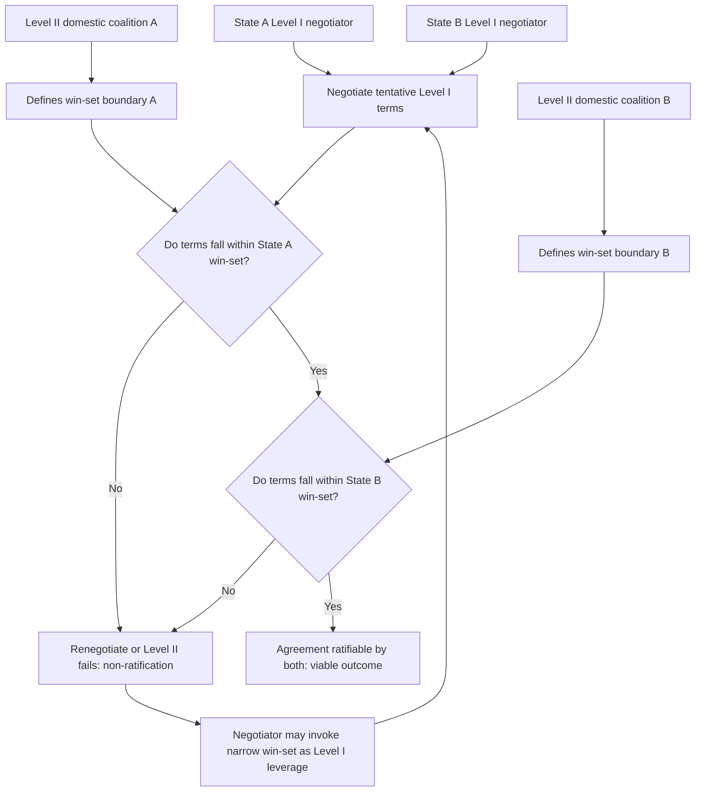

## Two-Level Games and the Domestic Ratification Constraint

### Theoretical Foundations

The **two-level game** framework, formalized by Robert Putnam in *Diplomacy and Domestic Politics: The Logic of Two-Level Games* (1988), models international negotiation as the simultaneous conduct of two linked bargaining processes rather than one. **Level I** is the negotiation between national representatives at the international table, in which a chief negotiator seeks agreement with a foreign counterpart. **Level II** is the negotiation between that same chief negotiator and their own domestic constituency — legislature, cabinet coalition, interest groups, or public opinion — whose consent is required to ratify or implement whatever is agreed at Level I. A negotiator is therefore simultaneously a Level I bargainer seeking the best deal obtainable from the foreign counterpart and a Level II bargainer seeking to secure domestic acceptance of that deal, and the two processes are not independent: any Level I agreement that Level II will not ratify is not, in the framework's terms, a viable agreement at all, regardless of how favorable its terms appear internationally.

**Win-set.** Putnam formalizes the domestic constraint through the concept of the **win-set**: for a given state, the win-set is the set of all possible Level I agreements that would secure the necessary domestic ratification (a legislative majority, a coalition's consensus, sufficient public acquiescence) if actually put to that ratification process. A negotiator's *effective* reservation value at Level I — recall that the reservation value is the point at which a party is indifferent between accepting a deal and invoking its BATNA — is therefore bounded not only by the state's external alternatives but by the boundary of its own win-set: an agreement outside the win-set cannot be implemented even if it would otherwise be preferred to the BATNA, because domestic actors possess an effective veto over ratification.

**Win-set overlap as the condition for agreement.** International agreement at Level I is possible only where the negotiating states' win-sets overlap — that is, where there exists at least one set of terms simultaneously ratifiable by both domestic constituencies. This reframes the ZOPA concept (recall: the zone of possible agreement bounded by each party's reservation value) as further constrained: even where an external ZOPA exists between two states' negotiators, no agreement is achievable unless that ZOPA also falls within the intersection of both states' domestic win-sets.

### Determinants of Win-Set Size

Putnam identifies three principal factors governing the size of a state's win-set, each independently manipulable by negotiators and domestic actors:

1. **Level II preferences and coalitions.** The distribution of preferences among domestic constituencies — a divided legislature, a fragile coalition government, or an organized interest group opposed to specific terms — narrows the win-set by increasing the range of terms some domestic veto-player will reject.
2. **Level II institutions.** Ratification procedures themselves shape win-set size independent of underlying preferences: a supermajority requirement (e.g., the U.S. Constitution's Article II requirement of two-thirds Senate consent for treaty ratification) mechanically narrows the win-set relative to a simple-majority requirement, because a larger blocking coalition becomes sufficient to defeat ratification.
3. **Level I negotiator strategies.** Negotiators can attempt to expand their own win-set (side payments to domestic constituencies, reframing the agreement's presentation, sequencing issues to build a ratifying coalition) or to *invoke* the narrowness of their win-set as a bargaining tactic at Level I — a maneuver examined next.

### The "Tied Hands" Tactic and Schelling's Precedent

Putnam's win-set concept operationalizes, at the interstate level, the paradox Thomas Schelling identified in *The Strategy of Conflict* (1960): a negotiator can *increase* bargaining leverage at Level I by *reducing* their own apparent flexibility, since a credible claim that "my legislature will not ratify anything beyond X" functions as a hard, externally verifiable constraint that a counterpart must accommodate, rather than a soft preference the counterpart might expect to erode through further concessions or pressure. This is the **"tied hands"** or **Schelling constraint** tactic: a negotiator deliberately narrows, publicizes, or exaggerates the narrowness of their domestic win-set specifically to extract concessions at Level I that a negotiator with a genuinely flexible mandate could not credibly demand. The tactic carries a corresponding risk: if the foreign counterpart judges the stated domestic constraint to be strategic bluff rather than a genuine binding limit, invoking it produces no leverage and may instead signal bad faith.

### Diplomatic Application: Versailles and U.S. Senate Non-Ratification (1919–1920)

The Treaty of Versailles negotiations illustrate a two-level game failure at the most consequential level: President Wilson negotiated Level I terms, including the League of Nations Covenant, that fell outside the win-set defined by the U.S. Senate under Article II's two-thirds requirement. Senate opposition, organized substantially around reservations to Article X (the League's collective-security provision) led by Senator Henry Cabot Lodge, reflected a Level II veto-player configuration that Wilson's Level I diplomacy had not adequately accommodated — whether through miscalculation of the Senate's win-set, insufficient consultation of Senate leadership during the Paris negotiations, or a genuine absence of overlap between the negotiated terms and any ratifiable configuration. The result was U.S. non-ratification of the treaty, a canonical instance of a Level I agreement failing entirely at Level II despite having been successfully concluded among the international parties.

### Diplomatic Application: Camp David Accords and Israeli Knesset Ratification (1978–79)

Recall that the Camp David negotiations reframed Israeli–Egyptian positional conflict over the Sinai Peninsula into an integrative agreement combining Egyptian sovereignty with phased, demilitarized Israeli withdrawal. This Level I agreement required ratification through Israel's Knesset, where Prime Minister Begin's own coalition contained factions opposed to relinquishing Sinai settlements. President Carter's parallel diplomacy — including direct outreach shaping Israeli domestic political conditions around ratification — functioned as an attempt to expand the Israeli win-set concurrently with the Level I negotiation rather than treating ratification as a separate, subsequent stage; this illustrates that two-level game management is not confined to the negotiator alone but can involve third-party mediators actively working to enlarge a party's domestic win-set.

### Diplomatic Application: Iran Nuclear Agreement and the U.S. Congressional Constraint (2015)

The Joint Comprehensive Plan of Action (JCPOA) illustrates institutional avoidance of a narrow win-set rather than its accommodation. Because the agreement was concluded as an executive agreement rather than submitted as a treaty requiring Article II two-thirds Senate ratification, the Obama administration structured the instrument specifically to operate within a more permissive Level II procedural pathway (subject instead to the Iran Nuclear Agreement Review Act's congressional review mechanism, which required only that Congress not pass a joint resolution of disapproval — a materially larger effective win-set than a two-thirds ratification threshold would have permitted). [Inference: characterizing this instrument choice as deliberately win-set-optimizing reflects a widely held political-science interpretation of the administration's strategy rather than a stated official rationale.] The instrument's non-treaty status subsequently permitted unilateral U.S. withdrawal in 2018 without the higher institutional threshold that treaty termination might have implied — illustrating that Level II institutional choice affects not only the probability of ratification but the durability of the resulting commitment.

### Diagram: Win-Set Overlap and Agreement Conditions

### Legal and Procedural Interface

The two-level game framework maps directly onto the distinction, under domestic constitutional law and international treaty practice, between instruments requiring formal ratification and those that do not. **VCLT Article 14** identifies ratification, acceptance, approval, or accession as the means by which a state expresses consent to be bound where the treaty so provides or the negotiating states have otherwise agreed that ratification is required — meaning the Level II ratification procedure is not merely a domestic political formality external to international law but is itself incorporated into the treaty's own binding-consent mechanics. **VCLT Article 46** further provides that a state may invalidate its consent to be bound on the grounds that consent was expressed in violation of a domestic law of fundamental importance regarding treaty-making competence, though only where that violation was "manifest and objectively evident to any State conducting itself in the matter in accordance with normal practice" — a provision that directly constrains, but does not eliminate, a state's ability to later disavow a Level I agreement on Level II constitutional grounds after the fact.

**Key Points**

- Putnam's two-level game models diplomacy as simultaneous Level I (international) and Level II (domestic ratification) bargaining; a Level I deal outside the domestic win-set is not a viable agreement regardless of its international merits.
- Win-set size is shaped by Level II preference distribution, Level II ratification institutions (e.g., supermajority requirements), and Level I negotiator strategy.
- The "tied hands" tactic, extending Schelling's 1960 insight on the strategic value of reduced flexibility, allows a negotiator to convert a narrow domestic win-set into Level I leverage — at the risk of the constraint being judged strategic bluff.
- Versailles/U.S. Senate (1919-20) illustrates catastrophic win-set misjudgment; Camp David (1978-79) illustrates third-party mediation actively expanding a win-set; the JCPOA (2015) illustrates deliberate institutional selection of a more permissive ratification pathway.
- VCLT Articles 14 and 46 incorporate the domestic ratification requirement into the treaty's own international-law consent mechanics, while narrowly constraining after-the-fact disavowal on domestic-law grounds.

**Related Topics**

- BATNA and reservation value in interstate bargaining
- Zone of possible agreement and value-claiming versus value-creating moves
- Schelling's commitment devices and credible signaling in crisis bargaining
- VCLT Article 46 and the limits of invoking domestic law to invalidate treaty consent
- Executive agreements versus treaties: comparative ratification pathways
- Coalition politics and veto-player theory in treaty ratification