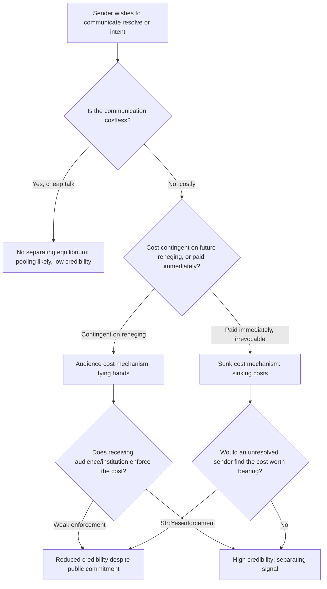

## Costly Signals and Credible Commitment in Diplomatic Communication

### Theoretical Foundations

**The cheap talk problem.** In a strategic interaction where parties have incentives to misrepresent private information — recall that interstate BATNA estimation is complicated precisely because states have incentives to misrepresent their reservation values to shift a counterpart's perceived ZOPA — costless verbal statements ("cheap talk") carry limited informational value, because a party willing to bluff would say the same thing regardless of its true position. Game-theoretic signaling models (formalized in the economics literature by Spence's 1973 job-market signaling model, and applied extensively to international relations by James Fearon in "Signaling Foreign Policy Interests: Tying Hands versus Sinking Costs," 1997) address this by distinguishing statements from **signals**: actions or commitments that are differentially costly depending on the sender's true type, such that only a sender with a genuine underlying resolve, capability, or intention would find it rational to send the signal at all. A costly signal achieves credibility precisely because it would be irrational to send if the sender's private information were otherwise — a bluffing party gains nothing from incurring a cost it would not incur if its true intentions matched the bluff.

**Separating versus pooling equilibria.** In formal signaling terms, an interaction reaches a **separating equilibrium** when the cost structure is such that only "resolved" or "high-capability" types send the costly signal and "unresolved" or "low-capability" types do not, allowing the receiver to correctly infer the sender's type from observing the signal. A **pooling equilibrium** occurs when the signal is cheap enough, or the potential benefit of bluffing high enough, that both types send the same signal regardless of true type — in which case the signal carries no informational content and the cheap-talk problem persists despite the signal's superficial costliness. Diplomatic signal design is substantially an exercise in constructing signals costly enough to separate resolved from unresolved actors without being so costly that even genuinely resolved actors decline to send them.

### Fearon's Two Mechanisms: Tying Hands and Sinking Costs

Fearon identifies two structurally distinct mechanisms by which a costly signal achieves credibility, both directly applicable to crisis diplomacy:

**Audience costs ("tying hands").** A leader who makes a public commitment — a public threat, an explicit red line stated before domestic and international audiences — incurs a cost specifically if that commitment is later abandoned: domestic audiences may punish the leader (electorally, politically) for backing down, and international audiences may discount the leader's future threats as non-credible. This audience cost is *contingent*: it is paid only if the leader reneges, not simply by making the statement. The mechanism is therefore state-institution-dependent — Fearon's original argument, and subsequent empirical extensions, suggest democratic leaders, facing more institutionalized domestic accountability and more attentive electorates, can generate larger audience costs (and thus more credible tying-hands signals) than autocratic leaders facing weaker domestic accountability mechanisms for foreign-policy reversal. [The magnitude and even the existence of a democratic advantage in audience-cost generation remains an active empirical dispute in the international relations literature; some studies find substantial audience-cost effects, others find them weak or contingent on specific institutional configurations.]

**Sunk costs ("sinking costs").** A state can instead signal resolve by incurring an *irrevocable* cost at the moment of signaling, independent of the eventual outcome — mobilizing military forces, moving assets into a forward position, or making an irreversible economic commitment. Unlike audience costs, a sunk cost is paid regardless of whether the state later follows through, which means the signal's credibility derives not from the threat of future punishment for backing down but from the fact that only a genuinely resolved state would find the immediate, unconditional cost worth bearing in the first place — an unresolved state has no reason to spend the resource if it does not intend to escalate further.

### Diplomatic Application: Cuban Missile Crisis Naval Quarantine (1962)

Recall that the Cuban Missile Crisis involved a U.S. reservation-value assessment across a range of alternatives from quarantine to invasion. The naval quarantine itself functioned as a costly signal rather than merely an operational military measure: by publicly declaring and enforcing a blockade line, the Kennedy administration incurred both audience costs (a domestic and international commitment that backing down from would have been politically damaging) and a form of sunk, escalatory commitment (naval interdiction of Soviet vessels risked direct confrontation, a cost borne independent of whether the Soviets ultimately withdrew). The deliberate choice of quarantine over an immediate air strike is frequently analyzed as calibrated signal design: costly enough to demonstrate resolve credibly, while preserving an off-ramp that an immediate strike would have foreclosed — illustrating the design tension between signal costliness and reversibility.

### Diplomatic Application: Démarches and Formal Diplomatic Protest

A **démarche** — a formal diplomatic representation delivered by one government to another, typically through an ambassador or senior official, expressing an official position, protest, or warning — occupies a graduated position on the costliness spectrum between pure cheap talk and a fully costly signal. A démarche's marginal credibility above ordinary statements derives from its formality and its creation of a documented, attributable diplomatic record: because a démarche is a recognized, catalogued instrument of diplomatic practice, delivering one carries a reputational cost if the stated position is later abandoned without explanation, distinguishing it from an informal remark, even though a démarche alone typically lacks the irrevocable material cost of a sunk-cost signal such as troop mobilization. States frequently escalate through a graduated sequence — informal warning, formal démarche, public statement, visible military repositioning — precisely to calibrate signal costliness to the perceived stakes and to preserve escalatory room.

### Diplomatic Application: Agrément and the Credibility Function of Diplomatic Appointment Procedure

An **agrément** is the formal, prior consent a receiving state gives to a sending state's nominee for ambassador before that nominee is formally appointed — governed in customary international law and codified in the **1961 Vienna Convention on Diplomatic Relations, Article 4**, which provides that the sending state must ascertain that the receiving state has given its agrément to the proposed head of mission before appointment, and Article 4(2), under which a receiving state is not obliged to give reasons for a refusal. While primarily a procedural mechanism, the agrément process functions secondarily as a low-intensity credibility signal in bilateral relations: a receiving state's refusal of agrément (or public delay) is an unusual and costly diplomatic act — carrying reputational and relational costs precisely because it is a departure from routine practice — that reliably signals serious displeasure with the sending state's choice or broader bilateral posture, more credibly than an equivalent verbal protest would.

### Diplomatic Application: Signaling in the Iran Nuclear Negotiations

Recall that Iran's reservation value shifted under the deteriorating BATNA created by escalating multilateral sanctions. Alongside this material BATNA-degradation, both sides employed costly signals to establish credibility of intent during the P5+1 talks: Iranian confidence-building measures — including verified reductions in enriched uranium stockpiles and centrifuge activity ahead of a final agreement — functioned as sunk-cost signals of negotiating good faith, since reversing an already-executed stockpile reduction would itself carry cost and delay. Conversely, U.S. congressional threats of additional sanctions legislation during the talks functioned as an audience-cost mechanism directed at the Iranian negotiating team, signaling that the U.S. executive's negotiating flexibility was domestically bounded (a two-level game dynamic, recall the win-set constraint on ratifiable Level I terms) in a manner intended to be credible precisely because Congress, as an independent institutional actor, could not simply be commanded to stand down by the executive.

### Diagram: Signal Credibility Assessment

### Legal and Procedural Interface

Costly signaling intersects with formal treaty-making at the point of **signature** under **VCLT Article 18**, which obliges a state that has signed a treaty (subject to ratification) to refrain from acts that would defeat the treaty's object and purpose pending ratification or a clear expression of intent not to become a party. Signature without ratification is itself a graduated costly signal in Fearon's typology: it falls short of the sunk cost of full ratification and binding consent, but Article 18's obligation attaches a real, if limited, legal cost to signature, distinguishing it from cheap talk and making the choice to sign — versus merely stating intent to eventually join — a meaningful signal of the state's trajectory, observable and legally consequential to counterpart states monitoring the negotiation's progress toward entry into force.

**Key Points**

- Costly signals achieve credibility because they are differentially costly to send depending on the sender's true type, producing a separating equilibrium where cheap talk would produce a pooling equilibrium with no informational content.
- Fearon's two mechanisms are audience costs (tying hands: cost paid contingently, upon reneging, often institution-dependent) and sunk costs (sinking costs: cost paid immediately and irrevocably, regardless of outcome).
- The 1962 naval quarantine illustrates calibrated signal design balancing costliness against preserved reversibility; démarches and agrément refusals illustrate graduated, procedurally embedded signals below the threshold of sunk military cost.
- The JCPOA negotiations combined Iranian sunk-cost confidence-building measures with U.S. audience-cost signaling via congressional constraint, operating within the two-level game's win-set framework.
- VCLT Article 18 attaches a real legal cost to treaty signature pending ratification, making signature a legally consequential signal distinguishable from mere stated intent.

**Related Topics**

- Two-level games and the domestic ratification constraint
- BATNA and reservation value in interstate bargaining
- Escalation ladders and graduated diplomatic-military signaling sequences
- Vienna Convention on Diplomatic Relations (1961): agrément, persona non grata, and diplomatic immunity procedures
- VCLT Article 18: obligations of a signatory state pending ratification
- Reputation and credibility across repeated interstate interactions