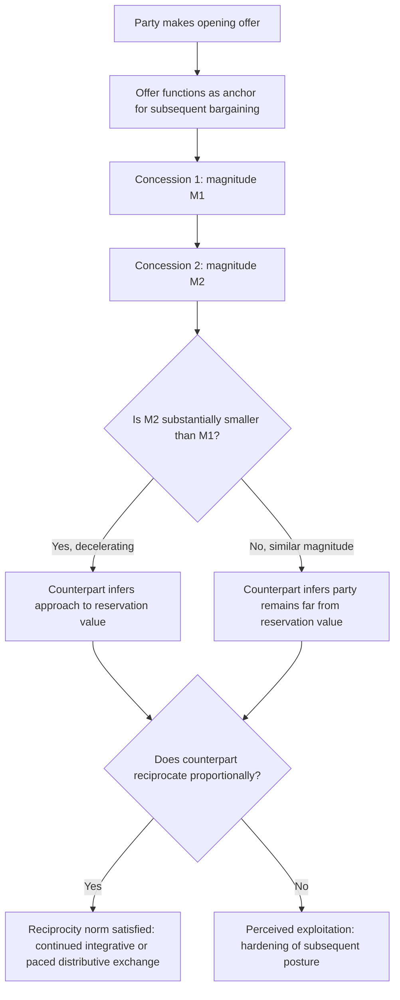

## Framing, Anchoring, and the Sequencing of Concessions

### Theoretical Foundations: Framing

**Framing** refers to the systematic influence of how a choice or outcome is presented — rather than its underlying substantive content — on a decision-maker's evaluation and preferences. The foundational theoretical basis is Kahneman and Tversky's **prospect theory** (1979) and, specifically, their framing experiments demonstrating that identical outcomes described in terms of gains versus losses relative to a reference point produce systematically different risk preferences: decision-makers exhibit **risk aversion in the domain of gains** (preferring a certain smaller gain over a risky larger one) and **risk seeking in the domain of losses** (preferring a risky chance of avoiding a loss over a certain smaller loss), a pattern inconsistent with the reference-point-independent utility maximization assumed by classical expected-utility theory. The critical mechanism is the **reference point**: because gains and losses are evaluated relative to a reference point rather than in absolute terms, whoever establishes the reference point against which a proposal is evaluated exercises substantial, non-substantive influence over how that proposal is perceived, independent of its actual terms.

**Diplomatic application of framing.** A concession framed as "reducing planned troop levels from 50,000 to 30,000" (framed relative to a higher planning baseline, emphasizing the reduction as a loss relative to that baseline for the conceding party, and thus signaling costly sacrifice) is substantively identical to "maintaining troop levels at 30,000" (framed relative to a status-quo baseline, emphasizing continuity rather than concession) — yet the two framings invite materially different interstate perceptions of what has been conceded and what reciprocal concession might be warranted in exchange. Diplomatic communiqués and joint statements are frequently negotiated word-by-word specifically over reference-point framing of this kind, because the frame — not merely the substantive commitment — shapes each domestic audience's assessment of whether their side "won" or "lost" the negotiation, which is directly relevant to the Level II ratification dynamics previously discussed (recall that a state's effective reservation value is bounded by its domestic win-set, and public perception of concession versus continuity materially affects a leader's ability to secure that domestic ratification).

### Theoretical Foundations: Anchoring

**Anchoring** is the cognitive bias, also identified by Tversky and Kahneman (in their 1974 "Judgment under Uncertainty" work), whereby an initial numerical or qualitative reference point exerts disproportionate influence on subsequent judgments, even when the anchor is arbitrary or known to be non-diagnostic of the true value. In negotiation specifically, the **first offer** functions as an anchor: extensive experimental bargaining literature (building on Galinsky and Mussweiler's 2001 negotiation-specific anchoring studies) finds that final settlement points correlate more strongly with the first offer's extremity than with either party's true reservation value, because the counterpart's subsequent counteroffers and concessions are cognitively adjusted from the anchor rather than generated independently from their own private assessment.

**Anchor extremity trade-off.** An anchor's persuasive power increases with its extremity up to a point, but an anchor perceived as outside the plausible range of a genuine opening position risks being dismissed outright rather than adjusted from — a counterpart who judges an anchor "insulting" or "not a serious opening position" may refuse to engage with it as a reference point at all, forfeiting the anchoring effect entirely and potentially damaging the negotiation's broader credibility and pace. Anchor calibration is therefore a central tactical judgment in distributive bargaining (recall that distributive bargaining structurally requires an anchoring-and-concession sequence toward a settlement point within the ZOPA): sufficiently aggressive to shift the counterpart's perceived range, but not so extreme as to be rejected as non-credible.

### Theoretical Foundations: Concession Sequencing

The **pattern** of concessions over the course of a negotiation carries information independent of their magnitude, because a rational counterpart infers a party's proximity to its reservation value from the *rate of deceleration* of concessions rather than from any single concession in isolation. A sequence of large, evenly spaced concessions signals that a party remains far from its reservation value and can be expected to concede further; a sequence of rapidly shrinking concessions (e.g., 10 percent, then 4 percent, then 1 percent) signals approach to the reservation value and functions as an implicit, non-verbal claim that little further movement is available — a mechanism sometimes termed **decremental concession-making**. Because this pattern is read as a genuine signal of proximity to reservation value (an inference problem structurally identical to the signaling logic examined in costly-signal theory — recall that a signal's credibility depends on whether an unresolved or distant-from-limit party would find it advantageous to mimic the pattern), a party can strategically front-load small concessions specifically to create a false impression of proximity to its limit early in a negotiation, at the risk that a sophisticated counterpart discounts the signal if the tactic is recognized as a common opening maneuver rather than genuine information.

**Reciprocity norms in concession sequencing.** Bargaining behavior across many contexts, including diplomatic negotiation, exhibits a documented **reciprocity norm**: a concession from one party creates social and strategic pressure on the counterpart to reciprocate with a roughly commensurate concession, and a party who repeatedly concedes without reciprocation frequently revises their assessment of the interaction from an integrative, good-faith exchange toward a more purely distributive, exploitative one — with corresponding hardening of subsequent negotiating posture. Sequencing decisions therefore also function as tests of the counterpart's willingness to operate integratively (recall the value-creating versus value-claiming distinction), since a counterpart's failure to reciprocate an intended-integrative opening move is itself diagnostic information about which mode the counterpart intends to pursue.

### Diplomatic Application: SALT I/START Negotiating Sequences

U.S.–Soviet strategic arms negotiations across SALT I (1969–72) and subsequent rounds exhibited documented anchoring dynamics in the opening specification of warhead and delivery-vehicle ceilings, where each side's initial proposed ceiling reflected not a genuine assessment of an acceptable final number but a strategically extreme anchor intended to shift the eventual negotiated ceiling favorably — a dynamic explicitly discussed in declassified U.S. negotiating team preparatory memoranda regarding opening-position calibration. [Inference: the specific numerical extremity chosen in any given round reflects internal negotiating team debate not fully recoverable from the public historical record in all cases; the general anchoring dynamic itself, however, is well documented in negotiator memoirs and declassified instructions.]

### Diplomatic Application: Framing in the Paris Climate Agreement (2015)

The Paris Agreement's negotiators made a documented framing choice in structuring national commitments as **Nationally Determined Contributions (NDCs)** rather than internationally imposed binding targets — a framing shift from a loss-domain reference point (a mandatory external target from which any shortfall is a violation) to a gain-domain, self-determined reference point (a voluntary national pledge from which progress is measured as achievement rather than compliance). This framing was central to securing broad participation, including from states whose Level II domestic ratification constraints (recall the two-level game win-set concept) would likely have excluded a binding-target framing from the ratifiable range — illustrating framing's direct interaction with the domestic ratification constraint rather than functioning as a purely rhetorical or cosmetic choice.

### Diplomatic Application: Iran Nuclear Talks Concession Sequencing

Recall that Iranian confidence-building measures (verified stockpile and centrifuge reductions) functioned as sunk-cost signals of negotiating good faith during the P5+1 talks. These measures were also sequenced deliberately in the **Joint Plan of Action (2013)** interim agreement preceding the final 2015 JCPOA, structured as a graduated exchange of limited, reversible Iranian nuclear constraints for limited, reversible sanctions relief — a sequencing architecture explicitly designed to test reciprocity and build mutual confidence incrementally before either side committed to the more extensive, less easily reversible concessions of a comprehensive final agreement, rather than attempting the full concession sequence in a single negotiating round.

### Diagram: Concession Sequence Interpretation

### Legal and Procedural Interface

Framing and concession sequencing operate primarily at the pre-textual, negotiating-room stage of diplomacy and have no direct VCLT provision governing them, since the VCLT's competence begins at the point of textual agreement and consent to be bound rather than the psychological or tactical process by which that text is reached. Their legal relevance surfaces indirectly through **VCLT Article 31(1)**, which directs that a treaty be interpreted in good faith "in accordance with the ordinary meaning to be given to the terms of the treaty in their context and in light of its object and purpose": because framing choices during negotiation frequently shape the specific terms and structure that end up in the final text (as in the NDC framing structurally embedded in the Paris Agreement's operative provisions), a framing decision made for negotiating-room tactical reasons can have durable interpretive consequences once codified, since subsequent interpretation under Article 31 attends to the actual textual structure produced, not the tactical reasoning that generated it.

**Key Points**

- Framing exploits prospect theory's reference-point dependence: identical substantive terms evaluated as a "loss" versus a "gain" relative to different reference points produce different risk preferences and different perceived fairness, independent of substance.
- Anchoring gives disproportionate weight to a first offer in determining the eventual settlement point, subject to a calibration trade-off between anchor extremity (more influence) and credibility (risk of outright rejection).
- Concession sequencing signals proximity to reservation value through the rate of deceleration, not concession magnitude alone, and interacts with reciprocity norms that shape whether a counterpart perceives the exchange as integrative or exploitative.
- The Paris Agreement's NDC framing illustrates framing's direct interaction with Level II domestic ratification constraints, expanding participation by shifting the reference point from binding compliance to voluntary achievement.
- Tactical choices made for framing or sequencing reasons during negotiation can acquire durable interpretive weight once codified into treaty text, evaluated later under VCLT Article 31's good-faith, ordinary-meaning interpretive standard.

**Related Topics**

- Distributive versus integrative bargaining in diplomatic negotiation
- Two-level games and the domestic ratification constraint
- Costly signals and credible commitment in diplomatic communication
- Prospect theory and risk preference reversal in crisis decision-making
- VCLT Articles 31–33: treaty interpretation, context, and supplementary means
- Reciprocity and tit-for-tat strategies in repeated interstate bargaining