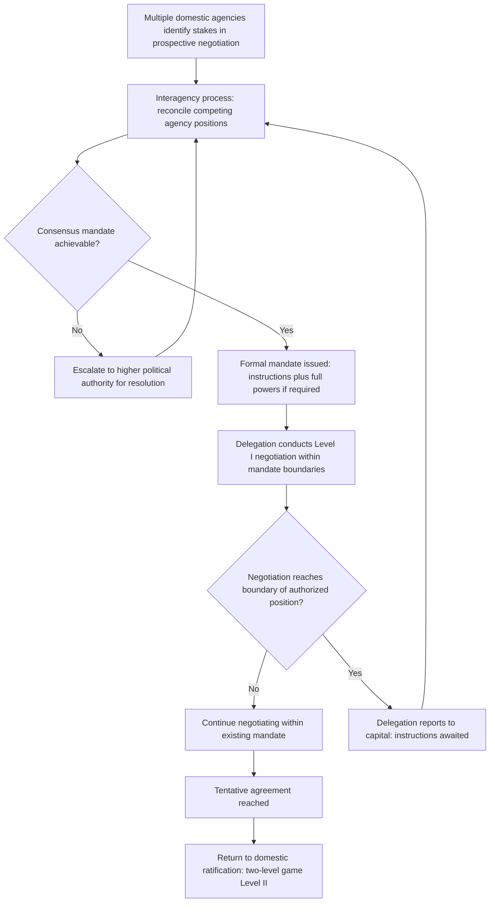

## Interagency Instructions and the Negotiating Mandate

### Theoretical Foundations

A **negotiating mandate** is the formally delegated authority granted to a state's negotiating delegation defining the scope, limits, and objectives within which that delegation may commit the state at the international table. The mandate is the institutional mechanism through which a state resolves, prior to Level I engagement, the question the two-level game framework treats as central: recall that a state's effective reservation value at Level I is bounded by its domestic win-set — the range of terms its own ratifying constituency will accept. The mandate operationalizes this constraint procedurally by fixing, in advance, the negotiator's authorized range of movement, so that the Level II ratification question is substantially pre-negotiated internally before the negotiator ever sits down with a foreign counterpart.

**The interagency process** refers to the internal executive-branch (or, in parliamentary systems, cross-ministerial) coordination process by which a mandate is formed. Because foreign policy negotiations typically touch the jurisdictional interests of multiple government bodies simultaneously — a trade negotiation implicates a trade ministry, a finance ministry, and often a foreign ministry; a security negotiation implicates a defense ministry, an intelligence service, and a foreign ministry — the mandate that a lead negotiator carries into Level I talks is itself the product of a prior, internal Level II-style negotiation among domestic bureaucratic actors, each with distinct institutional interests, risk tolerances, and technical expertise. This makes mandate formation a nested instance of the same distributive-versus-integrative dynamics governing interstate bargaining (recall that distributive bargaining divides a fixed quantity while integrative bargaining trades across differently prioritized issues): competing agencies frequently hold genuinely divergent priorities over the same negotiation, and the interagency process must resolve those divergences into a single, coherent negotiating position before the state can present a unified front internationally.

### Bureaucratic Politics and the Mandate

**Allison's bureaucratic politics model.** Graham Allison's *Essence of Decision* (1971), analyzing the Cuban Missile Crisis through three complementary lenses, introduced the **bureaucratic politics model** (Allison's "Model III") as an alternative to treating the state as a unitary rational actor: foreign policy outputs, in this model, emerge not from a single coherent strategic calculation but from bargaining among agencies and officials with distinct organizational interests, standard operating procedures, and bureaucratic incentives — "where you stand depends on where you sit." Applied to mandate formation, this model predicts that a negotiating mandate will reflect not merely the objectively optimal negotiating position given the state's external interests, but a compromise shaped by which agencies had the most bureaucratic leverage during mandate formation, which agency chairs the interagency process, and which agencies' equities were most directly threatened by particular negotiating outcomes.

**Principal–agent dynamics.** The relationship between the political leadership issuing a mandate (the principal) and the negotiating delegation executing it (the agent) exhibits the structural features of a **principal-agent problem**: the delegation typically possesses superior real-time information about the counterpart's actual flexibility, emerging opportunities, and tactical dynamics at the table, while the principal retains formal authority over the mandate's boundaries but cannot observe the negotiation directly. This creates a persistent tension over **mandate flexibility versus mandate discipline**: a delegation granted broad discretionary authority can exploit real-time information to reach a better deal but risks committing the state beyond what domestic ratification will bear (an agency problem, since the delegation's interest in reaching *any* agreement may diverge from the principal's interest in reaching only a *ratifiable* agreement); a delegation held to a narrow, rigidly specified mandate cannot exploit integrative opportunities that emerge only through real-time interest disclosure at the table (recall that integrative value-creation specifically requires such disclosure and improvisation), but is correspondingly protected against exceeding the domestic win-set.

### Mandate Structure: Instructions and Reporting Cables

In practice, a negotiating mandate is transmitted and maintained through a formal instruction architecture rather than a single static document:

- **Full powers** (*plein pouvoirs*): a formal instrument, addressed in **VCLT Article 7**, authorizing a named representative to negotiate, adopt, or authenticate the text of a treaty, or to express the state's consent to be bound, on the state's behalf. Article 7(2) dispenses with the requirement for formal full powers for heads of state, heads of government, and ministers for foreign affairs, who are considered by virtue of their office to represent their state for all acts relating to treaty conclusion — a codification of a customary practice distinguishing office-holders whose representative authority is presumed from other officials who require explicit documentary authorization.
- **Instructions** (a cable, telegram, or formal diplomatic instruction issued by the capital to the delegation, historically transmitted by diplomatic cable and now frequently by secure electronic communication): the substantive, and typically classified, specification of the delegation's negotiating position, authorized concessions, red lines, and reporting obligations, distinct from the formal legal authority conferred by full powers. Instructions are the operational content of the mandate; full powers are the treaty-law authorization to exercise it.
- **Reporting cables**: the delegation's return communications to capital during a negotiation, typically required at defined intervals or trigger points (e.g., before any new concession beyond the initial mandate, or upon a significant shift in the counterpart's position), through which the interagency process retains ongoing supervisory control over a negotiation in progress rather than issuing a mandate once and receiving only a final outcome.

**"Instructions awaited" as a tactical and procedural state.** A delegation that reaches the boundary of its mandate mid-negotiation and must seek expanded authority from capital before proceeding — a state colloquially referenced in diplomatic practice as awaiting fresh instructions — occupies a position with both genuine procedural content (the delegation literally lacks authority to commit further) and potential tactical utility (recall the "tied hands" mechanism from costly-signal theory: a credible claim of exhausted mandate can function as a Schelling-style constraint, extracting concessions from a counterpart who must either wait or move first, precisely because a genuinely mandate-exhausted delegation cannot be pressured into conceding further regardless of tactics applied at the table).

### Diplomatic Application: U.S. Trade Negotiations and Trade Promotion Authority

U.S. trade negotiations illustrate a formalized interagency mandate mechanism through **Trade Promotion Authority (TPA)**, under which Congress delegates negotiating authority to the executive subject to defined negotiating objectives and a subsequent guaranteed up-or-down ratification vote without amendment. TPA directly addresses the principal-agent tension identified above: without it, a negotiated trade agreement remains vulnerable to unlimited legislative amendment after conclusion, which foreign counterparts recognize as undermining the credibility of any concession the U.S. delegation offers (since a counterpart's concession, once made, could be met with a legislatively altered U.S. commitment rather than the negotiated one) — the TPA mechanism narrows the delegation's post-hoc Level II uncertainty specifically to expand the delegation's credible Level I bargaining range, at the cost of the specific, congressionally negotiated substantive objectives the TPA statute itself imposes as mandate boundaries.

### Diplomatic Application: EU Negotiating Mandates and Member-State Unanimity

European Union external negotiations (e.g., trade agreements negotiated by the European Commission on behalf of member states) illustrate an especially structured interagency mandate architecture: the Council of the European Union adopts negotiating directives authorizing the Commission to negotiate on the EU's behalf, and the Commission must report to a designated committee (historically the "133 Committee," now generally the Trade Policy Committee under the Lisbon Treaty framework) throughout the negotiation. This structure functions as a standing, institutionalized interagency process spanning the entire negotiation's duration rather than a single upfront mandate — reflecting the acute coordination challenge of aggregating 27 member states' distinct interests (a markedly more complex interagency problem than a single state's ministries) into a coherent Level I negotiating position, and explaining why EU external negotiations are frequently characterized by extended internal coordination timelines preceding and running concurrent with the external negotiation itself.

### Diagram: Mandate Formation and Execution Cycle

### Legal and Procedural Interface

Beyond Article 7's full powers provision, the mandate architecture interacts with **VCLT Article 8**, which provides that an act relating to the conclusion of a treaty performed by a person not authorized under Article 7 to represent a state for that purpose is without legal effect unless subsequently confirmed by that state — meaning that a negotiator who exceeds their mandate's substantive boundaries does not thereby bind the state; the excess is legally void unless and until the state elects to ratify it retroactively through subsequent confirmation. This provision is the treaty-law counterpart to the principal-agent concern above: it guarantees, as a matter of international law rather than merely domestic administrative practice, that a delegation's excess of its mandate cannot unilaterally commit the state, preserving the principal's ultimate control regardless of what occurs at the negotiating table.

**Key Points**

- A negotiating mandate operationalizes the two-level game's domestic win-set constraint by fixing a delegation's authorized range of movement before Level I engagement begins.
- Allison's bureaucratic politics model predicts that mandates reflect interagency bargaining leverage and organizational interests, not solely objectively optimal external strategy.
- Mandate architecture separates full powers (VCLT Article 7, the formal legal authorization) from instructions (the substantive, often classified negotiating position) and reporting cables (ongoing capital oversight).
- The principal-agent tension between mandate flexibility (enabling integrative value-creation) and mandate discipline (protecting the domestic win-set) is managed variably across systems, illustrated by U.S. Trade Promotion Authority and the EU's Council-directive/Trade Policy Committee structure.
- VCLT Article 8 renders acts exceeding a negotiator's authorized mandate legally void unless subsequently confirmed by the state, providing an international-law backstop to the principal's control over the agent.

**Related Topics**

- Two-level games and the domestic ratification constraint
- VCLT Article 7 full powers and Article 8 unauthorized acts
- Bureaucratic politics and the Cuban Missile Crisis: Allison's three models
- Trade Promotion Authority and fast-track ratification mechanisms
- EU external competence and mixed-agreement negotiating structures
- Costly signals and credible commitment in diplomatic communication