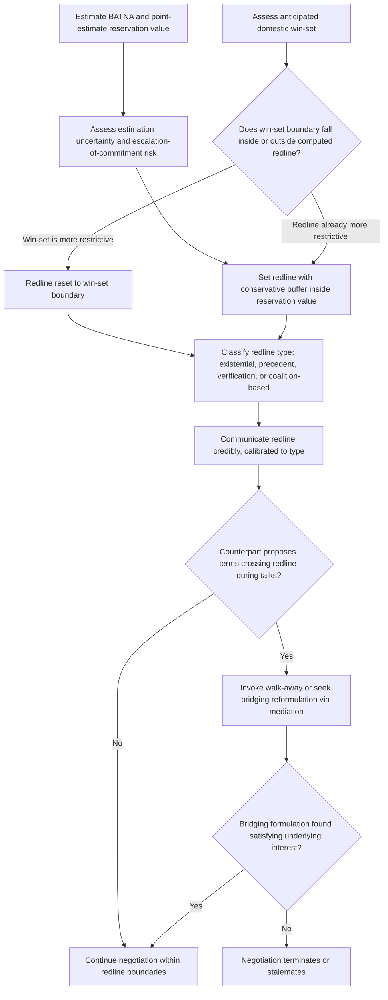

## Setting Redlines and Walk-Away Positions Before Talks Begin

### Theoretical Foundations

A **redline** is a pre-committed, non-negotiable boundary condition specified before a negotiation begins, distinguishing terms a delegation is authorized to accept from terms it is not, regardless of what concessions or pressures arise at the table. A **walk-away position** is the closely related but analytically distinct concept of the point at which a delegation is instructed to terminate negotiations entirely rather than continue engaging on unacceptable terms. The two concepts map onto, but are not identical to, the reservation value discussed previously: recall that a reservation value is the point derived from a party's BATNA at which it is indifferent between accepting a deal and invoking its best alternative. A redline is typically set with a margin *inside* the true reservation value — a deliberately more conservative internal boundary than the theoretically justified indifference point — precisely because pre-commitment devices exist to guard against several distinct failure modes that pure reservation-value reasoning does not, by itself, protect against.

**Why redlines diverge from reservation values.** Three distinct rationales justify setting a redline more conservative than a computed reservation value:

1. **In-the-room persuasion and escalation of commitment.** A negotiator physically present at the table is subject to reciprocity pressure (recall the reciprocity norm from concession-sequencing dynamics), rapport effects with a counterpart, and the sunk-cost psychology of having already invested extensive time and effort in reaching a deal — all of which create a documented risk of gradual concession beyond a rationally computed limit, a phenomenon closely related to the **escalation of commitment** bias identified in behavioral decision research (Staw, 1976). A pre-set redline, fixed before these in-room pressures are present, functions as a commitment device against the negotiator's own anticipated future susceptibility to them.
2. **Uncertainty in BATNA and reservation-value estimation.** Because interstate BATNA estimation is inherently probabilistic and frequently contested even within a single government's own analytic community (recall the multiplicity-of-alternatives problem in interstate BATNA construction), a redline set with a buffer below the point-estimate reservation value hedges against the possibility that the true reservation value is more favorable than estimated — protecting against agreeing to a deal that seemed acceptable under an optimistic BATNA estimate but would not be acceptable if the true external alternative were less favorable than modeled.
3. **The two-level game's domestic win-set.** Recall that an agreement outside a state's domestic win-set cannot be ratified regardless of its merits relative to the external BATNA. A redline frequently encodes the outer boundary of the anticipated win-set directly, functioning as an internal proxy for domestic ratifiability that a negotiator can apply in real time without needing to consult domestic political actors during the negotiation itself.

### The Precommitment Function and Its Limits

**Schelling's precommitment logic.** Recall that Schelling's "tied hands" mechanism generates external bargaining leverage precisely by reducing a negotiator's own apparent flexibility (discussed earlier as an audience-cost signaling device). A redline set and communicated *before* talks begin operates on the identical logic internally: it removes the negotiator's own discretion to concede further, which — if genuinely binding and credibly conveyed to the counterpart — can extract better terms than an unconstrained negotiator could credibly demand, because the counterpart faces a genuinely fixed boundary rather than a soft preference subject to further erosion through pressure or persistence.

**The credibility-rigidity trade-off.** A redline's value as a precommitment device depends entirely on the counterpart perceiving it as genuine rather than a bluffing opening tactic (the identical separating-versus-pooling equilibrium problem examined in costly-signal theory: a redline is only informative if a party without a genuine constraint would not claim to have one). Where a delegation has previously "walked back" stated redlines in past negotiations, a reputational cost accrues that degrades the credibility of future redline claims specifically — an instance of the broader principle that costly-signal credibility depends on consistent enforcement, since a redline abandoned once becomes cheap talk in all subsequent invocations. Conversely, a genuinely rigid redline forecloses the possibility of exploiting late-emerging integrative opportunities (recall that integrative value-creation frequently depends on real-time interest disclosure and improvisation at the table) — the same flexibility-versus-discipline tension identified in the principal-agent structure of mandate design applies directly to redline-setting as a special, more binding case of mandate specification.

### Types of Redlines in Diplomatic Practice

Diplomatic redlines are typically classified by their underlying rationale, which affects both how firmly they should be held and how they should be communicated:

- **Sovereignty or existential redlines**: conditions bearing on core state sovereignty, territorial integrity, or regime survival, where the domestic political and security costs of concession are judged categorically unacceptable rather than merely undesirable on some continuous scale. These redlines are typically the least negotiable and are often communicated publicly precisely to maximize their audience-cost-backed credibility.
- **Precedent-based redlines**: conditions where the specific term at issue may be individually tolerable but is refused because accepting it would establish a precedent applicable to other, more consequential future negotiations — the redline is set not by the term's direct cost but by its expected effect on the party's bargaining position in subsequent, related negotiations.
- **Verification and enforceability redlines**: conditions refused not because the substantive commitment sought is unacceptable in principle, but because the proposed verification or enforcement mechanism is judged insufficient to make the counterpart's reciprocal commitment credible — a redline addressing the durability of an agreement rather than its stated terms.
- **Domestic-coalition redlines**: conditions that, while potentially acceptable to the lead negotiator's own assessment of the state's interests, fall outside what the anticipated domestic ratifying coalition (recall the two-level game's win-set) will sustain regardless of the international merits.

### Diplomatic Application: North Korean Nuclear Talks and the Denuclearization Redline

Six-Party Talks and subsequent U.S.–North Korea negotiations illustrate a persistent redline-incompatibility dynamic: successive U.S. administrations maintained "complete, verifiable, irreversible denuclearization" (CVID) as an existential-category redline for any sanctions-relief agreement, while North Korea maintained retention of at least a residual nuclear deterrent as its own existential-category redline, reflecting a regime-survival calculation. [Inference: characterizing North Korean internal reasoning as regime-survival-driven reflects a widely held analytic consensus rather than a directly disclosed North Korean negotiating rationale.] Because both redlines were set in the existential category on directly incompatible dimensions — recall that a ZOPA requires overlapping reservation values, and an existential-category redline is, by design, held with minimal flexibility — no ZOPA existed on the core denuclearization dimension across multiple negotiating rounds (2018–2019 Hanoi summit failure being a documented instance of talks collapsing specifically at the point where the incompatibility of the two sides' redlines became explicit and irreconcilable within the scope of the proposed deal).

### Diplomatic Application: Brexit Withdrawal Negotiations and the EU's Precedent-Based Redline

Recall that the EU–UK Withdrawal Agreement combined value-claiming dynamics on the financial settlement with value-creating structure on the Northern Ireland protocol. Throughout the negotiation, EU negotiators maintained a firm precedent-based redline against allowing the UK "cherry-picking" access to specific single-market benefits (e.g., financial services passporting) without accepting the corresponding obligations (free movement of persons, budgetary contributions) — a redline held not because UK access to any single benefit was independently unacceptable, but explicitly because conceding it would establish a precedent usable by other member states considering exit, or currently negotiating special arrangements, undermining the EU's broader integrative structure. EU negotiators' public and repeated articulation of this redline functioned as an audience-cost-backed signal (recall Fearon's tying-hands mechanism) intended to foreclose UK expectations of eventual EU flexibility on this specific dimension.

### Diplomatic Application: Camp David 1978 and the Management of a Near-Redline Collision

Recall that Israeli Prime Minister Begin's negotiating position on Sinai settlements approached a domestic-coalition redline given his coalition's internal composition. The negotiation's success depended substantially on U.S. mediators identifying, through the single negotiating text procedure, a formulation (phased withdrawal with security guarantees) that satisfied Israel's underlying security interest without requiring Begin to cross what would have been an unsustainable domestic-coalition redline — illustrating that skilled mediation can sometimes resolve an apparent redline collision not by inducing either party to abandon their redline, but by discovering a formulation that satisfies the interest underlying the redline through different substantive means (a mediation-facilitated instance of the bridging mechanism from integrative bargaining theory).

### Diagram: Redline-Setting and Application Process

### Legal and Procedural Interface

A redline that a delegation cannot cross without exceeding its formal mandate is directly governed by the **VCLT Article 8** principle discussed in the context of interagency mandates: recall that an act performed by a representative exceeding their authorized mandate is without legal effect unless subsequently confirmed by the state. A redline is, in this sense, frequently not merely a tactical or political instruction but the operational boundary of the negotiator's actual legal authority to bind the state — crossing it does not produce an invalid *treaty* per se (the treaty's validity depends on the state's own subsequent confirmation or non-confirmation) but does mean the negotiator's in-the-room concession, standing alone, lacks binding legal effect until or unless ratified. Additionally, where a proposed term would require a later invocation of a **fundamental change of circumstances** doctrine (*rebus sic stantibus*, codified restrictively in **VCLT Article 62**) to exit the agreement if conditions changed, negotiators frequently treat the anticipated difficulty of invoking Article 62 — which permits withdrawal only where the change was unforeseen, radically transforms the extent of obligations still to be performed, and was not the product of the invoking party's own breach — as a further reason to hold certain redlines firmly at signature, since Article 62's narrow scope means a state cannot reliably rely on later treaty exit to correct for a redline crossed under momentary negotiating pressure.

**Key Points**

- Redlines and walk-away positions are pre-committed boundaries typically set more conservatively than a computed reservation value, hedging against in-room escalation of commitment, BATNA estimation uncertainty, and the domestic win-set constraint.
- Redlines function as Schelling-style precommitment devices, gaining external leverage by reducing the negotiator's own discretion, subject to a credibility-rigidity trade-off identical in structure to costly-signal separating equilibria.
- Diplomatic redlines are typically classified as existential/sovereignty-based, precedent-based, verification-based, or domestic-coalition-based, each warranting different firmness and communication strategy.
- The 2019 Hanoi summit illustrates negotiation collapse from incompatible existential-category redlines; Camp David 1978 illustrates mediation-facilitated bridging that satisfies a redline's underlying interest without requiring the redline itself to be crossed.
- VCLT Article 8 renders a redline-exceeding concession legally void absent subsequent state confirmation, while Article 62's narrow *rebus sic stantibus* standard limits the reliability of later treaty exit as a corrective for a redline crossed under pressure.

**Related Topics**

- Interagency instructions and the negotiating mandate
- BATNA and reservation value in interstate bargaining
- Costly signals and credible commitment in diplomatic communication
- VCLT Article 62 and fundamental change of circumstances (rebus sic stantibus)
- Mediation and single negotiating text procedures in resolving redline collisions
- Two-level games and the domestic ratification constraint