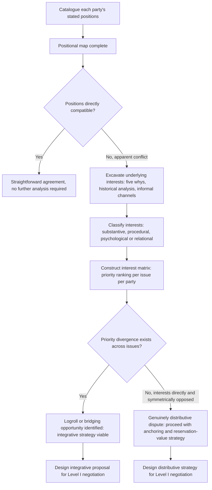

## Interest Mapping versus Positional Mapping in Pre-Negotiation Analysis

### Theoretical Foundations

**Positional mapping** is the pre-negotiation analytic exercise of cataloguing each party's stated demands — the explicit terms a party has publicly or diplomatically asserted it seeks — typically organized as a simple inventory of each side's declared position on each issue under negotiation. **Interest mapping** is the analytically deeper exercise, foundational to the Fisher and Ury *Getting to Yes* (1981) framework, of identifying the underlying needs, fears, and objectives that a party's stated position is instrumentally intended to satisfy. Recall the core distinction previously established: a position is a party's stated demand, while an interest is the underlying need a position is meant to serve, and integrative value-creation (recall: identifying trades that make one party better off without making another worse off) is structurally impossible from positional data alone, because two positions can appear diametrically opposed while the interests generating them are entirely compatible or even complementary — a fact invisible to an analysis that stops at the level of stated positions.

**Why positional mapping alone is analytically insufficient.** A negotiation team that maps only positions can identify the existence and rough boundaries of a distributive ZOPA (recall: the interval bounded by each party's reservation value within which agreement is individually rational) but cannot identify whether an integrative reframing is available that would expand that interval or shift the negotiation onto an entirely different, more favorable frontier. Positional mapping, in this sense, is a necessary but insufficient input: it establishes what each party is *asking for*, which is required for basic negotiation planning, but provides no analytic purchase on *why*, which is the information integrative strategy formation actually requires.

### The Iceberg Model and Interest Excavation

Interest mapping is frequently taught through an **iceberg metaphor**: a party's stated position is the visible portion above the waterline, while the substantially larger mass of underlying interests — security concerns, economic needs, domestic political constraints, historical grievances, status and recognition concerns, procedural preferences — remains submerged and must be actively excavated through analysis rather than read directly off public statements. Standard techniques for this excavation in diplomatic pre-negotiation preparation include:

- **"Five whys" iterative questioning**: repeatedly asking why a stated position is held, treating each answer as a provisional interest and interrogating it further until reaching an interest that does not itself reduce to a more fundamental one (e.g., "Why does State A demand demilitarization of the border zone?" → "Because of security concerns about surprise attack" → "Because of a specific historical precedent of invasion via that route" — arriving at a specific, addressable security interest rather than resting at the generic positional demand for demilitarization as such).
- **Historical and documentary analysis**: examining a party's negotiating history, domestic political debates, and prior public statements across time to identify consistent underlying concerns that persist across changes in specific stated positions — since interests tend to be more stable over time than the tactical positions used to advance them.
- **Track II and informal channel elicitation**: recall that Track II diplomacy (informal, non-binding contact, often through academics or retired officials) can surface genuine interests that a formal Level I position, constrained by the need to maintain a credible public bargaining stance, would not disclose directly.
- **Categorization by interest type**: a widely used pre-negotiation taxonomy sorts elicited interests into **substantive** (the tangible resource or outcome sought), **procedural** (concerns about how the negotiation itself is conducted — sequencing, forum, participants), and **psychological or relational** (concerns about respect, recognition, trust, or status) categories, since procedural and relational interests are frequently satisfiable through low-cost concessions that a purely substantive positional analysis would never surface as available trades.

### Diplomatic Application: Camp David 1978, Revisited at the Analytic Stage

Recall that the Camp David negotiation's integrative breakthrough rested on identifying that Israel's underlying interest was security from cross-border attack rather than territorial control per se, while Egypt's underlying interest was sovereignty and national dignity rather than an unrestricted military presence. This analytic result was not incidental to the negotiation's tactics but was substantially the product of deliberate pre-negotiation and in-process interest-mapping work by the U.S. mediating team, which used extensive separate consultations with each delegation (a mediation technique functionally analogous to interest excavation via informal channel elicitation) specifically to identify the demilitarization-plus-sovereignty formulation that a purely positional reading of "Israel wants the Sinai" versus "Egypt wants the Sinai" would never have generated, since positional mapping alone represents the dispute as a zero-sum territorial claim with no visible integrative structure.

### Diplomatic Application: Positional Rigidity Masking Interest Compatibility — Falklands/Malvinas

The Falklands/Malvinas dispute between the United Kingdom and Argentina illustrates a case where sustained positional mapping (each side's sovereignty claim, essentially unchanged since the dispute's origins) has obscured, rather than revealed, any substantial interest-level compatibility: both parties' underlying interests are substantially and directly opposed at the sovereignty level itself (national territorial identity and historical claim, on both sides, rather than an instrumentally separable interest a position merely serves), which is a documented case of a dispute where deeper interest excavation does not reliably surface integrative possibilities, because the position and the interest largely coincide rather than diverge. This contrasts instructively with Camp David: interest mapping is a valuable analytic step precisely because it *sometimes* reveals compatibility invisible at the positional level, but the technique does not guarantee such a finding, and a rigorous pre-negotiation analysis must be prepared to conclude, after genuine interest excavation, that the underlying interests remain genuinely and directly opposed — in which case the negotiation is correctly characterized as substantially distributive rather than integrative, and further search for a bridging formulation may be analytically unproductive.

### Diplomatic Application: Iran Nuclear Talks — Procedural and Psychological Interests Beneath Substantive Positions

Recall the JCPOA negotiations' substantive logroll trading sanctions relief against verified nuclear constraint. Pre-negotiation and in-process interest mapping by P5+1 analysts identified a significant **psychological/relational interest** operating beneath Iran's substantive positions: a documented Iranian negotiating priority on formal international recognition of a right to peaceful nuclear enrichment (a status and dignity interest, connected to broader Iranian post-revolutionary narratives about sovereign technological self-sufficiency) that was analytically distinct from, and in some respects more central than, the specific technical enrichment levels ultimately negotiated. [Inference: the relative weighting of this psychological interest against purely substantive Iranian calculations is a matter of continued analytic debate among negotiators and scholars of the talks, not a precisely quantifiable finding.] Recognition of this relational interest shaped the final agreement's careful textual framing regarding Iran's enrichment rights, illustrating how procedural and psychological interest categories can require accommodation through drafting and framing choices (recall the framing mechanisms discussed previously) rather than through substantive concessions alone.

### Mapping Methodology: From Individual Interests to a Negotiation Matrix

Once each party's interests are separately excavated, standard pre-negotiation practice constructs an **interest matrix**: a structured cross-tabulation of each issue under negotiation against each party's priority ranking for that issue, typically on an ordinal scale (high/medium/low priority) rather than requiring precise cardinal valuation, which is rarely obtainable with confidence in an interstate context. This matrix is the direct analytic precursor to logrolling opportunity identification (recall: trading concessions across issues valued differently), since a logroll requires precisely the kind of priority-divergence pattern the matrix is designed to reveal — an issue ranked high priority for Party A but low priority for Party B (and vice versa on a different issue) is a directly actionable trade, while an issue ranked identically high priority for both parties is a purely distributive subproblem regardless of how thoroughly interests are mapped.

### Diagram: Positional versus Interest Analysis Pathways

### Legal and Procedural Interface

Interest and positional mapping are pre-textual analytic exercises with no direct governing provision under the VCLT, since the Convention's competence attaches at the stage of textual negotiation, signature, and consent to be bound rather than the preparatory intelligence and analytic work preceding a delegation's arrival at the table. Their downstream legal relevance surfaces through **VCLT Article 32**, which permits recourse to "supplementary means of interpretation, including the preparatory work of the treaty and the circumstances of its conclusion" where interpretation under Article 31 leaves a term's meaning ambiguous or leads to a manifestly absurd result: a treaty's *travaux préparatoires* (preparatory work) can, in subsequent interpretive disputes, include documentary traces of the interest-mapping and negotiating history that produced a given textual formulation, meaning that pre-negotiation analytic work, though itself outside the VCLT's direct scope, can become interpretively relevant evidence if a resulting treaty term's meaning is later contested.

**Key Points**

- Positional mapping catalogues stated demands; interest mapping excavates the underlying substantive, procedural, and psychological needs a position instrumentally serves, and only the latter can reveal integrative opportunities invisible at the positional level.
- The iceberg model and techniques such as iterative "five whys" questioning, historical analysis, and Track II elicitation are standard methods for excavating interests beneath stated positions.
- Camp David 1978 illustrates interest mapping successfully revealing compatibility (security versus territorial control) invisible in positional terms; the Falklands/Malvinas dispute illustrates that interest excavation does not guarantee such a finding and can confirm genuine, direct interest-level opposition.
- An interest matrix, cross-tabulating issue priority by party, is the direct analytic precursor to logrolling opportunity identification, since actionable trades require priority divergence across issues.
- Pre-negotiation interest-mapping work, though outside the VCLT's direct scope, can become interpretively relevant as *travaux préparatoires* under Article 32 if a resulting treaty term's meaning is later disputed.

**Related Topics**

- Distributive versus integrative bargaining in diplomatic negotiation
- BATNA and reservation value in interstate bargaining
- Interagency instructions and the negotiating mandate
- VCLT Article 32: supplementary means of interpretation and travaux préparatoires
- Track II diplomacy and informal channel negotiation
- Framing, anchoring, and the sequencing of concessions