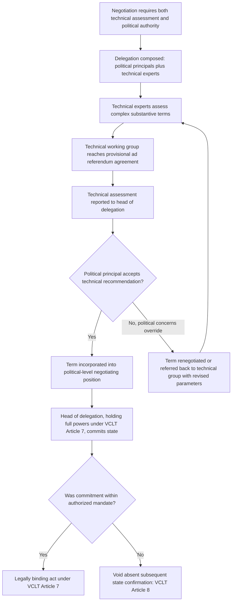

## Delegation Composition: Political Principals versus Technical Experts

### Theoretical Foundations

A diplomatic delegation is rarely a homogeneous body; it typically combines **political principals** — officials with formal decision-making authority and accountability to the domestic ratifying constituency (a foreign minister, head of state, or senior political appointee) — with **technical experts** — subject-matter specialists (legal advisers, economists, military officers, scientists, or sector regulators) whose function is to supply the substantive knowledge required to negotiate complex, technically dense terms, but who typically lack independent authority to commit the state. This bifurcation reflects a structural division of labor directly connected to the two-level game and mandate frameworks previously discussed: recall that a negotiating mandate operationalizes the domestic win-set constraint by fixing a delegation's authorized range of movement, and recall the principal-agent tension between mandate flexibility and mandate discipline. Delegation composition is the organizational mechanism through which a state attempts to secure both technical competence (accurate assessment of complex substantive terms) and mandate discipline (ensuring commitments remain within authorized, ratifiable bounds) simultaneously, since a single individual rarely possesses both the specialized technical expertise and the plenary political authority a complex negotiation requires.

**The composition trade-off.** A delegation weighted heavily toward technical experts gains analytic depth — more accurate assessment of a proposed verification protocol's actual adequacy, or a trade schedule's genuine economic effect — but risks either paralysis (no one present can authorize a deal, forcing constant reference back to capital) or, conversely, technical experts inadvertently making de facto political commitments through their technical judgments that political principals later find difficult to reverse without appearing to repudiate their own expert advice. A delegation weighted heavily toward political principals gains negotiating authority and speed of decision but risks agreeing to technically deficient terms — a verification mechanism that sounds adequate in political language but is technically inadequate to detect the violations it purports to guard against — because no one present possesses the specialized competence to identify the deficiency in real time.

### Technical Experts as Information Intermediaries and the Bureaucratic Politics Overlay

Recall Allison's bureaucratic politics model: foreign policy outputs frequently emerge from bargaining among agencies and officials with distinct organizational interests rather than from unitary rational calculation. Technical experts on a delegation are typically drawn from precisely the agencies (defense ministries, central banks, scientific or regulatory bodies) whose interagency bargaining shaped the mandate the delegation carries, meaning technical experts at the table often continue to represent — consciously or through professional socialization — the institutional perspective of their home agency even while formally serving the delegation's unified position. This creates a documented tension: a technical expert's assessment of whether a proposed term is "technically acceptable" is not always a purely objective determination independent of the expert's home-agency institutional interest, since technical judgments in genuinely complex domains (nuclear verification adequacy, financial-model assumptions, environmental baseline methodologies) frequently admit a defensible range of expert opinion within which institutional priors can influence which end of that range an expert emphasizes.

**The credibility function of technical expert presence.** Independent of their substantive analytic contribution, the presence of technical experts on a delegation serves a signaling function toward the counterpart: a delegation that includes credentialed technical specialists in a given domain signals that the sending state takes the technical dimension of the agreement seriously and intends genuine compliance verification capacity, rather than treating the technical provisions as mere diplomatic formalities — a form of costly signal (recall Fearon's framework) in that maintaining specialized technical expertise on a standing negotiating team itself represents a real institutional investment that a state uninterested in technical rigor would have less reason to bear.

### Diplomatic Application: SALT/START Delegations and Military-Technical Expertise

U.S.–Soviet strategic arms negotiations from SALT I through START required sustained integration of military and scientific technical experts (specialists in missile guidance systems, warhead yield verification, and satellite reconnaissance capability) alongside political principals (State Department and, on the Soviet side, Foreign Ministry leadership), because the negotiations' core substantive content — verifiable ceilings on specific weapons categories — was simply inaccessible to purely political assessment. Declassified U.S. negotiating team records document persistent internal friction between technical specialists advocating for verification-protocol rigor calibrated to their professional assessment of detectability limits, and political principals more attentive to the pace of negotiations and the broader diplomatic relationship — an internal delegation dynamic directly reflecting the bureaucratic politics overlay described above, where technical experts' institutional backgrounds (often the Department of Defense or intelligence community) shaped which risks they emphasized relative to State Department political leadership more focused on reaching a ratifiable agreement within a defined political timeline.

### Diplomatic Application: Paris Climate Agreement and Scientific Expert Integration

The Paris Agreement negotiations (2015) integrated climate scientists and technical negotiators (specializing in emissions accounting methodologies, baseline-setting conventions, and monitoring, reporting, and verification frameworks) directly into national delegations alongside political principals empowered to make the NDC framing and burden-sharing commitments discussed previously (recall the Nationally Determined Contributions framing choice). The technical dimension proved consequential in the specific architecture of the **Enhanced Transparency Framework**, where technical negotiators' assessments of feasible common reporting methodologies directly shaped what political principals could credibly commit their states to report, illustrating a case where technical expert input constrained the *feasible set* of political commitments available for principals to negotiate over, rather than merely informing principals' preferences within an already-fixed feasible set.

### Diplomatic Application: EU Accession Negotiations and Chapter-Based Technical Delegation Structure

European Union accession negotiations illustrate an institutionalized separation of technical and political tracks: accession negotiations are formally divided into policy "chapters" (competition policy, environment, justice and home affairs, and so forth), each requiring the candidate state to demonstrate technical alignment with the EU's *acquis communautaire* (the accumulated body of EU law), assessed substantially by technical experts and specialized working groups, while the overarching political decision to open or close each chapter, and ultimately to conclude accession, remains with political principals at the ministerial and head-of-state level (the European Council). This structure explicitly formalizes the composition trade-off into distinct institutional stages rather than requiring a single delegation to embody both functions simultaneously at every point in the process — technical assessment substantially precedes and informs, but is procedurally separated from, the political ratification decision.

### Managing the Trade-off: Reporting Lines and Authority Calibration

Standard diplomatic practice manages the composition trade-off through explicit internal authority calibration rather than leaving the balance to emerge informally:

- **Technical experts report through, but do not substitute for, the head of delegation**: technical assessments are formally channeled to the delegation's political lead, who retains sole authority to accept or reject a term, preventing technical judgments from becoming de facto binding commitments.
- **Parallel technical working groups**: complex technical dimensions (verification protocols, tariff schedules, environmental baselines) are frequently negotiated in dedicated technical working groups running in parallel to the main political-level talks, with technical agreements provisionally reached "ad referendum" — subject to confirmation by political principals — rather than treated as final upon technical-level agreement.
- **Technical experts as advisers without negotiating authority**: many delegations formally designate technical specialists as advisers rather than negotiators, a status distinction with direct legal relevance under **VCLT Article 7**, recall that Article 7 requires full powers or office-based presumption of authority for those empowered to negotiate, adopt, or express consent to be bound — a technical adviser without full powers cannot, as a matter of treaty law, independently commit the state regardless of what is agreed at the technical-working-group level, reinforcing the VCLT Article 8 principle (recall: an unauthorized act is without legal effect absent subsequent state confirmation) as the final legal backstop against a technical expert's assessment being mistaken for binding political commitment.

### Diagram: Delegation Composition and Authority Flow

### Legal and Procedural Interface

The political-principal/technical-expert distinction maps directly onto the **VCLT Article 7** full-powers framework discussed in the context of interagency mandates: Article 7(2)'s presumption of representative authority extends specifically to heads of state, heads of government, and ministers for foreign affairs — a category coinciding closely with the "political principal" function — while any other delegation member, including virtually all technical experts, requires explicit documentary full powers to perform an act with binding legal effect, and in standard practice technical experts are simply not issued such full powers precisely because their institutional function is advisory rather than authoritative. This legal architecture is not incidental to delegation design but substantially explains it: because the VCLT already allocates binding authority narrowly to political-principal-category officials by default, delegation composition practices that concentrate final decision authority in political principals while relegating technical experts to an advisory role are, in significant part, an organizational adaptation to a pre-existing legal structure rather than a purely discretionary management choice.

**Key Points**

- Delegation composition combines political principals (formal decision authority, domestic accountability) with technical experts (subject-matter competence, typically without independent authority to commit the state), reflecting the same flexibility-versus-discipline trade-off examined in mandate design.
- Technical experts frequently continue to reflect their home agency's institutional perspective at the table, an extension of Allison's bureaucratic politics dynamic into the composition and internal functioning of a single delegation.
- SALT/START illustrates sustained technical-political integration and internal friction over verification rigor versus negotiating pace; the Paris Agreement illustrates technical expertise constraining the feasible set of political commitments; EU accession illustrates formal institutional separation of technical assessment (chapter-based) from political ratification decisions.
- Standard practice manages the trade-off through reporting-line discipline, parallel technical working groups with ad referendum agreements, and formally designating technical specialists as advisers rather than negotiators.
- VCLT Article 7's default allocation of representative authority to heads of state, heads of government, and foreign ministers, combined with Article 8's voidance of unauthorized acts, provides the legal backstop ensuring technical-level agreement cannot substitute for a political principal's binding commitment.

**Related Topics**

- Interagency instructions and the negotiating mandate
- Setting redlines and walk-away positions before talks begin
- VCLT Article 7 full powers and Article 8 unauthorized acts
- Bureaucratic politics and the Cuban Missile Crisis: Allison's three models
- Ad referendum agreements and provisional technical-level negotiation
- EU accession chapters and the acquis communautaire alignment process