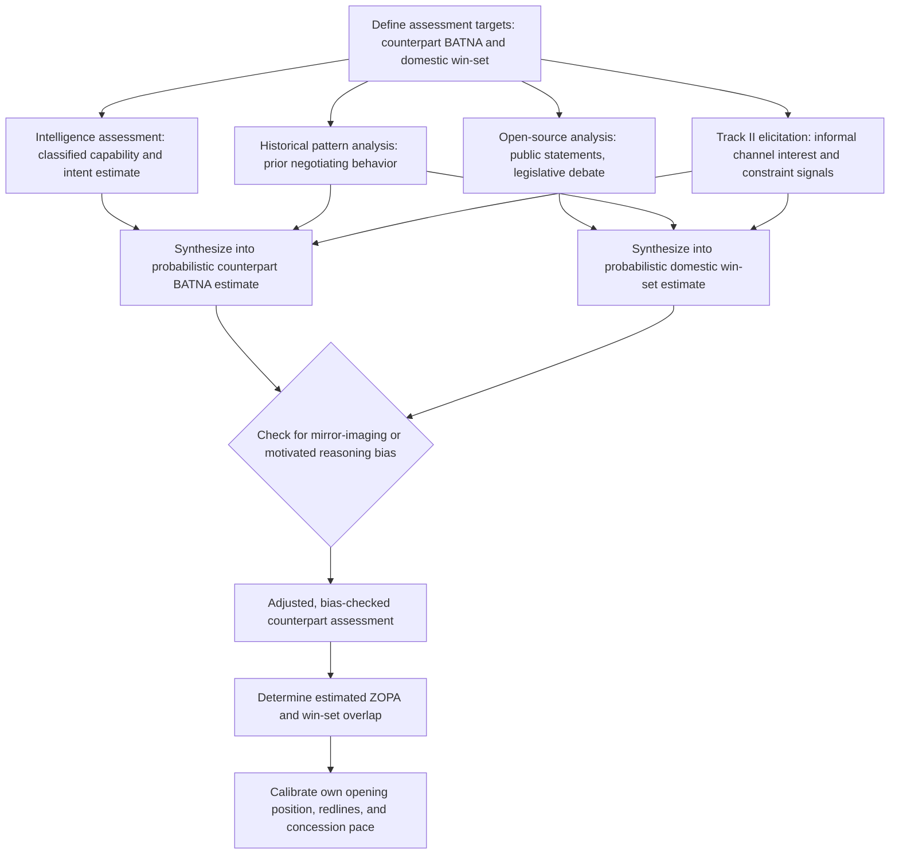

## Assessing a Counterpart's BATNA and Domestic Constraints

### Theoretical Foundations

Recall that a **BATNA** (best alternative to a negotiated agreement) sets the reservation value below which a party should rationally decline any negotiated deal, and that a **ZOPA** (zone of possible agreement) exists only where the parties' reservation values overlap. Accurate self-assessment of one's own BATNA is a well-established preparation task; the analytically harder and equally necessary task is **assessing the counterpart's BATNA and domestic constraints** — since the ZOPA's boundaries, and therefore the entire feasible space of negotiable outcomes, cannot be determined from one side's reservation value alone. Recall further that the two-level game framework establishes a second, independent constraint on feasibility: even where an external ZOPA exists between two states' negotiators, agreement additionally requires that the outcome fall within the intersection of both parties' domestic win-sets. A complete pre-negotiation assessment of a counterpart therefore requires estimating two analytically distinct quantities — the counterpart's external BATNA and the counterpart's domestic win-set — because a counterpart may be externally willing to accept terms that its own domestic ratification process will not sustain, or conversely may face domestic pressure to appear more externally constrained than its true BATNA would justify.

**Why counterpart assessment is structurally harder than self-assessment.** A state has direct access to its own classified alternatives, internal political deliberations, and true priority weightings; assessing a counterpart's equivalent information is inherently an exercise in inference from indirect and often deliberately manipulated signals, because — recall the interstate BATNA discussion — states have strong strategic incentives to misrepresent their reservation values specifically to shift a counterpart's perceived ZOPA midpoint favorably. Counterpart assessment is therefore not merely "the same analytic task performed on someone else's data," but a distinct analytic problem involving inference under adversarial information conditions, closely related to the receiver's side of the signaling and separating-equilibrium framework discussed previously (recall that a signal is only informative where the sender's incentive structure would prevent an unresolved type from sending it, and that a sophisticated receiver must assess whether a given signal is actually separating or merely part of a pooling equilibrium designed to mislead).

### Sources and Methods of Counterpart Assessment

Diplomatic practice draws on several distinct, complementary information streams to construct a counterpart BATNA and domestic-constraint estimate, each with characteristic strengths and biases:

**Intelligence assessment.** Formal intelligence products — drawing on the full range of collection disciplines (signals intelligence, human intelligence, open-source analysis) — provide the most direct, though also the most classified and access-restricted, insight into a counterpart's actual military, economic, and internal political conditions bearing on its true alternatives to agreement. A documented limitation is that intelligence assessments of adversary reservation values and intentions carry their own estimation uncertainty and historical track record of significant error (misjudgment of Soviet capabilities and intentions during the Cold War, or of Iraqi weapons programs preceding the 2003 invasion, are frequently cited as cautionary instances), meaning a negotiating team should treat even classified BATNA assessments as probabilistic rather than as ground truth.

**Open-source and public-statement analysis.** A counterpart's domestic political debates, legislative proceedings, and public statements by officials and opposition figures provide observable evidence of the counterpart's domestic win-set boundaries — recall that the win-set is defined by the preferences of the counterpart's own Level II ratifying constituency, which is frequently debated in reasonably public terms (legislative hearings, party platforms, media commentary) even where the counterpart's precise external BATNA remains classified. This source is comparatively transparent but subject to a documented interpretive risk: public statements intended for a counterpart's own domestic audience may themselves be strategic signals (recall audience-cost and tying-hands mechanisms) rather than accurate reports of genuine domestic constraint, requiring the assessing party to distinguish authentic constraint from performative rigidity.

**Historical pattern analysis.** A counterpart's behavior in structurally similar prior negotiations — how far it has previously moved from an opening position, what issues it has historically treated as non-negotiable, how its domestic ratification processes have handled comparable agreements — provides a base rate against which current signals can be calibrated, on the premise that a state's institutional negotiating behavior and domestic ratification thresholds exhibit meaningful continuity across related negotiations even as specific issues and personnel change.

**Track II and informal channel elicitation.** Recall that Track II diplomacy — informal, non-binding contact typically conducted by academics or retired officials rather than sitting negotiators — can surface a counterpart's genuine underlying interests and constraints with less of the strategic distortion present in formal Level I channels, precisely because Track II participants are not making binding commitments and therefore face weaker incentives to misrepresent for tactical advantage. This makes Track II contact a particularly valuable, though inherently unofficial and unconfirmed, source specifically for domestic-constraint assessment, since informal interlocutors are frequently better positioned to convey genuine internal political sensitivities than a counterpart's own formal negotiators, who must maintain a consistent official position.

### Diplomatic Application: Cuban Missile Crisis and ExComm's Soviet BATNA Assessment

Recall that ExComm deliberations functioned substantially as a comparative assessment of reservation values implied by competing U.S. alternatives. A parallel and equally consequential strand of ExComm's work was direct assessment of the Soviet Union's BATNA and internal constraints: intelligence assessments of Soviet conventional and strategic inferiority in a direct Caribbean confrontation informed the U.S. judgment that Khrushchev's true reservation value was more favorable to a negotiated withdrawal than Soviet public rhetoric during the crisis suggested, a judgment that proved substantially accurate in retrospect but that carried significant contemporaneous uncertainty — U.S. decision-makers could not directly observe internal Kremlin deliberations and were inferring Soviet constraint from a combination of military-capability intelligence, historical Soviet behavior patterns in prior confrontations, and back-channel communications (including the Scali-Feklisov informal contacts, a documented instance of Track II-adjacent elicitation during an acute crisis) rather than from any single authoritative source.

### Diplomatic Application: Iran Nuclear Talks and Assessment of Iran's Sanctions-Driven BATNA Deterioration

Recall that Iran's reservation value in the P5+1 talks shifted under the deteriorating BATNA created by escalating multilateral sanctions (the 2012 EU oil embargo and SWIFT exclusion). P5+1 negotiators' calibration of negotiating pace and demands throughout the talks depended substantially on ongoing assessment of *how much* Iran's BATNA had actually deteriorated — a quantity inferred from open-source economic indicators (currency depreciation, oil export volumes, inflation data) combined with intelligence assessment of the Iranian leadership's internal political tolerance for continued economic pressure, rather than from any Iranian disclosure of its own reservation value, which Iran had every strategic incentive to misrepresent as more resilient than the underlying economic data suggested.

### Diplomatic Application: EU–UK Brexit Talks and Assessment of the UK's Domestic Win-Set

Recall that the EU maintained a precedent-based redline against UK "cherry-picking" of single-market benefits. Throughout the Withdrawal Agreement negotiations, EU negotiators conducted sustained open-source and public-statement analysis of UK domestic politics — parliamentary vote counts, the internal composition of the governing party's competing factions on Brexit terms, and public opinion polling — specifically to assess the boundaries of the UK's domestic win-set (recall the two-level game concept) independent of what UK negotiators formally proposed at the table. This assessment proved consequential in explaining the EU's calibration of concessions during periods when UK parliamentary arithmetic appeared to narrow the range of ratifiable outcomes, illustrating domestic-constraint assessment functioning as a direct, real-time input to Level I negotiating strategy rather than a purely preparatory, pre-negotiation exercise.

### Common Estimation Biases in Counterpart Assessment

Pre-negotiation counterpart assessment is documented to be vulnerable to several systematic biases distinct from the estimation uncertainty inherent in the underlying intelligence problem itself:

- **Mirror-imaging**: the tendency to assume a counterpart's decision-making process, priorities, and rationality standards resemble one's own state's, producing systematic misestimation where the counterpart's actual institutional or cultural decision-making context differs materially.
- **Motivated reasoning toward a favorable ZOPA**: an analytic team under pressure to demonstrate that a negotiation is achievable may unconsciously bias its counterpart-BATNA estimate toward a more favorable (narrower ZOPA-widening) assessment than the underlying evidence supports.
- **Overreliance on public signals as ground truth**: treating a counterpart's public statements of domestic constraint as straightforwardly accurate rather than as themselves potentially strategic, tying-hands-style signals requiring independent verification against other evidence streams.

### Diagram: Counterpart Assessment Process

### Legal and Procedural Interface

Counterpart BATNA and domestic-constraint assessment is a purely pre-textual intelligence and analytic function with no direct VCLT governance, since it precedes and informs, rather than constitutes, any act of treaty negotiation, signature, or consent to be bound. Its principal legal-adjacent relevance arises where counterpart assessment informs a negotiator's judgment about the eventual treaty's durability — specifically regarding the *rebus sic stantibus* doctrine's narrow scope under **VCLT Article 62** (recall: withdrawal for fundamental change of circumstances requires the change to have been unforeseen and to radically transform the extent of obligations still to be performed). Because Article 62 offers limited recourse if a counterpart's assessed domestic constraints later shift adversely after signature, accurate ex ante assessment of a counterpart's domestic win-set durability — not merely its momentary boundary at the time of signing — is treated in sophisticated diplomatic practice as a risk-management input to the negotiation itself, since a treaty concluded against an unstable or narrowly-held counterpart win-set carries elevated risk of the counterpart's subsequent non-compliance or attempted renegotiation, a risk Article 62 does not reliably allow the other party to unwind.

**Key Points**

- Complete counterpart assessment requires estimating both the counterpart's external BATNA and its domestic win-set, since the two constraints are analytically independent and either can bind separately from the other.
- Counterpart assessment is structurally harder than self-assessment because it requires inference under adversarial information conditions, given counterparts' strategic incentive to misrepresent their reservation values.
- Intelligence assessment, open-source and public-statement analysis, historical pattern analysis, and Track II elicitation are complementary information streams, each with characteristic strengths and interpretive risks.
- The Cuban Missile Crisis illustrates high-stakes, high-uncertainty Soviet BATNA assessment; the Iran nuclear talks illustrate sanctions-driven BATNA deterioration assessed via economic indicators; Brexit talks illustrate real-time domestic win-set assessment via UK parliamentary arithmetic.
- Mirror-imaging, motivated reasoning, and overreliance on public signals as ground truth are documented systematic biases distinct from ordinary estimation uncertainty, and VCLT Article 62's narrow scope makes accurate ex ante win-set durability assessment a meaningful risk-management input to negotiation strategy.

**Related Topics**

- BATNA and reservation value in interstate bargaining
- Two-level games and the domestic ratification constraint
- Costly signals and credible commitment in diplomatic communication
- Track II diplomacy and informal channel negotiation
- Intelligence assessment failures and mirror-imaging in strategic analysis
- VCLT Article 62 and fundamental change of circumstances (rebus sic stantibus)