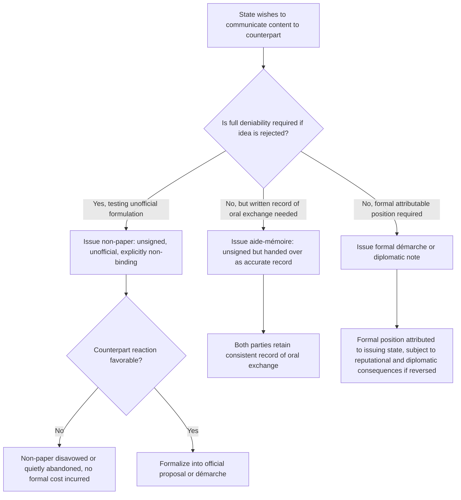

## Non-Papers and Aide-Mémoires as Pre-Negotiation Instruments

### Theoretical Foundations

A **non-paper** is an unofficial, unsigned diplomatic document circulated to explore a negotiating position, proposal, or formulation without committing the issuing state to its content — the document exists, by design and diplomatic convention, outside the category of formal, attributable state communication, allowing an idea to be floated, tested, and if necessary disavowed without the reputational or legal consequences attaching to a formal démarche or official proposal. An **aide-mémoire** is a more formal, though still typically unsigned, written summary of a state's position or of points made in an oral exchange, conventionally handed to a counterpart at the conclusion of a meeting or discussion to ensure an accurate, mutually available record of what was conveyed, occupying an intermediate position on the formality spectrum between a non-paper's deliberate deniability and a signed diplomatic note's full attributability.

**The graduated formality spectrum.** These instruments are best understood not as isolated categories but as points along the same escalating-commitment spectrum introduced in the discussion of costly signals (recall: informal remark, formal démarche, public statement, visible material commitment, each carrying progressively greater cost and credibility). Non-papers and aide-mémoires occupy the *low-commitment end* of this spectrum, deliberately positioned there to enable a distinct pre-negotiation function that higher-commitment instruments cannot serve: the exploration of potential terms *before* either party is prepared to incur the cost, and accept the informational exposure, of a formal position.

### The Deniability Function and Its Relationship to Integrative Bargaining

Recall the **negotiator's dilemma** (Lax and Sebenius): value-creating moves require the disclosure of priorities and potential trade-offs, but such disclosure is risky under value-claiming incentives, since a party that reveals its true interests exposes itself to a counterpart who might exploit that information purely to extract concessions rather than reciprocate with an integrative trade. A non-paper is a specific institutional mechanism for managing this dilemma: by explicitly stripping a proposed formulation of its "official" status, a non-paper allows a state to test a counterpart's reaction to a potential integrative trade — "would X formulation be acceptable if we were to consider it?" — without the diplomatic cost of having formally proposed and then had to withdraw an official position if the counterpart's reaction is negative. This function directly parallels the "hypothetical and conditional framing" technique noted earlier as a means of managing the negotiator's dilemma (recall: proposing trades as "if you could accept X, would Y be possible?" rather than firm concessions), with the non-paper serving as the *documentary* instantiation of that same conditional-framing logic.

**Why deniability requires genuine institutional recognition, not merely informal intent.** The non-paper's deniability function depends on both parties recognizing and respecting the convention that a non-paper does not constitute an official position — a convention sufficiently well-established in professional diplomatic practice that non-papers are treated, by mutual and largely unwritten agreement among diplomatic services, as existing outside the normal evidentiary and attributional rules governing formal communication. This is analytically significant: the non-paper's usefulness depends on a **shared institutional norm** rather than on any unilateral disclaimer a state could simply attach to any document, since a counterpart's willingness to treat a document as genuinely non-binding — and specifically not to cite or leak it as evidence of the issuing state's true position — is itself a form of reciprocal diplomatic good faith that can be, and occasionally is, breached (a state leaking or publicly attributing a counterpart's non-paper is a recognized diplomatic norm violation, with reputational consequences for the leaking party's own future ability to receive non-papers).

### Aide-Mémoires and the Function of Accurate Record-Keeping

An aide-mémoire's principal function differs functionally from a non-paper's exploratory role: rather than testing an unofficial proposal, it typically documents what was actually said or agreed in an oral exchange, addressing a distinct problem in diplomatic communication — the risk of divergent recollections of an oral conversation subsequently causing disputes about what was actually conveyed or committed. By handing a written aide-mémoire summarizing the discussion's key points at the conclusion of a meeting, a diplomat creates a contemporaneous, mutually available record without requiring the higher formality (and correspondingly higher commitment) of a signed diplomatic note, while still substantially reducing the ambiguity risk inherent in relying on unwritten oral exchange alone. Because an aide-mémoire is typically handed over and acknowledged as received (even if not formally endorsed as accurate in every particular by the receiving party), it carries an evidentiary weight closer to the formal end of the spectrum than a non-paper, even though it remains conventionally unsigned and not treated as a binding instrument in itself.

### Diplomatic Application: Non-Papers in EU Internal Negotiation Practice

The European Union's internal negotiating practice among member states makes extensive, institutionally routine use of non-papers, particularly during the preparatory stages of Council negotiations on complex legislative or budgetary questions. A member state or the Commission frequently circulates a non-paper proposing a specific compromise formulation on a contested provision precisely to gauge the reaction of other member states' delegations before any state must commit to a formal negotiating position that would be difficult to withdraw once tabled officially — recall that the EU's institutionalized standing interagency-style process (the Trade Policy Committee structure discussed previously in a different context, and analogous committee structures across policy areas) creates a recurring, multilateral negotiating environment in which non-papers serve as a low-cost mechanism for testing coalition viability for a proposed formulation among 27 member states before any single state or the Commission incurs the reputational cost of formally proposing text that fails to attract sufficient support.

### Diplomatic Application: Non-Papers in Israeli-Palestinian and Middle East Peace Process Diplomacy

Extended Israeli-Palestinian and broader Middle East peace process diplomacy has made documented, extensive use of non-papers, including reportedly during Track II-adjacent and formal negotiating phases, as a mechanism to explore politically sensitive formulations (territorial adjustments, refugee-related provisions, security arrangements) that neither side's political leadership could risk having attributed as an official proposal to their own domestic constituency (recall the two-level game's win-set constraint: a leader whose domestic coalition would treat a specific formulation as an unacceptable concession, if formally and publicly proposed, faces a materially different political cost than the same leader privately exploring that formulation through a non-paper that can be disavowed if leaked or if the exploration proves unproductive). [Inference: specific historical instances of non-paper use in this context are frequently reported in journalistic and memoir accounts of the negotiations rather than through official, verifiable diplomatic archives, given the instruments' deliberately unofficial and typically undisclosed nature; the general pattern of non-paper usage in politically sensitive peace process diplomacy is well-attested across multiple independent accounts even where specific document contents remain unconfirmed.]

### Diplomatic Application: Aide-Mémoires in Historical Bilateral Crisis Diplomacy

Aide-mémoires have historically served a documented function in crisis diplomacy specifically because oral communication during acute crises carries elevated risk of miscommunication with potentially severe consequences. Cold War-era U.S.-Soviet crisis communication practices, including exchanges during periods of heightened tension, made use of aide-mémoires specifically to ensure that precise formulations conveyed orally — where a translation error or an imprecise verbal characterization could materially affect the receiving government's threat assessment — were also captured in a written record both sides could subsequently consult, reducing the risk that a critical nuance (e.g., the precise conditions attached to a proposed de-escalatory step) would be lost or misremembered in the high-pressure environment of crisis communication.

### Diagram: Instrument Selection by Commitment and Deniability Requirement

### Legal and Procedural Interface

Non-papers and aide-mémoires occupy a position explicitly outside the VCLT's definitional threshold for a treaty: recall that **VCLT Article 2(1)(a)** requires an "international agreement... governed by international law" reduced to written form for treaty status, and non-papers in particular are deliberately structured to avoid satisfying even the threshold requirements for characterization as a state's official position, let alone an agreement creating legal obligation. This deliberate sub-threshold status is the instrument's core functional feature rather than an incidental characteristic. However, an aide-mémoire's more formal, attributable character means it can, in some circumstances, carry evidentiary weight relevant to establishing a state's position or the content of prior exchanges — potentially relevant as part of the "circumstances of [a treaty's] conclusion" that **VCLT Article 32** permits as supplementary interpretive means where a resulting treaty's textual meaning proves genuinely ambiguous under Article 31, even though the aide-mémoire itself never rises to the level of a binding instrument. A non-paper's characteristic anonymity and explicit non-attribution, by contrast, typically limit its later evidentiary utility even under Article 32's permissive supplementary-means standard, since establishing what a specific non-paper actually represented as a state's considered position is frequently difficult or contested precisely because the instrument was designed from the outset to resist such attribution.

**Key Points**

- Non-papers are unsigned, unofficial documents enabling deniable exploration of a potential position or formulation; aide-mémoires are more formal, though still typically unsigned, written records of a position or an oral exchange's content.
- Both occupy the low-commitment end of the graduated diplomatic signaling spectrum, with non-papers serving the negotiator's dilemma directly by enabling conditional, disclaimable disclosure of potential integrative trades.
- The non-paper's deniability function depends on a shared, reciprocally enforced diplomatic norm treating the instrument as non-attributable, rather than on a unilateral disclaimer alone; violating this norm (leaking or attributing a counterpart's non-paper) carries its own reputational cost.
- The EU's institutionalized internal negotiating practice and Israeli-Palestinian peace process diplomacy illustrate non-paper use for testing politically sensitive formulations against the two-level game's domestic win-set constraint before formal commitment.
- Non-papers are deliberately structured to fall outside VCLT Article 2(1)(a)'s treaty threshold; aide-mémoires, while also non-binding, carry somewhat greater potential evidentiary relevance as part of a treaty's "circumstances of conclusion" under VCLT Article 32's supplementary interpretive standard.

**Related Topics**

- Costly signals and credible commitment in diplomatic communication
- Interest mapping versus positional mapping in pre-negotiation analysis
- Two-level games and the domestic ratification constraint
- VCLT Article 2(1)(a): definition of a treaty and instrument threshold requirements
- VCLT Article 32: supplementary means of interpretation and circumstances of conclusion
- Track II diplomacy and informal channel negotiation