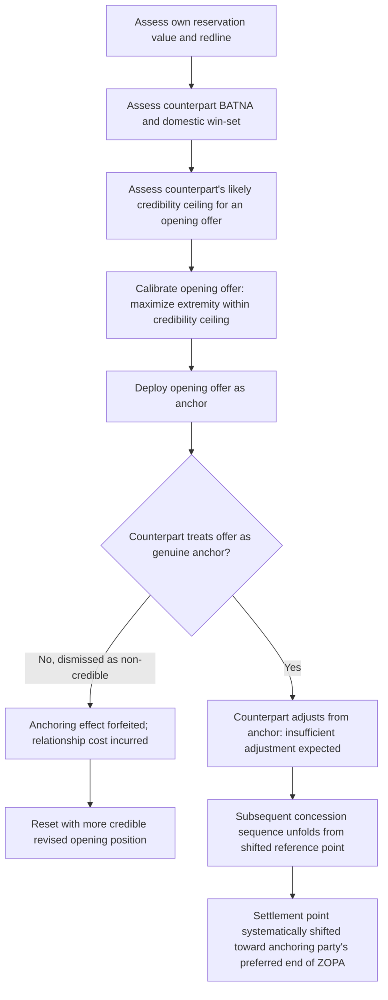

## Opening Offers and Anchoring in Diplomatic Bargaining

### Theoretical Foundations

Recall that **anchoring** is the cognitive bias, identified by Tversky and Kahneman in their foundational 1974 work on judgment under uncertainty, whereby an initial reference point exerts disproportionate influence on subsequent judgments even when that reference point is known to be arbitrary or non-diagnostic of the true underlying value. Applied specifically to negotiation, the **opening offer** functions as this initial anchor: a substantial and now well-replicated experimental bargaining literature (building on Galinsky and Mussweiler's negotiation-specific anchoring studies, 2001) demonstrates that final settlement points correlate more strongly with the extremity of the first offer than with either party's actual reservation value, because subsequent counteroffers and concessions are generated through cognitive adjustment from the anchor rather than through independent, anchor-free calculation of the counterpart's own private assessment. This chapter item develops the tactical mechanics of opening-offer design and deployment in bilateral diplomatic bargaining specifically, building on the anchoring theory introduced earlier as one component within the broader framing-anchoring-sequencing triad.

**The adjustment-insufficiency mechanism.** The psychological mechanism underlying anchoring's persistence — even among sophisticated, expert negotiators aware of the bias — is termed **insufficient adjustment**: a counterpart receiving an extreme anchor does adjust away from it toward what they judge to be a more reasonable figure, but the adjustment process typically terminates too early, before reaching the value the counterpart would have generated had they begun their reasoning from a neutral or self-generated starting point rather than from the anchor itself. This means anchoring effects are not simply a matter of the receiving party naively believing the anchor is a genuine reservation value, but persist even among negotiators who correctly recognize the anchor as strategically inflated — the bias operates on the adjustment process itself, not merely on initial belief formation.

### The Anchor Extremity–Credibility Trade-off

Recall the calibration tension identified previously: an anchor's persuasive power generally increases with its extremity, since a more extreme anchor requires more adjustment to reach any given settlement point, and insufficient adjustment means that larger required adjustments still leave the final judgment shifted further in the anchor's favor. However, this relationship is bounded by a **credibility ceiling**: an anchor perceived as falling entirely outside the plausible range of a genuine, good-faith opening position risks outright rejection as a serious reference point altogether — a counterpart who judges an offer "not a real position" may decline to engage with it as an anchor at all, instead treating it as a signal of bad faith or negotiating incompetence, forfeiting the anchoring effect and potentially imposing broader relationship costs on the negotiation's tone and pace. Diplomatic anchor calibration is therefore a judgment exercise balancing two competing objectives: sufficient extremity to maximize the anchoring effect's leverage, against sufficient plausibility to ensure the anchor is treated as a genuine, if aggressive, opening position rather than dismissed.

**Calibration inputs.** Practical anchor-setting in diplomatic practice typically draws on several calibration inputs to locate the extremity ceiling for a given negotiation: the counterpart's assessed BATNA and domestic win-set (recall the prior discussion of counterpart assessment methodology), the specific negotiating history between the two parties or their broader diplomatic cultures (an anchor extremity that would be normal in one bilateral relationship's negotiating convention may be read as a serious affront in another), and the relative power symmetry between the parties (a materially weaker party's extreme anchor may be more readily dismissed by a stronger counterpart than the reverse, since the stronger party's assessed BATNA gives it less need to engage seriously with an anchor it judges non-credible).

### First-Mover Advantage and Its Limits

The anchoring literature generally identifies a **first-mover advantage**: the party that makes the first substantive offer captures the anchoring effect for their own benefit, shifting the counterpart's subsequent reasoning toward their preferred end of the ZOPA (recall: the zone of possible agreement bounded by each party's reservation value). This creates a documented incentive for parties to compete to make the first offer in bilateral negotiations, a reversal of an older diplomatic convention that sometimes treated waiting for the counterpart to state a position first as advantageous (on the theory that an early offer reveals information about one's own reservation value). Contemporary negotiation-theory consensus, following the anchoring research, generally favors first-mover initiative specifically because the anchoring benefit is understood to typically outweigh the information-revelation cost, *provided* the offer is calibrated within the credibility ceiling discussed above — an important qualification, since a first-mover advantage secured through an anchor so extreme it is dismissed produces no actual benefit and may impose the relationship costs noted above.

**Conditions under which first-mover advantage is diminished or reversed.** The first-mover advantage is not unconditional. Where a counterpart possesses substantially superior information about the actual value or feasibility range of the issue under negotiation — a technically complex verification protocol, for instance, where one party's technical experts (recall the delegation-composition discussion of political principals versus technical experts) have materially deeper subject-matter knowledge — an opening offer risks anchoring the *offering* party's own subsequent reasoning inappropriately if it reflects insufficient information about the genuine feasible range, a risk sometimes termed the **winner's curse** analog in negotiation contexts: a party that anchors aggressively without adequate informational grounding may find its own opening position technically infeasible or reputationally costly to sustain once genuinely superior information later emerges in the negotiation.

### Diplomatic Application: SALT/START Ceiling Negotiations, Revisited

Recall that U.S.–Soviet strategic arms negotiations across SALT I and subsequent rounds exhibited documented anchoring dynamics in opening ceiling proposals, with declassified preparatory memoranda explicitly discussing opening-position calibration as a strategic anchoring exercise rather than a genuine statement of an acceptable final number. The specific tactical mechanics illustrate the extremity-credibility trade-off directly: negotiating team preparatory documents record explicit internal debate over how extreme an opening ceiling proposal could be pitched before risking Soviet dismissal of the U.S. position as not a serious basis for negotiation, reflecting real-time application of the calibration judgment described above within a live, high-stakes bilateral negotiation.

### Diplomatic Application: Panama Canal Treaty Negotiations (1964–1977)

The extended U.S.-Panama negotiations over Panama Canal sovereignty and eventual transfer illustrate a case where anchoring dynamics interacted directly with the negotiations' unusually long duration (spanning multiple U.S. presidential administrations). Panama's opening and sustained anchor — full and relatively immediate sovereignty transfer — remained a consistent reference point across more than a decade of intermittent negotiation, with successive U.S. administrations' counteroffers generally understood by both sides as adjustments from that Panamanian anchor rather than as independently generated U.S. positions, illustrating that an anchor's influence can persist across a negotiation's full multi-year duration and across changes in the specific individuals negotiating, provided the anchoring party maintains consistent public and diplomatic reiteration of the anchor across that span — itself a form of costly signal reinforcing the anchor's credibility through repetition and consistency over time.

### Diplomatic Application: Iran Nuclear Talks Opening Positions

Recall the JCPOA negotiations' eventual logroll trading sanctions relief against verified nuclear constraint. Early negotiating rounds (2013 Joint Plan of Action stage) saw both sides open with positions substantially more extreme than their eventual settlement points — Iranian opening positions implying minimal acceptable constraint on enrichment capacity, and P5+1 opening positions implying near-total dismantlement — a pattern consistent with standard anchoring practice in a negotiation both sides recognized would require extended, multi-round bargaining, where each side's opening anchor was calibrated to shift the eventual multi-year settlement trajectory favorably while remaining within a credibility range that kept the other side engaged in the process rather than judging the opening position a signal of bad faith sufficient to abandon talks.

### Diagram: Opening Offer Calibration and Anchoring Process

### Legal and Procedural Interface

Opening offers and anchoring tactics operate at the pre-textual, tactical stage of negotiation and carry no direct VCLT governance in themselves, since the Convention's competence attaches to the negotiated text's authentication, signature, and consent to be bound rather than to the psychological tactics employed in reaching that text. Their principal legal-adjacent relevance surfaces, as with framing and concession-sequencing tactics generally, through **VCLT Article 31**'s good-faith, ordinary-meaning interpretive standard: an opening position's specific numerical or textual formulation, even where understood by both parties at the time as a strategically extreme anchor rather than a genuine final position, can nonetheless become embedded in the eventual treaty's textual structure or in associated preparatory materials, and **Article 32**'s allowance of *travaux préparatoires* as supplementary interpretive means means that a documented history of opening-position anchoring can, in principle, become interpretively relevant if a later dispute turns on the treaty drafters' original intent regarding a provision whose final language reflects a compromise between initially anchored positions.

**Key Points**

- Opening offers function as anchors per Tversky and Kahneman's anchoring bias; the insufficient-adjustment mechanism means the effect persists even among negotiators who recognize the anchor as strategically inflated.
- Anchor extremity increases leverage up to a credibility ceiling, beyond which the anchor risks outright dismissal as non-credible, forfeiting the anchoring effect and imposing relationship costs.
- A general first-mover advantage favors making the opening offer, but this advantage is diminished or reversed where the offering party lacks adequate information about the genuine feasible range, risking a negotiation-context analog of the winner's curse.
- SALT/START illustrates explicit internal calibration debate over anchor extremity; the Panama Canal negotiations illustrate an anchor's multi-year persistence through sustained, consistent reiteration; the JCPOA's opening rounds illustrate calibrated extremity balanced against credibility within a recognized multi-round negotiating trajectory.
- Anchoring tactics carry no direct VCLT governance but can acquire interpretive relevance under Article 31's good-faith standard and Article 32's allowance of travaux préparatoires where a treaty's final compromise language is later disputed.

**Related Topics**

- Framing, anchoring, and the sequencing of concessions
- BATNA and reservation value in interstate bargaining
- Assessing a counterpart's BATNA and domestic constraints
- Zone of possible agreement and value-claiming versus value-creating moves
- VCLT Article 32: supplementary means of interpretation and travaux préparatoires
- Delegation composition: political principals versus technical experts