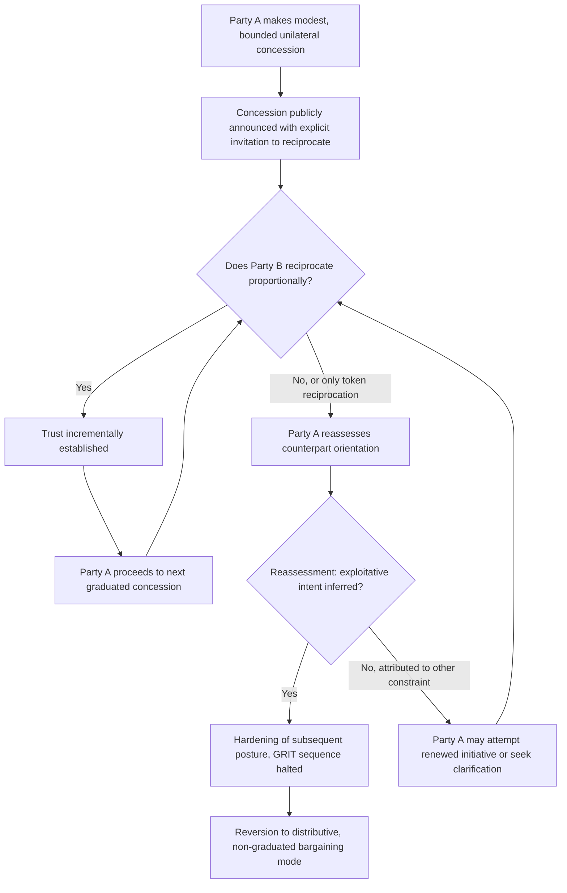

## Concession Patterns and the Reciprocity Norm

### Theoretical Foundations

Recall that concession sequencing carries information independent of concession magnitude, because a rational counterpart infers a party's proximity to its reservation value from the *rate of deceleration* of successive concessions rather than from any single concession viewed in isolation — a sequence of large, evenly spaced concessions signals substantial remaining distance from the reservation value, while a sequence of rapidly shrinking concessions (**decremental concession-making**) signals approach to the limit. This item develops the second major mechanism governing concession behavior: the **reciprocity norm**, the empirically documented social and strategic pressure for a party receiving a concession to respond with a roughly commensurate concession of its own, and the tactical and diagnostic consequences that follow from that norm's operation in bilateral diplomatic bargaining.

**Reciprocity as a documented behavioral regularity.** The reciprocity norm is grounded in a broad literature on social exchange (Gouldner's foundational 1960 sociological treatment of the "norm of reciprocity" as a near-universal feature of human social organization) and has been extensively replicated in experimental and observational bargaining research: parties who receive an unreciprocated concession from a counterpart tend to experience social and psychological pressure to respond in kind, and a party who repeatedly concedes without reciprocation tends to revise their assessment of the interaction's character — from a good-faith, potentially integrative exchange toward a more purely distributive or even exploitative one — with a corresponding hardening of subsequent negotiating posture. This reassessment dynamic means that concession patterns function not merely as private signals about a party's own reservation value, but as ongoing tests of the *counterpart's* orientation toward the negotiation, since a counterpart's response to a concession is itself diagnostic of whether that counterpart intends to negotiate in an integrative or purely distributive mode (recall the distinction between value-creating and value-claiming moves).

### The GRIT Framework and Graduated Reciprocation

The most systematically developed application of reciprocity theory to diplomatic and strategic bargaining is Charles Osgood's **GRIT** framework (**Graduated and Reciprocated Initiatives in Tension-reduction**, first proposed in *An Alternative to War or Surrender*, 1962), developed specifically in the context of Cold War strategic tension reduction. GRIT proposes a structured unilateral-initiative strategy: a party makes a modest, unilateral, publicly announced concession — sufficiently small that it does not compromise the initiating party's core security or bargaining position even if unreciprocated — explicitly invites reciprocation, and then, contingent on the counterpart's actual reciprocation, proceeds to a further graduated concession, building a sequence of escalating mutual concessions through repeated, tested reciprocity rather than attempting a single large simultaneous exchange. GRIT's theoretical significance lies in its explicit engineering around the reciprocity norm as a *trust-building mechanism* under conditions of deep mutual suspicion, where neither party is willing to risk a large unilateral concession without evidence that the counterpart will actually reciprocate rather than exploit the opening.

**GRIT's risk-calibration logic.** GRIT's structure directly addresses a documented failure mode of naive reciprocity-based strategy: a large unreciprocated concession can be exploited by an adversary without meaningful cost to the exploiting party, while a graduated sequence of small, individually low-cost concessions limits the initiating party's exposure at each step, allowing the relationship to be tested incrementally with bounded downside risk at each stage rather than requiring either party to accept a large one-time trust exposure. This makes GRIT a distinct tactical answer to the negotiator's dilemma (recall: value-creating disclosure risks exploitation under value-claiming incentives) specifically tailored to the reciprocity mechanism, as opposed to the non-paper and single-negotiating-text mechanisms discussed in earlier items, which address the same underlying dilemma through different institutional devices.

### Reciprocity Failure and Escalation Dynamics

The reciprocity norm's converse — a documented pattern where a perceived failure to reciprocate produces disproportionate relationship deterioration rather than a merely neutral or proportionate response — is a significant tactical risk in bilateral diplomatic bargaining. Because a concession is frequently interpreted by the conceding party as creating a reciprocity *obligation* on the counterpart, a counterpart's failure to reciprocate is frequently read not as a neutral absence of response but as an active signal of bad faith or exploitative intent, producing a hardening of subsequent posture that can exceed what a purely rational, forward-looking reassessment of the counterpart's reservation value would justify — an asymmetry consistent with the broader loss-aversion findings from prospect theory (recall: losses are weighted more heavily than equivalent gains), since an unreciprocated concession is frequently processed by the conceding party as a loss relative to the reciprocity expectation the concession itself generated, rather than merely as a null result.

**Deliberate non-reciprocation as tactic.** A sophisticated counterpart aware of the reciprocity norm may deliberately withhold reciprocation specifically to test how far a conceding party's unilateral concessions will continue absent reciprocal response, exploiting the conceding party's own reciprocity-driven optimism about eventual reciprocation, or conversely may accept concessions while offering only minimal, token reciprocation calibrated to sustain the appearance of good faith without matching the conceding party's actual commensurate value — a tactic that eventually risks detection and the reassessment-driven hardening described above, but that can extract disproportionate value in the interim if the conceding party is slow to recognize the pattern.

### Diplomatic Application: GRIT and the Kennedy "Strategy of Peace" Initiative (1963)

Osgood's GRIT framework found a documented real-world diplomatic application in the sequence of unilateral U.S.-Soviet gestures following President Kennedy's June 1963 "Strategy of Peace" speech at American University, in which Kennedy announced a unilateral U.S. suspension of atmospheric nuclear testing — a graduated, bounded initiative consistent with GRIT's structure — and explicitly invited Soviet reciprocation. The Soviet Union's reciprocal response (including Khrushchev's own conciliatory rhetoric and subsequent agreement to negotiate what became the Partial Test Ban Treaty, signed within months in August 1963) is frequently analyzed in the negotiation-theory literature as a documented instance of GRIT's graduated-reciprocation mechanism producing a rapid de-escalatory sequence following the acute Cuban Missile Crisis confrontation, illustrating the framework's original Cold War tension-reduction application in close to its purest historically documented form. [Inference: attributing the Partial Test Ban Treaty's rapid conclusion primarily to the GRIT-consistent gesture sequence, rather than to the independent shock effect of the missile crisis itself on both sides' threat perceptions, reflects an analytic interpretation emphasized in the negotiation-theory literature rather than a single, uncontested causal account; both factors are generally treated as contributing rather than as mutually exclusive explanations.]

### Diplomatic Application: Reciprocity Testing in the Iran Nuclear Interim Agreement (2013)

Recall that the Joint Plan of Action (2013) structured a graduated exchange of limited, reversible Iranian nuclear constraints for limited, reversible sanctions relief specifically to test reciprocity before either side committed to the more extensive concessions of a comprehensive final agreement. This interim-agreement architecture functioned as an explicit, deliberately designed reciprocity test consistent with GRIT's graduated logic: each side's compliance with the interim measures served as an observable reciprocation signal informing both sides' confidence in proceeding to the substantially larger, less easily reversible concessions required for the final 2015 JCPOA, rather than requiring either side to accept the full trust exposure of the comprehensive agreement's concessions without first observing several rounds of successfully reciprocated, bounded initial exchange.

### Diplomatic Application: Reciprocity Breakdown in Six-Party Talks with North Korea

The Six-Party Talks process with North Korea across multiple rounds (2003–2009) illustrates a documented pattern of reciprocity breakdown contributing to the process's eventual collapse: successive agreements involving North Korean steps toward denuclearization in exchange for energy assistance and sanctions relief were, on multiple documented occasions, followed by North Korean actions (weapons tests, disclosed enrichment activity) that other parties interpreted as unilateral non-reciprocation or active violation of the reciprocal exchange, producing the reassessment-and-hardening dynamic described above among the other five parties and progressively eroding the diplomatic trust capital needed to sustain further graduated exchange — an instance where breakdown of the reciprocity mechanism, rather than an absence of an initial integrative or graduated framework, is frequently cited as a central contributing factor in the negotiation's eventual stalemate.

### Diagram: Reciprocity Norm Operation and GRIT Sequencing

### Legal and Procedural Interface

Concession patterns and reciprocity-based initiatives operate substantially at the pre-textual and interim-measure stage of diplomatic bargaining, and where such initiatives are formalized into interim or confidence-building agreements (as with the Iran Joint Plan of Action), they frequently take the form of instruments falling short of full VCLT Article 2(1)(a) treaty status — often structured instead as political commitments or executive-level understandings specifically because their function is to test reciprocity under conditions of reversibility, a design goal in tension with the durable, binding character a full treaty instrument would impose. Where a graduated reciprocity sequence does eventually produce a binding treaty (as with the Partial Test Ban Treaty following the Kennedy-initiated GRIT sequence), the negotiating history of unilateral gestures and reciprocal responses preceding the formal text can become relevant as part of the "circumstances of [the treaty's] conclusion" admissible as supplementary interpretive means under **VCLT Article 32**, should later disputes arise regarding the treaty parties' original shared understanding of provisions whose specific formulation reflects the trust-building sequence that preceded formal negotiation.

**Key Points**

- The reciprocity norm, grounded in Gouldner's sociological work and extensively replicated in bargaining research, creates pressure for commensurate response to a concession and drives reassessment of a counterpart's negotiating orientation when reciprocation fails to materialize.
- Osgood's GRIT framework operationalizes reciprocity as a bounded, graduated trust-building mechanism, explicitly engineered to limit exposure at each step while testing counterpart good faith incrementally.
- Reciprocity failure triggers disproportionate relationship deterioration consistent with prospect theory's loss-aversion findings, and can be deliberately exploited by a counterpart aware of the conceding party's reciprocity-driven expectations.
- Kennedy's 1963 "Strategy of Peace" initiative and the subsequent Partial Test Ban Treaty illustrate GRIT's graduated-reciprocation mechanism in a documented historical Cold War application; the Iran Joint Plan of Action illustrates deliberate reciprocity-testing architecture preceding a comprehensive final agreement.
- The Six-Party Talks with North Korea illustrate reciprocity breakdown as a documented contributing factor in negotiation stalemate, distinct from an absence of an initially viable graduated framework.

**Related Topics**

- Framing, anchoring, and the sequencing of concessions
- Distributive versus integrative bargaining in diplomatic negotiation
- Non-papers and aide-mémoires as pre-negotiation instruments
- Costly signals and credible commitment in diplomatic communication
- Confidence-building measures and interim agreements in arms control diplomacy
- VCLT Article 32: supplementary means of interpretation and circumstances of conclusion