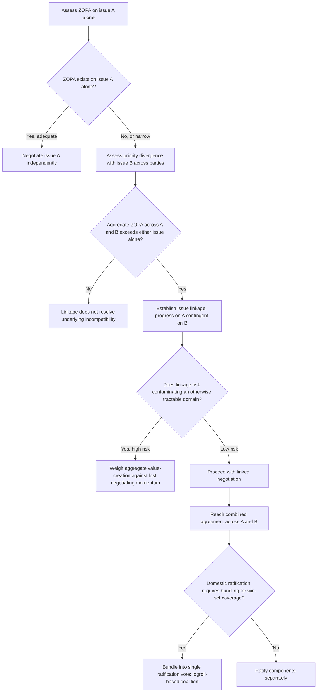

## Issue Linkage and Bundling Across a Bilateral Agenda

### Theoretical Foundations

**Issue linkage** is the tactical practice of formally or informally connecting the resolution of one negotiating issue to the resolution of another, ostensibly unrelated issue, such that progress or agreement on one is made contingent upon, or explicitly traded against, progress or agreement on the other. **Bundling** is the closely related but distinct practice of packaging multiple issues into a single negotiated agreement or single vote, such that a party must accept or reject the entire package rather than negotiating and ratifying each component issue separately. Both practices are direct tactical applications of the **logrolling** mechanism introduced earlier (recall: trading concessions across issues valued differently by each party, the principal mechanism of integrative value-creation), but issue linkage and bundling extend the logrolling concept beyond a single negotiation's internal issue set to encompass **cross-negotiation** or **cross-domain** linkage — connecting an issue under active negotiation to an entirely separate policy domain, alliance relationship, or prior dispute that is not, on its face, part of the same substantive negotiation at all.

**The analytic distinction between linkage and bundling.** Linkage is fundamentally a *bargaining leverage* device: a party makes progress on issue A conditional on the counterpart's movement on issue B, without necessarily requiring that both issues be resolved in the same formal instrument or vote — the connection can remain implicit, tactical, and even deniable (recall the non-paper's deniability function as one mechanism for floating such linkages without formal commitment). Bundling, by contrast, is fundamentally a *ratification-engineering* device: by combining multiple issues into a single package requiring a single up-or-down acceptance, a negotiator can secure ratification for an individually unpopular provision by attaching it to sufficiently popular provisions that the package's net political value exceeds the individually unpopular component's cost — directly engaging the two-level game's domestic win-set mechanics (recall: an agreement outside the domestic win-set cannot be ratified regardless of its external merits) by altering the *unit of ratification* itself rather than the substantive terms of any single issue.

### Linkage as Extended Logrolling and Its Structural Requirements

Recall that logrolling requires priority divergence across issues — an issue valued highly by Party A but weakly by Party B, and vice versa on a separate issue, creates an actionable trade. Cross-domain issue linkage extends this logic across the full scope of a bilateral relationship rather than confining it to a single negotiation's formal agenda: a state may link concessions on a trade dispute to a security cooperation issue, or link progress on a territorial question to economic assistance, precisely because the two domains, considered separately, may each present a ZOPA too narrow (or nonexistent) to support agreement on either issue alone, while the *combined* package — spanning both domains — offers sufficient aggregate value on each side to produce an overall ZOPA where none existed domain-by-domain.

**Linkage's characteristic risk: domain contamination.** A well-documented risk of issue linkage is that connecting two substantively unrelated issues can cause negotiating difficulty in one domain to contaminate and stall progress in an otherwise tractable second domain, effectively converting two independently resolvable disputes into a single, jointly more difficult one. This risk means linkage is not unambiguously beneficial even where it does create an aggregate ZOPA: linkage sacrifices the ability to bank incremental progress in the more tractable domain while the more difficult domain remains unresolved, a trade-off between aggregate value-creation potential and negotiating momentum that skilled diplomatic practice must weigh explicitly rather than assuming linkage is costlessly additive.

### Bundling and the Ratification-Engineering Function

Recall the two-level game's win-set concept directly: bundling functions by allowing a negotiator to construct a package whose *aggregate* net value to the domestic ratifying constituency exceeds the ratification threshold, even where one specific component, evaluated in isolation, would fall outside the win-set. This is analytically distinct from linkage's bargaining-leverage function because bundling's audience is primarily domestic (the ratifying legislature or public) rather than the foreign counterpart, though the two functions frequently operate together in practice — an internationally negotiated linkage between two issues (trade concessions tied to a human-rights commitment, for instance) is commonly also *domestically* bundled into a single ratification vote specifically to secure the domestic coalition that supports the trade component to also carry the human-rights component across the ratification threshold, even where some legislators might oppose the human-rights provision if it were voted on in isolation.

**Logroll-based ratification coalitions.** Bundling frequently constructs what political-science literature terms a **logroll-based ratification coalition**: a legislative coalition assembled not because a majority of legislators favor every component of the bundled package, but because each legislator's support for the components they personally value most is sufficient to secure their vote for the entire package, with different legislators supporting the same bundle for different, even mutually inconsistent, reasons. This mechanism directly parallels logrolling's negotiation-table dynamics (recall: parties trading concessions across differently prioritized issues) but operationalized at the ratification stage rather than the negotiation stage — bundling essentially imports the logrolling mechanism into Level II of the two-level game.

### Diplomatic Application: Most Favored Nation Status and Human Rights Linkage, U.S.-China (1990s)

U.S. policy toward China through the 1990s illustrates a documented and eventually abandoned issue-linkage regime: successive annual renewals of China's Most Favored Nation (MFN) trade status were, for a period, formally linked by U.S. legislative and executive practice to Chinese human-rights conditions, following the Jackson-Vanik amendment's broader precedent of linking trade status to human-rights and emigration-policy conditions in non-market economies. This linkage was ultimately abandoned in 1994 (when President Clinton delinked the two issues) and subsequently superseded by the 2000 grant of Permanent Normal Trade Relations status, reflecting a documented case where the domain-contamination risk described above was judged, at the policy level, to have exceeded the linkage's leverage benefit: the U.S. business community's objection to using an economically significant trade relationship as continuing leverage over a substantively unrelated human-rights domain became evidence, over time, that the linked issues' resolution paths were sufficiently divergent that maintaining the linkage risked the trade relationship without producing commensurate human-rights progress. [Inference: the precise weighting of business-community pressure against human-rights policy objectives in the 1994 delinking decision remains a matter of continued historical and political-science analysis rather than a single settled causal account.]

### Diplomatic Application: EU Enlargement Bundling — Copenhagen Criteria and Chapter Closure

Recall that EU accession negotiations divide substantive negotiation into policy chapters, each requiring technical alignment assessment before political closure (discussed previously in the context of delegation composition). The EU accession process illustrates deliberate use of both linkage and bundling: individual chapters are negotiated and provisionally closed on a chapter-by-chapter basis, but final accession requires the *simultaneous* closure of all chapters and a single ratification act by existing member states — a bundling structure ensuring that a candidate state's compliance across the full range of policy domains (competition policy, judiciary, environment, and so on) cannot be partially achieved and partially deferred indefinitely, since the single-ratification-unit structure means the aggregate package, not any individual chapter, is what existing member states ultimately vote to accept or reject.

### Diplomatic Application: SALT/START Linkage to Broader U.S.-Soviet Relations

Strategic arms control negotiations during the Cold War were, at various points, explicitly linked by U.S. policy to broader Soviet behavior in other domains — most notably, the Carter administration's 1979 decision to withdraw the SALT II treaty from Senate ratification consideration following the Soviet invasion of Afghanistan, a case illustrating linkage operating not through prospective bargaining leverage during negotiation but through *retroactive* linkage applied at the ratification stage: a treaty substantively concluded through bilateral negotiation was nonetheless held hostage, at the domestic Level II stage, to an entirely separate foreign-policy domain (Soviet military action in Afghanistan), illustrating that linkage can be imposed unilaterally at the ratification stage by a domestic political process even where the negotiating delegations themselves did not design the original agreement around any such cross-domain connection.

### Diagram: Linkage and Bundling Decision Structure

### Legal and Procedural Interface

Bundled agreements spanning multiple substantive issues are typically concluded as a single treaty instrument under **VCLT Article 2(1)(a)**, and their internal structure raises a distinct interpretive question addressed by **VCLT Article 44**, which governs the **separability of treaty provisions**: Article 44(1) establishes that a state's right to denounce, withdraw from, or suspend a treaty may be exercised only with respect to the whole treaty unless the treaty otherwise provides or the parties otherwise agree, meaning that a bundled agreement's individually unpopular component cannot generally be unilaterally excised by a party after ratification without withdrawing from the entire bundled instrument — a legal architecture directly reinforcing bundling's ratification-engineering function, since the same all-or-nothing structure that assembles a logroll-based ratification coalition at the point of adoption also constrains any subsequent attempt to selectively abandon only the less popular bundled component once the treaty is in force. Article 44(3) provides a narrower separability exception for grounds such as material breach or fundamental change of circumstances where the affected clauses are separable from the treaty's remainder and their acceptance was not an essential basis of the other parties' consent — a technical qualification relevant where a bundled treaty's specific structure is later disputed, but one that leaves the general non-separability default intact for ordinary withdrawal or denunciation.

**Key Points**

- Issue linkage is a bargaining-leverage device connecting concessions across substantively separate domains to create an aggregate ZOPA where none exists domain-by-domain; bundling is a ratification-engineering device combining issues into a single accept-or-reject package to secure domestic ratification for an individually unpopular component.
- Both extend the logrolling mechanism beyond a single negotiation's internal agenda, with bundling specifically importing logrolling's dynamics into the two-level game's Level II ratification stage as a logroll-based ratification coalition.
- Linkage carries a documented domain-contamination risk: connecting a difficult domain to a tractable one can stall the tractable domain rather than costlessly aggregating value, as illustrated by the U.S.-China MFN/human-rights linkage's eventual abandonment in 1994.
- EU accession illustrates deliberate simultaneous-closure bundling across policy chapters; the 1979 SALT II/Afghanistan case illustrates unilateral, retroactive linkage imposed at the ratification stage independent of the negotiating delegations' original design.
- VCLT Article 44 generally requires whole-treaty withdrawal or denunciation rather than selective abandonment of a bundled treaty's individual provisions, legally reinforcing bundling's ratification-engineering function beyond the point of initial adoption.

**Related Topics**

- Distributive versus integrative bargaining in diplomatic negotiation
- Two-level games and the domestic ratification constraint
- Concession patterns and the reciprocity norm
- VCLT Article 44: separability of treaty provisions
- Interagency instructions and the negotiating mandate
- Trade Promotion Authority and fast-track ratification mechanisms