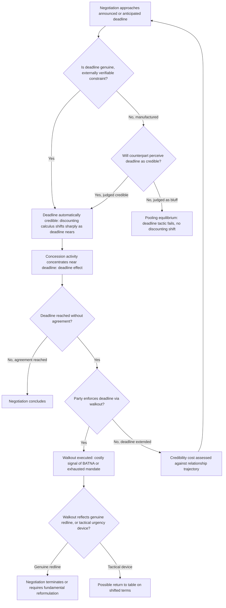

## Deadlines, Walkouts, and Manufactured Urgency

### Theoretical Foundations

**Deadlines** in negotiation theory function as a distinct class of tactical device from the reservation-value and BATNA concepts previously developed: while a reservation value defines the substantive terms below which a party will not agree, a deadline introduces a **temporal constraint** that alters the negotiation's payoff structure independent of the substantive terms under discussion, by attaching a cost to delay itself. The foundational formal treatment is the **Rubinstein bargaining model** (Ariel Rubinstein, "Perfect Equilibrium in a Bargaining Model," 1982), which demonstrates that in an alternating-offer bargaining game with discounting — where each party's valuation of a given settlement diminishes with each round of delay — the unique subgame-perfect equilibrium outcome is determined substantially by the parties' relative discount rates (patience), with the more impatient party (the one who loses more value per unit of delay) systematically obtaining a worse settlement share. A **deadline** is, in this formal sense, an extreme, discontinuous form of discounting: rather than smoothly diminishing value with delay, a hard deadline imposes a sharp discontinuity — often approximating total loss of the negotiation's value — at a specific point in time, dramatically amplifying the strategic significance of relative patience and impatience precisely at and near that point.

**The deadline effect.** A substantial body of experimental bargaining research documents the **deadline effect**: a disproportionate share of concessions and settlement activity in real negotiations cluster in the period immediately preceding an announced or anticipated deadline, rather than being distributed evenly across the negotiation's full duration. This pattern is consistent with the Rubinstein framework's prediction that impending discontinuous value-loss sharply increases the effective cost of continued delay for parties who have not yet reached agreement, producing concentrated concession activity precisely as the deadline approaches, independent of whether the underlying substantive ZOPA (recall: the zone of possible agreement) has actually changed over the negotiation's earlier, more static period.

### Deadline Authenticity and the Genuine-versus-Manufactured Distinction

A critical practical distinction, not always made explicit in formal bargaining theory but central to diplomatic practice, separates **genuine deadlines** — those arising from an authentic external constraint independent of either negotiating party's tactical choice (a legislative session's scheduled expiration, an international summit's fixed calendar date, an underlying crisis's natural time-sensitivity) — from **manufactured deadlines**, unilaterally declared by a negotiating party specifically to alter the counterpart's discounting calculus without any genuine underlying constraint requiring that specific timeline. This distinction connects directly to the costly-signal framework developed earlier (recall Fearon's separating-versus-pooling equilibrium logic): a genuine deadline is, definitionally, externally verifiable and therefore automatically credible, while a manufactured deadline's credibility depends entirely on whether the declaring party can convince the counterpart that failing to meet the deadline will actually trigger the threatened consequence (walkout, escalation, unilateral action) — precisely the separating-equilibrium problem that determines whether any costly signal achieves genuine credibility or merely produces a pooling equilibrium in which the counterpart correctly discounts the claimed deadline as bluff.

**The manufactured-deadline enforcement problem.** A manufactured deadline that a party fails to enforce — continuing to negotiate past the announced expiration without triggering the threatened consequence — produces a documented reputational cost closely analogous to the redline-abandonment cost discussed previously (recall: a redline "walked back" once degrades the credibility of future redline claims specifically, since a redline abandoned once becomes cheap talk in all subsequent invocations). This creates a structural tension for the declaring party: enforcing a manufactured deadline that turns out, upon reflection, to have been prematurely or unwisely set may sacrifice a substantively achievable and valuable agreement merely to preserve tactical credibility, while failing to enforce it sacrifices the credibility of future deadline tactics — a trade-off requiring careful ex ante calibration of deadline severity before announcement, structurally identical to the redline-setting calibration problem (recall the redline credibility-rigidity trade-off) applied specifically to the temporal rather than substantive dimension of negotiating commitment.

### Walkouts as Costly Signal and Tactical Instrument

A **walkout** — the deliberate, announced suspension or termination of negotiations by one party — functions simultaneously as several distinct tactical mechanisms depending on its specific deployment:

- **Deadline enforcement**: a walkout triggered upon an announced deadline's expiration converts a manufactured deadline from cheap talk into an enacted, costly signal (recall the sunk-cost signaling mechanism: a walkout, once executed, imposes real costs — lost negotiating time, reputational risk, potential relationship damage — regardless of whether the walking-out party subsequently returns to the table, distinguishing it from a merely verbal deadline threat).
- **BATNA demonstration**: a walkout can function as a costly signal specifically communicating that the walking-out party's BATNA genuinely exceeds the terms currently on offer (recall: only a party for whom the external alternative is genuinely superior would rationally incur a walkout's costs), making the walkout itself informative about the party's true reservation value in a way mere verbal assertion of dissatisfaction would not be.
- **Tied-hands reinforcement**: a walkout conducted publicly, before domestic or international audiences, generates audience costs (recall Fearon's tying-hands mechanism) that make a subsequent return to the table on substantially unchanged terms politically costly for the walking-out party's own leadership, thereby credibly signaling to the counterpart that any eventual return will require the counterpart to have moved, not merely the walking-out party reconsidering.

**The strategic ambiguity of walkout intent.** A documented complication in interpreting a walkout is that a counterpart cannot always distinguish, at the time it occurs, between a walkout reflecting genuine, non-tactical exhaustion of the walking-out party's authorized flexibility (recall: a delegation reaching its redline or exhausting its mandate, discussed previously as the "instructions awaited" state) and a walkout deployed purely as a manufactured-urgency tactic intended to extract further concessions upon an anticipated return to the table — an ambiguity that itself can be tactically exploited (a party may deliberately cultivate uncertainty about which type of walkout it is engaged in, since a counterpart uncertain whether the walkout reflects a genuine limit or a tactic faces its own inference problem structurally identical to the pooling-versus-separating equilibrium question in costly-signal theory generally).

### Diplomatic Application: Camp David 1978 and the Presidential Deadline Device

Recall that Camp David's Israeli-Egyptian negotiations used a single negotiating text procedure to manage the negotiator's dilemma. The negotiation additionally illustrates deliberate deadline manufacturing as a facilitation device: President Carter's decision to convene the negotiations at the isolated Camp David retreat for a bounded, though not initially fixed, period functioned to create a psychologically compressed negotiating environment distinct from the parties' normal diplomatic routines, and Carter's later willingness to signal that the summit could not continue indefinitely without a resolution is documented in multiple participant accounts as contributing to a late-stage acceleration of concessions consistent with the general deadline-effect pattern — a case of a mediator, rather than either principal party, manufacturing and enforcing deadline pressure specifically to overcome an otherwise persistent negotiating stalemate.

### Diplomatic Application: Iran Nuclear Talks Deadline Extensions (2013–2015)

The P5+1-Iran negotiations illustrate a documented pattern of repeated deadline extension across the multi-year negotiating process — the original Joint Plan of Action interim deadline was extended multiple times before the final JCPOA's 2015 conclusion. This pattern is instructive precisely because it illustrates the manufactured-deadline enforcement problem in a case where the parties collectively judged, on each occasion, that the substantive value of continued negotiation exceeded the credibility cost of extending rather than enforcing the announced deadline — a documented instance where repeated deadline extension did not appear to substantially degrade the parties' ability to eventually reach and credibly conclude a final agreement, suggesting that deadline credibility costs may be more contingent on the broader negotiating relationship's trajectory and perceived good faith than on a simple, mechanical "deadlines must always be enforced or credibility is lost" rule. [Inference: the precise conditions under which repeated deadline extension does or does not degrade future negotiating credibility remain an area of ongoing scholarly and practitioner debate rather than a settled finding.]

### Diplomatic Application: Walkouts in U.S.-North Korea Hanoi Summit (2019)

Recall the existential-category redline incompatibility between U.S. denuclearization demands and North Korean regime-survival-linked retention interests discussed previously. The 2019 Hanoi summit's abrupt, unscheduled termination — a walkout initiated by the U.S. side without a prior announced deadline structure — illustrates a walkout functioning primarily as a genuine redline-enforcement mechanism (recall: the summit collapsed at the point where the incompatibility of the two sides' redlines became explicit and irreconcilable within the scope of the proposed deal) rather than as a manufactured-urgency tactic within an ongoing, otherwise-productive negotiation, distinguishing this case functionally from the Camp David and Iran talks examples above, where deadline and walkout dynamics operated within negotiations that were fundamentally converging toward an achievable ZOPA rather than confronting a fundamental incompatibility of existential-category positions.

### Diagram: Deadline and Walkout Decision Structure

### Legal and Procedural Interface

Deadlines and walkouts operate at the pre-textual, tactical stage of negotiation and carry no direct VCLT governance over the tactic itself, since the Convention's competence attaches to the negotiated outcome's textual conclusion rather than the temporal pressure tactics used to reach it. Their principal legal-adjacent relevance arises in two respects. First, where a negotiation does reach a concluded text under time pressure, the deadline-driven negotiating history can become relevant as part of the "circumstances of conclusion" admissible as supplementary interpretive means under **VCLT Article 32**, particularly where a provision's specific, potentially imprecise formulation appears attributable to late-stage, deadline-compressed drafting rather than to careful, unhurried textual construction — a documented interpretive consideration in treaty disputes where ambiguous language is traced to rushed final-hours drafting. Second, a walkout that occurs after a state has already signed a treaty subject to ratification implicates **VCLT Article 18**'s obligation to refrain from acts that would defeat the treaty's object and purpose pending ratification — meaning a walkout from *implementation* or follow-on negotiation after signature carries different, and potentially more legally consequential, implications than a walkout occurring during the pre-signature negotiating phase itself, where no such Article 18 obligation yet attaches.

**Key Points**

- Deadlines function as a discontinuous form of discounting per the Rubinstein bargaining model, with the deadline effect describing the empirically documented concentration of concession activity immediately preceding an announced or anticipated deadline.
- Genuine deadlines are automatically credible by virtue of external verifiability; manufactured deadlines face the same separating-versus-pooling equilibrium credibility problem as other costly signals, with enforcement failure risking the same reputational cost as redline abandonment.
- Walkouts function simultaneously as deadline-enforcement mechanisms, BATNA-demonstrating costly signals, and tied-hands audience-cost generators, with genuine ambiguity often surrounding whether a given walkout reflects authentic exhausted mandate or manufactured tactical urgency.
- Camp David 1978 illustrates mediator-manufactured deadline pressure overcoming stalemate; the Iran nuclear talks illustrate repeated deadline extension without apparent credibility collapse; the 2019 Hanoi summit illustrates a walkout functioning as genuine redline enforcement rather than tactical urgency within an otherwise convergent negotiation.
- Deadline-compressed drafting can become interpretively relevant under VCLT Article 32's circumstances-of-conclusion standard, while a post-signature walkout implicates VCLT Article 18's object-and-purpose obligation in a way a pre-signature walkout does not.

**Related Topics**

- Setting redlines and walk-away positions before talks begin
- Costly signals and credible commitment in diplomatic communication
- Concession patterns and the reciprocity norm
- VCLT Article 18: obligations of a signatory state pending ratification
- VCLT Article 32: supplementary means of interpretation and circumstances of conclusion
- Assessing a counterpart's BATNA and domestic constraints