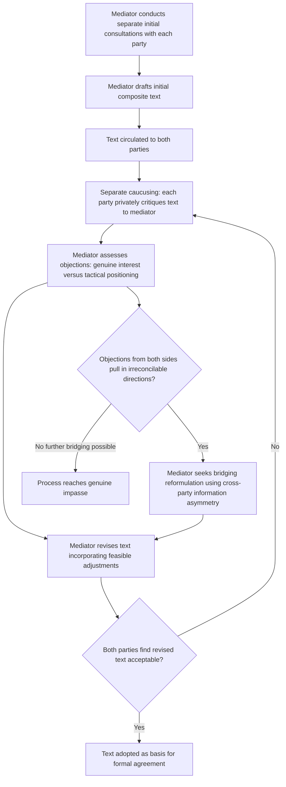

## The Single Negotiating Text Procedure

### Theoretical Foundations

The **single negotiating text procedure** is a mediation and drafting technique in which a third party — rather than either principal negotiating delegation — produces, circulates, and iteratively revises a single composite draft agreement, with each party responding not by advancing or defending their own competing draft but by critiquing and proposing modifications to the mediator's evolving text. The procedure was formally articulated and named by Roger Fisher in the context of the Camp David negotiations he helped design, and is treated in the Fisher and Ury *Getting to Yes* (1981) framework as a structural solution to a specific class of negotiating pathology: multi-party or high-tension bilateral negotiations in which the exchange of competing draft texts tends to harden each side's position around defending their own document's specific language, rather than genuinely engaging with the counterpart's underlying interests.

**The structural problem the procedure addresses.** Recall the **negotiator's dilemma** (Lax and Sebenius): value-creating moves require the disclosure of priorities and interests, but such disclosure is risky under value-claiming incentives, since a party that reveals its true interests exposes itself to exploitation by a counterpart who might use that information purely for extraction rather than reciprocal integrative trade. Direct bilateral drafting — where each party produces its own text and the two texts are then reconciled through direct exchange — exacerbates this dilemma in a specific, documented way: each party's own draft functions as a public commitment (recall the "tied hands" audience-cost mechanism) that becomes psychologically and politically costly to abandon once advanced, creating an escalating attachment to specific textual formulations largely independent of whether those formulations actually serve the party's underlying interests. This produces what negotiation theorists term **positional drafting lock-in**: parties end up negotiating over whose document's language prevails, a dynamic that is structurally distributive (a single text, ultimately, must be adopted) even where the underlying substantive interests would support a genuinely integrative resolution.

**How the procedure restructures the interaction.** By removing authorship from both principal parties and vesting it in a neutral mediator, the single negotiating text procedure converts the interaction from a *choice between two competing, authored proposals* into a *shared critique of a jointly disowned draft*. Because neither party has authored the text under discussion, criticizing or proposing changes to it carries none of the reputational cost of reversing one's own prior public position — a party can freely say "this formulation does not work for us" without this being read as backing down from a stated position, since the text was never their position to begin with. This directly defuses the escalation-of-commitment dynamic (recall: the documented risk that a negotiator becomes attached to positions through the psychological momentum of having already advanced and defended them) while simultaneously enabling the kind of interest disclosure that integrative bargaining requires, since a party's specific objection to draft language ("this clause fails to address our security concern regarding X") reveals underlying interests precisely because the objection is framed as a critique of the mediator's proposal rather than as a concession from the party's own prior stated position.

### Procedural Mechanics

The procedure typically follows a structured iterative cycle:

1. **Initial draft construction.** The mediator, drawing on prior separate consultations with each party (a form of interest excavation closely related to the informal-channel elicitation techniques discussed in interest-mapping methodology), produces an initial composite text intended as a genuine, good-faith attempt at a mutually workable formulation rather than as an opening anchor favoring either side.
2. **Separate or joint critique.** Each party reviews the draft and identifies specific provisions that fail to meet its interests, typically communicated to the mediator through **caucusing** — separate, private meetings between the mediator and each delegation, conducted independently of the other party's presence — allowing candid identification of problems without either party's objections being directly and immediately visible to (and thus potentially exploitable by) the other.
3. **Revision.** The mediator revises the text incorporating feasible adjustments addressing the raised concerns, applying independent judgment regarding which objections reflect genuine, addressable interests versus purely tactical positioning, and regarding how to reconcile objections that pull the text in materially opposed directions.
4. **Iteration to convergence or impasse.** Steps 2 and 3 repeat, with each successive draft ideally narrowing the range of unresolved objections, until either a version emerges that both parties can accept (even if neither considers it perfect) or the process reaches a genuine impasse where no further mediator-proposed revision can satisfy both sides' core interests simultaneously.

**The mediator's asymmetric information position.** A structurally important feature of the procedure is that the mediator, through separate caucusing with each party, frequently accumulates a more complete picture of both parties' underlying interests than either party has of the other — since each party discloses more candidly to the trusted, non-adversarial mediator in private caucus than it would disclose directly to its counterpart. This gives the mediator a distinctive capacity to identify **bridging solutions** (recall: inventing a new option that satisfies both parties' underlying interests without requiring either to abandon their position outright) that neither party could independently construct from its own necessarily incomplete information about the other's true priorities — the procedure's value-creation function depends substantially on this asymmetric-information advantage held uniquely by the mediator rather than by either principal.

### Diplomatic Application: Camp David Accords (1978)

Recall that Camp David's breakthrough rested on identifying Israel's underlying interest as security from cross-border attack (rather than territorial control) and Egypt's underlying interest as sovereignty and national dignity (rather than an unrestricted military presence) — an interest-level compatibility invisible at the purely positional level. This finding was substantially the product of the single negotiating text procedure as formally and deliberately deployed by the U.S. mediating team under President Carter: contemporaneous and subsequent participant accounts document a reported 23 or more successive drafts produced and revised over the course of the thirteen-day summit, with U.S. mediators conducting extensive separate caucusing with the Israeli and Egyptian delegations throughout, allowing each side to register specific objections to successive drafts without ever having to formally propose or defend competing bilateral text of their own. [Inference: the precise number of draft iterations varies somewhat across different participant memoirs and historical accounts; the general pattern of extensive, mediator-driven iterative redrafting through separate caucusing is consistently documented across multiple independent sources regardless of the exact draft count.] The procedure's caucusing structure is specifically credited in the negotiation-theory literature with allowing Prime Minister Begin to register objections regarding Sinai settlement provisions without those objections being read as a reversal of a prior Israeli public position, since no such formal Israeli position on the mediator's specific draft language had ever been publicly advanced in the first instance.

### Diplomatic Application: Dayton Peace Accords (1995)

The Dayton negotiations, ending the Bosnian War, employed a single negotiating text procedure under U.S. mediation (led by Richard Holbrooke) at Wright-Patterson Air Force Base, structurally following the Camp David precedent closely: the parties — Bosnian, Croatian, and Serbian delegations — were physically isolated at the negotiating venue, and U.S. and international mediators produced and iteratively revised composite draft agreements addressing the territorial, constitutional, and military provisions ending the conflict, with extensive separate caucusing among the three parties conducted in parallel to formal joint sessions. The procedure's multi-party extension at Dayton (three principal parties rather than Camp David's two) illustrates that the single negotiating text approach scales to more complex multi-party configurations, though at the cost of a correspondingly more complex mediator task in identifying a single text formulation capable of satisfying three, rather than two, sets of underlying interests simultaneously — a documented increase in mediator drafting burden and caucusing complexity relative to the bilateral case.

### Diplomatic Application: UN Law of the Sea Convention Negotiations (UNCLOS III, 1973–1982)

The Third UN Conference on the Law of the Sea illustrates single negotiating text procedure deployment at an especially large multilateral scale: the Conference's president employed a formally designated "Informal Single Negotiating Text" (ISNT), later evolving through successive "Revised Single Negotiating Texts" (RSNTs) and eventually the Informal Composite Negotiating Text, as the vehicle for consolidating and progressively narrowing the negotiating positions of well over one hundred participating states across the Conference's near-decade duration. This case illustrates the procedure's formalization into an explicitly named, institutionally recognized document category within a large multilateral negotiating framework, distinguishing UNCLOS III's practice from the more ad hoc, mediator-driven drafting characteristic of Camp David and Dayton, while sharing the same underlying structural logic of substituting a jointly disowned, iteratively revised composite text for direct exchange of competing state proposals.

### Diagram: Single Negotiating Text Procedure Cycle

```plaintext
===syllabot_diagram_marker_unused===
```



### Legal and Procedural Interface

The single negotiating text itself, at any stage prior to final adoption, holds a status analogous to the non-papers discussed previously: it is explicitly not attributable as either party's official position, and its successive drafts are correspondingly outside **VCLT Article 2(1)(a)**'s treaty-instrument threshold until the parties formally adopt a version as their agreed text. Once adopted and signed, however, the drafting history of successive negotiating-text iterations — frequently preserved in mediator and delegation archives — can become significant as *travaux préparatoires* admissible as supplementary interpretive means under **VCLT Article 32**, particularly valuable in cases like UNCLOS III where the extended, multi-year iteration through ISNT, RSNT, and composite text stages created an unusually well-documented paper trail of how specific provisions evolved, which subsequent interpretive disputes before tribunals such as those constituted under UNCLOS Annex VII have on occasion drawn upon to establish the shared understanding underlying a contested provision's final formulation.

**Key Points**

- The single negotiating text procedure substitutes a mediator-authored, iteratively revised composite draft for direct exchange of competing party-authored proposals, specifically to defuse positional drafting lock-in and manage the negotiator's dilemma.
- Separate caucusing allows candid interest disclosure and objection-raising without the audience-cost exposure of publicly reversing a party's own prior stated position, since no party has authored the text under discussion.
- The mediator's accumulated cross-party information, gathered through separate caucusing, gives it a distinctive capacity to identify bridging solutions unavailable to either principal party working from incomplete information about the other's true interests.
- Camp David 1978 illustrates the procedure's original, paradigmatic bilateral deployment; the Dayton Accords illustrate its extension to a three-party configuration; UNCLOS III illustrates its formalization into a named document category at large multilateral scale.
- Draft iterations remain outside VCLT Article 2(1)(a)'s treaty threshold until formal adoption, but the resulting drafting history can become significant as travaux préparatoires under VCLT Article 32 in subsequent interpretive disputes.

**Related Topics**

- Zone of possible agreement and value-claiming versus value-creating moves
- Interest mapping versus positional mapping in pre-negotiation analysis
- Non-papers and aide-mémoires as pre-negotiation instruments
- Deadlines, walkouts, and manufactured urgency
- VCLT Article 32: supplementary means of interpretation and travaux préparatoires
- Mediation and third-party facilitation in multilateral diplomacy