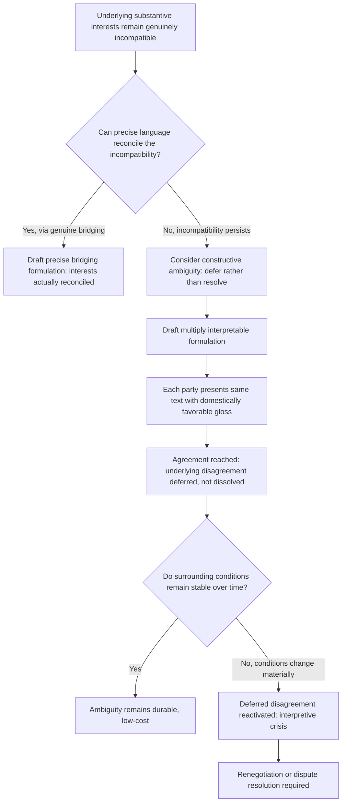

## Constructive Ambiguity as a Bridging Tactic

### Theoretical Foundations

**Constructive ambiguity** is the deliberate use of imprecise, multiply interpretable textual formulation to enable agreement between parties whose substantive positions remain genuinely incompatible at the level of precise, unambiguous language, allowing each party to sign the same text while maintaining materially different — sometimes directly contradictory — understandings of what that text actually commits them to. The term is most closely associated with Henry Kissinger, who used it extensively in describing his own Middle East shuttle-diplomacy practice, though the underlying technique substantially predates the term's popularization. Constructive ambiguity is best understood as a specific, textual instantiation of the **bridging** mechanism introduced earlier in the integrative-bargaining framework (recall: inventing a new option that satisfies both parties' underlying interests without requiring either to concede on their originally stated position) — but where ordinary bridging typically resolves the underlying interest conflict itself, constructive ambiguity instead defers or displaces that resolution, allowing the parties to proceed to agreement without actually reconciling the substantive incompatibility at all.

**The distinction between resolving and deferring incompatibility.** This distinction is analytically important because it separates constructive ambiguity from the genuine value-creating bridging solutions discussed in the theoretical-foundations material on distributive versus integrative bargaining. A genuine bridging solution — such as Camp David's demilitarization-plus-sovereignty formulation — identifies underlying interests that were never actually opposed, once properly understood; the positions appeared incompatible, but the interests were not. Constructive ambiguity, by contrast, is typically deployed precisely where the underlying interests themselves *remain* genuinely opposed or unresolved, and the ambiguous language functions not to reconcile that opposition but to avoid forcing either party to publicly concede on it at the moment of signature — the substantive disagreement persists, but is textually obscured rather than substantively dissolved.

### The Mechanism: Multiple Audiences, Single Text

Constructive ambiguity exploits a structural feature of diplomatic communication directly connected to the two-level game framework (recall: a state's negotiators must simultaneously satisfy an international counterpart at Level I and a domestic ratifying constituency at Level II). A precisely worded, unambiguous text forces both the international counterpart and each party's own domestic audience to confront the same single interpretation simultaneously. An ambiguously worded text, by contrast, allows each party's negotiators to present the *same* text to their *own* domestic audience with an interpretive gloss favorable to that audience's expectations, while the international counterpart's negotiators simultaneously present the identical text to their own domestic audience with a different, equally favorable gloss — each side's domestic win-set (recall the win-set concept from the two-level game discussion) can be satisfied by a domestically convenient reading of the same words, even though the two readings, if placed side by side, would be recognized as substantively incompatible.

**Why this differs from simple deception.** Constructive ambiguity is distinguished, at least in its idealized theoretical form, from unilateral deception because both negotiating parties are understood — at the negotiator level, if not necessarily at the broader domestic-audience level — to recognize that the language is deliberately ambiguous and to have jointly accepted that ambiguity as the price of reaching any agreement at all. This mutual, negotiator-level awareness is what separates constructive ambiguity from one party unilaterally misleading the other about the text's actual meaning: the ambiguity is a jointly constructed and jointly understood feature of the text, even though its function specifically depends on each party's own domestic audience *not* sharing that negotiator-level awareness of the term's genuine multivalence.

### The Deferred-Cost Problem

Constructive ambiguity's central structural risk is that it does not eliminate the underlying substantive disagreement but merely relocates the point at which that disagreement must be confronted — from the moment of signature to a later moment of implementation, interpretation, or dispute. Because the ambiguity was, by design, never actually resolved, subsequent events frequently force the parties to confront the divergent interpretations directly, at which point the absence of a jointly agreed, precise meaning can itself become a source of acute conflict, potentially more damaging than if the original incompatibility had been transparently acknowledged (and either resolved through genuine bridging or left as an explicit, unresolved item) at the time of signature. This is the tactic's core trade-off: constructive ambiguity purchases the *possibility* of reaching an agreement that precise language would have made impossible, at the cost of deferring, rather than eliminating, the risk of a subsequent interpretive crisis — a trade-off that is sometimes, but not reliably, favorable depending on whether circumstances at the later interpretive moment prove more or less conducive to managing the deferred disagreement than the original negotiating moment was.

### Diplomatic Application: UN Security Council Resolution 242 (1967)

The paradigmatic and most extensively analyzed instance of constructive ambiguity in modern diplomatic practice is UN Security Council **Resolution 242** (1967), addressing the aftermath of the Six-Day War. The resolution's English text calls for Israeli withdrawal "from territories occupied in the recent conflict," while the equally authoritative French text uses language ("des territoires occupés," more naturally read as "from the territories") that a substantial body of subsequent diplomatic and legal analysis has read as implying withdrawal from *all* occupied territories, in contrast to the English formulation's grammatical openness to a partial-withdrawal reading. This drafting — reportedly the product of deliberate ambiguity accepted by the resolution's drafters, including principally the U.S. and UK delegations under Lord Caradon's stewardship, specifically because a precisely worded formulation acceptable to both Israel (which sought language compatible with retaining some occupied territory pending negotiated security arrangements) and Arab states (which sought language compatible with complete withdrawal) proved unachievable — has generated sustained interpretive dispute across subsequent decades of Middle East diplomacy, with both the scope of required withdrawal and the resolution's relationship to the separate question of recognized boundaries remaining genuinely contested. [The precise degree to which the English/French textual divergence was a deliberate drafting choice, as opposed to an unintended translation discrepancy that was subsequently exploited or emphasized by parties favoring one interpretation, remains a matter of continued historical and diplomatic dispute; the two positions are not fully reconcilable from the available drafting record, and this uncertainty is itself part of what the resolution's ongoing interpretive controversy illustrates.]

### Diplomatic Application: The Northern Ireland "Constructive Ambiguity" on Sovereignty (Good Friday Agreement, 1998)

The Good Friday (Belfast) Agreement ending the Northern Ireland conflict employed constructive ambiguity regarding Northern Ireland's constitutional status, formulating provisions that allowed unionist communities to read the settlement as confirming Northern Ireland's continued status within the United Kingdom (contingent on majority consent) while allowing nationalist and republican communities to read the same provisions as establishing a credible, legitimate pathway toward eventual Irish unification through the same consent-based mechanism. Recall that this is the identical structural pattern later revisited in the 2020 Brexit Withdrawal Agreement's Northern Ireland protocol (discussed in the redlines item): the protocol's own subsequent renegotiation via the 2023 Windsor Framework is consistent with the deferred-cost problem identified above — the original 1998 constructive ambiguity regarding sovereignty and consent proved durable for over two decades, but the introduction of Brexit's new trade-border complications reactivated latent interpretive tensions that the original ambiguous formulation had successfully deferred rather than permanently resolved, illustrating that a deferred disagreement can remain stable for an extended period under stable surrounding conditions while still resurfacing when those surrounding conditions materially change.

### Diplomatic Application: The "One China" Policy Formulations

U.S.-China-Taiwan diplomatic relations since the 1970s illustrate sustained, multi-decade constructive ambiguity regarding Taiwan's status: the U.S. "acknowledges" (in the language of the 1972 Shanghai Communiqué) rather than explicitly "accepts" or "endorses" the position that there is one China and Taiwan is part of it, a specific verb choice reportedly the product of deliberate negotiation between U.S. and Chinese drafters precisely to allow each side's domestic and international audiences to read the formulation consistent with their own preferred understanding of the U.S. position's actual substantive commitment, while avoiding either an explicit U.S. endorsement of Chinese sovereignty claims over Taiwan or an explicit U.S. rejection of them. This formulation has remained diplomatically load-bearing for over five decades, illustrating constructive ambiguity's capacity for exceptional durability where the surrounding strategic conditions (in this case, all major parties' shared interest in avoiding forced confrontation of the underlying sovereignty question) remain relatively stable, in contrast to the Good Friday Agreement/Windsor Framework case's eventual reactivation under changed circumstances.

### Diagram: Constructive Ambiguity Deployment and Risk Structure

### Legal and Procedural Interface

Constructive ambiguity creates a distinctive and well-recognized challenge for treaty interpretation under the VCLT's interpretive framework. **VCLT Article 33**, governing treaties authenticated in two or more languages, provides in paragraph 3 a presumption that the terms of a treaty have the same meaning in each authentic text, and in paragraph 4 that where a comparison of authentic texts discloses a difference of meaning not resolved by applying Articles 31 and 32, "the meaning which best reconciles the texts, having regard to the object and purpose of the treaty, shall be adopted" — a provision directly implicated by cases like Resolution 242's English/French textual divergence, though Resolution 242, as a Security Council resolution rather than a treaty, is technically governed by UN Charter interpretive practice rather than the VCLT directly, even though analogous interpretive principles are commonly applied by analogy. More generally, where constructive ambiguity is deployed within an actual treaty text, **VCLT Article 31(1)**'s good-faith, ordinary-meaning, object-and-purpose interpretive standard provides the primary mechanism through which a subsequent interpretive dispute over deliberately ambiguous language must eventually be resolved — and the very deliberateness of the original ambiguity can complicate this process, since Article 31's ordinary-meaning inquiry presumes a genuine, if perhaps context-dependent, meaning exists to be recovered, a presumption that sits uneasily with language whose drafters specifically intended it to sustain multiple, mutually exclusive meanings simultaneously.

**Key Points**

- Constructive ambiguity uses deliberately imprecise language to enable agreement where substantive positions remain genuinely incompatible, functioning as a deferral rather than a resolution mechanism, distinct from genuine bridging solutions that reconcile actually-compatible underlying interests.
- The tactic exploits each party's ability to present an identical text with a domestically favorable interpretive gloss to its own Level II audience, while negotiators at the international level are typically mutually aware of the language's deliberate multivalence.
- The technique's central risk is the deferred-cost problem: the unresolved disagreement resurfaces at a later interpretive or implementation moment, potentially under less favorable conditions than existed at signature.
- UN Security Council Resolution 242's English/French textual divergence illustrates sustained multi-decade interpretive dispute; the Good Friday Agreement's sovereignty formulation illustrates durable ambiguity later reactivated by changed Brexit-era conditions; the "One China" Shanghai Communiqué formulation illustrates exceptional five-decade durability under stable surrounding strategic conditions.
- VCLT Article 33(4) directly addresses multi-language textual divergence by directing interpreters toward the meaning that best reconciles authentic texts in light of the treaty's object and purpose, while Article 31's ordinary-meaning standard sits in tension with language deliberately drafted to sustain multiple meanings.

**Related Topics**

- Zone of possible agreement and value-claiming versus value-creating moves
- The single negotiating text procedure
- Two-level games and the domestic ratification constraint
- VCLT Article 33: interpretation of treaties authenticated in two or more languages
- VCLT Article 31: general rule of interpretation
- Setting redlines and walk-away positions before talks begin