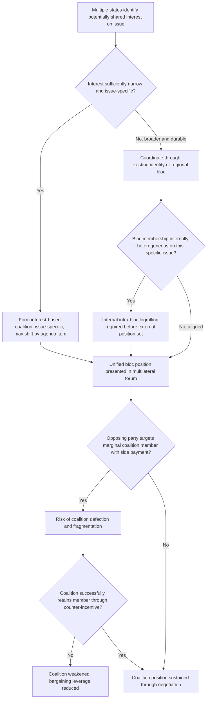

## Coalition-Building and Bloc Formation in Multilateral Fora

### Theoretical Foundations

Multilateral negotiation — involving three or more independently negotiating parties — introduces analytic complexity absent from the bilateral bargaining framework developed in prior chapter items: rather than a single ZOPA bounded by two parties' reservation values, a multilateral negotiation must locate an agreement point acceptable to some sufficient coalition of parties, where "sufficient" is defined by whatever decision rule (unanimity, consensus, weighted or simple majority) governs the forum in question. **Coalition-building** is the process by which parties with imperfectly aligned but sufficiently overlapping interests combine their bargaining positions to achieve collectively what none could achieve individually, while **bloc formation** refers to the emergence of more durable, often institutionalized groupings that persist and coordinate across multiple negotiating rounds or issue areas rather than forming ad hoc around a single question.

**Coalition theory foundations.** The formal analytic basis for multilateral coalition behavior draws substantially on cooperative game theory, particularly the concept of the **core** — the set of outcomes from which no coalition of players could profitably deviate by forming an alternative arrangement among themselves — and on William Riker's **minimum winning coalition** theory (*The Theory of Political Coalitions*, 1962), which predicts that rational coalition-builders, all else equal, prefer the smallest coalition sufficient to prevail, since a larger-than-necessary coalition dilutes each member's share of whatever collective benefit the coalition secures. Riker's theory provides a baseline prediction against which real diplomatic coalition behavior can be compared, though multilateral diplomatic practice frequently departs from the minimum-winning-coalition prediction in documented and theoretically explicable ways, discussed below.

**Why diplomatic coalitions frequently exceed minimum winning size.** Riker's minimum-winning-coalition logic assumes coalition partners are dividing a fixed, quantifiable benefit among themselves — a premise that holds imperfectly in diplomatic contexts, where coalition value frequently derives not from dividing a fixed prize but from establishing negotiating **legitimacy** and **durability** across a forum's ongoing, repeated interactions rather than a single vote. A coalition perceived as representing a broad and diverse membership carries greater persuasive weight in multilateral deliberation (a form of information signal about the position's genuine breadth of support, distinct from the pure vote-counting logic of Riker's model) and is more resistant to defection-based erosion by opposing parties who might otherwise pick off marginal coalition members one at a time — considerations that favor coalitions larger than the bare minimum required for a single vote, particularly in fora where reputation and standing persist across many successive negotiating rounds.

### Types of Multilateral Coalition Structures

Diplomatic practice in multilateral fora exhibits several recurring, analytically distinct coalition structures:

- **Interest-based coalitions**: groupings formed around a specific, often narrow shared substantive interest in a particular negotiation, with membership that may shift issue-by-issue as different substantive alignments become relevant — a state may belong to entirely different coalitions across different agenda items within the same forum, reflecting the underlying interest-mapping logic (recall: interests, not fixed identities, are the relevant unit of coalition analysis) applied at the multilateral scale.
- **Identity or regional blocs**: more durable groupings organized around shared regional identity, historical relationship, or institutional affiliation (the African Union bloc, the Non-Aligned Movement, regional economic groupings), which coordinate across a broad range of issues over extended periods rather than reforming around each specific question, trading some issue-specific interest precision for the durability and negotiating efficiency of an established, standing coordination mechanism.
- **Cross-cutting issue coalitions**: groupings that deliberately cut across established regional or identity blocs to combine parties with a shared interest on a specific dimension that does not track existing bloc membership — for instance, a coalition of small island states combining across otherwise distinct regional groupings specifically around climate-vulnerability interests, a coalition structure that exists because the underlying interest (vulnerability to sea-level rise) does not correspond to any pre-existing regional or ideological bloc boundary.

### The G77 and the Logrolling Function of Broad Developing-World Coalitions

The **Group of 77** (G77), formed in 1964 and now encompassing well over 130 developing-country members despite its founding-era name, illustrates the durable-bloc structure at exceptionally large scale within UN and broader multilateral fora. The G77's function substantially reflects the legitimacy-and-durability logic identified above rather than Riker's minimum-winning-coalition prediction: by aggregating the collective bargaining weight of a large majority of UN member states behind broadly shared developing-world interests (favorable terms of trade, development assistance, technology transfer), the bloc secures negotiating standing and agenda-setting influence that no individually-sized developing-world coalition could achieve, even at the cost of internal heterogeneity — G77 membership spans states with genuinely divergent specific interests on many individual issues, requiring substantial internal coordination and, frequently, internal logrolling (recall: trading concessions across issues valued differently) among G77 members themselves before the bloc can present a unified external position, illustrating that large diplomatic blocs frequently contain, and must internally manage, the same distributive-versus-integrative bargaining dynamics that characterize bilateral negotiation, simply relocated to the intra-bloc coordination stage preceding external multilateral engagement.

### Diplomatic Application: Climate Negotiation Coalition Structures (UNFCCC)

The UN Framework Convention on Climate Change negotiating process, culminating in the Paris Agreement (recall the NDC framing discussed previously), illustrates a particularly rich and well-documented multilateral coalition ecosystem, with overlapping and sometimes competing coalition structures operating simultaneously: the **G77 plus China** grouping representing broad developing-world interests in the climate context specifically; the **Alliance of Small Island States (AOSIS)**, a cross-cutting issue coalition (per the taxonomy above) formed specifically around existential climate-vulnerability interests that cut across G77's broader and more heterogeneous membership; the **Umbrella Group** of non-EU developed countries (including the United States, Japan, Canada, and Australia among others) coordinating around shared developed-country negotiating interests distinct from the EU's own, separately coordinated negotiating bloc; and the **Like-Minded Developing Countries** grouping, a further subset within the broader developing-world coalition space organized around a more specific set of shared negotiating priorities regarding differentiated responsibility. This dense, overlapping coalition structure illustrates that real multilateral negotiations frequently do not resolve into a small number of clean, mutually exclusive blocs, but instead involve states navigating simultaneous, sometimes cross-pressuring membership in multiple coalition structures whose interests align differently across different specific sub-issues within the broader negotiation.

### Diplomatic Application: UNCLOS III Group of 77 and the Common Heritage of Mankind Principle

Recall that UNCLOS III's single negotiating text procedure evolved through successive ISNT, RSNT, and composite text stages across a near-decade multilateral negotiation. The G77's coordinated advocacy during UNCLOS III for the **"common heritage of mankind"** principle — ultimately incorporated governing deep seabed mineral resources beyond national jurisdiction — illustrates a documented case of successful large-bloc coalition influence substantially reshaping a multilateral negotiation's substantive outcome relative to what the numerically smaller bloc of developed, seabed-mining-capable states would have preferred absent the G77's coordinated pressure, though the resulting compromise (Part XI of UNCLOS, later substantially modified by the 1994 Implementation Agreement to secure broader developed-state ratification) also illustrates that a large bloc's negotiating success at the initial text-adoption stage does not guarantee the resulting provision's durability absent subsequent accommodation of the interests of parties whose ratification remains necessary for the treaty's broader legitimacy and functioning — a bloc-formation analog to the two-level game's domestic win-set constraint, operating here at the level of which states' eventual accession is required for a multilateral instrument's practical effectiveness.

### Coalition Fragility and Defection Dynamics

Multilateral coalitions, particularly large and internally heterogeneous ones, face a documented structural vulnerability to **defection**: because a large coalition's bargaining position typically reflects a compromise among internally divergent member interests (recall the intra-G77 logrolling dynamic noted above), an opposing party or coalition can frequently identify and exploit the coalition's most marginal or dissenting members through targeted side-payments or issue-specific concessions calibrated to peel that member away from the broader coalition position — a tactic directly analogous to bilateral issue linkage (recall: connecting an issue under negotiation to a separate domain to create an aggregate ZOPA) but deployed specifically against a single coalition member rather than against a unified bilateral counterpart, exploiting the coalition's internal interest heterogeneity as an point of leverage unavailable against a genuinely unified single-state counterpart.

### Diagram: Multilateral Coalition Formation and Function

### Legal and Procedural Interface

Coalition and bloc structures in multilateral fora have no direct governing provision under the VCLT, since the Convention addresses the legal mechanics of treaty conclusion among states rather than the political coordination mechanisms states employ in reaching a negotiating position. Their principal legal relevance surfaces at the point of treaty adoption and entry into force: **VCLT Article 9(2)** provides that, absent an agreed different procedure, the adoption of a treaty text at an international conference takes place by the vote of two-thirds of the states present and voting, unless those states decide, by the same majority, to apply a different rule — a provision whose practical operation is directly shaped by coalition and bloc dynamics, since the two-thirds threshold makes large, durable blocs such as the G77 potentially decisive in text-adoption votes at conferences structured under this default rule, explaining much of the strategic incentive for maintaining broad, durable coalition membership discussed above even at some cost to internal interest homogeneity. Separately, where a treaty's entry into force is conditioned on a specified number or category of ratifications (a common structural feature of multilateral treaties, addressed under **VCLT Article 24**), a bloc's coordinated ratification behavior — or a critical subset's coordinated non-ratification, as in the developed-state resistance to UNCLOS Part XI prior to the 1994 Implementation Agreement — can determine whether a multilaterally negotiated and even formally adopted text ever achieves the practical entry into force its negotiators intended.

**Key Points**

- Multilateral coalition-building extends bilateral bargaining logic (logrolling, interest divergence, distributive-versus-integrative tension) to settings requiring a sufficient coalition rather than a single bilateral counterpart's agreement, governed by cooperative game theory concepts including the core and Riker's minimum winning coalition prediction.
- Diplomatic coalitions frequently exceed Riker's minimum winning size because coalition value in diplomacy derives substantially from legitimacy and durability across repeated interactions, not merely from dividing a single fixed benefit.
- Coalition structures range from narrow, shifting interest-based coalitions to durable identity or regional blocs to cross-cutting issue coalitions, with large blocs like the G77 requiring substantial internal logrolling to manage member heterogeneity before presenting unified external positions.
- The UNFCCC negotiating ecosystem illustrates dense, overlapping coalition structures (G77 plus China, AOSIS, the Umbrella Group, Like-Minded Developing Countries) operating simultaneously; UNCLOS III's common heritage of mankind outcome illustrates large-bloc influence on substantive text, later qualified by the 1994 Implementation Agreement's accommodation of ratification-critical developed states.
- VCLT Article 9(2)'s two-thirds conference adoption threshold and Article 24's ratification-conditioned entry into force provisions directly shape the strategic incentives underlying bloc size and durability, since both text adoption and practical treaty effectiveness can hinge on coordinated bloc behavior at these respective stages.

**Related Topics**

- Distributive versus integrative bargaining in diplomatic negotiation
- Issue linkage and bundling across a bilateral agenda
- The single negotiating text procedure
- VCLT Article 9: adoption of treaty text at international conferences
- VCLT Article 24: entry into force of multilateral treaties
- Two-level games and the domestic ratification constraint