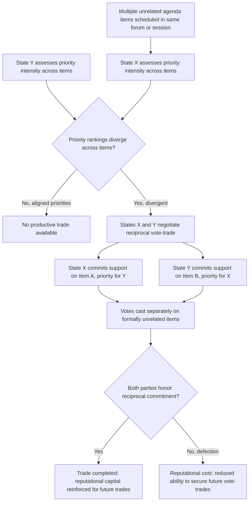

## Vote-Trading Across Unrelated Agenda Items

### Theoretical Foundations

**Vote-trading**, in the classical political-science sense from which the diplomatic application derives, refers to an exchange in which a party agrees to support another party's preferred outcome on one matter in exchange for reciprocal support on a separate matter, where the party's own preference intensity on the second matter (the one it receives support on) exceeds its preference intensity on the first (the one it concedes). The foundational formal treatment is James Buchanan and Gordon Tullock's analysis in *The Calculus of Consent* (1962), which demonstrates that vote-trading (there termed "logrolling" in its original legislative context) can produce Pareto-improving outcomes in a multi-issue voting body precisely because it allows intensity of preference, not merely direction of preference, to influence collective outcomes — a voter who cares intensely about issue A but only mildly about issue B can trade support on B (where they are near-indifferent) for support on A (where they care greatly), producing an outcome that better aggregates the true intensity-weighted preferences of the electorate than a system in which each issue is decided independently by simple majority without any cross-issue trading.

**Distinction from bilateral logrolling and bundling.** Recall that **logrolling** at the bilateral negotiating-table level (recall: trading concessions across issues valued differently within a single negotiation) and **bundling** at the ratification-engineering level (recall: combining multiple issues into a single accept-or-reject package to construct a logroll-based ratification coalition) both operate *within* a defined negotiation or defined ratification vote. **Vote-trading across unrelated agenda items**, as addressed in this item, extends the identical underlying logic to a distinct institutional setting: a standing multilateral body (the UN General Assembly, the UN Security Council, an international organization's governing council) where multiple, substantively unconnected agenda items come before the same body across a shared voting session or a related sequence of sessions, and a state's vote on one item is traded against another state's vote on an entirely separate, procedurally independent item — the two matters are not bundled into a single instrument or single vote at all, but remain formally separate votes whose outcomes are informally linked through a reciprocal understanding between the trading parties.

### Structural Preconditions for Multilateral Vote-Trading

Vote-trading of this kind requires several structural preconditions largely specific to standing multilateral bodies rather than one-off bilateral or treaty-conference negotiations:

- **Repeated interaction across a shared institutional forum.** Because the traded votes are formally separate and rely on a reciprocal, often informal understanding rather than a single binding instrument, vote-trading depends substantially on the parties' expectation of continued future interaction within the same body — a defection from an agreed vote-trade (voting against the agreed position after having received the reciprocal support) is punished primarily through reputational consequences affecting the defecting state's ability to secure future vote-trades, rather than through any formal legal enforcement mechanism, since no binding instrument connects the two separately cast votes.
- **Preference intensity asymmetry across the trading parties.** As in Buchanan and Tullock's original framework, productive vote-trading requires that the trading parties have different relative priority rankings across the traded items — a state indifferent to Item A but intensely invested in Item B can profitably trade with a state holding the reverse priority ranking, precisely the priority-divergence condition previously identified as the general precondition for any logrolling-type exchange (recall the interest-matrix methodology from the pre-negotiation analysis discussion, which identifies exactly this kind of cross-issue priority divergence as the signal of an actionable trade).
- **Sufficient agenda density and voting frequency.** Vote-trading of this kind is most viable in bodies with a sufficiently dense and continuous flow of agenda items — the UN General Assembly's annual cycle of resolutions across a very broad range of subjects provides substantially more opportunity for cross-issue trading than a body convening rarely or addressing only a narrow substantive range, since a wider agenda increases the probability that any given pair of states will find complementary priority-divergent items to trade across.

### Diplomatic Application: UN General Assembly Regional Group Rotation and Seat Trading

The UN General Assembly's practice of allocating non-permanent Security Council seats, subsidiary body memberships, and various elected positions substantially through **regional group** rotation (the UN's five regional groups: African, Asia-Pacific, Eastern European, Latin American and Caribbean, and Western European and Others) illustrates a documented, institutionalized form of vote-trading closely related to, though procedurally distinct from, the ad hoc cross-issue trading described above: states within a given regional group frequently negotiate reciprocal voting support for candidacies to different bodies and different election cycles, trading support for one state's Security Council bid in exchange for support for a different state's bid to a separate subsidiary body or specialized agency position, constructing multi-cycle reciprocal voting arrangements that function as a formalized, semi-institutionalized vote-trading system operating substantially within regional blocs (recall the bloc-formation discussion) rather than purely bilaterally.

### Diplomatic Application: Human Rights Council Country-Specific Resolution Voting

UN Human Rights Council practice regarding country-specific human-rights resolutions has been documented, in academic and NGO analysis of voting patterns, to exhibit correlations consistent with cross-issue vote-trading: states facing scrutiny or criticism regarding their own human-rights record have been observed to build reciprocal voting coalitions with other similarly situated states, trading mutual abstention or opposition on unrelated country-specific resolutions targeting each other's respective human-rights records — a pattern sometimes informally termed a **"non-aggression pact"** dynamic in human-rights diplomacy commentary, in which states with no substantive interest overlap on the underlying human-rights questions themselves nonetheless find a mutually beneficial trade in reciprocal protection from targeted multilateral criticism. [Inference: while voting-pattern correlations consistent with this dynamic are documented in academic and NGO analysis of Human Rights Council voting records, establishing a specific, deliberate vote-trading agreement between named states from voting-pattern correlation alone involves an inferential step that observational voting data cannot fully confirm, since correlated voting could also reflect independently shared political alignments rather than an explicit reciprocal trade.]

### Diplomatic Application: UN Security Council Package Deals on Non-Permanent Member Elections

Security Council non-permanent member elections, requiring a two-thirds majority of the General Assembly under the UN Charter, have historically produced documented instances of extended multi-round balloting resolved through vote-trading packages combining support for a Security Council candidacy with reciprocal commitments regarding entirely separate matters — including, in some documented historical instances, states' voting positions on unrelated General Assembly resolutions scheduled for the same or an adjacent session. The 1979 contest between Cuba and Colombia for a Latin American regional Security Council seat, which required an unusually protracted 154 rounds of balloting before both candidates withdrew in favor of a compromise candidate (Mexico), is frequently cited in diplomatic-practice literature as illustrating both the intensity of vote-trading activity that can surround a single contested multilateral election and the practical limits of vote-trading's capacity to resolve a deadlock when the underlying preference intensities of a sufficiently large blocking minority remain genuinely unmovable through available cross-issue trades.

### Vote-Trading Risks: Transparency, Accountability, and Legitimacy Costs

Multilateral vote-trading carries documented risks distinct from those affecting bilateral bundling or logrolling, arising specifically from the practice's characteristic **opacity**: because vote-trades linking formally unrelated agenda items are rarely formally documented or publicly disclosed (unlike a bundled treaty, whose combined provisions are, by definition, visible in the adopted instrument's text), the practice raises accountability concerns — a state's vote on a given resolution may reflect a reciprocal trade entirely invisible to observers assessing that vote as a supposedly independent expression of the state's substantive position on the resolution's actual subject matter, potentially distorting external perception of a multilateral body's genuine deliberative outcomes and complicating efforts (by domestic constituencies, civil society organizations, or scholarly observers) to hold states accountable for votes whose true rationale lies entirely outside the resolution's stated subject.

### Diagram: Multilateral Vote-Trading Process

### Legal and Procedural Interface

Vote-trading across unrelated agenda items in a standing multilateral body operates entirely outside the VCLT's scope, since the traded votes are typically cast on resolutions or elections rather than on treaty texts requiring signature or ratification, and the reciprocal trading arrangement itself is characteristically an informal political understanding rather than a legally binding instrument. Where a General Assembly vote does concern the adoption of a multilateral treaty text, however, **VCLT Article 9(2)**'s two-thirds conference-adoption threshold (discussed in the coalition-formation item) means that vote-trading dynamics of the kind described here can directly influence whether a treaty text achieves the necessary adoption majority, effectively importing the vote-trading practices of the broader multilateral forum into the treaty-adoption process itself. More generally, UN Charter **Article 18(2)** specifies which General Assembly matters are "important questions" requiring a two-thirds majority (including, among other matters, the election of non-permanent Security Council members and admission of new UN members), a threshold whose relative difficulty compared to a simple majority correspondingly increases the practical significance of vote-trading as a coalition-assembly mechanism for reaching that higher bar on the specific categories of question Article 18(2) enumerates.

**Key Points**

- Vote-trading across unrelated agenda items extends Buchanan and Tullock's logrolling framework to standing multilateral bodies, exchanging reciprocal support on formally separate, procedurally unconnected votes rather than bundling issues into a single instrument.
- Productive vote-trading requires repeated institutional interaction (to sustain reputational enforcement absent a binding instrument), priority-intensity asymmetry across trading parties, and sufficient agenda density to generate complementary trading opportunities.
- UN regional group seat-rotation practices illustrate institutionalized, semi-formal multi-cycle vote-trading; Human Rights Council voting-pattern analysis illustrates a documented, though not fully confirmable from voting data alone, reciprocal-protection dynamic; the 1979 Cuba-Colombia Security Council contest illustrates both intensive vote-trading activity and its limits against genuinely unmovable blocking-minority preferences.
- The practice's characteristic opacity — traded votes on formally unrelated items are rarely publicly documented as connected — raises distinct accountability and transparency concerns not present in bundled treaty instruments, whose combined provisions are visible in the adopted text itself.
- VCLT Article 9(2)'s two-thirds treaty-adoption threshold and UN Charter Article 18(2)'s "important questions" supermajority requirement both increase the practical significance of vote-trading as a coalition-assembly mechanism wherever a forum's decision rule exceeds simple majority.

**Related Topics**

- Coalition-building and bloc formation in multilateral fora
- Issue linkage and bundling across a bilateral agenda
- VCLT Article 9: adoption of treaty text at international conferences
- UN Charter Article 18: General Assembly voting procedures and important questions
- Distributive versus integrative bargaining in diplomatic negotiation
- The single negotiating text procedure