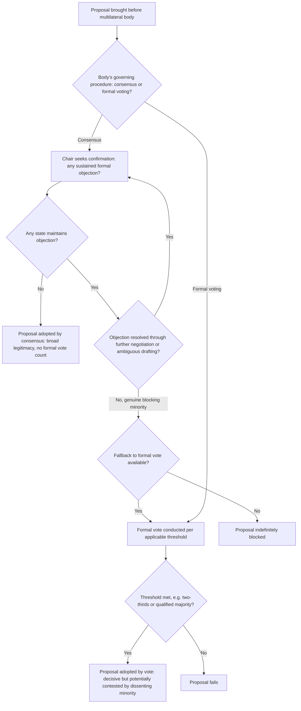

## Consensus Procedure versus Formal Voting in International Organizations

### Theoretical Foundations

**Formal voting** in international organizations refers to a decision rule under which a proposal's adoption is determined by a specified quantitative threshold of affirmative votes cast — simple majority, two-thirds supermajority, or a weighted or qualified-majority formula — with the outcome determined mechanically once votes are tallied, regardless of which specific states voted against or abstained. **Consensus procedure**, by contrast, is a decision rule under which a proposal is adopted only in the absence of any formally stated objection from a participating member, without necessarily requiring an affirmative vote count at all — a chair typically gavels a proposal as adopted "by consensus" upon confirming that no delegation has raised or maintained a formal objection, meaning consensus decision-making is fundamentally a **negative-consent** rule (silence or non-objection suffices) rather than a **positive-affirmation** rule (an actual counted "yes" is required) governing formal voting.

**The core trade-off: legitimacy versus decisiveness.** The choice between consensus and formal voting reflects a fundamental trade-off directly connected to the coalition-formation dynamics discussed previously (recall: diplomatic coalitions frequently exceed Riker's minimum-winning-coalition prediction because coalition value in diplomacy derives substantially from legitimacy and durability, not merely from a bare majority sufficient to prevail). Consensus procedure, by requiring the absence of any formal objection rather than merely a passing vote count, generally produces outcomes with substantially broader perceived legitimacy and durability — an outcome adopted by consensus cannot later be characterized by a dissenting minority as having been imposed over their objection through a bare majority vote, since consensus, by construction, requires no state to have formally maintained an objection. This legitimacy benefit comes at a direct cost to decisiveness: because a single state's sustained formal objection can block consensus regardless of how isolated that objection is relative to the broader membership's preferences, consensus procedure effectively grants each participating state a **de facto veto** over the specific proposal under discussion, a dramatically more permissive blocking threshold than even the most demanding formal supermajority voting rule.

### Consensus as an Endogenous, Negotiated Outcome

A critical distinction, frequently underappreciated in casual usage of the term, is that "consensus" in formal multilateral procedure does **not** mean unanimous enthusiastic agreement or the absence of substantive disagreement among participants — it means the absence of any state's *sustained formal objection* to the specific proposal as finally worded, a status that is itself typically the *product* of extensive prior negotiation specifically aimed at producing text no state finds objectionable enough to formally block, rather than a spontaneous discovery of pre-existing unanimous preference. This connects directly to constructive ambiguity (recall: deliberately imprecise language enabling agreement where substantive positions remain genuinely incompatible) as a characteristic tool for achieving consensus specifically: because consensus requires only the absence of formal objection rather than genuine substantive convergence, sufficiently ambiguous language allowing each state to interpret a provision consistently with its own preferred position is frequently a more tractable path to consensus than precise language that would force an explicit, and potentially objection-triggering, resolution of the underlying substantive disagreement.

### The Blocking-Minority Problem and Procedural Responses

Consensus procedure's de facto veto structure creates a documented vulnerability to **blocking-minority tactics**: because a single sustained objection suffices to prevent consensus, a state (or small group of states) with an intense minority preference can indefinitely delay or entirely prevent adoption of a proposal favored by an overwhelming majority of the forum's broader membership, a dynamic structurally opposite to Buchanan and Tullock's vote-trading logic (recall: vote-trading allows intensity of preference to influence outcomes precisely through cross-issue trading), since under consensus a single intensely opposed state need not trade anything at all — its mere sustained objection is sufficient to block, without needing to offer any reciprocal concession to secure that blocking power. Multilateral bodies employing consensus procedure have developed several documented, though only partially effective, institutional responses to this vulnerability:

- **Informal social pressure and isolation costs.** A state maintaining a lone or near-lone objection against an otherwise broad consensus faces reputational costs from being publicly identified as the sole obstacle to an outcome the broader membership favors — a dynamic connecting to the audience-cost mechanism discussed in the costly-signals framework, though operating here as a cost imposed on the *objecting* party by the collective body rather than a cost the objecting party strategically incurs to build its own credibility.
- **Chair's discretion and "silence procedure."** Forum chairs frequently exercise interpretive discretion regarding what constitutes a sufficiently sustained and substantive objection to block consensus, as opposed to a more qualified reservation or a a statement "for the record" that does not rise to the level of blocking the outcome — a discretionary chair's-judgment mechanism that introduces an element of formal-voting-like decisiveness into nominally pure consensus procedure, since the chair effectively determines, at the margin, whether a given state's stated position counts as a blocking objection at all.
- **Fallback to formal voting.** Many multilateral bodies operating primarily by consensus retain formal voting as an available fallback procedure when consensus genuinely proves unachievable, meaning the choice between consensus and voting is frequently not a fixed, single procedural rule for the body as a whole but a sequential default (attempt consensus first, resort to formal vote only if consensus fails) — a structure that preserves consensus's legitimacy benefits for the substantial majority of decisions where it succeeds, while avoiding consensus's most severe blocking-minority pathology for the residual set of decisions where a genuine, irreconcilable minority objection would otherwise produce indefinite paralysis.

### Diplomatic Application: World Trade Organization Consensus Requirement

The World Trade Organization's governing agreements formally establish consensus as the organization's primary decision-making procedure for most substantive matters, a structure carried forward from the GATT's own longstanding consensus practice. WTO practice illustrates the blocking-minority problem in an especially consequential documented form: the Doha Development Round's prolonged multi-year stalemate (negotiations launched in 2001, never concluded as a comprehensive round) is frequently attributed substantially to the consensus requirement's interaction with genuinely divergent developed- and developing-country interests on agricultural subsidies and market access, where a relatively small number of states maintaining sustained objections on core provisions proved sufficient to prevent the broader membership from reaching a comprehensive agreement despite extensive, sustained multilateral negotiating effort across more than a decade. [Inference: the relative causal weight of the consensus requirement itself, as opposed to the underlying substantive difficulty of the agricultural and market-access issues under negotiation, in explaining Doha's prolonged stalemate remains a matter of continued trade-policy scholarly debate; both factors are generally treated as contributing rather than as fully separable explanations.]

### Diplomatic Application: UN Security Council Formal Voting and the Permanent-Member Veto

The UN Security Council illustrates the converse structural case: rather than a consensus norm, the Security Council operates under formal voting per **UN Charter Article 27**, requiring an affirmative vote of nine of the fifteen members including the concurring votes of all five permanent members on non-procedural matters — a formal voting rule that nonetheless *incorporates* a consensus-like blocking mechanism specifically for the five permanent members (the veto), while operating as ordinary majority-threshold formal voting for the broader ten non-permanent members' votes. This hybrid structure illustrates that the consensus-versus-voting distinction is not always a clean binary at the level of an entire institution's decision rule, but can be selectively combined within a single body's formal procedure — full formal voting for the numerical majority requirement, combined with an effective single-state veto (functionally equivalent to consensus procedure's blocking-minority vulnerability, but formally embedded in the voting rule itself rather than arising from a separate consensus convention) for the five permanent members specifically.

### Diplomatic Application: Paris Climate Agreement's Consensus-Based Adoption

Recall that the Paris Agreement's NDC framing was specifically designed to expand the range of states willing to participate given domestic win-set constraints. The Agreement's adoption at COP21 (2015) itself proceeded through UNFCCC's characteristic consensus procedure, a process reported in extensive contemporaneous accounts of the negotiation's final hours as involving intensive, last-minute drafting adjustments specifically to resolve a late-emerging objection from the Nicaraguan delegation regarding a single word in the text's legal-form language, illustrating in a well-documented, recent instance both the blocking-minority vulnerability inherent in consensus procedure (a single state's objection genuinely threatened to prevent adoption of an agreement representing years of negotiation among nearly two hundred parties) and the intensive last-minute drafting and diplomatic pressure characteristically deployed to resolve such objections and preserve the broader legitimacy benefits of consensus adoption for an agreement whose durability was judged to depend substantially on avoiding a formally voted, and therefore potentially more contestable, adoption process.

### Diagram: Consensus versus Formal Voting Decision Structure

### Legal and Procedural Interface

Formal voting procedures in treaty-adoption contexts are directly governed by **VCLT Article 9**, whose paragraph 1 establishes that adoption of a treaty text takes place by the consent of all states participating in its drawing up (a rule most naturally suited to smaller bilateral or limited-multilateral negotiations), while paragraph 2 — as discussed in the coalition-formation item — establishes the two-thirds formal-voting default for adoption at international conferences, unless the conference decides by the same majority to apply a different procedure, a provision under which conferences frequently do adopt consensus as their operative "different procedure," meaning Article 9(2) functions as much as a *default rule displaceable in favor of consensus* as it does a standing formal-voting requirement in modern multilateral treaty-making practice. Where consensus is adopted as a conference's operative procedure (as UNFCCC conferences and most modern multilateral treaty conferences do), the VCLT itself provides no separate codified definition of consensus, leaving its specific operational meaning (what constitutes a sufficient objection, whether abstention differs from objection, the chair's discretionary role) to the specific forum's own rules of procedure rather than to any uniform international-law standard — a documented source of procedural variation and occasional dispute across different multilateral bodies employing nominally similar "consensus" language with materially different specific operational rules.

**Key Points**

- Formal voting is a positive-affirmation, quantitative-threshold decision rule; consensus is a negative-consent rule requiring only the absence of sustained formal objection, generally producing broader legitimacy at the cost of granting each participant a de facto veto.
- Consensus is typically an endogenous, negotiated outcome rather than spontaneous unanimous agreement, with constructive ambiguity serving as a characteristic tool for achieving the absence of formal objection without resolving genuine underlying substantive disagreement.
- The blocking-minority problem inherent in consensus procedure is partially addressed through informal social-pressure costs on isolated objectors, chair's discretion regarding what constitutes a blocking objection, and sequential fallback to formal voting where consensus genuinely fails.
- The WTO's Doha Round stalemate illustrates consensus procedure's blocking-minority vulnerability at a prolonged, multi-year scale; the UN Security Council illustrates a hybrid structure combining ordinary formal voting with an embedded permanent-member veto; the Paris Agreement's COP21 adoption illustrates last-minute drafting resolution of a single-state objection to preserve consensus's legitimacy benefits.
- VCLT Article 9(2)'s two-thirds conference-adoption default is frequently displaced in favor of consensus by the conference's own procedural decision, with the specific operational meaning of "consensus" left to each forum's own rules of procedure rather than defined uniformly under international law.

**Related Topics**

- Coalition-building and bloc formation in multilateral fora
- Vote-trading across unrelated agenda items
- Constructive ambiguity as a bridging tactic
- VCLT Article 9: adoption of treaty text at international conferences
- UN Charter Article 27: Security Council voting procedure and the permanent-member veto
- The single negotiating text procedure