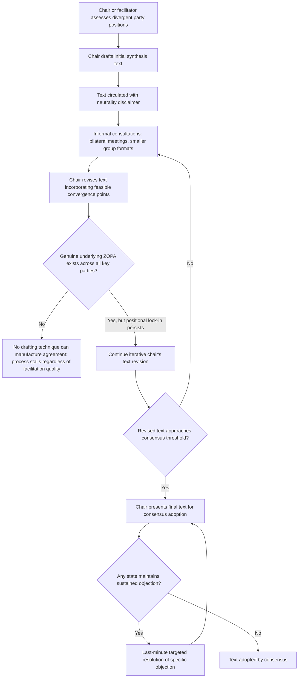

## Chairs' Texts and the Facilitator's Drafting Role

### Theoretical Foundations

A **chair's text** (also termed a **facilitator's text** or, at more senior levels, a **president's text**) is a draft agreement produced by a multilateral negotiation's presiding officer — the conference chair, a designated facilitator, or the forum's president — rather than by any participating state delegation, circulated as a proposed basis for continued negotiation or final adoption. The instrument is the direct multilateral-scale extension of the **single negotiating text procedure** discussed earlier in the bilateral context (recall: a mediator-authored, iteratively revised composite draft substituting for direct exchange of competing party-authored proposals, specifically to defuse positional drafting lock-in and manage the negotiator's dilemma), applied to a setting with dozens or hundreds of parties rather than two, where the coordination challenge of reconciling competing party-authored drafts scales combinatorially with the number of participants and where consensus procedure's blocking-minority structure (recall: any single state's sustained objection can prevent adoption) makes an authorless, broadly acceptable composite text especially valuable as a vehicle for achieving the "absence of formal objection" that consensus requires.

**Why chair's texts are especially important under consensus procedure.** Recall that consensus is typically an endogenous, negotiated outcome rather than spontaneous unanimous agreement, and that achieving it requires text no participating state finds objectionable enough to formally block. In a large multilateral setting, no single state-authored draft is likely to satisfy this condition directly, since any state's own draft will reflect that state's own priorities and will predictably draw objections from states with divergent interests. A chair's text, produced by a party with no direct substantive stake in the outcome and explicit responsibility for producing broadly acceptable language, is structurally better positioned to approach the consensus threshold than any individual party's own proposal — the facilitator's institutional role is defined precisely by the requirement to synthesize, rather than to advocate for, a particular substantive outcome.

### The Facilitator's Distinctive Institutional Position

A chair or facilitator's drafting role differs from an ordinary bilateral mediator's role (as discussed in the single negotiating text item) in several respects specific to the multilateral, standing-institution context:

- **Formal procedural authority.** A conference chair or forum president typically holds a formally recognized procedural role under the body's own rules of procedure, distinct from an ad hoc bilateral mediator's role, which is usually created specifically for a single negotiation and carries no standing institutional authority beyond that negotiation. This formal authority gives a chair's text a degree of procedural legitimacy — as the text a properly constituted presiding officer has put forward under the body's own recognized rules — that an ad hoc mediator's draft in a bilateral setting does not automatically carry.
- **Accountability to the body's broader membership, not merely the negotiating parties.** A bilateral mediator's obligation runs primarily to the two negotiating parties whose agreement the mediator is trying to facilitate. A multilateral chair's obligation runs to the entire body's membership, including states not actively engaged in drafting a specific contested provision, creating a broader constituency whose interests the chair's text must at least plausibly address to sustain its claim to representing a genuinely neutral synthesis rather than favoring the specific delegations most actively engaged in direct negotiation with the chair.
- **Repeated institutional role across multiple negotiations.** Many chairs and facilitators (particularly in standing bodies like the UNFCCC's Conference of the Parties presidency, which rotates annually, or the WTO's Trade Negotiations Committee chairmanship) occupy their facilitating role only for a defined session or negotiating round, but the broader institutional practice of chair's-text drafting persists across changing individual office-holders, creating an institutionalized expectation among the body's membership regarding the chair's text's procedural status and the norms governing how objections to it should be raised and addressed — a form of institutional memory and established practice that an ad hoc bilateral mediation, created fresh for each negotiation, does not accumulate in the same way.

### The Perceived-Bias Risk and Chair Selection

A chair's text's value depends entirely on the parties' willingness to treat it as a genuinely neutral synthesis rather than as a vehicle for the chair's own state's (or the chair's own institutional patron's) substantive preferences — a documented risk given that chairs are themselves typically drawn from a specific member state or regional grouping and therefore are not, in the strictest sense, entirely disinterested parties in the way an idealized ad hoc mediator might be. Multilateral practice manages this risk through several mechanisms:

- **Chair selection procedures** frequently rotate the chairing role among regional groups or alternate between developed- and developing-country representatives across successive negotiating sessions, distributing the perceived-bias risk across the body's membership over time rather than concentrating it in any single group's sustained institutional advantage.
- **Explicit "chair's text" labeling and disclaimers** — many chair's texts are formally circulated with language explicitly stating that the text represents the chair's own assessment of a possible landing zone and does not prejudge or bind any party's position, a formal disclaimer functioning analogously to the non-paper's deniability convention (recall: the shared institutional norm treating a non-paper as non-attributable) but applied to protect the chair's own neutrality claim rather than to protect a submitting party's deniability.
- **Parallel or competing facilitator tracks** in some large negotiations, where multiple co-facilitators (frequently one from a developed and one from a developing country, or one from each of two competing regional blocs) are jointly assigned responsibility for a single chair's text, diluting any single facilitator's capacity to embed a particular substantive bias and requiring the co-facilitators' own internal negotiation before a joint text can even be circulated to the broader body.

### Diplomatic Application: UNFCCC COP Presidency Texts and the Paris Agreement's "Paris Text"

Recall that the Paris Agreement's COP21 (2015) adoption proceeded through UNFCCC consensus procedure, ultimately requiring last-minute resolution of a single-state (Nicaraguan) objection. The Agreement's final text emerged through a sustained sequence of successive French COP21 presidency texts — the presidency, held that year by France under Minister Laurent Fabius, produced and iteratively revised what participants and subsequent accounts term the "Paris text" through multiple drafts over the conference's two-week duration, incorporating input gathered through extensive informal consultations, bilateral meetings, and smaller "indaba" format discussions (a South African-originated consensus-building format subsequently adopted more broadly in UNFCCC practice, involving smaller, more intimate ministerial-level groupings intended to surface genuine underlying positions more candidly than the full plenary setting allows) before the presidency's final text was presented for consensus adoption. This case illustrates the presidency-text mechanism operating at exceptionally high stakes and under significant time pressure (recall the deadline-effect dynamics discussed previously), with the French presidency's accumulated procedural credibility — built partly through the specific consultative innovations like the indaba format and partly through the broader institutional legitimacy of the COP presidency role itself — treated in subsequent analysis as a significant contributing factor in the conference's ultimate success, in documented contrast to the substantially less successful COP15 Copenhagen conference (2009), whose presidency text process is widely analyzed as having suffered from a comparatively less inclusive and less trusted drafting and consultation process.

### Diplomatic Application: WTO Chair's Texts in the Doha Round

Recall that the Doha Round's prolonged stalemate is substantially attributed to consensus procedure's interaction with genuinely divergent developed- and developing-country interests. Throughout the round's extended, ultimately unsuccessful negotiating history, successive chairs of the various Doha negotiating groups (covering agriculture, non-agricultural market access, and other subject areas) produced numerous chair's texts attempting to synthesize a landing zone across the persistently divergent positions — a documented case illustrating that the chair's-text mechanism, while structurally well-suited to overcoming positional drafting lock-in, cannot by itself manufacture an underlying ZOPA where the parties' genuine, substantively grounded reservation values simply do not overlap (recall: no drafting technique can create agreement where no actual zone of possible agreement exists), distinguishing chair's-text failure attributable to a genuinely absent ZOPA from chair's-text failure attributable merely to positional drafting lock-in that better facilitation might have overcome.

### Diplomatic Application: UN Security Council Presidential Statements and the Role of the Rotating Presidency

The UN Security Council's monthly rotating presidency occasionally produces **presidential statements** — a formal instrument distinct from a binding Security Council resolution, agreed by consensus among Council members and read into the record by the presiding member, functioning as a lower-formality alternative to a formally voted resolution particularly useful where full Council consensus on a binding resolution proves unachievable but some collective Council statement is nonetheless desired. This illustrates a chair's-text-adjacent mechanism operating specifically at the boundary between consensus and formal voting (recall the previous item's discussion of this boundary): a presidential statement's drafting process resembles chair's-text facilitation in requiring the rotating president to synthesize language acceptable to all fifteen Council members without a formal vote count, but its lower formal status (compared to a binding resolution) reflects a deliberate institutional accommodation of situations where full consensus on binding, Article 27-governed action proves unachievable, in a way roughly analogous to how a non-paper (recall the earlier discussion) accommodates situations where a formal démarche's attributional commitment would be premature or unachievable.

### Diagram: Chair's Text Development and Consensus-Building Process

### Legal and Procedural Interface

A chair's text, at any stage prior to formal adoption, holds the same pre-treaty status discussed in relation to the single negotiating text procedure generally: it falls outside **VCLT Article 2(1)(a)**'s treaty-instrument threshold and is not attributable as any party's official position, including, by explicit disclaimer convention, the chair's own state's position. Once formally adopted through consensus or a subsequent formal vote, however, the chair's-text drafting history — including successive iterations and the specific consultative processes (such as the indaba format) through which convergence was achieved — becomes a documented component of the "circumstances of conclusion" available as supplementary interpretive means under **VCLT Article 32**, and the chair's or presidency's own formal statements accompanying the text's presentation for adoption (explaining the chair's understanding of ambiguous or contested provisions) are frequently treated by subsequent interpreters and tribunals as particularly probative evidence of the negotiating history's shared understanding, given the chair's institutionally recognized, cross-party synthesizing role at the time such statements were made.

**Key Points**

- A chair's text extends the single negotiating text procedure's mediator-authored drafting logic to the multilateral scale, where consensus procedure's requirement of broadly acceptable language makes an authorless synthesis especially valuable relative to any single state-authored proposal.
- Chairs and facilitators hold formal procedural authority and accountability to a body's full membership, distinguishing their institutional position from an ad hoc bilateral mediator's role, while facing a documented perceived-bias risk managed through rotating chair selection, explicit neutrality disclaimers, and parallel co-facilitator arrangements.
- The Paris Agreement's French COP21 presidency text, developed through consultative innovations including the indaba format, illustrates successful high-stakes chair's-text facilitation, in documented contrast to the less successful COP15 Copenhagen presidency process.
- The Doha Round's chair's-text history illustrates that facilitation technique cannot manufacture agreement where the parties' underlying reservation values genuinely fail to overlap, distinguishing ZOPA-absence failure from mere positional-lock-in failure.
- Chair's texts remain outside VCLT Article 2(1)(a)'s treaty threshold prior to adoption, but their drafting history and accompanying chair statements can become particularly probative supplementary interpretive evidence under VCLT Article 32 once the resulting text is formally adopted.

**Related Topics**

- The single negotiating text procedure
- Consensus procedure versus formal voting in international organizations
- Constructive ambiguity as a bridging tactic
- Coalition-building and bloc formation in multilateral fora
- VCLT Article 32: supplementary means of interpretation and circumstances of conclusion
- Deadlines, walkouts, and manufactured urgency