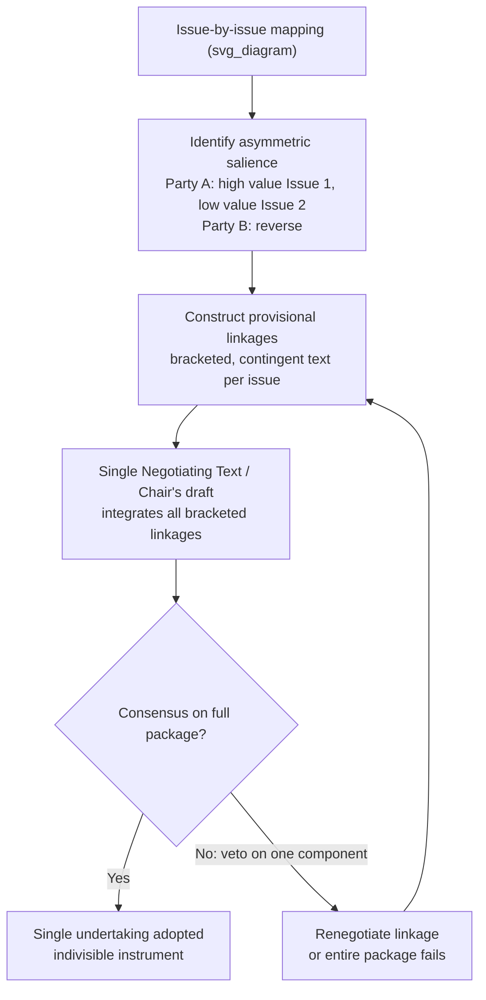

## Package Deals and the Grand Bargain Technique

### Theoretical Foundation

Package dealing rests on a core proposition from integrative bargaining theory: when negotiators face multiple issues simultaneously, differences in how parties *rank* those issues create opportunities for mutually beneficial trades that are unavailable when issues are negotiated one at a time. This is the logic of **issue linkage** — deliberately connecting substantively separate matters within a single negotiating framework so that concessions on one issue can be exchanged for concessions on another.

The theoretical basis is the distinction between **distributive bargaining** (fixed-sum, single-issue haggling over how to divide a known quantity) and **integrative bargaining** (multi-issue negotiation where parties with different priority orderings can each gain by trading away low-priority items for high-priority ones). If Party A values Issue 1 more than Issue 2, and Party B has the reverse preference ordering, a package that gives A most of Issue 1 in exchange for giving B most of Issue 2 can leave both parties better off than a symmetric split on each issue taken separately. This is sometimes called "expanding the pie" through **logrolling**.

A **grand bargain** is the limiting case of package dealing: instead of linking two or three related issues, negotiators bundle the *entire* agenda — often issues drawn from structurally different domains (security, economics, sovereignty, institutional design) — into a single, all-or-nothing final agreement. The grand bargain technique is typically deployed at the terminal stage of a negotiation, converting a set of separately-negotiated partial understandings into one comprehensive instrument that is accepted or rejected as a whole.

**Single Negotiating Text (SNT)** is the procedural mechanism most associated with constructing grand bargains in multilateral settings: a mediator or chair drafts a composite text integrating all parties' positions, which is then amended iteratively rather than negotiated from competing drafts. This lowers the psychological cost of concession, since parties are reacting to a neutral document rather than capitulating to an opposing delegation's draft.

### Mechanism: Why Package Deals Work

**1. Asymmetric salience creates gains from trade.**

Package dealing is only useful when parties do not weight all issues identically. If every party ranked every issue the same way, there would be nothing to trade — negotiation would collapse into pure distributive conflict on each dimension. Skilled negotiators invest early effort in **issue mapping**: identifying which items are high-salience/low-cost to concede for the other side (and vice versa), since these are the efficient trades.

**2. Linkage can convert a blocked issue into a solvable one.**

An issue that is individually intractable — because domestic political constituencies make any concession on it politically costly — can sometimes be resolved only as part of a package, where the concession is buried within a larger agreement that a leader can defend as a whole ("we gained X and Y, and conceded Z") rather than defended issue-by-issue.

**3. The package converts marginal, incremental bargaining into a single ratification decision.**

This has a distinct legal and procedural effect: it shifts the object of consent. Instead of separately ratifying agreements on tariffs, agriculture, and services, a state ratifies *one* comprehensive instrument. This is significant under treaty law because Article 44 of the Vienna Convention on the Law of Treaties (VCLT) generally presumes that a treaty's provisions are **not separable** for purposes of termination, withdrawal, or suspension unless the treaty itself so provides or the parties otherwise agree — meaning a grand bargain's legal architecture often deliberately locks obligations together so that no party can retain the benefits it wants while shedding the costs it does not.

**4. All-or-nothing framing can also destabilize a negotiation.**

Because a package deal forces simultaneous ratification of every component, a single high-salience objection anywhere in the package can sink the entire agreement — a dynamic negotiators must manage through **sequencing** (resolving the hardest issues early so they do not become last-minute veto points) or through carefully calibrated exit provisions.

### The Single Undertaking Principle

The most doctrinally explicit grand-bargain architecture in modern diplomatic practice is the **single undertaking** principle used in WTO multilateral trade rounds, most notably the Uruguay Round (1986–1994). Under single undertaking, "nothing is agreed until everything is agreed" — no component of the negotiated package enters into force individually; all annexes (goods, services, intellectual property, dispute settlement) had to be accepted as one indivisible commitment establishing the WTO.

This was a deliberate departure from the prior GATT practice of "codes" — optional, à la carte agreements that some GATT members joined and others did not, producing a fragmented, multi-tier system of obligations. The Uruguay Round negotiators judged that à la carte adoption had allowed free-riding and inconsistent liberalization, and used single undertaking specifically to force developing countries to accept the Trade-Related Intellectual Property Rights (TRIPS) agreement — which they had comparatively little interest in — as the price of admission to the market access gains from the Agreement on Agriculture and the Multifibre Arrangement phase-out, which they wanted. This is the textbook case of issue linkage converting a blocked issue (IP protection, resisted by developing countries with weak pharmaceutical and technology sectors) into a tradeable one by packaging it with issues those same states valued highly.

The same principle later became a structural obstacle: the Doha Development Round (launched 2001) stalled for over a decade in large part *because* single undertaking meant the entire round was hostage to persistent deadlock on agricultural subsidies between the United States, the EU, and the G20 developing-country coalition — illustrating the linkage mechanism's double edge: what enables trades across issues also transmits gridlock across issues.

### Package Deals in Constitutional and Institutional Design

Grand bargains are also the characteristic technique for resolving **constitutive negotiations** — talks establishing a new international regime or organization, where there is no pre-existing legal baseline to fall back on if talks fail.

The **UN Convention on the Law of the Sea (UNCLOS III, 1973–1982)** is a canonical case. The negotiation bundled together issues with almost no substantive connection: the breadth of the territorial sea, exclusive economic zones, continental shelf delimitation, freedom of navigation through straits, and — critically — the deep seabed mining regime (Part XI), which pitted industrialized states with mining technology against developing states asserting the seabed as the "common heritage of mankind." Maritime and land-locked states, coastal and archipelagic states, and industrialized and developing states all had different priority rankings across this issue set, which is precisely the condition package dealing exploits. The 1982 Convention was adopted as a single package; the United States' persistent objection specifically to Part XI (seabed mining) — rather than to navigation or EEZ provisions it favored — meant it could not simply ratify the parts it liked, and the US remains a non-party to this day, illustrating how an indivisible package can produce holdout non-ratification even from a state that supports most of the substance.

### Sequencing and Drafting Technique in the Room

Practically, constructing a grand bargain involves several recurring procedural moves:

- **Provisional agreement subject to the package ("nothing is agreed until everything is agreed")**: negotiators reach tentative, bracketed agreement on individual chapters early, explicitly marked as contingent on the whole package closing. This allows technical work to proceed on multiple tracks in parallel without prematurely locking in leverage.
- **The chairman's/president's text**: in large multilateral rounds, a neutral chair (or the secretariat) produces the composite SNT-style draft late in the process, embodying the linkages the chair judges will produce a viable package — shifting the negotiation from bilateral haggling to reaction-to-text.
- **The "endgame" or "green room" format**: a small subset of the most consequential delegations negotiates the final linkages in a restricted setting, then presents the result to the full membership for consensus — a practice used extensively in both GATT/WTO rounds and UNCLOS III, and criticized by smaller states as marginalizing their input into the final trade-offs.
- **Deliberate ambiguity ("constructive ambiguity")**: where a linkage cannot be fully resolved, negotiators sometimes adopt textual language vague enough that each side can present it domestically as a favorable outcome — a technique distinct from, but often combined with, package dealing.

### Diagram: Package Deal Construction

### Risks and Critiques

- **Veto transmission**: because rejection of any single element can block the whole, package deals are vulnerable to a single well-resourced or determined holdout — as UNCLOS Part XI demonstrated with the United States, and as Doha demonstrated with agricultural subsidies.
- **Opacity and legitimacy costs**: green-room-style endgame bargaining, necessary to manage the complexity of a true grand bargain among many parties, is frequently criticized by excluded states as producing outcomes negotiated by a small "directorate" and presented to the wider membership as a fait accompli.
- **Ratification risk concentration**: because Article 44 VCLT presumes non-separability absent contrary provision, a grand bargain concentrates domestic ratification risk — a change in government or a shift in a single veto-player's calculus after signature can jeopardize the entire package rather than just one component.
- **Post-agreement renegotiation pressure**: precisely because grand bargains lock together concessions a party would not have made individually, they generate persistent domestic pressure to revisit or violate the "unwanted" component while keeping the benefits of the "wanted" ones — a dynamic visible in recurring disputes over TRIPS flexibilities after the Uruguay Round.

**Related Topics**

- Single negotiating text (SNT) procedure and mediator drafting technique
- Issue linkage and logrolling in bilateral vs. multilateral settings
- VCLT Article 44 (separability of treaty provisions) and Article 56 (denunciation/withdrawal absent express provision)
- Consensus decision-making vs. formal voting in multilateral treaty-making
- The WTO single undertaking vs. plurilateral "coalition of the willing" agreements
- Constructive ambiguity as a drafting technique distinct from linkage
- Holdout problems and ratification failure in multilateral treaties (UNCLOS Part XI, Kyoto Protocol)