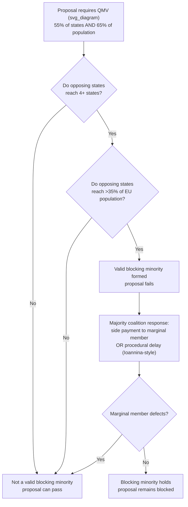

## Blocking Minorities and Veto Coalitions

### Theoretical Foundation

A **blocking minority** is a subset of parties to a multilateral negotiation or decision-making body that, while not itself a majority, holds sufficient formal voting weight or procedural leverage to prevent a proposal from reaching the threshold required for adoption. The concept is grounded in **cooperative game theory**, specifically **voting power indices** — the Banzhaf index and the Shapley-Shubik index — which measure a coalition member's power not by its raw vote share but by the frequency with which it is "critical" or "pivotal" to converting a losing coalition into a winning one. A blocking minority's power derives precisely from this pivotal-member logic: it need not build a winning coalition of its own, only deny the threshold to every rival coalition.

This differs analytically from a **veto**, which is a single-actor legal entitlement to block a decision regardless of the size of the opposing coalition (as with the five permanent UN Security Council members under Article 27(3) of the UN Charter). A blocking minority, by contrast, is an *emergent* coalition-level phenomenon: no single member of the minority may individually possess a veto, but the group's combined weighted votes exceed the margin needed to deny passage. The distinction matters tactically — a formal veto holder can act alone and is a fixed target for persuasion, whereas a blocking minority must first form and cohere, and its power is fragile to defection by any single member close to the threshold.

**Recall that a BATNA (best alternative to a negotiated agreement) sets the floor below which a party should walk away from a deal.** Blocking-minority formation is best understood as a coalition-level BATNA problem: each potential minority member joins the blocking coalition only if its expected payoff from blocking exceeds its expected payoff from allowing the proposal to pass, and the coalition as a whole is stable only if no subset has an incentive to defect and negotiate separately with the majority.

### Mechanism: Qualified Majority Voting and the EU Council

The most codified and heavily studied blocking-minority architecture in contemporary diplomacy is the European Union's **Qualified Majority Voting (QMV)** system in the Council of the European Union, governed by Article 16(4) of the Treaty on European Union (TEU) as amended by the Lisbon Treaty, in force since 1 November 2014 (with a transitional period allowing recourse to the pre-Lisbon weighted system until 31 March 2017).

Under the Lisbon "**double majority**" formula, a QMV decision requires:

1. At least 55% of Council members (currently 15 of 27 member states), **and**
2. Member states representing at least 65% of the total EU population.

A **blocking minority** under this formula requires at least four Council members representing more than 35% of the EU population — the "four-state safeguard" was deliberately inserted to prevent the three or four most populous states (Germany, France, Italy, or a similar grouping) from being able to block on population weight alone, forcing any blocking coalition to be broader than a small directorate of large states.

This creates a structurally distinct bargaining environment from unanimity: because the threshold is a *dual* condition (state count AND population), a skilled negotiator assembling a blocking coalition must solve two simultaneous constraints, and a coalition that satisfies the population threshold with too few states, or the state-count threshold with too little population, fails. This dual-threshold design is itself a negotiated compromise from the 2000 Nice Treaty and 2007 Lisbon IGC processes, where smaller member states insisted on the state-count leg specifically to prevent population-weighted voting alone from marginalizing them.

### Historical Case: The Ioannina Compromise (1994)

The **Ioannina Compromise** (29 March 1994) is the paradigmatic historical case of blocking-minority renegotiation under enlargement pressure. Ahead of the EU's 1995 enlargement (Austria, Finland, Sweden), the existing blocking-minority threshold under the then-weighted voting system would have risen automatically from 23 to 27 votes out of a new total of 87, in proportion to the increase in total votes. The United Kingdom and Spain objected, arguing this shift would make it too easy for a small group of states to block, and threatened to withhold agreement on enlargement itself — using their leverage over a separate, linked decision (enlargement) to renegotiate the blocking threshold.

The compromise reached was procedural rather than substantive: it did not change the formal blocking threshold, but created a political convention that if a coalition holding between 23 and 26 votes (i.e., just short of the new formal blocking minority but above the old one) objected to a decision, the Council would continue "reasonable" efforts to reach a wider consensus before proceeding to a vote. This is a textbook example of converting a hard formal threshold dispute into a **procedural delay right** — a device negotiators use when the underlying voting-weight allocation cannot be reopened but the *practical* exercise of majority power can be softened. The Ioannina mechanism was later revived in a modified form during the 2007 Lisbon Treaty negotiations at Poland's insistence, again as a concession to a state that stood to lose blocking power under a formula shift (in that case, the transition from Nice-weighted voting to the Lisbon double-majority system).

### Blocking Coalitions Outside Formal QMV: The UN Security Council and WTO Consensus

Blocking-minority logic operates differently, but analogously, in bodies that do not use weighted voting.

In the **UN Security Council**, the formal veto held individually by the five permanent members (P5) under Article 27(3) UN Charter is a *unilateral* veto, not a blocking minority in the coalition sense — but the **nine-vote threshold for a substantive resolution** (Article 27(3), requiring nine affirmative votes including all P5 concurring) means a coalition of seven non-permanent members can also block a resolution by simply withholding affirmative votes, without any single member needing a formal veto. This is a genuine blocking-minority dynamic operating alongside, and independent of, the P5 veto.

In the **WTO**, where decisions are formally taken by **consensus** under Article IX of the Marrakesh Agreement (a vote is possible but almost never invoked), any single member's objection functionally operates as an individual veto rather than requiring a minority coalition — but in practice, blocking *coalitions* still form and are named as such: the **G20 developing-country coalition** (led by Brazil, India, China) in the Doha Round agricultural negotiations functioned as a blocking minority in the political, if not formal legal, sense — no single G20 member could block Doha's agricultural chapter alone against determined US-EU pressure, but the coalition acting together could, and did, prevent closure for over a decade.

### Coalition Stability and the Defection Problem

Blocking minorities face an inherent stability problem distinct from majority coalitions: because a blocking coalition's only "output" is the negative act of preventing passage, it captures no share of a distributed benefit the way a winning coalition does under **Shapley value** allocation logic. This makes blocking coalitions structurally vulnerable to **side payments** — the majority coalition can offer a marginal blocking-minority member a targeted concession (a derogation, a transition period, a compensating benefit in an unrelated policy area) sufficient to induce defection and collapse the blocking threshold. The EU's use of country-specific derogations and transition periods in enlargement and single-market legislation is frequently explained in the literature as this precise mechanism: buying off the marginal member of an otherwise-durable blocking coalition rather than contesting the coalition's substantive objection directly.

Conversely, a majority seeking to avoid blocking-minority formation altogether typically engages in **preemptive coalition-splitting**: identifying which prospective blocking-coalition member has the *lowest* intensity of preference against the proposal and addressing that member's concern first, before the coalition can consolidate around a shared negotiating position.

### Diagram: Blocking Minority Formation Under QMV

### Related Topics

- Voting power indices: Banzhaf index and Shapley-Shubik index in weighted-voting institutions
- The distinction between institutional veto rights (UNSC Article 27(3)) and emergent blocking coalitions
- Side-payment and derogation strategies for dissolving blocking minorities
- Consensus decision-making versus formal voting thresholds (WTO Article IX, EU QMV)
- Enlargement-driven threshold renegotiation as a category of institutional bargaining
- Coalition theory: minimum winning coalitions versus minimum blocking coalitions