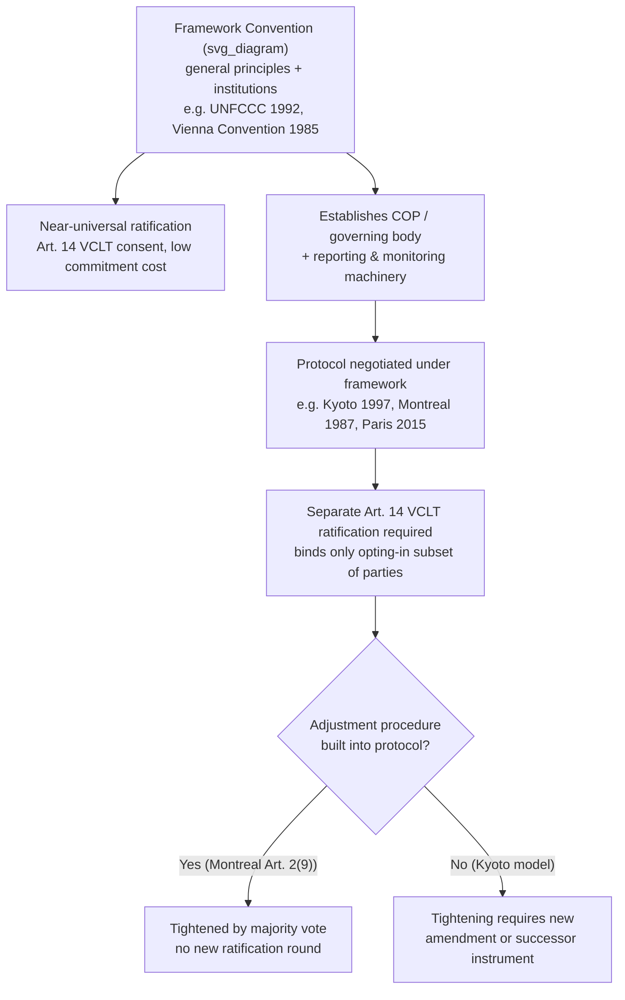

## Framework Conventions versus Protocols in Treaty Architecture

### Theoretical Foundation

A **framework convention** (sometimes "umbrella convention") is a treaty that establishes general principles, institutional machinery, and broad obligations of a programmatic character, while deliberately deferring specific, quantified, or operational commitments to subsequent instruments. A **protocol** is a subsidiary treaty, legally distinct from but formally linked to a parent convention, that supplies those deferred specific obligations — typically binding only on the subset of parties that separately ratify it.

The theoretical rationale is a negotiation-sequencing solution to a well-known problem in multilateral treaty-making: when the number of parties and the technical complexity of the subject matter are both high, attempting to negotiate final, quantified, binding commitments in a single instrument at the outset frequently produces either (a) prolonged deadlock, because states with divergent capabilities and preferences cannot agree on numbers up front, or (b) a lowest-common-denominator text so weak it is not worth the paper. The framework-protocol architecture decomposes the negotiation into stages: first secure near-universal agreement on the *existence of a problem*, the *institutional architecture* for addressing it, and *general norms* (which is comparatively low-cost for states to accept, since it entails no immediate quantified obligation), and only then negotiate binding specifics among a coalition of the willing, once trust, data, and institutional capacity have developed.

This is a specific application of a broader negotiation-theory principle: decomposing an intractable single-shot negotiation into a **sequential game** allows parties to resolve lower-stakes coordination problems first, which can lower the transaction costs and build the reciprocal trust needed to resolve the higher-stakes distributive problem later.

### Legal Basis: Treaty Relationship Under the VCLT

There is no VCLT article that defines "framework convention" or "protocol" as distinct treaty types — the Vienna Convention on the Law of the Sea, Vienna Convention on the Law of Treaties (VCLT, 1969) treats every such instrument simply as a "treaty" under **Article 2(1)(a)** (an international agreement concluded between States in written form and governed by international law). The framework-protocol relationship is therefore a matter of **treaty design choice**, not a separate legal category, but it has specific consequences under general treaty law:

- **Separate consent to be bound.** Under **Article 14 VCLT**, consent to be bound by a treaty is expressed through signature, ratification, acceptance, approval, or accession — and a protocol requires its *own* act of ratification distinct from ratification of the parent convention. A state can be a party to the framework convention without being a party to any of its protocols; the reverse is typically foreclosed by the protocol's own text, which usually makes prior or simultaneous adherence to the parent convention a precondition (a **linked-consent clause**).
- **Article 30 VCLT (successive treaties relating to the same subject matter)** governs how the framework convention and its protocols interact where provisions conflict: where a protocol is expressly stated to be subject to, or not incompatible with, the parent convention, the framework's general provisions apply to the extent the protocol does not vary them (Article 30(2)).
- **Amendment mechanics differ structurally.** The framework convention typically has a demanding amendment procedure (often requiring near-unanimous ratification of an amendment to bind the whole membership), while protocols are designed as the *primary* mechanism for tightening obligations over time — new protocols, or amendments to existing protocols, can be adopted with lower thresholds and bind only the subset of parties that opt in. This makes the protocol layer the operative site of ongoing negotiation, while the framework layer remains comparatively static.

### Mechanism: The UNFCCC–Kyoto Protocol–Paris Agreement Sequence

The **UN Framework Convention on Climate Change (UNFCCC, 1992)** is the reference case for this architecture. The UNFCCC itself contains no binding, quantified emissions targets — its Article 4 obligations are framed as general commitments ("shall... formulate national programmes," "shall promote and cooperate") and it establishes only the institutional machinery: the Conference of the Parties (COP), a secretariat, and reporting obligations. This structure permitted near-universal ratification (198 parties) rapidly, because no state was being asked to accept a specific quantified constraint at the point of joining.

The **Kyoto Protocol (1997, entered into force 2005)**, negotiated under UNFCCC Article 17, supplied the deferred specifics: binding, quantified emissions-reduction targets for Annex I (industrialized) parties, expressed as percentages against 1990 baseline emissions, for the 2008–2012 commitment period. Critically, Kyoto bound only the subset of UNFCCC parties that separately ratified it, and its design (the **Annex I / non-Annex I bifurcation**, reflecting the UNFCCC's own Article 3.1 "common but differentiated responsibilities" principle) meant major emerging emitters (China, India) had no binding targets under it — a structural feature that later became the central point of US objection to ratification.

The **Paris Agreement (2015)**, also negotiated under the UNFCCC as its Article 17 instrument, represents a *structural departure* from the Kyoto model while retaining the framework-protocol logic: rather than internationally negotiated, top-down quantified targets, Paris uses **Nationally Determined Contributions (NDCs)** — bottom-up pledges set by each party itself, with binding *procedural* obligations (submit an NDC, report on it, participate in the Article 14 "global stocktake") but no binding *substantive* emissions targets. This design choice was a direct negotiating response to the ratification failure of the top-down Kyoto model in key markets (notably the US Senate's unanimous 1997 Byrd-Hagel Resolution opposing any treaty without binding developing-country commitments), illustrating how failure at the protocol stage can force redesign of the protocol *mechanism itself*, not merely renegotiation of its numbers.

### Comparative Case: The Vienna Convention–Montreal Protocol Sequence

The **Vienna Convention for the Protection of the Ozone Layer (1985)** and its **Montreal Protocol on Substances that Deplete the Ozone Layer (1987)** are frequently cited as the framework-protocol architecture's clearest success case, useful as an analytical contrast to UNFCCC-Kyoto.

The Vienna Convention, like the UNFCCC, contained no binding control measures — only general obligations to cooperate on research and monitoring. The Montreal Protocol supplied binding phase-out schedules for specific ozone-depleting substances (initially CFCs and halons), and — distinctively — was designed with **built-in adjustment procedures** (Article 2(9)) allowing the phase-out schedules to be tightened by a two-thirds majority vote of parties *without* requiring a new ratification round, unlike a conventional amendment. This adjustment mechanism, absent from the Kyoto Protocol's design, is the key legal-technical reason the Montreal regime was able to tighten its substantive obligations repeatedly (London 1990, Copenhagen 1992, Beijing 1999, Kigali 2016) far more rapidly than the UNFCCC-Kyoto sequence, which required renegotiating an entirely new instrument (the Doha Amendment, then Paris) each time it needed strengthening. The comparison illustrates that the choice between an **amendment procedure** and an **adjustment procedure** at the protocol-drafting stage has first-order consequences for how quickly a regime can be strengthened later — a drafting decision negotiators must make deliberately at the outset, anticipating future tightening needs.

### Tactical Implications for the Negotiator

- **Front-loading institutional design.** Negotiators pushing for eventual binding obligations have a strategic incentive to secure strong institutional machinery (a standing COP, a scientific advisory body, a reporting mechanism) at the *framework* stage, since this machinery — once established — creates the forum and information base that makes subsequent protocol negotiation more tractable, even though the framework itself is substantively weak.
- **Sequencing as leverage management.** A state wary of binding commitments can rationally accept an ambitious framework convention (which costs little) while reserving its real resistance for the protocol stage, where it can extract concessions (differentiated obligations, financing mechanisms, technology transfer) in exchange for accepting quantified targets — a pattern visible in developing-country negotiating strategy across both the ozone and climate regimes.
- **Protocol non-ratification as a distinct risk category.** Because protocols require independent consent (Article 14 VCLT), an ambitious framework convention with near-universal membership can mask a protocol layer with much narrower actual coverage — the US ratified the UNFCCC but never ratified Kyoto, remaining a framework party while opting out of the framework's operative protocol entirely.

### Diagram: Framework–Protocol Legal Architecture

**Related Topics**

- Common but differentiated responsibilities (CBDR) as a framework-drafting principle
- Amendment (VCLT Art. 40) versus adjustment procedures in multilateral environmental agreements
- Nationally Determined Contributions and the shift from top-down to bottom-up treaty design
- Reservations under VCLT Articles 19–23 and their interaction with protocol opt-in structures
- Non-compliance mechanisms and the Montreal Protocol's Implementation Committee
- Single undertaking versus opt-in protocol architecture as alternative treaty-design strategies