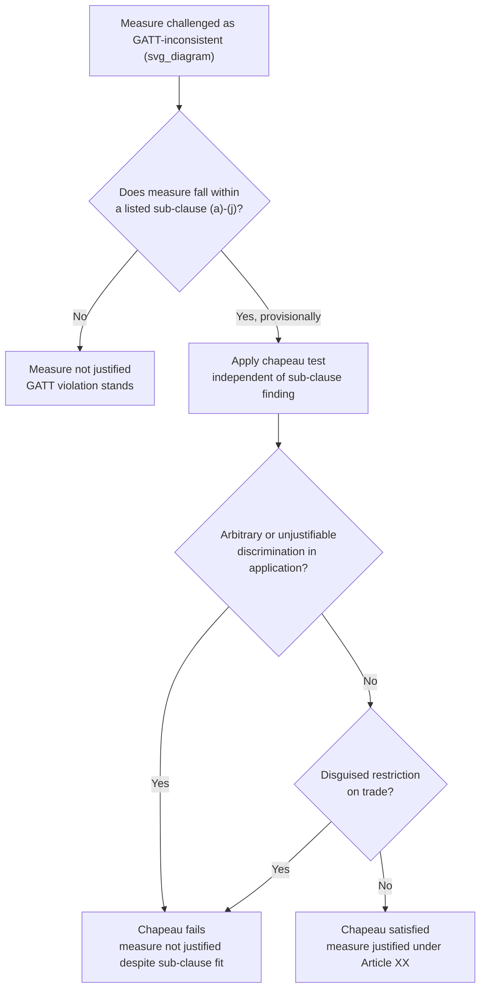

## Chapeau Language and Saving Clauses in Treaty Drafting

### Theoretical Foundation

Treaty drafting is not merely the recording of a negotiated substantive outcome; the textual architecture chosen to express an obligation has independent legal consequences for how that obligation is interpreted, limited, and reconciled with other instruments. Two drafting devices addressed here — **chapeau language** and **saving clauses** — both operate as *structural qualifiers*: they do not create the primary obligation itself but govern the scope, conditions, or priority under which that obligation applies. Negotiators who secure the substantive outcome but neglect chapeau or saving-clause drafting frequently find that the practical effect of the text diverges sharply from what they believe they agreed to — these are the clauses most heavily fought over in the final drafting sessions of a negotiation, often after the substantive numbers or categories have already been settled.

A **chapeau** (French: "hat" or "heading") is introductory or umbrella text that precedes a list of specific items, sub-clauses, or exceptions, and that supplies a *general qualifying condition* governing every item that follows. A **saving clause** (also "without prejudice clause") is a provision — which may appear anywhere in a treaty, not only as an introduction — stating that the instrument does not affect, diminish, or override specified other rules, rights, or obligations, whether under other treaties, customary international law, or domestic law.

### Legal Basis: Interpretive Effect Under the VCLT

Both devices are given interpretive weight through **Article 31 VCLT** (general rule of interpretation), which directs that a treaty be interpreted "in good faith in accordance with the ordinary meaning to be given to the terms of the treaty in their context and in the light of its object and purpose" (Article 31(1)), with "context" for this purpose including the treaty's preamble and annexes (Article 31(2)). A chapeau is textually part of the "context" of every sub-clause it governs, meaning a chapeau's qualifying language is not merely rhetorical framing — it is operative text that a tribunal or treaty body must read into each subordinate provision.

Where a chapeau imposes a threshold condition (e.g., "provided that such measures are not applied in a manner which would constitute... arbitrary or unjustifiable discrimination"), that condition functions as a **two-tier test**: first, whether the specific sub-clause exception applies in substance; second, independently, whether the chapeau's conditions are also satisfied. A measure can validly fall within a listed exception and still fail the chapeau — the chapeau is not redundant with the sub-clauses but adds an independent layer of scrutiny.

### Mechanism: The GATT Article XX Chapeau

The most heavily litigated chapeau in international economic law is the introductory paragraph of **Article XX of the General Agreement on Tariffs and Trade (GATT 1947)**, which reads: "subject to the requirement that such measures are not applied in a manner which would constitute a means of arbitrary or unjustifiable discrimination between countries where the same conditions prevail, or a disguised restriction on international trade," followed by ten lettered sub-clauses (a) through (j) listing specific permissible grounds for otherwise GATT-inconsistent measures (protection of public morals, human/animal/plant life or health, conservation of exhaustible natural resources, etc.).

The **WTO Appellate Body's decision in *United States — Import Prohibition of Certain Shrimp and Shrimp Products* (1998)** is the reference case establishing the chapeau's independent operative force. The US measure (an import ban on shrimp harvested without turtle-excluder devices) was found capable of falling within Article XX(g) (conservation of exhaustible natural resources) in substance, but the Appellate Body separately found the *manner* of the measure's application — rigid, undifferentiated certification requirements applied without regard to conditions in exporting countries, and without genuine prior negotiation efforts with affected states — failed the chapeau's "unjustifiable discrimination" test. This established definitively that chapeau compliance is assessed independently of, and after, sub-clause compliance: a measure must clear *both* tests, and the chapeau functions as a check against the sub-clause exceptions being deployed as a pretext for disguised protectionism. This two-step architecture is now the standard template negotiators reference when drafting exception clauses in subsequent economic treaties (investment treaties, regional trade agreements) that borrow GATT Article XX-style structure.

### Mechanism: Saving Clauses and Inter-Treaty Priority

A saving clause serves a distinct function from a chapeau: rather than qualifying the application of the instrument's own provisions, it manages the instrument's relationship to *other* legal instruments or bodies of law, addressing the problem of **treaty conflict** governed generally by Article 30 VCLT (application of successive treaties relating to the same subject matter).

Where negotiators cannot fully harmonize a new instrument with pre-existing legal regimes — often because renegotiating those regimes is outside the mandate of the current talks, or because different states are parties to different subsets of the relevant instruments — a saving clause allows the new treaty to proceed without formally resolving the conflict, by explicit hierarchy language: e.g., "Nothing in this Agreement shall be construed to affect the rights and obligations of the Parties under [other instrument]." Saving clauses can run in either direction: **subordinating** the new instrument to a prior one (common where a new instrument implements a pre-existing framework convention), or **preserving space** for a prior instrument to continue operating alongside the new one without either explicitly prevailing (common where two instruments cover overlapping but non-identical subject matter and outright subordination would be more concession than either side is willing to make).

A frequently cited example is Article 103 of the **UN Charter**, which establishes an explicit priority rule rather than a mere saving clause — "in the event of a conflict between the obligations of the Members of the United Nations under the present Charter and their obligations under any other international agreement, their obligations under the present Charter shall prevail" — demonstrating the stronger end of the spectrum from soft "without prejudice" language to hard supremacy clauses. By contrast, many multilateral environmental agreements use softer mutual saving-clause language specifically to *avoid* resolving priority with, e.g., WTO trade obligations, because resolving that hierarchy explicitly was outside what negotiators on either side were prepared to concede — the ambiguity is a deliberate drafting choice, not an oversight.

### Tactical Implications for the Negotiator

- **Chapeau fights are frequently the true site of the negotiation's outcome.** Because sub-clause categories (the lettered list) are often drafted broadly enough that most delegations can accept them in principle, the chapeau's qualifying language — words like "necessary," "relating to," "arbitrary," "unjustifiable" — is where the real distributive stakes are resolved, since it is the chapeau that determines how tightly or loosely the exceptions will later be applied by an adjudicating body.
- **A saving clause is a technique for concluding a negotiation without resolving an underlying jurisdictional dispute.** Where two negotiating blocs disagree about which of two treaty regimes should take priority, and neither side has the leverage to force explicit subordination, a mutual "without prejudice" saving clause allows both sides to sign the text while preserving their competing legal position for a future dispute — deferring, rather than resolving, the conflict. This is a legitimate and common closing technique, not merely a drafting failure, when the alternative is no agreement at all.
- **Precision in chapeau drafting has asymmetric downstream costs.** Because a chapeau's language is later interpreted by a court or tribunal applying Article 31 VCLT's "ordinary meaning" standard, imprecise or untested chapeau phrasing (borrowing language from a different treaty context without adjustment) can produce interpretive outcomes the original negotiators did not anticipate — the shrimp-turtle case is frequently taught precisely because the chapeau's "arbitrary or unjustifiable discrimination" language, drafted in 1947 for a very different trade context, was subsequently given content by adjudication rather than by the original drafters' intent.

### Diagram: Two-Tier Chapeau Analysis (GATT Article XX Model)

**Related Topics**

- Article 31 VCLT general rule of interpretation and the role of preambular/contextual text
- Treaty conflict and successive treaties under Article 30 VCLT
- The WTO Appellate Body's two-tier test methodology (Shrimp-Turtle, US–Gasoline)
- Supremacy and priority clauses versus soft "without prejudice" saving clauses
- Preambles as interpretive context versus operative treaty text
- Constructive ambiguity as a drafting technique for unresolved distributive disputes