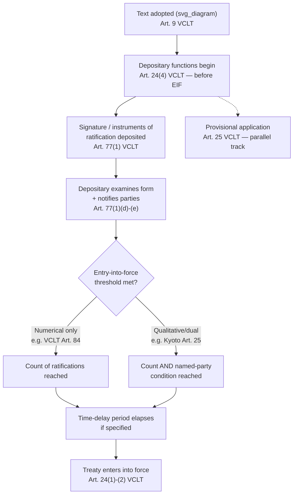

## Final Clauses: Entry into Force and Depositary Functions

### Theoretical Foundation

Final clauses are the cluster of standardized, largely non-substantive provisions placed at the end of a treaty text — governing signature, ratification, entry into force, amendment, reservation, withdrawal, and depositary arrangements — that convert a negotiated substantive text into a functioning legal instrument. Negotiators often treat final clauses as a technical afterthought to be drafted once the substantive articles are settled, but this is analytically mistaken: final clauses determine *when* and *for whom* the substantive obligations actually bind, and can therefore be used tactically to shape the practical effect of a negotiated outcome independently of the substantive text itself. A state that loses a substantive fight in the main body of a treaty can sometimes recover significant leverage by negotiating a high entry-into-force threshold, a long ratification window, or a favorable withdrawal clause.

### Legal Basis: The VCLT Framework for Entry Into Force

**Article 24 VCLT** governs entry into force. Article 24(1) establishes the default rule: a treaty enters into force "in such manner and upon such date as it may provide or as the negotiating States may agree" — meaning the treaty's own final clauses take precedence over any VCLT default. Only where the treaty is silent does Article 24(2) supply a residual rule: the treaty enters into force "as soon as consent to be bound... has been established for all the negotiating States." Article 24(3) addresses the common case of a state consenting to be bound *after* the treaty has already entered into force for others, and Article 24(4) carves out an important exception: certain provisions — those governing the authentication of the text, the establishment of consent to be bound, the manner of entry into force, reservations, and the depositary's functions — apply "from the time of the adoption of [the] text," i.e., before the treaty as a whole has entered into force. This is why depositary and reservation machinery can operate functionally even while the substantive treaty obligations are not yet binding on anyone.

Multilateral treaties negotiated after roughly the mid-20th century virtually always displace the Article 24(2) default (unanimous consent) with a **numerical or dual threshold clause**, because requiring literally every negotiating state to ratify before the treaty enters into force at all would in practice mean many important multilateral instruments never enter into force — a single non-ratifying state could hold the entire instrument hostage indefinitely.

### Mechanism: Entry-Into-Force Threshold Design

The drafting of the entry-into-force threshold is a genuine negotiating decision with strategic consequences, not a mechanical formality, and treaty practice shows several recurring architectures:

- **Simple numerical threshold.** A fixed number of ratifications, regardless of which states ratify. The VCLT itself entered into force under **Article 84(1)** on the thirtieth day following deposit of the 35th instrument of ratification or accession — a purely numerical threshold with no qualitative requirement about *which* 35 states.
- **Qualitative (named-party) threshold.** A treaty enters into force only once specified, usually the most consequential, parties have ratified — because a treaty's practical value may depend overwhelmingly on the participation of a small number of pivotal states, regardless of how many smaller states join. The **Kyoto Protocol's Article 25** is the canonical case: entry into force required not merely 55 ratifying parties but also that ratifying Annex I parties account for at least 55% of that group's total 1990 CO2 emissions. This dual threshold was deliberately engineered by negotiators to ensure the protocol could not enter into force through ratification by numerous minor emitters while major emitters remained outside — but it also created acute vulnerability: after the **United States' 2001 announcement that it would not ratify** (removing roughly 36% of Annex I 1990 emissions from the potential ratifying pool), entry into force became mathematically dependent on Russia's ratification, since without both the US and Russia the 55% emissions threshold could not practically be reached. This gave Russia substantial *ex post* negotiating leverage over unrelated matters (notably its WTO accession negotiations with the EU) during 2003–2004, as its ratification became the pivotal act needed to bring the entire regime into force — the Protocol finally entered into force on 16 February 2005 following Russia's November 2004 ratification.
- **Time-delay clauses.** Many treaties, including the VCLT itself, specify not only a ratification-count threshold but also a fixed delay (commonly 30 or 90 days) after the threshold is reached before entry into force takes legal effect — providing a buffer period for states and depositaries to complete notification procedures.
- **Provisional application.** **Article 25 VCLT** allows a treaty, or part of it, to apply provisionally pending entry into force, if the treaty so provides or the negotiating states so agree — a device used where substantive urgency (e.g., an economic or security matter requiring immediate operational effect) outpaces the ratification timeline. The **Energy Charter Treaty** made extensive use of provisional application, which became legally significant when Russia, having signed but never ratified, was held under an ICSID tribunal (the *Yukos* arbitration) to have been bound by the treaty's investor-protection provisions during the period it applied the treaty provisionally, prior to Russia's formal 2009 notification of its intent not to become a party.

### Mechanism: Depositary Functions

**Article 76 VCLT** establishes that a treaty's depositary may be one or more states, an international organization, or the chief administrative officer of an international organization, and — critically — Article 76(2) provides that the depositary's functions are "international in character" and the depositary is "under an obligation to act impartially" even where a dispute arises between a state and the depositary regarding performance of those functions. This impartiality obligation matters because the depositary sits at the center of several functions with real legal consequences, not merely custodial ones:

**Article 77 VCLT** enumerates the depositary's specific functions, which include: keeping custody of the original treaty text and any full powers delivered to it; preparing certified copies for parties and signatories; receiving signatures and all instruments of ratification, accession, or notifications relating to the treaty; examining whether a signature or instrument is in due and proper form; informing parties of acts, notifications, and communications relating to the treaty (including reservations and objections to reservations); informing parties when the number of signatures or instruments required for entry into force has been achieved; and registering the treaty with the UN Secretariat under **Article 102 of the UN Charter**.

The depositary's examination function under Article 77(1)(e) — determining whether an instrument is "in due and proper form" — is not merely clerical: it can require the depositary to make judgment calls with genuine political consequence, most visibly in the treatment of contested reservations or declarations attached to instruments of ratification, and in questions of contested statehood or government recognition when a purported state or government seeks to deposit an instrument. The UN Secretary-General, who serves as depositary for a very large number of multilateral treaties (including the UNFCCC, UNCLOS, and most human rights conventions), has developed a body of institutional practice for handling precisely these situations, generally adopting a position of formal neutrality on recognition questions while still performing the custodial functions.

**Multiple/joint depositaries** are occasionally used for treaties of particular political sensitivity, most notably the 1963 **Partial Test Ban Treaty** and the 1968 **Nuclear Non-Proliferation Treaty**, both of which designated the United States, the United Kingdom, and the Soviet Union (now Russia) as joint depositaries — a structure understood as a Cold War-era device to ensure no single bloc controlled the custodial and notification function for an instrument central to the nuclear order, at the cost of some administrative redundancy (parties must in principle deposit instruments with all three).

### Tactical Implications for the Negotiator

- **Entry-into-force threshold design is a substitute battleground.** A negotiating bloc that cannot secure its preferred substantive outcome may instead fight to shape the entry-into-force formula — either to make the treaty's practical effect contingent on participation by a state it expects will refuse (effectively vetoing the regime's real-world operation without formally blocking the text's adoption), or conversely to set a low threshold precisely so the treaty can enter into force and generate normative and institutional momentum even without universal, or even majority, major-power participation.
- **The choice of depositary is not neutral administrative housekeeping.** Selecting a depositary — a single state, joint states, or an international organization's Secretary-General — has consequences for the pace and predictability of the treaty's notification and entry-into-force machinery, and, in politically sensitive cases, for how contested instruments (disputed reservations, disputed government credentials) are handled.
- **Provisional application clauses can create binding obligations before formal entry into force**, and negotiators using this device should anticipate that a state which signs but never ratifies may nonetheless face legal exposure for conduct during the provisional-application period, as the Energy Charter Treaty/Yukos experience demonstrates.

### Diagram: Treaty Lifecycle from Adoption to Entry Into Force

**Related Topics**

- Article 25 VCLT provisional application and its use in the Energy Charter Treaty
- Reservations, objections, and depositary practice under Articles 19–23 VCLT
- Withdrawal and denunciation clauses (Article 56 VCLT) as a distinct final-clause category
- UN Charter Article 102 treaty registration and its non-registration consequences
- Amendment procedures under Article 40 VCLT versus simplified protocol adjustment mechanisms
- Joint and multiple depositary arrangements in Cold War-era arms control instruments