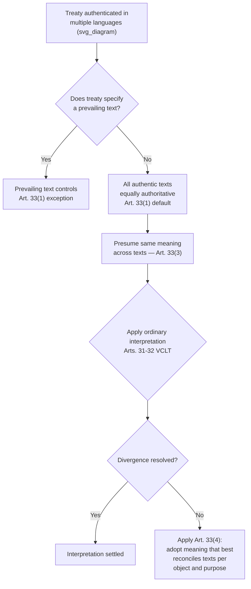

## Authentic Texts and the Problem of Multilingual Interpretation

### Theoretical Foundation

Most multilateral treaties are adopted in more than one language, and the question of which language version — or versions — constitutes the legally operative text is a distinct drafting problem from translation in the ordinary sense. A treaty's **authentic text** is the version (or versions) that the negotiating states have formally agreed carries legal authority for purposes of establishing the parties' obligations; a text that is merely an official *translation*, however accurate, does not carry this status unless the parties specifically designate it as authentic. This distinction matters because in multilingual authentic-text treaties, linguistic divergence between equally authoritative versions is not a translation error to be corrected but a genuine interpretive problem the treaty's own interpretive rules must resolve — no single-language version is presumptively "the real treaty" against which others are checked.

The underlying theoretical tension is between the negotiators' practical need to conduct substantive negotiation predominantly in one or two working languages (for reasons of efficiency and because delegations' fluency is unevenly distributed) and states' political and sovereign interest in having the treaty text exist authentically in their own national or official language — since a text a state did not negotiate but merely received in translation is, from that state's domestic legal and political perspective, of lesser standing.

### Legal Basis: Article 33 VCLT

**Article 33 of the Vienna Convention on the Law of Treaties** is the governing provision, titled "Interpretation of treaties authenticated in two or more languages." Its structure establishes a hierarchy of interpretive presumptions:

- **Article 33(1)**: where a treaty has been authenticated in two or more languages, the text is "equally authoritative in each language, unless the treaty provides or the parties agree that, in case of divergence, a particular text shall prevail." This establishes the **default rule of equal authenticity** — absent an explicit prevailing-text clause, no language version has interpretive priority over another, even where negotiations were conducted predominantly in one language.
- **Article 33(2)**: a version in a language other than one in which the text was authenticated is considered an authentic text only if the treaty so provides or the parties so agree — codifying that mere translation, however official, does not confer authentic status.
- **Article 33(3)**: the terms of a treaty are *presumed* to have the same meaning in each authentic text — a rebuttable presumption of semantic equivalence across language versions, not a guarantee.
- **Article 33(4)**: where comparison of authentic texts discloses a difference of meaning that the ordinary interpretive rules of Articles 31–32 do not resolve, the interpreter shall adopt "the meaning which best reconciles the texts, having regard to the object and purpose of the treaty." This is a genuine substantive interpretive instruction — not a tie-breaking mechanical rule but a directive to construct the meaning that best serves the treaty's overall purpose across its divergent versions.

This framework means multilingual treaty interpretation is not simply "pick the correct translation" but potentially requires an interpreter — a court, tribunal, or treaty body — to synthesize a meaning that no single authentic text expresses in isolation, whenever a genuine divergence surfaces between versions and ordinary interpretation under Article 31 cannot resolve it.

### Mechanism: The UN's Six Official Languages and Prevailing-Text Practice

Treaties negotiated under UN auspices are commonly authenticated in the UN's six official languages — Arabic, Chinese, English, French, Russian, and Spanish — with the treaty's own final clauses specifying whether all six are equally authentic (the Article 33(1) default) or whether a prevailing-text clause displaces that default.

The **UN Charter itself** is instructive: Article 111 designates the Chinese, French, Russian, English, and Spanish texts as "equally authentic" (Arabic was added as a sixth official UN language only in 1973 and was not part of the Charter's original authentication). This equal-authenticity design was a deliberate political choice reflecting the P5's status, since displacing any one of the founding languages in favor of a single prevailing text would have been read as a hierarchy among the founding powers.

By contrast, many bilateral and some plurilateral treaties explicitly designate a **prevailing text** precisely to avoid Article 33(4)'s reconciliation exercise, which is time-consuming, unpredictable in outcome, and creates litigation risk. Numerous bilateral investment treaties and free trade agreements between states of different working languages include a clause such as "in case of divergence between the [Language A] and [Language B] texts, the [Language A] text shall prevail" — sacrificing linguistic parity for interpretive predictability. This is a genuine negotiating trade-off: the state whose language is *not* designated as prevailing accepts a real, if usually small, legal disadvantage in exchange for either reciprocal concessions elsewhere in the package or practical necessity (e.g., where one party lacks the institutional capacity to maintain an equally authoritative text in a less widely used language over time).

### Case Illustration: The WTO's Trilingual Authentication and *EC – Chicken Cuts*

**WTO covered agreements** are authenticated in English, French, and Spanish, all three equally authentic under the Marrakesh Agreement's own final provisions — a rare case of trilingual (rather than the UN's hexalingual) equal authentication reflecting the GATT/WTO's institutional lineage from a predominantly English/French-drafted GATT 1947.

The Appellate Body's report in ***European Communities — Customs Classification of Frozen Boneless Chicken Cuts* (2005)** ("EC – Chicken Cuts") is a frequently cited illustration of Article 33(4) reconciliation in practice: the dispute turned partly on the interpretation of tariff classification language in the EC's WTO schedule, where the Appellate Body examined whether the English, French, and Spanish authentic versions of the relevant schedule entries diverged in meaning, and applied Article 33 methodology (alongside ordinary Article 31–32 interpretation) to determine the schedule's proper scope. The case is instructive precisely because it shows that authentic-text divergence issues are not confined to treaties' primary operative articles but can arise in technical annexes and schedules — meaning careful multilingual drafting discipline must extend to the treaty's most granular, technical components, not merely its headline provisions.

### Tactical Implications for the Negotiator

- **Working-language asymmetry creates a persistent translation-quality risk that negotiators must manage deliberately.** Because substantive drafting in large multilateral negotiations is frequently conducted predominantly in one or two working languages (commonly English and French in UN practice) with other authentic versions produced by professional translation services after the substantive text is largely settled, delegations working in a non-primary language have a structural incentive to review the translated authentic text with the same scrutiny as the primary negotiating text — divergences introduced at the translation stage become, once authenticated, equally binding and not correctable as mere error.
- **A prevailing-text clause is a genuine concession, not a technicality, and should be evaluated as part of the substantive package.** A state agreeing to a prevailing-text clause in a language other than its own is accepting a real interpretive disadvantage in any future dispute — this is properly treated as a bargaining chip subject to trade-off against other elements of the package, following the same package-deal logic used for substantive issue linkage.
- **Article 33(4) reconciliation is unpredictable and best avoided through precise drafting rather than relied upon as a fallback.** Because Article 33(4) instructs an interpreter to construct a meaning "which best reconciles the texts" by reference to object and purpose — a standard that gives an adjudicator considerable discretion — negotiators who anticipate a term may be difficult to render precisely across authentic languages should prioritize achieving genuine terminological equivalence during drafting (including specialist legal-linguistic review) rather than assuming a tribunal will later resolve any resulting ambiguity in their favor.

### Diagram: Article 33 VCLT Interpretive Sequence

**Related Topics**

- Article 31–32 VCLT general and supplementary rules of interpretation
- Legal-linguistic review and terminology harmonization in multilateral drafting
- The distinction between authentic texts and official (non-authentic) translations
- Schedule and annex drafting precision, illustrated by EC – Chicken Cuts
- Prevailing-text clauses as a negotiated concession in bilateral treaty practice
- UN official languages policy and its relationship to treaty authentication practice