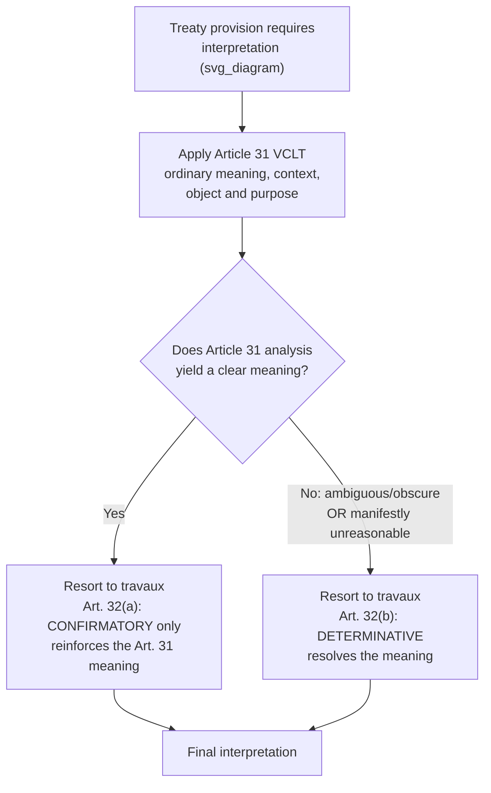

## Travaux Préparatoires as an Interpretive Aid

### Theoretical Foundation

**Travaux préparatoires** (French: "preparatory works") refers to the documentary record generated during a treaty's negotiation — conference records, drafting committee reports, delegation statements, successive draft texts and their revisions, explanatory memoranda, and negotiating history more broadly — that can be examined to establish what the negotiating parties intended a given provision to mean. The interpretive question travaux préparatoires addresses is fundamentally about **evidentiary hierarchy**: when the final, adopted treaty text is ambiguous, obscure, or produces a manifestly unreasonable result, should an interpreter be permitted to look behind the text to the process that produced it, and if so, under what constraints?

This sits within a broader jurisprudential debate between **textualist** and **intentionalist** approaches to treaty interpretation. A strict textualist position holds that the adopted text is the final and exclusive expression of the parties' agreed obligations — precisely because divergent, undisclosed subjective intentions among negotiating delegations are what the text-drafting and adoption process is designed to resolve into a single agreed formulation. An intentionalist position holds that the text is evidence of, but not a perfect substitute for, the parties' actual common intention, and that where the text is unclear, the negotiating history is the most direct available evidence of what was actually agreed. The VCLT's drafters resolved this debate not by choosing one approach exclusively but by establishing a **hierarchy of interpretive resort**, discussed below.

### Legal Basis: Article 32 VCLT

**Article 32 of the Vienna Convention on the Law of Treaties**, titled "Supplementary means of interpretation," governs the status of travaux préparatoires. It provides that recourse may be had to supplementary means of interpretation, *including* the preparatory work of the treaty and the circumstances of its conclusion, in two distinct circumstances:

(a) **to confirm** the meaning resulting from application of Article 31 (the general rule of interpretation — ordinary meaning, in context, in light of object and purpose); or

(b) **to determine** the meaning when interpretation according to Article 31 either "leaves the meaning ambiguous or obscure" or "leads to a result which is manifestly absurd or unreasonable."

This structure establishes travaux préparatoires as explicitly **subordinate and supplementary** to the Article 31 general rule — it is not a coordinate, freestanding interpretive method an interpreter may resort to at will, but a secondary resource triggered either to confirm a meaning already reached, or to resolve a genuine impasse the ordinary interpretive process cannot resolve on its own. This hierarchical placement was a deliberate drafting choice by the International Law Commission during the VCLT's own negotiation, reflecting the majority view among ILC members that treaty interpretation should be **objective and text-centered** in the first instance, with subjective negotiating-history evidence held in reserve rather than treated as co-equal with the adopted text — precisely because travaux préparatoires are frequently incomplete, one-sided (reflecting what was said on the record by vocal delegations rather than the full range of unstated positions), or simply unavailable to third states or later-acceding parties who were not present at the original negotiation and cannot be bound by an unpublished understanding they had no opportunity to examine before consenting to be bound.

### Mechanism: What Counts as Travaux, and Its Practical Limits

Travaux préparatoires as a category is not exhaustively defined by the VCLT itself, and international tribunals have in practice treated the following as falling within it: official conference records (verbatim or summary records of plenary and committee sessions), successive drafts of the treaty text with accompanying commentary (particularly International Law Commission commentaries, where the ILC prepared the underlying draft, as with the VCLT itself), explanatory reports accompanying the adopted text, and, more contestably, individual delegations' statements of position where those statements were made on the record and not objected to by other delegations.

The evidentiary limits are significant in practice:

- **Availability and completeness asymmetry.** Not all treaties generate an equally complete or equally accessible negotiating record — some multilateral conferences maintain detailed verbatim records; others produce only summary minutes, or conduct decisive negotiation in informal, unminuted small-group sessions (the "green room" format) whose substance is never fully captured in any official document. This means travaux préparatoires as an interpretive resource is often unevenly available depending on how a particular treaty happened to be negotiated, not a standardized resource an interpreter can reliably expect to exist in comparable form across different treaties.
- **Non-participant states.** A state that accedes to a multilateral treaty after its original negotiation, or that was never present at the negotiating conference, was not party to the travaux and had no opportunity to shape or object to statements made in it — this is a principal reason the ILC and subsequent tribunals have treated travaux as subordinate to the text: the adopted text, not the negotiating history, is what a later-acceding state actually consented to.
- **Selective and strategic statements.** Because delegations are aware that their on-the-record statements may later be examined as evidence of intent, sophisticated negotiators sometimes make deliberate on-the-record statements specifically to build a favorable travaux record for future interpretive disputes — a tactic that itself reduces the reliability of travaux as a neutral window into "true" collective intent, since the record can be strategically constructed rather than simply descriptive.

### Case Illustration: The ICJ and Article 32's Confirmatory Function

International courts have generally applied Article 32 cautiously, consistent with its textually subordinate status. The International Court of Justice has repeatedly used travaux préparatoires primarily in the **confirmatory** mode under Article 32(a) — citing negotiating history to reinforce a meaning the Court had already reached through Article 31 ordinary-meaning analysis — considerably more often than in the **determinative** mode under Article 32(b), where the Court is required first to establish that Article 31 analysis genuinely leaves the meaning ambiguous, obscure, or leads to a manifestly unreasonable result before travaux can be dispositive. This pattern in practice reflects the drafters' hierarchical design: tribunals treat the bar for resorting to travaux in the determinative sense as a genuinely higher threshold than merely finding the text imperfectly clear, since "ambiguous or obscure" under Article 32(b) has been read as requiring more than ordinary interpretive difficulty.

This has direct consequences for how negotiators should think about a negotiating record as a strategic asset: because tribunals resort to travaux predominantly for confirmation, a well-documented negotiating position is most reliably useful for reinforcing an interpretation a state expects to prevail on the text alone, and is a considerably less certain tool for overturning what the adopted text's ordinary meaning otherwise indicates.

### Tactical Implications for the Negotiator

- **Building the record deliberately during negotiation.** Because Article 32(a) permits travaux to *confirm* an Article 31 meaning, a delegation that anticipates future interpretive disputes over a provision has a genuine incentive to make its understanding of that provision clear on the official record during the negotiation itself — a statement of interpretation entered into the conference record (sometimes formalized as an **interpretive declaration**, distinct from a reservation under Article 19 VCLT) can later function as confirmatory travaux, provided it was not contradicted or objected to by other delegations at the time.
- **Recognizing travaux's evidentiary ceiling.** Negotiators should not rely on an unminuted understanding, a side conversation, or an informal assurance from a counterpart delegation as though it carries the same interpretive weight as text — because such an understanding, unless captured in some documentary form accessible to a later interpreter, will likely be unavailable as travaux at all, and even where documented, remains subordinate to the adopted text under Article 32's threshold conditions.
- **Anticipating the non-participant problem in treaties designed for broad accession.** Where a treaty is drafted with the expectation that many states will accede after the original negotiating conference (a common feature of framework conventions, discussed as a category under framework-protocol architecture), negotiators should place unusual weight on achieving clarity in the adopted text itself, since travaux from an original negotiating conference has diminished normative claim on states that acceded without having participated in producing that travaux.

### Diagram: Article 31–32 Interpretive Hierarchy

**Related Topics**

- Article 31 VCLT general rule of interpretation and its relationship to Article 32
- Interpretive declarations versus reservations under Article 19 VCLT
- The International Law Commission's role in drafting and commenting on treaty texts
- Evidentiary reliability of conference records versus informal negotiating understandings
- Non-participant accession and the limits of negotiating history as binding context
- Constructive ambiguity as a drafting technique and its interaction with Article 32 resort