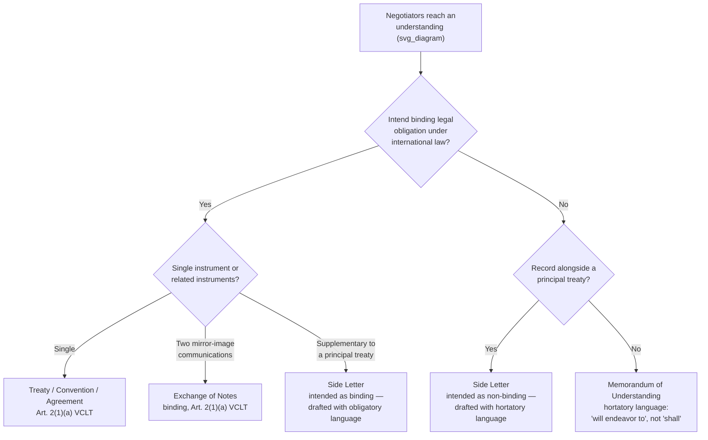

## Side Letters, Exchanges of Notes, and Non-Binding Memoranda of Understanding

### Theoretical Foundation

Not every instrument negotiators produce at the conclusion of a negotiation is a treaty in the VCLT sense, and the choice of instrument form is itself a negotiated, tactical decision, not merely a matter of administrative convenience. The threshold question for any such instrument is whether the parties intended it to be **governed by international law** and thereby create binding legal obligations — a state of mind the VCLT calls the parties' **intent to create legal relations**. This intent, not the instrument's title or format, is dispositive: a document labeled "Memorandum of Understanding" can be a binding treaty if the parties intended it as such, and a document labeled "Treaty" could in principle fail to bind if genuine intent to be bound is absent (though this is rare in practice, since formally titled treaties are almost always intended to bind). Understanding the legal architecture of side letters, exchanges of notes, and MOUs — and the negotiating logic for choosing among them — is therefore a distinct skill from treaty drafting proper.

### Legal Basis: Article 2(1)(a) VCLT and the Intent Threshold

**Article 2(1)(a) VCLT** defines "treaty" for the Convention's purposes as "an international agreement concluded between States in written form and governed by international law, whether embodied in a single instrument or in two or more related instruments and whatever its particular designation." Three elements are doing the operative work here: the agreement must be (i) between states (or, by extension of customary law, other subjects with treaty-making capacity), (ii) in written form, and (iii) **governed by international law**. It is this third element — not form, title, or even the number of instruments involved — that determines treaty status, and it is precisely this element that side letters and MOUs are drafted to either satisfy or deliberately avoid, depending on what the parties want.

The ICJ's jurisprudence, notably in *Qatar v. Bahrain* (Jurisdiction and Admissibility, 1994), confirms that even minutes of a meeting, or an exchange of letters, can constitute a binding international agreement where the substance discloses genuine commitments and an intent to be bound — the Court there found that minutes signed by foreign ministers, despite an informal format, created legally binding obligations because their content set out substantive commitments the parties had agreed to undertake. This case is the standard reference for the proposition that **form does not control** — a state cannot avoid binding effect simply by choosing an informal instrument type if the substance and circumstances otherwise disclose an intent to be bound.

### Mechanism: Exchanges of Notes

An **exchange of notes** (or exchange of letters) is a treaty-making technique, not a distinct category of non-binding instrument: it is simply a treaty concluded through two (or more) separate but mutually referential written communications — typically diplomatic notes — in which one party proposes specified terms and the other confirms acceptance, the two documents together constituting the single agreement under VCLT Article 2(1)(a)'s explicit accommodation of agreements "embodied in... two or more related instruments." This technique is used extensively for technical, administrative, or lower-political-salience agreements — status-of-forces arrangements, minor boundary or fisheries adjustments, aviation agreements — precisely because it allows the two governments to conclude a binding agreement through routine diplomatic correspondence rather than through the more elaborate signature and ratification ceremony typically associated with a formally titled "treaty" or "convention," while still producing a fully binding international agreement. The key drafting discipline is ensuring the two notes are drafted as genuine mirror-image offer-and-acceptance, since a mismatch between the terms proposed in the first note and those confirmed in the second can create interpretive ambiguity about what was actually agreed.

### Mechanism: Side Letters

A **side letter** is a supplementary written communication, exchanged alongside a principal treaty or agreement (typically at or near signature), addressing a matter the parties wish to record but did not include in the main instrument's text — commonly because the matter is politically sensitive enough that one or both parties prefer it not appear in the publicly available primary treaty text, or because it addresses an implementation detail, an understanding about how a particular clause will be applied, or a bilateral matter not relevant to other parties to a multilateral instrument.

Side letters occupy an unusually consequential position precisely because their **binding status must be independently assessed** — a side letter is not automatically part of the "treaty" merely by virtue of being exchanged alongside one, nor is it automatically non-binding merely by virtue of being separate from the main text. If the side letter is exchanged as an integral part of reaching final agreement, expressed in obligatory language, and intended to be read together with the principal instrument, it can itself constitute part of the treaty (falling within Article 2(1)(a)'s "two or more related instruments" language) or a separate binding agreement in its own right. If instead it records a political understanding, an aspiration, or a unilateral clarification without obligatory language, it may be non-binding despite its formal, treaty-adjacent appearance. This is precisely why side letters are a favored technique for managing **politically sensitive linkage** in a negotiation: they allow negotiators to record a genuine understanding — sometimes a concession one party needed to secure domestic political cover, sometimes an assurance the other party was unwilling to have appear in the primary public text — while controlling, through careful drafting, whether that understanding carries binding legal weight or remains a political commitment only.

### Mechanism: Memoranda of Understanding (MOUs)

A **Memorandum of Understanding** is the instrument type most associated, in ordinary diplomatic usage, with the deliberate choice to *avoid* binding legal obligation — though this association is a strong convention rather than an invariable rule, and the *Qatar v. Bahrain* precedent above demonstrates the label alone is not determinative. States that wish to record a political commitment, a statement of shared intent, or an operational framework for cooperation — without creating obligations enforceable as a matter of international law, and specifically without triggering domestic legal requirements that attach to binding treaties (in many states, ratification procedures, legislative approval, or judicial reviewability differ sharply between binding treaties and non-binding political commitments) — will deliberately draft an MOU using **hortatory rather than obligatory language**: "will endeavor to," "intend to," "should," rather than "shall" or "undertake to." This drafting choice is a genuine negotiating tool: an MOU allows two states to reach substantive, often detailed, operational agreement on a sensitive matter (security cooperation, intelligence sharing, economic cooperation frameworks) while avoiding the political exposure, domestic ratification burden, or public precedent-setting effect of a formally binding treaty.

The distinction has real practical consequences beyond mere formality: a binding treaty obligation, once breached, can in principle give rise to state responsibility under customary international law (the law of state responsibility, as reflected in the ILC's 2001 Articles on Responsibility of States for Internationally Wrongful Acts) and potential recourse to dispute settlement mechanisms if the treaty provides for them; a non-binding MOU breach carries only political and diplomatic consequences — reputational cost, loss of trust, potential retaliation in the relationship — but no claim in international law. Negotiators choosing the MOU form are therefore making a considered trade-off between securing a substantive understanding and accepting that the understanding will not be legally enforceable if the other party later departs from it.

### Tactical Implications for the Negotiator

- **Instrument choice is itself a negotiated outcome, and should be treated as a distinct item on the agenda rather than a default.** Whether a given understanding is captured in a treaty, an exchange of notes, a side letter, or an MOU should follow from a deliberate assessment of how much binding legal weight each party wants the commitment to carry — not from administrative habit or convenience.
- **Drafting language must match intended legal status precisely.** Because intent to be bound, not label, is dispositive under Article 2(1)(a) VCLT and the *Qatar v. Bahrain* precedent, a negotiator seeking a genuinely non-binding outcome must ensure the instrument's operative language is consistently hortatory throughout — a single obligatory clause embedded in an otherwise hortatory MOU can create genuine ambiguity about whether that specific provision was intended to bind, inviting exactly the kind of dispute the MOU form was chosen to avoid.
- **Side letters require the same drafting discipline as the primary text on the binding-status question, precisely because their ambiguous position makes them a common source of later dispute.** A negotiator using a side letter to record a politically sensitive understanding should decide explicitly, and draft accordingly, whether that side letter is meant to be part of the treaty package (Article 2(1)(a) "related instruments") or a separate, non-binding political assurance — and should anticipate that if this is left ambiguous, a future dispute-settlement body may need to resolve the question using the same intent-based analysis the ICJ applied in *Qatar v. Bahrain*.
- **Domestic legal consequences differ sharply and should inform the choice.** Because many states' domestic constitutional or statutory frameworks impose ratification, legislative-approval, or publication requirements specifically on binding treaties (and not on non-binding political commitments), the choice between a treaty-form instrument and an MOU can be driven as much by a negotiator's need to avoid a difficult domestic ratification process as by the substantive content of the commitment itself.

### Diagram: Instrument Choice by Intended Binding Status

**Related Topics**

- Article 2(1)(a) VCLT definition of "treaty" and the primacy of intent over form
- *Qatar v. Bahrain* (ICJ 1994) and the determination of binding status from substance
- The ILC Articles on State Responsibility and consequences of treaty breach versus MOU breach
- Domestic ratification and legislative-approval requirements as drivers of instrument choice
- Agreed minutes and joint communiqués as adjacent categories of diplomatic instrument
- Constructive ambiguity in binding-status drafting as a distinct technique from substantive ambiguity