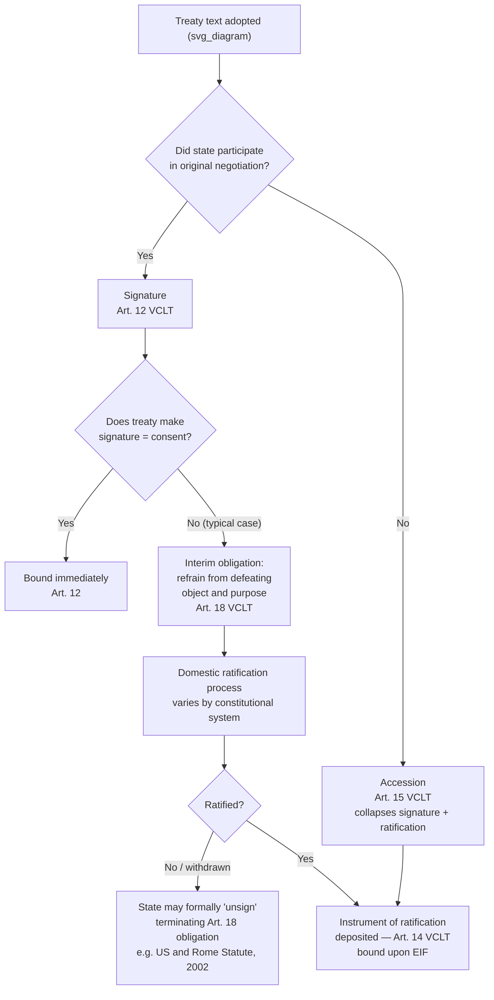

## Signature, Ratification, and Accession as Distinct Stages of Consent

### Theoretical Foundation

International treaty law does not treat "agreeing to a treaty" as a single undifferentiated act. Instead, it recognizes several formally distinct methods by which a state expresses its **consent to be bound**, each carrying different legal consequences, different domestic institutional requirements, and different points at which a state can still withdraw without breach. Understanding why these stages are kept legally separate — rather than collapsed into a single moment of "agreement" — is essential to understanding both treaty practice and a recurring negotiating dynamic: the gap between when a delegation concludes a negotiation and when a state is actually legally bound.

The theoretical rationale for separating signature from binding consent traces to a structural problem in international law: treaty negotiations are conducted by **executive-branch representatives** (heads of state, foreign ministers, or accredited plenipotentiaries), but in most domestic constitutional systems, the authority to commit the state to binding international obligations is shared with, or requires approval from, another domestic body (a legislature, a parliament, in some systems a popular referendum). If signature alone bound the state, treaty-making would effectively bypass this domestic separation of powers. The multi-stage consent architecture preserves executive negotiating authority while reserving the final binding act for a process that can accommodate domestic constitutional requirements.

### Legal Basis: Articles 11–16 VCLT

**Article 11 VCLT** establishes the general principle that consent to be bound by a treaty may be expressed by signature, exchange of instruments constituting a treaty, ratification, acceptance, approval, or accession, "or by any other means if so agreed" — establishing that the treaty's own final clauses, not a fixed universal rule, determine which specific method applies to a given instrument.

- **Article 12 VCLT (Signature)**: consent to be bound may be expressed by signature alone where the treaty so provides, where it is otherwise established that the negotiating states agreed signature should have that effect, or where the intention to give signature that effect appears from the representative's full powers or was expressed during negotiation. This is the exception, not the default — for the large majority of significant multilateral treaties, signature alone does **not** constitute consent to be bound; it instead serves the distinct function described in Article 18 (below).
- **Article 14 VCLT (Ratification, acceptance, approval)**: consent to be bound is expressed by ratification where the treaty so provides, where it is otherwise established that the negotiating states agreed ratification should be required, where the state's representative signed the treaty subject to ratification, or where the intention to require ratification appears from the representative's full powers or was expressed during negotiation. Ratification is a **subsequent, formal, domestic-level act** — typically involving the head of state or executive formally confirming the state's consent, often only after satisfying whatever domestic constitutional approval process (legislative consent, in many systems) the treaty's subject matter triggers — followed by deposit of an instrument of ratification with the depositary.
- **Article 15 VCLT (Accession)**: consent to be bound may be expressed by accession where the treaty so provides, or it is otherwise established the negotiating states agreed a state could express consent that way, or where all the parties have subsequently agreed a state not originally party could accede. **Accession is the mechanism by which a state that was not a party to the original negotiation becomes bound** — it collapses signature and ratification into a single act, since an acceding state did not participate in the negotiation or original signature process and has no occasion to sign in the interim sense Article 18 contemplates.

### Mechanism: Why Signature Is Not (Usually) Consent

**Article 18 VCLT** supplies the crucial intermediate function of signature in the (more common) case where signature does *not* itself constitute consent to be bound: a state that has signed a treaty subject to ratification, acceptance, or approval is obliged "to refrain from acts which would defeat the object and purpose of the treaty," until it has made clear its intention not to become a party. This is the **interim good-faith obligation** — signature commits a state to a weaker but genuine legal standard even before ratification: it may not act to undermine the treaty's core purpose during the period between signature and ratification (or a decision not to ratify).

This provision has real practical bite. The United States, having signed but never ratified the **Rome Statute of the International Criminal Court** (signed by President Clinton in December 2000), formally **"unsigned"** the treaty in May 2002 — the Bush administration notified the UN Secretary-General, as depositary, that the US did not intend to become a party, and that consequently the US had no legal obligations arising from its signature. This unsigning was widely understood as a deliberate legal act specifically to terminate the Article 18 good-faith obligation, since remaining merely a non-ratifying signatory would have continued to constrain US conduct under Article 18's "object and purpose" standard even without ratification — illustrating that the signature-to-ratification gap is not a legal vacuum, and that a state wishing fully to exit that intermediate obligation must take an affirmative step to do so.

Similarly, the **United States signed but has never ratified the UN Convention on the Law of the Sea (UNCLOS)**, and separately signed but has never ratified the **Kyoto Protocol** — in the Kyoto case, the Bush administration's 2001 statement that it did not intend to submit the treaty for ratification is generally understood in the literature as functionally serving the same Article 18-limiting purpose, without going so far as formal unsigning.

### Mechanism: Ratification as a Domestic-International Interface

Ratification's function as a distinct stage exists precisely because it is the point at which international treaty law and **domestic constitutional law intersect**. Different states allocate ratification authority differently:

- In the **United States**, treaties (in the constitutional sense) require Senate advice and consent by a two-thirds majority under Article II of the Constitution before the President can ratify — this high threshold is a major reason the US frequently uses non-treaty instruments (congressional-executive agreements, sole executive agreements) for matters where a two-thirds Senate majority is not achievable, and helps explain the recurring pattern of prominent US signature without ratification (Kyoto, Rome Statute, UNCLOS, CEDAW).
- In many parliamentary systems, ratification requires prior approval by ordinary parliamentary majority, a lower threshold than the US supermajority requirement, which partly explains why some treaties achieve broader ratification outside the United States than within it despite comparable executive-branch support.
- Some states' constitutions require certain categories of treaty (commonly those affecting territory, sovereignty, or requiring domestic legislative change) to be submitted to a **popular referendum** before ratification — a notable historical case being Denmark's 1992 referendum rejecting the Maastricht Treaty, which required renegotiation (producing the Edinburgh Agreement opt-outs) before a second 1993 referendum approved a revised instrument.

This domestic variation means a skilled negotiator must understand not merely what a counterpart delegation is willing to agree to at the table, but what that state's **domestic ratification pathway actually requires** — a delegation may negotiate in good faith toward a text its own executive branch fully supports, only for the agreement to fail at the ratification stage due to a domestic legislative threshold the negotiating delegation did not adequately anticipate or factor into the negotiation's design (for instance, by pursuing a treaty-form instrument where a lower-threshold executive agreement would have achieved the same substantive outcome with materially lower ratification risk).

### Mechanism: Accession and the Closed-Versus-Open Treaty Distinction

Whether a state may accede to a treaty — rather than having needed to participate in the original negotiation and sign at or near adoption — depends on whether the treaty is drafted as **open** or **closed**. An open multilateral treaty's final clauses typically provide that any state (or any state meeting specified criteria — UN membership, regional-organization membership, or an invitation procedure) may accede after the treaty has been adopted, often after it has already entered into force for the original parties. A closed treaty restricts participation to the original negotiating states, with accession by additional states requiring the unanimous consent of existing parties (per the residual Article 15(c) VCLT mechanism).

Framework conventions intended for near-universal eventual membership, discussed as a distinct architecture in the framework-protocol context, are almost invariably drafted as open treaties specifically to facilitate broad accession over time without requiring each new party to have participated in the original negotiating conference — this is precisely why accession, as a distinct consent mechanism collapsing signature and ratification into one act, is the operative mechanism through which most states eventually become party to instruments like the UNFCCC or the VCLT itself, as opposed to the smaller set of original signatory states present at adoption.

### Tactical Implications for the Negotiator

- **Signing is not winning.** A negotiator who secures agreement at the table and a signature at the closing ceremony has achieved a meaningful but legally intermediate result — the Article 18 good-faith obligation, not full binding consent — and must recognize that securing ratification is frequently the harder, longer, and more politically exposed phase of the process, particularly in states with high domestic ratification thresholds.
- **Instrument-type choice should account for the ratifying state's domestic threshold.** Given known variation in domestic ratification requirements (US Senate supermajority versus ordinary parliamentary approval versus referendum requirements), negotiators representing states with high domestic thresholds have a structural incentive to prefer instrument forms (executive agreements, MOUs, as previously discussed) that avoid triggering the highest domestic threshold, where the substantive content permits.
- **The open/closed treaty design choice shapes long-term regime membership growth.** Negotiators designing a new multilateral instrument who want to maximize eventual universal participation should favor open-treaty accession clauses; negotiators wishing to preserve tighter control over future membership (common in regional or alliance-type instruments) should favor closed-treaty structures requiring existing-party consent for new accessions.

### Diagram: Stages of Consent to Be Bound

**Related Topics**

- Article 18 VCLT interim good-faith obligation and the mechanics of "unsigning"
- Full powers and the authority of state representatives under Article 7 VCLT
- Domestic constitutional ratification thresholds as a driver of treaty-versus-executive-agreement choice
- Open versus closed treaty architecture and its relationship to framework conventions
- Entry into force thresholds and their interaction with the pace of ratification
- Congressional-executive agreements and sole executive agreements in US treaty practice