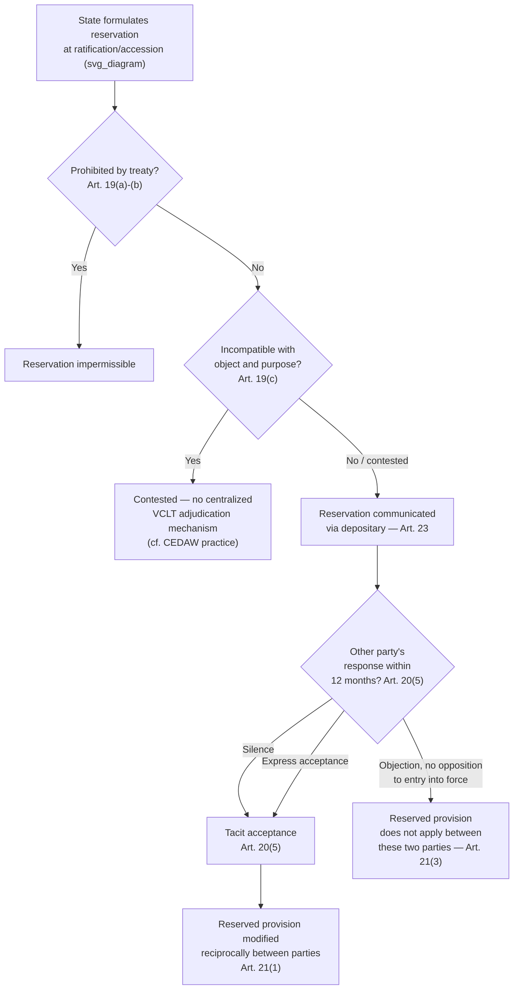

## Reservations to Treaties and Their Legal Effect Under the VCLT

### Theoretical Foundation

A **reservation** is a unilateral statement made by a state, however phrased or named, when signing, ratifying, accepting, approving, or acceding to a treaty, by which it purports to exclude or modify the legal effect of certain provisions of the treaty in their application to that state. Reservations exist to solve a structural problem in multilateral treaty-making distinct from the ones addressed by framework-protocol architecture or package dealing: even where negotiators have used sequencing, linkage, or deferred specificity to build broad consensus around a text, some individual states will still find one or more *specific* provisions unacceptable while otherwise wishing to become party to the whole. Reservations allow a state to join a multilateral treaty on modified terms rather than face the binary choice of accepting every provision or remaining entirely outside the regime — trading treaty universality for treaty precision.

This creates an immediate tension the drafters of reservation doctrine had to resolve: a reservation, if given unlimited effect, threatens the very consensus that made the treaty adoptable in the first place, since other parties negotiated and accepted the treaty's *package* of provisions, not a version modified for each reserving state. The law of reservations is therefore best understood as a body of doctrine balancing two competing values — **universality of participation** (accommodating as many states as possible, including those with specific objections) against **integrity of the negotiated text** (preserving the substantive bargain other parties actually agreed to).

### Legal Basis: Articles 19–23 VCLT

**Article 19 VCLT** establishes the baseline permissibility rule: a state may formulate a reservation when signing, ratifying, accepting, approving, or acceding to a treaty, *unless* (a) the reservation is prohibited by the treaty; (b) the treaty provides that only specified reservations, not including the one in question, may be made; or (c) the reservation is incompatible with the object and purpose of the treaty. This third ground — the **object-and-purpose compatibility test** — is the most contested and litigated of the three, since unlike (a) and (b) it requires a substantive, and often genuinely debatable, judgment about a treaty's core purpose rather than a simple textual check against an express prohibition.

**Article 20 VCLT** governs acceptance of and objection to reservations. Under Article 20(4), unless the treaty otherwise provides: acceptance by another contracting state makes the reserving state a party in relation to that other state once the treaty is in force for both (Article 20(4)(a)); an objection by another contracting state does not preclude entry into force of the treaty between the objecting and reserving states unless a contrary intention is definitely expressed by the objecting state (Article 20(4)(b)); and an act expressing consent to be bound with a reservation is effective once at least one other contracting state has accepted it (Article 20(4)(c)). Notably, Article 20(5) establishes a **default of tacit acceptance**: a reservation is considered accepted by a state if it has raised no objection within twelve months of notification, or by the date it expresses consent to be bound, whichever is later — meaning silence functions as acceptance, placing the burden of action on states wishing to reject a reservation rather than on the reserving state to secure affirmative approval.

**Article 21 VCLT** specifies the legal effect: as between the reserving state and a state that has accepted the reservation, the reserved provision is modified for both parties to the extent of the reservation (Article 21(1)) — critically, the modification is **reciprocal**, meaning the accepting state also cannot invoke the reserved provision against the reserving state to the extent of the reservation, even though the accepting state itself made no reservation. As between the reserving state and an objecting state that has not opposed entry into force, the reserved provision does not apply between them at all to the extent of the reservation (Article 21(3)) — the treaty relationship between those two specific parties is narrower than the full text, but the treaty as a whole still enters into force between them on every other provision.

**Article 23 VCLT** governs procedure: reservations, express acceptances, and objections must be formulated in writing and communicated to contracting states and other states entitled to become parties — establishing that reservation practice, like the depositary functions discussed separately, depends on formal written notification through the depositary's Article 77 communicative function.

### Mechanism: The Bilateralization Effect

The cumulative effect of Articles 20–21 is that a multilateral treaty with reservations does not produce one uniform set of obligations among all parties, but rather a **web of bilateral legal relationships**, each potentially slightly different depending on which reservations each pair of parties has made and accepted or objected to. This is sometimes called the **bilateralization** or **relativization** of multilateral treaty relations: Party A and Party B may have a full, unreserved treaty relationship on all provisions; Party A and Party C may have a relationship modified by A's reservation to Article 5, if C accepted it; Party A and Party D, who objected to A's reservation without opposing entry into force, may have no Article 5 relationship between them at all. A single multilateral treaty with active reservations practice can therefore, in the most complex cases, generate as many distinct legal configurations as there are pairs of parties with divergent reservation-acceptance patterns — a negotiator analyzing a state's actual obligations under a widely ratified, heavily reserved convention cannot simply read the treaty text; they must examine that specific state's reservations and the specific pattern of other parties' acceptances or objections.

### Case Illustration: CEDAW and the Object-and-Purpose Problem

The **Convention on the Elimination of All Forms of Discrimination Against Women (CEDAW, 1979)** is the most frequently cited case study for the practical difficulty of applying Article 19(c)'s object-and-purpose test. CEDAW has attracted an unusually large number of reservations, several of which — reservations grounded in Islamic personal-status law or domestic family law that qualify acceptance of provisions on marriage and family relations (Article 16) or, in some cases, the equal-rights core of Article 2 — have been formally objected to by other states parties specifically on the ground that they are incompatible with the Convention's object and purpose. Because the VCLT provides no centralized mechanism to authoritatively adjudicate object-and-purpose compatibility (no CEDAW body has binding authority to strike down a reservation; the CEDAW Committee can comment and criticize but reservations formally remain governed by the state-to-state acceptance/objection mechanism of Articles 20–21), the result has been a persistent, unresolved practice in which numerous states maintain reservations that other states have formally declared incompatible with the treaty's object and purpose, without any binding third-party determination resolving the disagreement — illustrating a genuine structural gap in the VCLT reservations regime: Article 19(c) states a substantive legal standard but supplies no institutional mechanism to enforce it authoritatively across a multilateral membership, leaving the practical outcome to the decentralized, and often inconsistent, individual reactions of other parties.

### The Human Rights Treaty Body Departure: General Comment No. 24

Human rights treaty bodies, most prominently the UN Human Rights Committee (overseeing the International Covenant on Civil and Political Rights), have in some instances asserted a competence the classical VCLT framework does not clearly grant them: the authority to determine for themselves whether a state's reservation is compatible with the treaty's object and purpose, and — controversially — to treat an incompatible reservation as **severable**, meaning the reservation is void and the reserving state remains bound by the full unreserved treaty, rather than the reservation causing the state's participation to fail altogether. The Human Rights Committee's **General Comment No. 24 (1994)** articulated this severability approach specifically for the ICCPR, reasoning that human rights treaties, unlike ordinary reciprocal state-to-state treaties, create obligations owed to individuals rather than primarily reciprocal obligations between states — meaning the ordinary Article 21 reciprocal-bilateralization logic, designed for reciprocal state obligations, is a poor fit for instruments whose beneficiaries are individuals who have no voice in the state-to-state acceptance/objection process. This position was contested by several states (notably the United States, United Kingdom, and France in their responses to General Comment No. 24) precisely because it departs from the VCLT's state-consent-centered architecture — the severability approach effectively allows a treaty body, rather than the reserving state itself, to determine the scope of that state's obligations, which critics argue is inconsistent with the fundamentally consensual basis of treaty law reflected throughout the VCLT.

### Tactical Implications for the Negotiator

- **Reservation strategy should be planned before signature, not improvised at ratification.** Because Article 19 conditions permissibility on the treaty's own terms (express prohibition, specified-reservations-only clauses) and on the object-and-purpose test, a delegation anticipating that domestic political or legal constraints will require a reservation on a specific provision should assess, during the negotiation itself, both whether the treaty text will permit that reservation and how a probable reservation is likely to be received by key counterpart states — since acceptance versus objection materially changes the resulting bilateral legal relationship under Article 21.
- **Silence is acceptance — a critical procedural trap.** Given Article 20(5)'s twelve-month tacit-acceptance default, a state opposed to another party's reservation must affirmatively object within the window; failure to object, whether through oversight or bureaucratic delay, results in acceptance by default, with the corresponding bilateral modification of obligations under Article 21(1).
- **Reservation practice on human rights instruments carries distinct institutional risk.** A state formulating a reservation to a human rights treaty overseen by a body with a General Comment No. 24-style severability posture should recognize that the treaty body may treat the reservation as void rather than as excluding the state from the reserved obligation — meaning the reservation may not achieve the exclusionary effect the reserving state intended, unlike reservations to ordinary reciprocal state-to-state treaties.
- **Reservations negotiated as part of accession terms function as a form of tailored package dealing at the individual-state level** — allowing a reluctant state to join a broader multilateral consensus on modified terms functions analogously to the linkage logic underlying package deals, but resolved unilaterally through the reservation-acceptance mechanism rather than through multilateral renegotiation of the text itself.

### Diagram: Reservation Formulation and Bilateral Effect

**Related Topics**

- Article 19(c) object-and-purpose test and its unresolved institutional enforcement gap
- General Comment No. 24 and the human rights treaty body departure from reciprocal bilateralization
- Interpretive declarations versus reservations as distinct unilateral statement categories
- Depositary functions under Article 77 VCLT in communicating reservations and objections
- Withdrawal of reservations under Article 22 VCLT
- The ILC's 2011 Guide to Practice on Reservations to Treaties as a supplementary interpretive resource