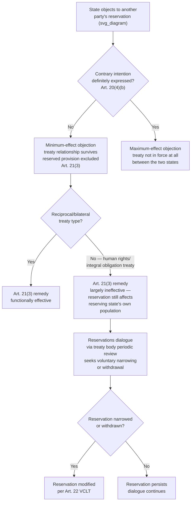

## Objections to Reservations and the Reservations Dialogue

### Theoretical Foundation

Where the formulation of a reservation is a reserving state's unilateral act qualifying its own obligations, the **objection** is the corresponding unilateral act available to *other* contracting states dissatisfied with that qualification. Recall that a reservation modifies the reserving state's treaty relationship with each other party individually, and that Article 20(5) VCLT establishes tacit acceptance as the default where no objection is raised within twelve months. The objection mechanism is therefore the sole formal tool other parties have within the VCLT framework to resist a reservation they consider undesirable, and understanding its structure — and its practical limits — is essential because the VCLT's objection provisions were drafted for a comparatively simple bilateral logic that has proven a poor fit for the more complex, and more institutionally developed, reservations practice that has since emerged, particularly around human rights treaties. This gap has given rise to what treaty-law scholarship and the International Law Commission term the **"reservations dialogue"** — an evolving, only partly codified practice of structured exchange between reserving and objecting states that goes considerably beyond the VCLT's original binary accept/object mechanism.

### Legal Basis: Article 20(4)-(5) and Article 21(3) VCLT

**Article 20(4)(b) VCLT** establishes the core rule governing an objection's legal effect: an objection by another contracting state to a reservation does not preclude the entry into force of the treaty as between the objecting and reserving states, *unless a contrary intention is definitely expressed by the objecting state*. This is the single most consequential structural feature of the VCLT objection regime: an ordinary objection is a **"minimum effect" objection** — it registers disapproval and produces the Article 21(3) consequence (the reserved provision does not apply between the two states, to the extent of the reservation) but does *not*, by default, prevent the treaty from entering into force between the two states on every other provision. The treaty relationship survives, narrowed; it is not severed.

The alternative — a **"maximum effect" objection**, sometimes called an objection with **super-maximum effect** in the more recent literature — occurs where the objecting state "definitely expresses" a contrary intention: that is, the objecting state states explicitly that it does not consider the treaty to be in force at all between itself and the reserving state. This is a considerably more drastic step, since it forecloses the entire treaty relationship between the two states, not merely the reserved provision, and states use it comparatively rarely — most objecting states prefer the default minimum-effect objection, which allows them to register formal disapproval, and to decline the specific reserved provision's application, while preserving the overall treaty relationship and its other benefits.

**Article 21(3) VCLT** supplies the substantive content of the minimum-effect objection: where a state objecting to a reservation has not opposed the entry into force of the treaty between itself and the reserving state, "the provisions to which the reservation relates do not apply as between the two States to the extent of the reservation." This produces the narrower bilateral relationship described in the discussion of reservations generally — a treaty relationship that exists but is smaller in scope than the full text, tailored to the specific pair of states involved.

### Mechanism: Why the VCLT Objection Regime Is Widely Viewed as Inadequate

The VCLT's drafters, working primarily from the model of reciprocal, state-to-state treaty obligations typical of the era's dominant treaty practice (trade, boundary, diplomatic-relations treaties), built an objection regime whose default (minimum effect, preserving the relationship) makes structural sense for reciprocal treaties: if State A reserves against Provision X, and State B objects, the practical consequence of Provision X simply not applying between A and B is a coherent, workable outcome precisely because A and B's obligations under the treaty are essentially bilateral exchanges of value, and losing one exchange while retaining the others is a sensible middle ground.

This logic transfers poorly to **human rights and other "non-reciprocal" or "integral" treaties**, where the treaty does not establish an exchange of reciprocal state benefits but instead sets a common, largely non-derogable standard of treatment owed to individuals (or, in environmental treaties, a common standard addressing a problem — like ozone depletion or greenhouse gas emissions — whose effects are not confined to a bilateral relationship between any two particular states). Recall the discussion of the Human Rights Committee's General Comment No. 24 in the reservations discussion: because human rights obligations are owed to individuals within the reserving state's own jurisdiction, not primarily to the other treaty parties, an objecting state's ordinary Article 21(3) remedy — the provision simply not applying between the objecting state and the reserving state — accomplishes essentially nothing, since the objecting state was never going to be the party invoking that provision against the reserving state in the first place; the actual intended beneficiaries (the reserving state's own population) remain affected by the reservation regardless of what any other state does. This mismatch is the central reason human rights treaty bodies have sought interpretive authority beyond the classical VCLT framework, as General Comment No. 24's severability doctrine illustrates.

### The ILC's 2011 Guide to Practice on Reservations to Treaties

In response to the recognized inadequacy and ambiguity of the VCLT's skeletal objection provisions, the **International Law Commission adopted the Guide to Practice on Reservations to Treaties in 2011**, after a project spanning roughly two decades under Special Rapporteur Alain Pellet. The Guide is not itself a binding treaty instrument — it takes the form of non-binding guidelines with commentary, intended to clarify and elaborate VCLT reservations practice rather than to displace or amend the VCLT — but it has become an influential reference point precisely because it addresses numerous procedural and substantive questions the VCLT text left unresolved, including detailed guidance on the timing and form of objections, the possibility and consequences of "conditional" or partial objections, the treatment of "objections with intermediate effect" (objections that seek to modify rather than simply exclude the reserved provision's application, expanding on the strict minimum/maximum binary the VCLT text itself suggests), and — significantly — the Guide's own treatment of the question of competence to assess reservation validity, addressing (without fully resolving) the tension between state-consent-based determination and treaty-body determination that the human rights treaty bodies' practice had already begun to generate independently of the ILC's work.

### Mechanism: The Reservations Dialogue in Practice

The term **"reservations dialogue"** describes an evolving practice, encouraged explicitly by the ILC Guide and by UN human rights treaty bodies, in which the formulation of a reservation and the response of other parties or treaty bodies is treated not as a single, final, binary transaction (reservation formulated, then accepted or objected to, with the matter closed) but as an **iterative exchange**: a treaty body or objecting state raises specific, substantive concerns about a reservation's scope or compatibility with the treaty's object and purpose; the reserving state is invited to respond, clarify, narrow, or ultimately withdraw the reservation in light of that dialogue, rather than the reservation simply standing indefinitely, unmodified, subject only to the passive twelve-month acceptance window.

This practice is most institutionally developed in the human rights treaty body system, where committees such as the Human Rights Committee and the CEDAW Committee routinely raise reservations during the periodic state-reporting review process (the mechanism by which states parties to human rights treaties submit periodic reports on implementation, which the relevant committee reviews and comments on), pressing reserving states to explain, narrow, or withdraw problematic reservations over time — a soft, dialogic pressure mechanism operating alongside, and in the ILC Guide's framing, as a complement to, the harder-edged but practically underused formal objection mechanism of Article 20(4)(b). Some states have in fact narrowed or withdrawn long-standing reservations following sustained treaty-body engagement through this dialogic process, illustrating that the reservations dialogue can produce substantive change even without the formal severability or invalidation doctrine that General Comment No. 24 controversially asserted.

### Tactical Implications for the Negotiator

- **The choice between minimum and maximum effect objection is a genuine strategic decision, not a formality.** A state objecting to another party's reservation must decide deliberately whether it wishes to preserve the overall treaty relationship while excluding only the reserved provision (the default, and the overwhelmingly more common choice in practice) or to take the considerably more drastic step of declaring the treaty not in force between the two states at all — a maximum-effect objection is a significant diplomatic escalation typically reserved for reservations the objecting state views as going to the core of the treaty's viability, not merely an undesirable qualification of one provision.
- **Formal objection and reservations dialogue serve different, complementary functions and a sophisticated negotiator uses both.** A formal Article 20(4)(b) objection creates an immediate, legally defined bilateral consequence under Article 21(3); the reservations dialogue, by contrast, is a slower, non-binding, relationship-preserving mechanism aimed at inducing voluntary narrowing or withdrawal of a reservation over time — states with an interest in a particular reservation's removal, but unwilling to bear the relationship cost of a maximum-effect objection, frequently pursue the dialogic route instead, especially within periodic treaty-body reporting cycles.
- **Silence remains the default trap regardless of which strategy a state prefers.** Because Article 20(5)'s twelve-month tacit-acceptance rule continues to govern formal objections regardless of a state's preference for the dialogic approach, a state wishing to preserve its formal right to object (even if it intends primarily to pursue dialogue) should still consider lodging a timely, even minimally worded, formal objection within the window, since failure to do so forecloses the formal Article 21(3) consequence entirely, leaving dialogue as the only remaining avenue.

### Diagram: Objection Effect and the Reservations Dialogue

**Related Topics**

- Minimum, maximum, and intermediate-effect objections under the ILC Guide to Practice
- General Comment No. 24 and treaty-body severability doctrine as a departure from Article 21(3)
- The periodic state-reporting review cycle in UN human rights treaty bodies
- Withdrawal and modification of reservations under Article 22 VCLT
- Reciprocal versus integral/non-reciprocal treaty obligations as a driver of objection effectiveness
- The ILC's 2011 Guide to Practice on Reservations to Treaties as non-binding interpretive guidance