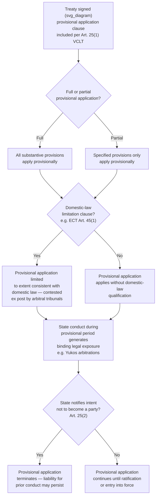

## Provisional Application of Treaties Pending Ratification

### Theoretical Foundation

Recall that consent to be bound by a treaty is ordinarily established through a sequence of distinct stages — signature, followed by domestic ratification, followed by entry into force — and that Article 18 VCLT imposes only a limited interim obligation (refraining from acts that would defeat the treaty's object and purpose) during the gap between signature and ratification. This standard architecture assumes the negotiating states are willing to tolerate the delay inherent in full ratification before the treaty's substantive obligations actually take legal effect. **Provisional application** is the VCLT mechanism that allows states to bypass this delay: it permits some or all of a treaty's provisions to apply, with genuine binding legal effect, *before* the treaty has formally entered into force under its own entry-into-force clause — addressing situations where the negotiating states judge that the substantive urgency of the matter, or the practical benefits of immediate implementation, outweigh the value of waiting for the full ratification process to run its course.

This is a distinct concept from both the Article 18 interim obligation (which is a *negative* obligation not to undermine the treaty, not an affirmative obligation to apply its substantive terms) and from entry into force itself (which is the treaty's permanent, non-provisional binding status once the relevant threshold, discussed under final clauses, is met). Provisional application occupies a genuinely intermediate category: full, affirmative application of some or all substantive provisions, but on a basis the parties can in principle terminate more readily than a fully entered-into-force treaty, and without the domestic ratification process having been completed.

### Legal Basis: Article 25 VCLT

**Article 25 VCLT** provides the governing rule in two paragraphs. Article 25(1): a treaty or a part of a treaty is applied provisionally pending its entry into force if (a) the treaty itself so provides, or (b) the negotiating states have in some other manner so agreed. Article 25(2): unless the treaty otherwise provides or the negotiating states otherwise agreed, the provisional application of a treaty or a part of a treaty with respect to a state terminates if that state notifies the other states between which the treaty is being applied provisionally of its intention not to become a party to the treaty.

Two structural features of Article 25 deserve emphasis for the practicing negotiator. First, provisional application can be established either through an explicit treaty clause (the more common and legally cleaner approach) or through some other form of agreement among the negotiating states — meaning it is possible, if less common and considerably riskier from an evidentiary standpoint, for provisional application to arise from conduct or informal agreement rather than express textual provision. Second, Article 25(2)'s default termination rule is significant: a state applying a treaty provisionally can exit that provisional application unilaterally, by simple notification of its intention not to become a party — this is a materially lower threshold for exit than the formal withdrawal or denunciation mechanisms (governed by Article 56 VCLT and any treaty-specific withdrawal clause) that apply once a treaty has actually entered into force. Provisional application is therefore legally binding while it lasts, but exits on a lighter procedural footing than full treaty membership.

### Mechanism: Why States Choose Provisional Application

Provisional application serves several distinct negotiating functions:

- **Bridging a long or uncertain ratification timeline.** Where a treaty's substantive urgency (an economic cooperation mechanism, a security arrangement, a regulatory regime addressing a fast-moving problem) is high relative to the anticipated delay of full domestic ratification across a potentially large number of parties, provisional application allows the regime to begin operating immediately among the states willing to apply it provisionally, rather than waiting for the ratification threshold to be met.
- **Managing uncertainty about whether ratification will occur at all.** Because Article 25(2) allows exit merely by notification of intent not to become a party, provisional application allows a state genuinely uncertain about its own eventual ratification prospects (due to unresolved domestic political or legal processes) to participate in the interim without making the more binding commitment full ratification represents — a useful device where a negotiating delegation's domestic ratification prospects are uncertain but the state's executive branch wants to signal good-faith engagement and begin realizing practical benefits immediately.
- **Preserving negotiating momentum and institutional continuity.** In treaties establishing ongoing institutional machinery (a governing body, a secretariat, a dispute-resolution mechanism), provisional application allows that institutional apparatus to begin functioning immediately upon signature rather than remaining dormant through a potentially lengthy ratification period, which can be important where the institution's credibility or operational capacity depends on early, continuous activity.

### Case Illustration: The Energy Charter Treaty and the Yukos Arbitrations

The **Energy Charter Treaty (ECT, signed 1994, entered into force 1998)** contains one of the most consequential and heavily litigated provisional application clauses in modern treaty practice. **Article 45(1) ECT** provides that each signatory agrees to apply the treaty provisionally pending its entry into force, "to the extent that such provisional application is not inconsistent with its constitution, laws or regulations" — a qualifying clause (sometimes called the "limitation clause") allowing a signatory state to limit or avoid provisional application to the extent domestic law would otherwise conflict with it, but which does not automatically exempt a state from provisional application merely because it has not yet completed the ratification process.

**Russia signed the ECT in 1994 but never ratified it**, and applied the treaty provisionally under Article 45(1) from 1994 until **20 October 2009**, when Russia formally notified the depositary of its intention not to become a party, terminating provisional application under the Article 25(2) mechanism. The critical legal question — the subject of the landmark ***Yukos* arbitrations** (a series of investor-state arbitrations brought by former shareholders of the dismantled Russian oil company Yukos, culminating in a 2014 award by a tribunal under the Permanent Court of Arbitration awarding claimants over USD 50 billion, later set aside and then partially reinstated through subsequent Dutch court proceedings) — was whether Russia's provisional application of the ECT from 1994 to 2009 meant Russia had been bound by the treaty's substantive investor-protection provisions (Part III of the ECT, including its investor-state dispute settlement mechanism) during that period, despite never having ratified the treaty.

The tribunal held that Russia's Article 45(1) "limitation clause" required examining Russian domestic law to determine whether provisional application of the ECT's investor-protection and arbitration provisions was consistent with Russian constitutional and statutory law, and — a central and contested holding — that because Russia had not identified a specific domestic-law inconsistency, the ECT's substantive provisions, including its dispute-resolution mechanism, had indeed applied to Russia on a provisional basis throughout the relevant period, exposing Russia to arbitral jurisdiction and substantive liability for conduct occurring while the treaty applied only provisionally, notwithstanding Russia's eventual formal notification that it did not intend to become a full party. This outcome is the reference case demonstrating that provisional application under Article 25 VCLT is not a legally weightless placeholder status — it can generate substantial, enforceable legal exposure, including exposure to binding third-party dispute resolution, for a state that ultimately never ratifies the underlying treaty at all.

### Mechanism: Limits and Ambiguities in Provisional Application Practice

Provisional application clauses vary considerably in their drafting precision, and this variation has real consequences:

- **Full versus partial provisional application.** A treaty's provisional application clause may apply the entire instrument provisionally, or may specify that only certain provisions (often excluding institutionally or fiscally sensitive provisions requiring domestic budgetary appropriation) apply provisionally while others await full entry into force — requiring careful textual analysis in each case of exactly which obligations are provisionally binding.
- **Domestic-law limitation clauses create interpretive uncertainty.** As the ECT/Yukos experience demonstrates, a limitation clause conditioning provisional application on consistency with domestic law (rather than either fully excluding or fully including a state, categorically) invites exactly the kind of contested after-the-fact litigation the Yukos tribunals confronted — a state's own view of its domestic law's requirements may differ sharply from an arbitral tribunal's later assessment of the same question, and the treaty text alone does not resolve which view controls.
- **The 2020 ECT modernization negotiations and eventual withdrawals** by several European states (including the EU's coordinated 2024 decision facilitating member state withdrawal) further illustrate the long-term instability risk inherent in provisional-application-heavy treaty regimes: a regime substantially shaped by provisional rather than fully ratified participation can prove more susceptible to later mass withdrawal than one built on a fully ratified membership base, since the underlying commitment for provisionally-applying states was, by Article 25(2)'s design, always exitable on comparatively short notice.

### Tactical Implications for the Negotiator

- **A limitation clause should be drafted with precision, not left as a general domestic-law reference.** The ECT/Yukos experience is frequently cited as a cautionary case for treaty drafters: a vague "to the extent not inconsistent with domestic law" formula defers a potentially high-stakes legal question to future, unpredictable adjudication rather than resolving it in the text — a negotiator representing a state uncertain about its ratification prospects, and wary of provisional-application exposure, should press for either a clear exclusion of specific high-risk provisions (such as investor-state dispute settlement) from provisional application, or for omitting provisional application from the treaty's final clauses altogether.
- **Provisional application should be evaluated as creating real, litigable legal exposure, not merely political goodwill.** A state agreeing to provisional application, particularly of a treaty containing binding dispute-resolution machinery, should recognize — per the Yukos precedent — that its conduct during the provisional-application period can later form the basis of binding arbitral liability, even if the state never proceeds to ratify.
- **Provisional application can be a useful sequencing tool precisely because Article 25(2) exit is comparatively low-cost**, and a negotiator seeking to build early momentum for a new regime, or to allow states with uncertain domestic ratification timelines to participate immediately, should weigh this benefit against the exposure risk described above — the two considerations pull in opposite directions and the appropriate balance depends heavily on the specific treaty's subject matter and the presence or absence of binding dispute-resolution provisions.

### Diagram: Provisional Application Lifecycle

**Related Topics**

- Article 18 VCLT interim good-faith obligation as a distinct, weaker pre-ratification standard
- The Yukos arbitrations and investor-state dispute settlement exposure under provisional application
- Domestic-law limitation clauses and their interpretive risk in treaty drafting
- Article 56 VCLT withdrawal and denunciation as the post-entry-into-force analog to Article 25(2) exit
- Entry-into-force thresholds and their interaction with provisional application as parallel tracks
- The 2024 EU coordinated withdrawal from the Energy Charter Treaty as a case of regime destabilization