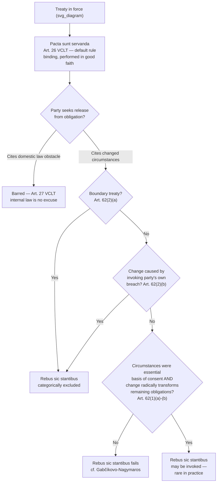

## Pacta Sunt Servanda and Rebus Sic Stantibus as Competing Principles

### Theoretical Foundation

Once a treaty has entered into force through the consent mechanisms already discussed — signature, ratification, or accession — international law must resolve a second-order question distinct from how obligations are created: under what conditions, if any, may a party be released from an obligation it has validly and knowingly accepted? Two foundational, and structurally opposed, principles govern this question. **Pacta sunt servanda** ("agreements must be kept") is the foundational principle that a validly concluded treaty binds the parties and must be performed by them in good faith — it is the principle that makes treaty law possible at all, since without a baseline presumption that agreements bind regardless of subsequent inconvenience, no state could rely on another's treaty commitments. **Rebus sic stantibus** ("things thus standing," commonly translated as the doctrine of fundamental change of circumstances) is the narrow, exceptional counter-principle permitting a party to withdraw from or terminate a treaty where the circumstances that existed at the time of conclusion have changed so fundamentally that the original basis of the parties' consent no longer holds.

These two principles are in permanent structural tension, and the tension is deliberate rather than an oversight in treaty-law doctrine: a legal system that allowed states to exit inconvenient obligations too readily under changed-circumstances reasoning would undermine pacta sunt servanda's core function of making international commitments reliable; a legal system that permitted no exception at all would bind states to obligations that later prove genuinely unworkable due to circumstances no party could have anticipated. The VCLT resolves this tension not by rejecting rebus sic stantibus but by codifying it in an unusually narrow, tightly conditioned form specifically to preserve pacta sunt servanda as the clearly dominant default.

### Legal Basis: Article 26 (Pacta Sunt Servanda)

**Article 26 VCLT** codifies pacta sunt servanda in a single sentence: "Every treaty in force is binding upon the parties to it and must be performed by them in good faith." This is placed immediately after Article 25 (provisional application) and immediately before Article 27, which reinforces the principle from a different angle: "A party may not invoke the provisions of its internal law as justification for its failure to perform a treaty" — foreclosing the argument that a domestic legal obstacle to performance (a subsequent statute, a constitutional court ruling, a change of government policy) excuses non-performance of an international obligation. Article 27's rule has a specific, narrow qualifier under Article 46 VCLT (addressed below), but as a general matter it establishes that international obligations cannot be unilaterally discharged by domestic legal developments — the state bears responsibility for aligning its domestic law with its international commitments, not the reverse.

Article 26's placement and brevity reflect its status as close to an axiomatic starting principle of treaty law rather than a rule requiring extensive elaboration — the VCLT's drafters treated pacta sunt servanda as the doctrinal bedrock from which the entire law of treaties proceeds, with essentially every other provision of the Convention (including the narrow escape valves discussed below) understood as a bounded exception to, rather than a displacement of, this baseline.

### Legal Basis: Article 62 (Fundamental Change of Circumstances)

**Article 62 VCLT** codifies rebus sic stantibus, and does so with unusually restrictive conditions precisely because of the doctrine's potential to undermine treaty stability if applied loosely. Article 62(1) provides that a fundamental change of circumstances which has occurred with regard to those existing at the time of the treaty's conclusion, and which was not foreseen by the parties, may **not** be invoked as a ground for terminating or withdrawing from the treaty unless: (a) the existence of those circumstances constituted an essential basis of the parties' consent to be bound by the treaty; **and** (b) the effect of the change is radically to transform the extent of obligations still to be performed under the treaty. Both conditions must be satisfied conjunctively — a change of circumstances that was merely significant, or that made performance more burdensome or less advantageous without radically transforming the nature of the obligation itself, does not meet the Article 62(1) threshold.

Article 62(2) imposes two further categorical exclusions, regardless of whether Article 62(1)'s conditions are met: a fundamental change of circumstances may **not** be invoked as a ground for terminating or withdrawing from a treaty (a) if the treaty establishes a boundary, or (b) if the fundamental change is the result of a breach by the invoking party either of an obligation under the treaty or of any other international obligation owed to any other party to the treaty. The boundary-treaty exclusion (Article 62(2)(a)) reflects a strong policy preference for territorial stability — allowing changed circumstances to unsettle boundary treaties would introduce intolerable instability into one of international law's most security-sensitive areas. The own-breach exclusion (Article 62(2)(b)) is a straightforward application of the general principle that a party cannot benefit from its own wrongful conduct — a state cannot engineer a "fundamental change" through its own violations and then invoke that self-created change as grounds for escaping the treaty altogether.

### Mechanism: The ICJ's Restrictive Application in *Gabčíkovo-Nagymaros*

The International Court of Justice's judgment in ***Gabčíkovo-Nagymaros Project (Hungary v. Slovakia)*** (1997) is the definitive modern authority applying, and substantially narrowing in practice, Article 62's already restrictive text. The case concerned a 1977 treaty between Hungary and Czechoslovakia (later Slovakia, as successor state) establishing a joint barrage system on the Danube River; Hungary sought to terminate the treaty in 1992, citing, among other grounds, a fundamental change of circumstances — arguing that new scientific understanding of the project's ecological consequences, changed political and economic conditions following the end of the Cold War and Hungary's transition away from a centrally planned economy, and evolving international environmental-law norms together constituted a fundamental change from the conditions prevailing when the treaty was concluded in 1977.

The Court rejected Hungary's rebus sic stantibus argument, holding that even accepting the changed political, economic, and environmental circumstances Hungary identified, these changes did not satisfy Article 62(1)(b)'s requirement that the change **radically transform the extent of obligations still to be performed** — the Court found the changed circumstances Hungary cited, while genuine, did not so fundamentally alter the nature of the parties' remaining obligations under the treaty as to meet the doctrine's threshold, and further emphasized that Article 62 states the conditions for invoking the doctrine in exceptionally narrow terms specifically to preserve the stability of treaty relations, cautioning against any broader or more flexible application. This judgment is now the standard reference for the proposition that rebus sic stantibus, notwithstanding its codification in Article 62, functions in actual international judicial practice as an almost never successfully invoked doctrine — the Court's reasoning reinforced that the VCLT's narrow drafting was not merely formal caution but reflects the doctrine's genuinely exceptional, near-vestigial role relative to the dominant pacta sunt servanda default.

### Distinguishing Rebus Sic Stantibus from Adjacent Doctrines

Rebus sic stantibus must be distinguished from several adjacent, but legally separate, grounds on which a treaty obligation might lapse or be excused, since negotiators and practitioners frequently conflate them:

- **Supervening impossibility of performance (Article 61 VCLT)**, which permits termination or withdrawal where performance has become impossible due to the permanent disappearance or destruction of an object indispensable to the treaty's execution (e.g., the submergence of an island, the drying up of a river essential to a water-sharing treaty) — this is a narrower, more factually concrete doctrine than rebus sic stantibus's broader "circumstances" language, and Article 61(2) similarly excludes invocation where the impossibility results from the invoking party's own breach.
- **Material breach (Article 60 VCLT)**, which permits a party to invoke another party's material breach as grounds for termination or suspension — this is fundamentally different in structure from rebus sic stantibus because it responds to the *other party's wrongful conduct*, not to a change in external circumstances unconnected to either party's behavior.
- **Force majeure and necessity** under the customary international law of state responsibility (reflected in the ILC's 2001 Articles on State Responsibility, Articles 23 and 25 respectively) — these are defenses precluding wrongfulness for a specific act of non-performance, operating within the law of state responsibility rather than the law of treaties, and are conceptually distinct from Article 62's treaty-termination mechanism: force majeure/necessity may excuse a particular instance of non-compliance without terminating the treaty itself, whereas Article 62 addresses termination or withdrawal from the treaty as such.

### Tactical Implications for the Negotiator

- **Rebus sic stantibus should not be relied upon as a practical exit strategy in treaty design.** Given the *Gabčíkovo-Nagymaros* precedent and Article 62's conjunctive, narrowly drafted conditions, a negotiator who anticipates that changing circumstances might later make a treaty's obligations undesirable should not assume the doctrine offers a realistic escape route — the more reliable and legally certain approach is to negotiate explicit **exit clauses** (withdrawal or denunciation provisions under Article 56 VCLT, discussed as final clauses generally) or **review and amendment mechanisms** directly into the treaty text at the drafting stage, rather than relying on an uncodified expectation that changed circumstances will later justify termination.
- **Boundary treaties are categorically insulated from this doctrine, which has specific implications for territorial negotiations.** Because Article 62(2)(a) excludes boundary treaties from rebus sic stantibus entirely, negotiators concluding a boundary settlement should understand that the resulting instrument is designed by international law to be unusually durable against later changed-circumstances challenges — a feature that itself has negotiating value: a state seeking maximum long-term certainty for a favorable boundary outcome benefits from this structural insulation, while a state uncertain about the durability of a boundary concession under future conditions should recognize that Article 62(2)(a) forecloses this particular avenue of later relief.
- **The own-breach exclusion under Article 62(2)(b) means a party cannot manufacture grounds for escape through its own conduct.** A negotiator should recognize that a rebus sic stantibus argument grounded in circumstances the invoking party itself brought about through breach of the treaty or another international obligation will fail as a categorical matter, regardless of how genuinely transformative the resulting change might otherwise appear.

### Diagram: Pacta Sunt Servanda as Default, Rebus Sic Stantibus as Narrow Exception

**Related Topics**

- Article 60 VCLT material breach as a distinct ground for termination or suspension
- Article 61 VCLT supervening impossibility of performance and its narrower factual scope
- Force majeure and necessity under the ILC Articles on State Responsibility
- *Gabčíkovo-Nagymaros Project* (ICJ 1997) as the leading rebus sic stantibus precedent
- Article 56 VCLT withdrawal and denunciation clauses as the preferred drafting alternative
- Boundary treaty stability and its distinct treatment across multiple VCLT provisions