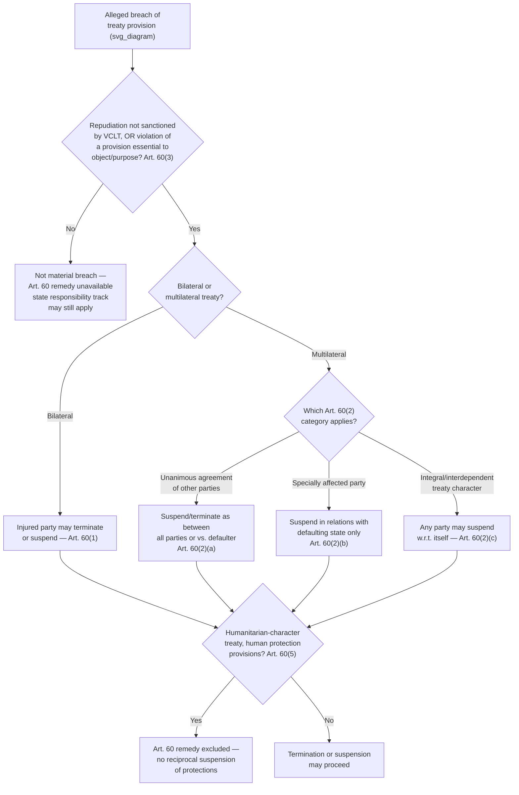

## Termination, Suspension, and Material Breach Under the VCLT

### Theoretical Foundation

Having established pacta sunt servanda (Article 26 VCLT) as the dominant baseline principle and rebus sic stantibus (Article 62) as its narrow, rarely successful exception, the VCLT's law of treaties provides a further, more commonly invoked category of grounds on which a treaty relationship may lawfully end or be suspended: **termination and suspension for material breach**. Where rebus sic stantibus addresses circumstances external to either party's conduct, material breach doctrine addresses the situation where *one party's own wrongful conduct* — its failure to perform the treaty as agreed — gives the other party or parties a legal entitlement to respond by terminating or suspending the treaty relationship. This is conceptually a specific application of a general principle running throughout contract and treaty law: a party's own breach can release the counterparty from continued performance, since the mutual character of treaty obligations means one party's fundamental non-performance undermines the basis on which the other party agreed to be bound.

The VCLT's material breach provisions must be understood alongside, and kept distinct from, two related but legally separate bodies of consequence: the **law of state responsibility** (governing a state's international legal responsibility and liability for the underlying wrongful act itself, codified in the ILC's 2001 Articles on Responsibility of States for Internationally Wrongful Acts) addresses what remedies are available for the breach as a wrongful act (reparation, cessation, guarantees of non-repetition); Article 60 VCLT, by contrast, addresses the narrower and more specific question of what happens to the **treaty relationship itself** — whether it may be terminated or suspended — as a consequence of material breach. A state can pursue state-responsibility remedies for a breach without terminating the treaty, and conversely a party terminating a treaty under Article 60 does not thereby forfeit any state-responsibility claim arising from the breach that triggered termination; the two tracks operate in parallel.

### Legal Basis: Article 60 VCLT — Material Breach

**Article 60(1) VCLT** establishes the bilateral treaty rule: a material breach of a bilateral treaty by one party entitles the other party to invoke the breach as a ground for terminating the treaty or suspending its operation in whole or in part. **Article 60(2)** establishes the more complex multilateral treaty rule, distinguishing three categories of response: (a) the other parties, by unanimous agreement, may suspend the treaty's operation in whole or in part, or terminate it, either as between themselves and the defaulting state or as between all parties; (b) a party specially affected by the breach may invoke it as a ground for suspending the treaty's operation in whole or in part in its relations with the defaulting state specifically; (c) any party other than the defaulting state may invoke the breach as a ground for suspending the treaty's operation in whole or in part with respect to itself, if the treaty is of such a character that a material breach of its provisions by one party radically changes the position of every other party with respect to further performance of its obligations under the treaty. This last category — sometimes called the **"integral" or "interdependent" treaty exception** — addresses treaties (certain disarmament or environmental agreements are the paradigm examples) whose value to each party depends on universal compliance, such that one party's material breach genuinely undermines the treaty's function for every other party, not merely for the party directly wronged.

**Article 60(3)** defines "material breach" precisely, rather than leaving it to open-ended judgment: material breach consists of (a) a repudiation of the treaty not sanctioned by the VCLT itself, or (b) the violation of a provision essential to the accomplishment of the object or purpose of the treaty. This definition deliberately excludes minor, technical, or peripheral violations from triggering Article 60's termination/suspension remedy — an ordinary, non-essential breach may give rise to state-responsibility consequences, but does not by itself entitle the injured party to terminate the treaty relationship; only a breach either amounting to outright repudiation or striking at a provision essential to the treaty's core object and purpose meets the threshold.

**Article 60(5)** carves out a significant exception applicable across all of Article 60: paragraphs 1 through 3 do not apply to provisions relating to the protection of the human person contained in treaties of a humanitarian character, particularly provisions prohibiting any form of reprisals against persons protected by such treaties. This exception reflects the same non-reciprocal, individual-rights-oriented logic already encountered in the discussion of reservations to human rights treaties (recall the Human Rights Committee's General Comment No. 24 reasoning): because humanitarian treaty obligations — most prominently the Geneva Conventions' protections for protected persons — are not owed reciprocally between states but are owed to individuals, one party's breach cannot justify the other party suspending its own humanitarian obligations toward protected persons as a form of retaliation; doing so would compound the original wrong against individuals who bear no responsibility for the breach. This is among the clearest textual instances in the VCLT of a deliberate departure from ordinary reciprocal-breach logic specifically because of a treaty category's non-reciprocal character.

### Mechanism: The ICJ's Elaboration in *Gabčíkovo-Nagymaros*

The same *Gabčíkovo-Nagymaros Project (Hungary v. Slovakia)* (1997) judgment discussed in connection with rebus sic stantibus also addressed Article 60 material breach, since Hungary advanced multiple grounds for termination, including Czechoslovakia's alleged material breach through its unilateral construction and operation of an alternative solution (the "Variant C" diversion of the Danube) after Hungary had suspended and later purported to terminate the original 1977 treaty. The Court's reasoning in this portion of the judgment is significant for clarifying the **sequencing** of Article 60 breach claims: the Court found that Hungary's own prior suspension and abandonment of works under the treaty itself constituted a material breach preceding Czechoslovakia's Variant C response — meaning Hungary could not rely on Czechoslovakia's later conduct as grounds for termination when Hungary's own earlier conduct had already breached the treaty first. This illustrates a recurring practical difficulty in material breach disputes: where both parties have engaged in conduct arguably inconsistent with the treaty over an extended relationship, establishing which party's breach came first, and whether subsequent conduct by the other party was itself a lawful response to that initial breach or an independent, separately wrongful act, requires careful chronological and causal analysis rather than a simple binary assessment of "who breached."

The Court also emphasized, consistent with its broader reasoning on rebus sic stantibus in the same judgment, that even where a material breach is established, Article 60 makes termination or suspension a matter the injured party may elect to invoke — it is not automatic — and importantly, a purported termination not properly grounded in a valid Article 60 (or other VCLT-recognized) ground is itself of no legal effect: the treaty remains in force notwithstanding the purporting party's unilateral declaration, meaning a state's own erroneous or premature invocation of Article 60 can itself constitute an independent wrongful act if the breach it cites does not in fact meet the Article 60(3) threshold.

### Mechanism: Distinguishing Termination from Suspension

Article 60's text consistently offers injured parties a choice between **termination** (ending the treaty relationship permanently) and **suspension** (pausing the treaty's operation, in whole or in part, while preserving the underlying treaty relationship for potential future resumption). This choice has genuine strategic significance distinct from the underlying breach determination: suspension is the more conservative, reversible response, appropriate where the injured party wishes to register the breach and withhold its own performance without foreclosing the relationship's future, while termination is the more definitive response appropriate where the injured party judges the treaty relationship itself no longer worth preserving. **Article 72 VCLT** governs the specific consequences of suspension (the parties are released from the obligation to perform the treaty in their mutual relations during the suspension period, but the suspension does not otherwise affect the legal relations between the parties established by the treaty), while **Article 70 VCLT** governs the consequences of termination (releasing the parties from any obligation further to perform the treaty, without affecting rights, obligations, or legal situations created through the treaty's execution prior to termination) — meaning termination, unlike suspension, does not retroactively unwind the legal effects of performance that already occurred before termination took effect.

### Tactical Implications for the Negotiator

- **The Article 60(3) materiality threshold should inform how negotiators draft compliance and enforcement provisions.** Because only breach of a provision "essential to the accomplishment of the object or purpose of the treaty" triggers Article 60 remedies, negotiators who wish specific provisions to carry termination-level consequences upon breach — even where those provisions might not obviously qualify as going to the treaty's core object and purpose under a court's independent assessment — have an incentive to draft the treaty's own text to designate certain obligations as essential, or to include explicit treaty-specific breach-and-remedy clauses that do not rely solely on the VCLT's default Article 60 framework.
- **The choice between termination and suspension as an available response should be considered at the drafting stage, not only at the breach-response stage.** A negotiator representing a party concerned about the durability of a treaty relationship in the face of a counterpart's potential future breach may wish to negotiate treaty-specific consultation or cure-period provisions (a grace period before a breach can be invoked as grounds for termination) — softening Article 60's default remedy structure to favor relationship preservation over immediate termination.
- **Article 60(5)'s humanitarian exception should be recognized as effectively non-negotiable in treaties of that character.** A negotiator drafting or interpreting a humanitarian-character treaty should not expect a reciprocal-suspension defense to be available even where the counterparty has committed serious material breaches — this is a deliberate, structural feature of the VCLT designed to prevent breach of humanitarian obligations from being used as leverage or retaliation.
- **A defective invocation of Article 60 carries its own risk.** Because the ICJ's *Gabčíkovo-Nagymaros* reasoning establishes that an unjustified purported termination has no legal effect and leaves the treaty in force, a party contemplating termination on material-breach grounds should assess the strength of its Article 60(3) case carefully before acting — an erroneous termination claim can itself expose the terminating party to liability for its own subsequent non-performance of what remains, legally, a treaty still in force.

### Diagram: Article 60 Material Breach Pathway

**Related Topics**

- Article 70 and Article 72 VCLT: distinct legal consequences of termination versus suspension
- The ILC 2001 Articles on State Responsibility as the parallel remedial track to Article 60
- *Gabčíkovo-Nagymaros Project* (ICJ 1997) on sequencing and chronology in breach disputes
- Article 62 rebus sic stantibus as the adjacent, non-breach-based termination ground
- Reprisals and the special humanitarian-treaty exception under Article 60(5)
- Cure periods and consultation clauses as treaty-specific alternatives to default Article 60 remedies