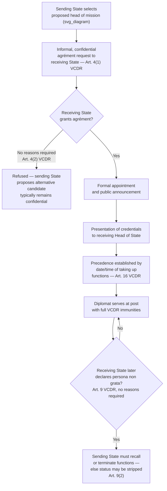

## Agrément and the Accreditation of Heads of Mission

### Theoretical Foundation

The establishment of a diplomatic mission and the appointment of its head involves a formal legal process governed principally by the **Vienna Convention on Diplomatic Relations (VCDR, 1961)**, which codified — and in places clarified or extended — pre-existing customary international law governing diplomatic intercourse. The theoretical premise underlying this process is that diplomatic relations, unlike many other forms of international engagement, require the **mutual and continuing consent** of both the sending and receiving states, not merely a unilateral decision by the sending state to dispatch a representative. This is a structurally different consent architecture from treaty-making consent (discussed in the preceding chapters): rather than a single act of ratification binding a state to an instrument, diplomatic accreditation involves a **screening and confirmation process** occurring before a specific individual is formally received, and this process can be — and periodically is — used by the receiving state as an instrument of diplomatic signaling, leverage, or protest, independent of the broader bilateral relationship's formal status.

**Define on first use**: **agrément** (French: "agreement" or "approval") is the formal, advance approval a receiving state gives to the sending state's proposed head of mission, prior to that individual's formal appointment and dispatch — it is the specific procedural device through which the receiving state exercises its right to reject a proposed envoy before that individual is committed to the position, avoiding the diplomatic embarrassment of a formal appointment being publicly refused after the fact.

### Legal Basis: Article 4 VCDR

**Article 4(1) VCDR** establishes the core rule: "The sending State must make certain that the agrément of the receiving State has been given for the person it proposes to accredit as head of the mission to that State." This is phrased as an obligation on the *sending* state — it is the sending state's responsibility to secure agrément before proceeding with a formal appointment, not the receiving state's obligation to proactively vet candidates it has not yet been asked about.

**Article 4(2) VCDR** supplies the corresponding, and diplomatically significant, rule governing the receiving state's response: "The receiving State is not obliged to give reasons to the sending State for a refusal of agrément." This provision is deliberately structured to preserve the receiving state's discretion as close to absolute as international law permits in this context — a receiving state may decline a proposed head of mission without any obligation to explain, justify, or even substantiate its refusal, which is precisely what makes agrément an effective, low-friction diplomatic tool: the receiving state need not construct a formal case or risk an evidentiary dispute; declining to give agrément is, procedurally, simply silence or a bare refusal.

This structure reflects a deliberate policy balance: allowing a receiving state unreviewable discretion over agrément preserves that state's sovereign control over who represents a foreign power on its territory (a matter with obvious security, political, and protocol sensitivity), while the norm's informal, pre-appointment character — occurring before any public announcement or formal credentialing — allows both states to avoid the greater diplomatic damage that would result from a public, formal rejection of an already-announced ambassador.

### Mechanism: The Agrément Process in Practice

The practical sequence, developed through customary diplomatic practice consistent with Article 4's framework, typically proceeds as follows: the sending state, through its foreign ministry or its existing mission in the receiving state, informally communicates the name and a brief biographical profile (a "note verbale" or informal diplomatic note) of its proposed head of mission to the receiving state's foreign ministry, *before* any public announcement or formal appointment is made. The receiving state then reviews the proposal — considering the candidate's background, any history of statements or conduct the receiving state finds objectionable, the candidate's suitability generally, and broader considerations of the bilateral relationship — and responds, typically within a period ranging from a few weeks to, in some cases, considerably longer, either granting agrément (allowing the sending state to proceed to formal appointment) or declining to do so.

Because Article 4(2) permits refusal without reasons, and because the process occurs before public announcement, an agrément refusal frequently never becomes public at all — the sending state simply proposes a different candidate, and the episode leaves no formal diplomatic record accessible to outside observers. This confidentiality is itself a structural feature enabling the mechanism's diplomatic utility: both states can manage a sensitive personnel disagreement without generating a public diplomatic incident, preserving the broader relationship even where a specific candidate proves unacceptable.

### Mechanism: Persona Non Grata as the Post-Accreditation Analog

Where agrément operates as a *pre-appointment* screening mechanism, **Article 9 VCDR** provides the corresponding mechanism available *after* a diplomat has already been accredited and is serving at post: the receiving state may, "at any time and without having to explain its decision," notify the sending state that the head of the mission or any member of the mission's diplomatic staff is **persona non grata** (Latin: "person not welcome") or that any other member of the staff is not acceptable. Article 9(1) further provides that in such a case, the sending state must, as appropriate, either recall the person concerned or terminate their functions with the mission; and Article 9(2) provides that if the sending state refuses or fails within a reasonable period to carry out its obligations, the receiving state may refuse to recognize the person concerned as a member of the mission — effectively stripping the individual of diplomatic status and the protections that accompany it.

The agrément/persona non grata pairing thus provides a complete pre- and post-accreditation toolkit: agrément allows the receiving state to prevent an unwanted appointment before it occurs; persona non grata allows it to terminate an already-accredited diplomat's status at any subsequent point, again without any obligation to state reasons. Both mechanisms share the deliberate design feature of not requiring justification, which — as with agrément — is precisely what gives persona non grata declarations their frequent use as a **diplomatic signaling tool** distinct from any genuine security or conduct concern: states have long used reciprocal or retaliatory persona non grata declarations (often in response to a similar action or an unrelated diplomatic dispute) as a lower-cost alternative to severing diplomatic relations entirely — a graduated response available on the spectrum between full normal relations and complete rupture.

### Case Illustration: Reciprocal Expulsions Following the 2018 Skripal Poisoning

The mass, coordinated expulsions of Russian diplomats by the United Kingdom, the United States, and numerous European and allied states in March 2018, following the poisoning of former Russian intelligence officer Sergei Skripal and his daughter in Salisbury, England, illustrate persona non grata's function as a coordinated multilateral diplomatic-signaling instrument rather than solely a bilateral tool. Dozens of states, acting in political coordination though each formally exercising its own sovereign Article 9 discretion independently, declared numerous Russian diplomatic personnel persona non grata in a closely timed, publicly announced wave — Russia responded with reciprocal expulsions of Western diplomats from Moscow. This episode is frequently cited to illustrate both the *individual* state discretion Article 9 preserves (each state made its own determination and was not legally bound by others' actions) and the *coordinated signaling* function persona non grata declarations can serve when multiple states choose to act in political parallel, converting what is formally a bilateral, unreviewable sovereign discretion into a tool of collective diplomatic pressure.

### Related Concept: Heads of Mission Classification and Precedence

**Article 14 VCDR** establishes that heads of mission are divided into three classes: (a) ambassadors or nuncios accredited to Heads of State, and other heads of mission of equivalent rank; (b) envoys, ministers, and internuncios accredited to Heads of State; and (c) chargés d'affaires accredited to Ministers for Foreign Affairs. Article 14(2) specifies that, except as concerns precedence and etiquette, there shall be no differentiation between heads of mission by reason of their class — meaning the substantive diplomatic functions and immunities of an ambassador and a chargé d'affaires are, as a legal matter, essentially equivalent; the classification chiefly affects **precedence** (the formal order in which heads of mission are ranked at official functions) and ceremonial protocol, not the underlying scope of diplomatic privilege. **Article 16 VCDR** establishes that precedence within each class is determined by the date and time each head of mission took up their functions — typically the date of presentation of credentials — establishing an objective, chronological rule rather than one based on the sending state's relative power or status, which avoids a recurring source of protocol friction that a status-based precedence rule would generate.

### Tactical Implications for the Negotiator/Diplomat

- **Agrément should be pursued discreetly and with realistic expectations about the receiving state's unreviewable discretion.** Because Article 4(2) permits refusal without reasons, a sending state proposing a head of mission should recognize that a refusal — however politically or personally frustrating — carries no formal recourse or appeal, and the appropriate response is typically to propose an alternative candidate quietly rather than to seek an explanation the receiving state is under no obligation to provide.
- **The informal, pre-public nature of the agrément process is itself a valuable diplomatic tool and should be preserved.** A sending state that prematurely announces a proposed head of mission before securing agrément risks converting what would otherwise be a quiet, low-cost candidate substitution into a public diplomatic embarrassment if agrément is subsequently refused — careful sequencing (securing agrément before any public announcement) is a basic but consequential procedural discipline.
- **Persona non grata declarations should be understood as carrying signaling value independent of, and often disproportionate to, the specific conduct cited (or not cited) as justification.** A diplomat or negotiator assessing a persona non grata action — whether their own state's or another's — should consider the broader political context and any coordinated multilateral pattern (as in the 2018 Skripal case) rather than treating the action in isolation, since Article 9's no-reasons-required structure means the declared justification, where one is offered informally through public statements, may not reflect the full or actual rationale.

### Diagram: Agrément and Accreditation Sequence

**Related Topics**

- Article 9 VCDR persona non grata as the post-accreditation counterpart to agrément
- Article 14 and Article 16 VCDR head-of-mission classification and precedence rules
- Diplomatic immunity and inviolability under Articles 29–31 VCDR
- Coordinated multilateral expulsions as a graduated diplomatic-signaling tool (2018 Skripal case)
- Chargé d'affaires ad interim and mission continuity during accreditation gaps
- Consular accreditation (exequatur) as the distinct consular-relations analog under the VCCR