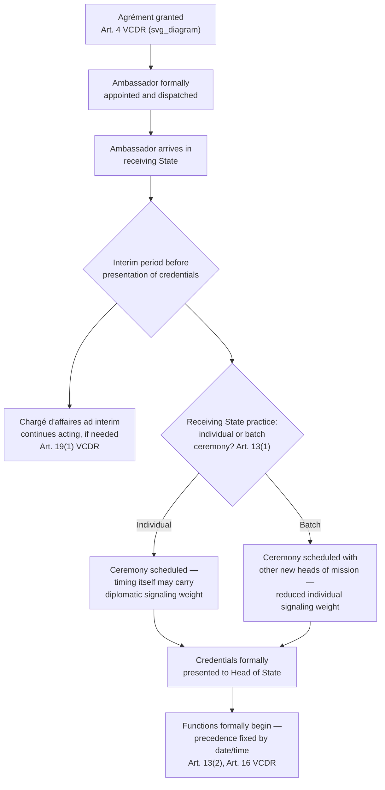

## Presentation of Credentials and Its Signaling Function

### Theoretical Foundation

Recall that agrément (the receiving state's advance approval of a proposed head of mission under Article 4 VCDR) resolves the question of *whether* an individual may be accredited, and that precedence among heads of mission is fixed by the date and time each took up their functions under Article 16 VCDR. The **presentation of credentials** is the specific formal ceremony that operationalizes both of these prior steps: it is the ceremonial act by which a newly agréed head of mission formally delivers their **letters of credence** (the sending Head of State's formal written authorization identifying the individual as their diplomatic representative) to the receiving Head of State, and it is this act — not the earlier agrément, and not the diplomat's physical arrival in the receiving state — that most VCDR-consistent state practice treats as the operative moment from which the head of mission's functions, and consequently their precedence ranking, formally begin.

The theoretical significance of presentation of credentials extends well beyond its administrative function of establishing precedence, however. Because it is typically the first, and often the only, formal occasion on which a newly arrived ambassador meets the receiving Head of State directly, the ceremony carries substantial **signaling value**: the manner, timing, formality, and surrounding circumstances of a credentials presentation are closely observed by diplomatic communities and, in politically sensitive cases, by domestic and international media, as indicators of the state of bilateral relations independent of what either government's official statements convey.

### Legal Basis: Article 13 VCDR

**Article 13(1) VCDR** provides that the head of a mission is considered as having taken up their functions in the receiving state either when they have presented their credentials, or when they have notified their arrival and a true copy of their credentials has been presented to the Ministry for Foreign Affairs of the receiving state, or such other ministry as may be agreed, "in accordance with the practice prevailing in the receiving State which shall be applied in a uniform manner." This provision deliberately accommodates variation in receiving-state practice — some states require the full ceremonial ceremony before the Head of State personally as the operative act; others permit an earlier, more administrative step (submission of credentials, or a certified copy, to the foreign ministry) to establish the formal start of functions, with the full ceremonial presentation to the Head of State following at a later, sometimes considerably delayed, date. Article 13's requirement that the chosen practice be applied "in a uniform manner" is significant: a receiving state may not selectively accelerate or delay the credentialing process for different sending states' representatives as a matter of arbitrary discretion — whatever domestic practice a receiving state adopts must be applied consistently across all incoming heads of mission, preserving the objective, non-discriminatory character of the precedence system Article 16 establishes.

**Article 13(2)** provides that the order of presentation of credentials, or of the notification procedure described above, is determined by the date and time of the head of mission's arrival — meaning that even the sequence in which diplomats present their credentials (relevant where several new ambassadors arrive in close succession) follows an objective chronological rule rather than any assessment of relative status or importance among sending states.

### Mechanism: The Delay Between Arrival and Presentation as a Diplomatic Signal

Because Article 13(1) permits (depending on receiving-state practice) a distinction between the date functions are formally considered to have begun and the date of the full ceremonial presentation before the Head of State, and because in many states considerable time can elapse between a new ambassador's physical arrival and the scheduling of the formal ceremony, the **length of this delay itself frequently functions as an informal diplomatic signal**, closely watched by the diplomatic corps and, in cases involving politically significant bilateral relationships, by outside observers. A receiving state that schedules a new ambassador's credentials ceremony promptly signals normal, cordial relations and a desire to proceed with the bilateral relationship without friction; a receiving state that delays the ceremony substantially — sometimes for many months — without formal explanation (consistent with the same no-reasons-required discretion that characterizes agrément and persona non grata determinations) is frequently read by diplomatic observers as signaling displeasure, a cooling of relations, or leverage-seeking behavior tied to an unrelated bilateral dispute, even where the receiving state offers only administrative or scheduling explanations for the delay.

This informal signaling dynamic exists precisely because the VCDR imposes no fixed timeline within which a receiving Head of State must grant a credentials ceremony once agrément has already been given and the diplomat has arrived — the absence of a hard legal deadline creates the interpretive space within which delay itself becomes meaningful diplomatic communication, in much the same way that agrément refusal's lack of a reasons requirement (Article 4(2)) creates space for the refusal itself, rather than any stated justification, to carry the message.

### Mechanism: Group Presentation and Batch Ceremonies

Receiving-state practice varies considerably regarding whether credentials are presented individually, in a one-on-one ceremony between the new ambassador and the Head of State, or in **batch ceremonies** where several newly arrived heads of mission present credentials to the Head of State on the same occasion, sometimes in immediate succession. States that favor batch ceremonies (a practice followed, for instance, by the United Kingdom, where new ambassadors present credentials to the Sovereign, and by numerous other monarchies and republics alike as an administrative efficiency measure) reduce the individual signaling weight any single ceremony carries, since the occasion is understood by convention to be a routine administrative batch process rather than an occasion specifically convened for, or delayed for, any single ambassador. By contrast, in receiving states where each credentials presentation is conducted as an individually scheduled, standalone ceremony, the scheduling of any single ambassador's ceremony — and particularly any departure from the pace at which other recently arrived ambassadors' ceremonies were scheduled — carries correspondingly greater potential signaling weight, since comparison across cases becomes more readily observable to the diplomatic community.

### Case Illustration: Credentials Ceremonies as a Site of Reciprocal Protest

Credentials presentation ceremonies and their surrounding formalities (public remarks exchanged at the ceremony, the level of ceremonial honors accorded, or explicit delay) have periodically been used by receiving states as venues for expressing displeasure with a sending state's conduct without resorting to the more drastic step of declining agrément altogether or later declaring the ambassador persona non grata. Because the credentials ceremony is typically the first formal head-of-state-level engagement with a newly arrived ambassador, a receiving Head of State's choice of remarks, or a deliberately understated ceremonial treatment relative to customary practice, allows the receiving state to register a pointed but calibrated signal — one considerably less severe than agrément refusal (which prevents the appointment from proceeding at all) or persona non grata (which terminates an already-serving diplomat's status), but still clearly legible to the diplomatic community as an expression of a strained bilateral relationship. This calibrated-signaling function situates credentials presentation, alongside agrément and persona non grata, as part of a broader continuum of formal diplomatic tools states use to communicate relationship status through *procedural and ceremonial* choices rather than through explicit public statements — a pattern consistent with diplomatic practice's general preference for indirect, plausibly-deniable signaling over direct public confrontation wherever the underlying relationship is not yet at the point of full rupture.

### Related Concept: Chargé d'Affaires ad interim During the Pre-Presentation Period

Because a head of mission's functions, under Article 13, are not considered to have formally begun until credentials presentation or the equivalent notification procedure, a mission does not become without formal leadership merely because its designated new ambassador has arrived but not yet presented credentials, nor during any gap between a departing ambassador's departure and a successor's arrival and credentialing. **Article 19(1) VCDR** addresses this: if the post of head of mission is vacant, or if the head of mission is unable to perform their functions, a **chargé d'affaires ad interim** (typically the mission's deputy head or another senior mission officer, whose name is communicated to the receiving state's foreign ministry, either by the head of mission or, if unable, by the sending state's foreign ministry) acts provisionally as head of mission, ensuring continuity of the mission's formal diplomatic representation throughout any gap in fully accredited ambassadorial leadership — including, relevantly, the period between a new ambassador's arrival and their formal presentation of credentials, where receiving-state practice treats presentation itself (rather than notification) as the operative commencement of functions.

### Tactical Implications for the Negotiator/Diplomat

- **A newly arrived ambassador should manage expectations about the credentials-ceremony timeline realistically, and should treat any unusual delay as information, not merely inconvenience.** Because Article 13 leaves the specific procedural practice, and any associated timeline, to receiving-state discretion, a sending state's diplomatic personnel should monitor whether a delay in scheduling the ceremony is consistent with the receiving state's recent treatment of other newly arrived ambassadors (suggesting routine administrative pacing) or is anomalous relative to that baseline (suggesting a deliberate signal), since this comparison is often the most reliable available evidence distinguishing routine delay from intentional diplomatic messaging.
- **The choice of individual versus batch credentialing practice should inform how a sending state interprets ceremonial details.** In receiving states that conduct batch ceremonies as routine administrative practice, a sending state should generally avoid over-interpreting the ceremony's timing or format as bilateral-relationship-specific signaling; in receiving states that conduct individualized ceremonies as standard practice, comparatively greater interpretive weight attaches to any departure from recent precedent.
- **Ceremonial remarks and honors at a credentials presentation warrant careful preparation precisely because the occasion functions as a calibrated signaling venue.** A sending state's diplomatic and protocol staff should treat the content and tone of a newly accredited ambassador's own remarks at the ceremony, and anticipate the register of the receiving Head of State's likely response, with the same care given to more overtly substantive diplomatic communications, since the ceremony's public or quasi-public character means its content can carry interpretive weight for the broader diplomatic community and, in higher-profile cases, the media.

### Diagram: Presentation of Credentials Within the Accreditation Sequence

**Related Topics**

- Article 4 VCDR agrément as the pre-appointment approval preceding credentials presentation
- Article 16 VCDR precedence rules and their dependence on the date functions begin
- Article 19 VCDR chargé d'affaires ad interim and mission continuity
- Article 9 VCDR persona non grata as a post-accreditation signaling tool on the same continuum
- Comparative receiving-state practice: individual versus batch credentialing ceremonies
- Letters of credence as a distinct instrument from full powers under treaty-negotiation practice