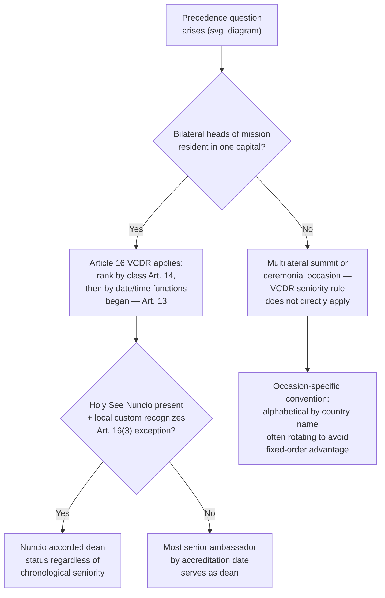

## Order of Precedence and the Avoidance of Unintended Slights

### Theoretical Foundation

Recall that Article 16 VCDR fixes precedence among heads of mission within each class by the objective, chronological criterion of the date and time each took up their functions, rather than by any assessment of the sending state's relative power, wealth, or political importance. This chronological rule is best understood as a deliberate solution to a specific and historically consequential diplomatic problem: prior to its widespread adoption, precedence disputes among competing ambassadors — each representing a sovereign whose dignity the ambassador was understood to personify — were a recurring and genuinely destabilizing source of diplomatic friction, since any precedence system based on the relative rank or status of sending states inevitably requires someone to rank sovereigns against one another, an exercise no diplomatic system has ever been able to perform without generating persistent, unresolvable resentment among the states ranked lower. The chronological, "first come, first served" rule sidesteps this problem entirely by substituting an objective, verifiable, and — crucially — **status-neutral** criterion for one that would otherwise require an inherently contestable judgment about relative sovereign dignity.

Precedence, properly understood, is not merely a ceremonial nicety but a formal legal and protocol framework with genuine functional purpose: it determines seating arrangements at state functions, the order of formal receiving lines, the sequence in which ambassadors are invited to speak or are acknowledged at multilateral or ceremonial occasions, and numerous other practical questions that arise constantly in the operation of a diplomatic corps resident in any capital. Because these questions arise routinely and often on short notice (organizing a state dinner, a national day reception, a multilateral summit's protocol arrangements), having a clear, objective, and — ideally — self-executing rule avoids the alternative, in which each occasion would require a fresh, potentially contentious determination.

### Legal Basis: Article 16 VCDR and the Historical Congress of Vienna Background

**Article 16(1) VCDR** provides that heads of mission take precedence in their respective classes (as established under Article 14, discussed in relation to agrément and accreditation) in the order of the date and time at which they took up their functions in accordance with Article 13 — meaning precedence within, for instance, the ambassadorial class is determined purely by seniority of accreditation, the longest-serving ambassador in that class ranking first, the most recently accredited ranking last, regardless of the size, wealth, or geopolitical significance of the sending states involved.

This VCDR codification builds directly on a considerably older diplomatic settlement: the **Congress of Vienna's 1815 Règlement concernant le rang entre les Agents Diplomatiques** (Regulation concerning the rank of diplomatic agents), and its 1818 supplement agreed at the Congress of Aix-la-Chapelle, are generally credited as the foundational modern codification resolving what had been centuries of often bitter and occasionally violent precedence disputes among European courts — disputes that in earlier eras had generated serious diplomatic incidents over questions as apparently minor as which ambassador's carriage should proceed first in a ceremonial procession, or whose seal should be affixed above another's on a joint instrument. The Vienna Congress settlement established the classification of diplomatic agents into ranked categories (a precursor to VCDR Article 14's three classes) and the principle of precedence by seniority of accreditation within each category — a framework the 1961 VCDR substantially preserved and gave more precise contemporary legal form.

**Article 16(2) VCDR** addresses a related question: alterations in a Head of Mission's letters of credence not involving a change of class do not affect their precedence — meaning routine credentialing updates do not reset the seniority clock, preserving the stability the system is designed to achieve. **Article 16(3)** provides that Article 16 is without prejudice to any practice accepted by the receiving state regarding the precedence of the representative of the Holy See — a specific, narrow exception reflecting long-standing European ceremonial custom according the Papal Nuncio a position of honorary primacy (dean of the diplomatic corps, discussed below) in many, though not all, Catholic-majority or historically Catholic states, independent of the Nuncio's actual seniority of accreditation under the ordinary chronological rule.

### Mechanism: The Dean of the Diplomatic Corps

A closely related institution, not itself directly codified in the VCDR but arising from consistent state practice building on the Article 16 precedence framework, is the **dean (or doyen) of the diplomatic corps**: conventionally, the most senior ambassador by date of accreditation within the highest class present in a given capital, who by custom (rather than binding legal obligation) serves as the informal representative and spokesperson of the resident diplomatic corps in its collective dealings with the receiving state's government — for instance, delivering collective remarks or greetings on behalf of the assembled diplomatic corps at major state ceremonial occasions, or serving as an informal channel of communication when the diplomatic corps as a body wishes to raise a shared concern with the receiving state's foreign ministry. As noted above, in many states with historic ties to the Roman Catholic Church, ceremonial custom accords the Apostolic Nuncio (the Holy See's diplomatic representative) automatic dean status regardless of the Nuncio's actual chronological seniority, consistent with the Article 16(3) exception — a practice followed in numerous Latin American, and several European, states, though by no means universally observed outside states with a significant historical Catholic ceremonial tradition.

The dean's role, while informal and carrying no independent VCDR legal authority beyond ordinary diplomatic status, has genuine practical significance precisely because it provides receiving states with a single, recognized point of contact for corps-wide protocol or logistical matters, avoiding the need to coordinate individually with every resident mission for routine matters affecting the diplomatic corps collectively.

### Mechanism: Precedence at Multilateral and Ceremonial Occasions

Beyond the bilateral head-of-mission context Article 16 directly addresses, precedence questions recur with particular acuteness at **multilateral summits, international conferences, and large ceremonial state occasions**, where representatives of numerous states must be seated, introduced, or sequenced in some determinate order, and where the bilateral VCDR seniority-by-accreditation rule does not straightforwardly apply (since the individuals present may not all be resident heads of mission accredited to the host state, but visiting heads of state, heads of government, or ministers attending for the specific occasion). In these settings, host states and international organizations typically apply supplementary, occasion-specific protocol conventions — commonly **alphabetical ordering by country name** (in a designated working language, or rotating among the organization's official languages to avoid systematically favoring states whose names begin with early alphabet letters), a convention widely used at UN General Assembly sessions and numerous other multilateral gatherings specifically because it is manifestly neutral and avoids any implication of ranking sovereign states by relative importance. Rotating alphabetical order (where the starting letter rotates by lot or by scheduled sequence from one session to the next) further avoids even the residual advantage a fixed alphabetical order would give to states whose names happen to begin with early letters in the chosen working language.

### Case Illustration: Precedence Disputes as Recurring Diplomatic Friction Points

Notwithstanding the VCDR's clear codification, precedence and seating disputes remain a recurring, if usually minor and quickly resolved, category of diplomatic friction in contemporary practice — disputes over whether a particular head of state or minister was seated at an appropriately senior position relative to counterparts at a summit, or whether a receiving state's protocol office correctly applied seniority rules in a state ceremonial lineup, periodically surface as minor diplomatic incidents, occasionally generating public commentary or informal protest through diplomatic channels even where no formal VCDR violation is alleged. Such disputes illustrate that even a well-codified, objective precedence rule does not eliminate the underlying sensitivity precedence questions carry — because ambassadors and other state representatives are understood, by longstanding diplomatic convention, to personify the dignity of their sending sovereign in a formal ceremonial sense, questions of relative ceremonial placement retain symbolic weight considerably disproportionate to their practical consequence, and protocol offices in most foreign ministries maintain considerable institutional expertise and procedural care specifically to minimize the risk of even unintentional precedence errors, recognizing that a receiving state's protocol mistake, however unintentional, may be read by an affected sending state as a deliberate slight.

### Tactical Implications for the Negotiator/Diplomat

- **A receiving state's protocol office should treat precedence administration as a matter of genuine diplomatic consequence, not mere administrative housekeeping.** Because an inadvertent precedence error can be perceived by an affected sending state as an intentional slight regardless of the receiving state's actual intent, meticulous, well-documented tracking of each head of mission's exact date and time of accreditation (per Article 13's operative-commencement rule) is a low-cost but diplomatically significant administrative discipline.
- **A sending state's diplomatic personnel should understand precedence as a genuinely objective, non-negotiable framework, and should generally avoid treating routine precedence outcomes as diplomatically meaningful in themselves.** Because Article 16's chronological rule is deliberately status-neutral, a lower precedence ranking reflects only the ambassador's more recent accreditation date, not any assessment of the sending state's relative importance — diplomatic personnel new to a posting benefit from understanding this distinction clearly, to avoid misreading a routine seniority-based outcome as an intended signal.
- **At multilateral occasions where alphabetical or other occasion-specific protocol conventions apply rather than the bilateral VCDR seniority rule, negotiators should confirm the specific convention in advance** (including which language's alphabetization applies, and whether rotation is in use) rather than assuming the bilateral precedence framework transfers directly to a multilateral ceremonial context, since the two systems operate on entirely different logics.
- **The dean of the diplomatic corps can be a valuable informal channel for a newly arrived ambassador seeking guidance on local protocol custom**, particularly in capitals where ceremonial practice includes elements (such as the Holy See exception) not fully captured in the VCDR's general text, and cultivating this relationship early in a posting is a low-cost way to reduce the risk of inadvertent protocol missteps.

### Diagram: Precedence Determination Across Contexts

**Related Topics**

- Article 13 VCDR and the operative commencement of a head of mission's functions
- Article 14 VCDR classification of heads of mission into three classes
- The 1815 Congress of Vienna Règlement as the historical foundation of modern precedence rules
- The dean of the diplomatic corps and its informal but functionally significant protocol role
- Rotating alphabetical seating conventions in UN and multilateral summit practice
- Presentation of credentials as the triggering event for precedence calculation