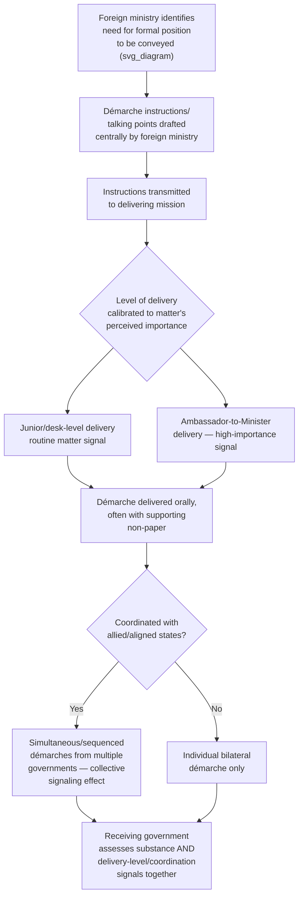

## The Démarche as a Formal Instrument of Diplomatic Communication

### Theoretical Foundation

Diplomatic communication occurs across a wide spectrum of formality, ranging from unminuted informal conversation between diplomatic personnel to the fully codified instruments of treaty law already examined. The **démarche** occupies a specific, well-defined position on this spectrum: it is a formal diplomatic representation or approach made by one government to another, typically delivered orally by a diplomat (frequently an ambassador or senior mission officer) to an official of the receiving state's foreign ministry, communicating the sending government's official position, concern, request, or protest on a specific matter, and often accompanied by a supporting **non-paper** or **note verbale** (discussed below) that documents the substance of the communication in writing without itself constituting a formally signed diplomatic note.

**Define on first use**: a **démarche** (French: "step" or "approach") is a formal diplomatic communication, delivered through official channels, by which one government conveys its position on a specific matter to another government — distinguished from ordinary diplomatic conversation by its official, authorized, and recorded character, and from a formal diplomatic note by typically being delivered orally (though often summarized or reinforced in writing) rather than through the fully formal written-and-signed note procedure.

The theoretical function of the démarche is to occupy a deliberate middle ground in the diplomatic escalation ladder: it is more formal, more clearly attributable to considered government policy, and more likely to be recorded and reported through both governments' internal channels than an informal conversation, yet it remains considerably less formal, less public, and less escalatory than a public statement, a formal diplomatic protest note, or more drastic measures such as recalling an ambassador for consultations or declaring a diplomat persona non grata. This intermediate positioning is precisely what gives the démarche its practical utility: it allows a government to register a position clearly, officially, and on the record, while preserving the option to escalate further if the démarche does not produce the desired response, and while avoiding the greater diplomatic cost and reduced flexibility a public statement or formal note would entail.

### Mechanism: Structure and Delivery of a Démarche

A démarche is typically structured around a set of prepared **talking points** or **démarche instructions**, drafted by the sending government's foreign ministry (or, in some structures, by a relevant functional or regional bureau within it) and transmitted to the diplomatic mission tasked with delivering the démarche, specifying precisely what points the diplomat is authorized to convey, in what order, and with what degree of emphasis or flexibility for elaboration. This centralized drafting and authorization process is a deliberate control mechanism: because a démarche is understood by the receiving government to represent the sending government's official, considered position — not the personal view of the delivering diplomat — foreign ministries maintain careful control over démarche content precisely to ensure consistency between what is said in the field and what the government's actual policy position is, avoiding the risk that an improvised or imprecisely worded oral communication could be read by the receiving government as conveying a policy commitment or nuance the sending government did not intend.

The démarche is typically delivered in a scheduled meeting between the delivering diplomat and an appropriate counterpart official at the receiving state's foreign ministry — the specific level of the receiving official (a desk officer, a director, a deputy minister, or in the most serious cases the foreign minister personally, or even the head of state) is itself a signal of the démarche's perceived importance and the sending government's assessment of how seriously the matter should be treated, following a similar signaling logic to that observed in credentials-ceremony scheduling and precedence more generally. The démarche is frequently, though not invariably, accompanied by a **non-paper** — an unsigned, unattributed written document summarizing the démarche's substantive points, provided to the receiving official as a reference aid — the "non-paper" designation signals that the document, while substantively authoritative in content, is not a formal diplomatic note requiring the procedural handling (registration, formal written response expectations) that a signed note would trigger, preserving some of the informality and flexibility the démarche format is chosen to achieve even while providing a written record.

### Mechanism: Distinguishing the Démarche from Adjacent Instruments

The démarche should be distinguished carefully from several adjacent diplomatic communication forms with which it is sometimes conflated:

- **The diplomatic note (or note verbale)** is a formal written communication between missions or between a mission and the receiving state's foreign ministry, traditionally drafted in the third person, unsigned (hence "note verbale," literally "verbal note," despite being a written instrument — a terminological artifact reflecting its historical function as recording what would otherwise have been communicated orally), and following established formal conventions of diplomatic correspondence. A note verbale is a more formal, more procedurally fixed instrument than a démarche's típically oral delivery, and where a démarche is accompanied by a non-paper rather than a formal note, this is itself a deliberate choice to remain in a less procedurally binding communicative register.
- **A formal protest note** is a specific category of diplomatic note (or, in the most serious cases, a démarche delivered at a senior level) explicitly registering the sending government's objection to specific conduct by the receiving government, and frequently reserving the sending government's rights or explicitly stating that the matter may be escalated further if not addressed — carrying a more explicitly adversarial tone than an ordinary démarche, which may simply convey a position or request without framing it as a protest.
- **A summons** (sometimes described using the French term "convocation") refers to the receiving government's act of calling in a foreign ambassador or other mission official to receive a communication (often itself in the nature of a démarche or protest) from the receiving government — the directional inverse of a démarche delivered by a visiting diplomat, and itself carrying signaling weight, since being summoned (rather than the receiving official simply accepting a scheduled meeting requested by the sending mission) is generally understood as a more pointed, less routine diplomatic act.

### Mechanism: The Démarche as an Instrument of Coordinated Multilateral Pressure

Démarches are frequently used not merely as a bilateral instrument but as a coordinated multilateral one, particularly within alliance or regional-organization contexts: multiple states, acting in political coordination (though each formally delivering its own démarche as a sovereign act, analogous to the coordinated-but-individually-sovereign structure observed in the 2018 Skripal-related persona non grata expulsions), may deliver simultaneous or closely sequenced démarches to a common target state, conveying a shared position with the deliberate signaling effect of demonstrating coordinated concern or disapproval across multiple governments rather than an isolated bilateral position. The **European Union's coordinated démarche practice**, in which EU member states' missions (sometimes joined by like-minded non-EU states) deliver aligned démarches on human rights, non-proliferation, or other common EU foreign-policy positions, is a frequently cited example of this coordinated-multilateral démarche function, illustrating how an instrument originally conceived as a bilateral tool has been adapted to serve collective diplomatic signaling purposes within structured multilateral coordination frameworks.

### Tactical Implications for the Negotiator/Diplomat

- **The choice of démarche versus a more formal instrument (a diplomatic note, a public statement) is itself a substantive decision about escalation posture, and should be made deliberately.** A government wishing to register a position firmly but without foreclosing flexibility, and without generating the greater attributional weight and procedural formality of a written, signed note, has a genuine strategic reason to prefer the démarche format — while a government wishing to create an unambiguous, formally documented record (for instance, to preserve a legal position or build a record for potential future use) may prefer the more formal note verbale or protest note instead.
- **The level at which a démarche is delivered, and the level of the receiving official to whom it is addressed, functions as an independent signal layered on top of the démarche's substantive content**, following the same signaling logic already observed in credentials-ceremony timing and persona non grata practice — a démarche delivered by an ambassador personally to a foreign minister carries materially greater signaling weight than the same substantive content delivered by a junior mission officer to a desk-level counterpart, and this level should be calibrated deliberately to match the sending government's actual assessment of the matter's importance.
- **Démarche instructions require the same drafting discipline as more formal diplomatic instruments, given the risk of misattribution.** Because a démarche is understood by the receiving government as conveying the sending government's official, considered position, a delivering diplomat's improvisation beyond authorized talking points — even where well-intentioned — risks creating a diplomatic record the sending government did not intend and may later need to walk back, at some cost to credibility.
- **Coordinated multilateral démarches should be assessed for their signaling value as a coordinated action, not merely their individual bilateral substance.** A target state receiving démarches from multiple aligned governments in close succession should recognize the deliberate signaling function of that coordination — and, conversely, a state organizing a coordinated démarche campaign should recognize that the coordination itself, not merely the démarches' individual content, is likely to be the primary signal received.

### Diagram: Démarche Preparation and Delivery Sequence

**Related Topics**

- Note verbale and formal diplomatic note conventions as the more procedurally formal alternative
- Non-papers as an informal but substantively authoritative written communication format
- Summons (convocation) as the receiving-state-initiated inverse of a démarche
- Coordinated EU démarche practice as an example of structured multilateral diplomatic signaling
- Persona non grata and ambassadorial recall as escalation points beyond the démarche
- Talking-points drafting discipline and the risk of unauthorized diplomatic improvisation