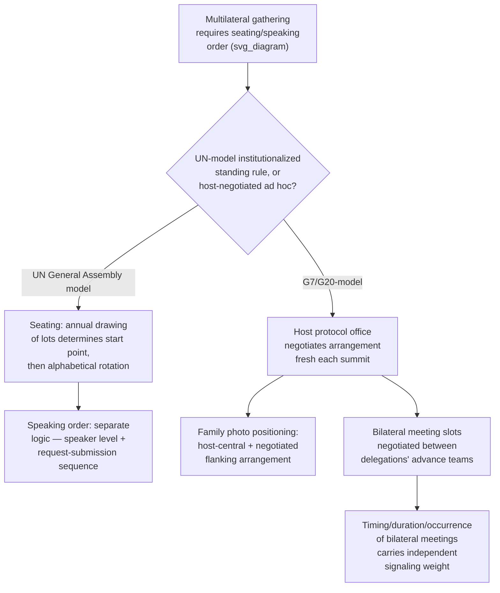

## Seating Plans and Speaking Order at Multilateral Summits

### Theoretical Foundation

Recall that Article 16 VCDR's chronological precedence rule resolves seniority disputes among resident heads of mission within a single receiving state, and that this bilateral framework does not directly extend to multilateral gatherings, where visiting heads of state, heads of government, or ministers attend for a specific occasion rather than holding ongoing accredited status in the host state. Multilateral summits therefore require a **distinct, occasion-specific protocol architecture** governing two related but analytically separate questions: the **seating plan** (the physical arrangement of delegations in plenary halls, at working sessions, and at ceremonial or social functions) and the **speaking order** (the sequence in which heads of delegation are recognized to address the assembly). Both questions raise the same underlying theoretical problem already encountered in bilateral precedence — the need for an objective, defensible, status-neutral allocation mechanism that avoids requiring the host or organizing body to make an inherently contestable judgment about the relative importance of participating states — but the solutions developed for the multilateral context differ structurally from the bilateral VCDR seniority rule precisely because a multilateral gathering typically has no equivalent of "date of accreditation" to serve as an objective allocating criterion.

### Mechanism: Alphabetical Rotation as the Dominant Convention

The most widely adopted solution, used extensively across UN bodies and numerous other multilateral organizations, is **alphabetical ordering by country name, with the starting point rotated between sessions**. The **UN General Assembly** determines seating order at the opening of each annual session by a **drawing of lots** (conducted by the Secretary-General, typically by having the President of the preceding session draw the name of a member state from a box), which determines which delegation occupies the front-row seat immediately to the right of the rostrum, with all other delegations then seated in English-alphabetical order proceeding from that starting point around the chamber. Because the starting point rotates by lot each year, no state permanently benefits or is disadvantaged by fixed alphabetical position (a state whose name begins with a letter early in the English alphabet would otherwise enjoy a persistent minor seating advantage under a static alphabetical system) — the annual redraw is a deliberate design feature ensuring that alphabetical position, while providing the needed objective ordering criterion, does not itself become a source of any state's durable relative advantage or disadvantage.

**Speaking order** in the UN General Assembly's General Debate follows a related but administratively distinct logic: rather than pure alphabetical sequence, the order is determined primarily by the level of the speaker (heads of state and government, by long-standing custom, generally speak before ministers or lower-level representatives) combined with the order in which delegations submit their request to speak, with the Secretariat's protocol office maintaining the resulting schedule — meaning speaking order in practice reflects a hybrid of seniority-of-representative-level and administrative sequencing rather than the seating chart's alphabetical-by-lot system, and the two orderings (who sits where, and who speaks when) are consequently not identical, a distinction protocol officers must track carefully since conflating the two systems is a recurring source of confusion for delegations less experienced with UN practice specifically.

### Mechanism: The G7, G20, and "Family Photo" Protocol

Smaller, more exclusive multilateral formats — the G7, G20, and similar leader-level summit structures — generally do not use the UN's alphabetical-rotation model, instead relying on **host-determined protocol arrangements** developed by the hosting government's protocol office for each specific summit, since these smaller formats lack the UN's institutionalized, standing seating-and-speaking rules and instead recreate protocol arrangements anew for each summit under the rotating presidency's direction. The recurring **"family photo"** — the group photograph of assembled heads of state and government customary at the opening of such summits — is itself a significant protocol exercise: positioning within the family photo (center positions generally understood as more prominent than flanking positions, and the host leader conventionally occupying the central position by virtue of hosting) is typically determined by a combination of host-state prerogative, the summit's specific membership composition for that year (rotating presidencies, invited guest states, and international-organization representatives who may or may not be included in the core family photo depending on the summit's specific format), and, in some cases, a modified alphabetical or seniority-based ordering applied around the host's central position. Because these smaller-format summits lack the UN's codified, decades-old standing rule, protocol arrangements for each summit are negotiated and finalized by the host's protocol office in the weeks and days preceding the event, in consultation with each participating delegation's own protocol staff, making pre-summit protocol negotiation a genuine, if usually low-visibility, diplomatic exercise in its own right.

### Mechanism: Bilateral Meeting Sequencing at Multilateral Summits

A related, and frequently more diplomatically consequential, protocol question arising at multilateral summits concerns the **sequencing and allocation of bilateral meetings** conducted on the margins of the main multilateral proceedings — the individual bilateral sessions between pairs of attending leaders that occur alongside, rather than as part of, the summit's formal plenary sessions. Because summit schedules are tightly constrained and every attending leader's time is a genuinely scarce resource, the allocation of bilateral meeting slots (which pairs of leaders meet at all, at what point in the schedule, and for how long) is negotiated in advance between the respective delegations' advance teams, and both the fact of a particular bilateral meeting occurring (or conspicuously not occurring) and its scheduling within the summit's overall sequence frequently carry signaling weight closely analogous to the signaling dynamics already observed in credentials-ceremony timing and démarche delivery level — a bilateral meeting granted early in a summit's schedule, or extended beyond its initially allotted time, is often read by observers as indicating warmer relations or higher priority than one scheduled at the margins of the summit's final hours, or one that fails to materialize despite advance speculation that it would occur.

### Case Illustration: The UN General Assembly's Institutionalized Alphabetical-Lot System

The UN General Assembly's seating system, formalized through Rule 28 of its Rules of Procedure and consistent practice since the Assembly's earliest sessions, is frequently cited as the paradigmatic example of a fully institutionalized, self-executing multilateral precedence solution — precisely because the drawing-of-lots mechanism removes any element of Secretariat or member-state discretion from the seating determination, making the outcome procedurally unimpeachable regardless of which state happens to draw the favorable or unfavorable starting position in a given year. This stands in instructive contrast to the more ad hoc, host-negotiated protocol arrangements characteristic of G7/G20-format summits, illustrating a broader point applicable across multilateral diplomatic architecture: **standing, self-executing rules** (of the kind Article 16 VCDR provides bilaterally, and the UN's alphabetical-lot system provides multilaterally) minimize recurring protocol friction and negotiation cost at the expense of some flexibility, while **host-negotiated, occasion-specific arrangements** (characteristic of G7/G20 formats) preserve flexibility to accommodate a particular summit's unique political circumstances at the cost of requiring fresh protocol negotiation, and the attendant risk of dispute or perceived slight, at each successive occasion.

### Tactical Implications for the Negotiator/Diplomat

- **A delegation's protocol staff should distinguish clearly between seating order and speaking order in UN and UN-model settings, since the two follow different allocation logics and conflating them is a recurring, avoidable error.** Advance briefing materials for a head of delegation attending a UN body should specify both separately rather than assuming the seating chart predicts the speaking sequence.
- **In host-negotiated summit formats (G7, G20, and similar), a delegation's advance protocol team should engage proactively and early with the host's protocol office, since seating and family-photo positioning in these formats is genuinely negotiated rather than mechanically determined**, and a delegation that engages passively risks less favorable positioning than one that actively advocates for its preferred arrangement within the bounds of the host's overall framework.
- **Bilateral meeting scheduling at multilateral summits should be treated as a significant, actively managed diplomatic negotiation in its own right, not a mere scheduling afterthought.** Given the genuine signaling weight bilateral meeting timing, duration, and even occurrence carry (following the same logic observed for credentials-ceremony delay and démarche delivery level), a delegation seeking to signal, or avoid signaling, particular relationship dynamics through summit-margin bilateral meetings should approach the scheduling negotiation with the same deliberateness applied to the meetings' substantive agenda.
- **A delegation new to a particular multilateral format should invest in understanding that format's specific protocol conventions in advance, since conventions vary substantially across institutions** — assuming UN-style alphabetical-lot conventions apply at a G7/G20-style summit, or vice versa, risks both practical scheduling confusion and, more seriously, inadvertent protocol missteps that could be read as unintended slights, echoing the broader precedence-sensitivity dynamics already discussed.

### Diagram: Multilateral Seating and Speaking Order Systems Compared

**Related Topics**

- UN General Assembly Rules of Procedure and the institutionalized drawing-of-lots mechanism
- Article 16 VCDR bilateral precedence as the analytical contrast to multilateral seating systems
- Advance-team diplomacy and pre-summit protocol negotiation practice
- Signaling functions of bilateral meeting scheduling, duration, and cancellation at summits
- The dean of the diplomatic corps and rotating summit presidencies as related seniority conventions
- Host-state prerogative in ad hoc protocol formats versus standing institutional rules