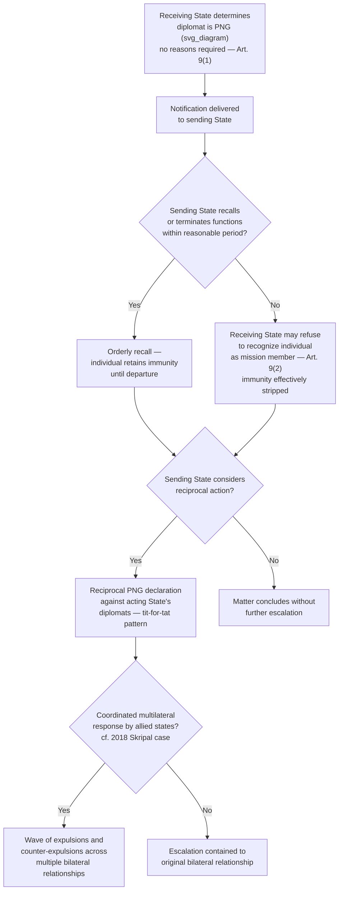

## Declaring a Diplomat Persona Non Grata

### Theoretical Foundation

Recall that a receiving state's control over which individuals may represent a foreign sovereign on its territory operates through a two-stage architecture: **agrément** (Article 4 VCDR) provides pre-appointment screening, allowing the receiving state to prevent an unwanted head of mission from being formally accredited in the first place, while **persona non grata** provides the corresponding post-accreditation mechanism, allowing the receiving state to terminate the diplomatic status of an individual already serving at post. Both mechanisms share a deliberate structural design feature — neither requires the receiving state to state reasons for its action — and both function, in practice, along the same spectrum between routine administrative discretion and pointed diplomatic signaling. Where agrément addresses the threshold question of *entry*, persona non grata addresses the distinct and often more diplomatically fraught question of *removal*, and because removal necessarily disrupts an already-functioning diplomatic relationship (unlike agrément refusal, which typically occurs quietly before any public commitment has been made), persona non grata declarations carry, as a structural matter, materially higher diplomatic stakes and visibility than agrément refusals typically do.

**Define on first use**: **persona non grata** (Latin: "person not welcome," commonly abbreviated **PNG** in diplomatic and academic usage) is the formal declaration by a receiving state that a specific individual — whether the head of mission or any other member of the mission's diplomatic staff — is no longer acceptable in their diplomatic capacity, triggering an obligation on the sending state either to recall that individual or terminate their functions with the mission.

### Legal Basis: Article 9 VCDR

**Article 9(1) VCDR** provides that the receiving state may, at any time and **without having to explain its decision**, notify the sending state that the head of the mission or any member of the mission's diplomatic staff is persona non grata, or that any other member of the mission's staff is not acceptable. In such a case, the sending state must, as appropriate, either recall the person concerned or terminate their functions with the mission. Article 9(1) further specifies that a person may be declared persona non grata or not acceptable **before arriving** in the territory of the receiving state — meaning the mechanism functions not only as a tool for removing an already-serving diplomat but also as a device for blocking a specific individual's arrival, in a manner functionally adjacent to, though legally distinct from, agrément refusal.

**Article 9(2) VCDR** supplies the enforcement mechanism: if the sending state refuses or fails within a reasonable period to carry out its Article 9(1) obligations, the receiving state may **refuse to recognize the person concerned as a member of the mission** — a consequence that, while stopping short of physical expulsion (which the VCDR does not itself authorize as an independent legal mechanism; a receiving state's practical removal of a non-cooperating individual proceeds instead through its ordinary domestic immigration or law-enforcement authority once diplomatic status and its attendant immunities are withdrawn), effectively strips the individual of the diplomatic immunities and privileges under Articles 29–31 VCDR that had previously shielded them, exposing them to the receiving state's ordinary domestic legal jurisdiction. This structural design — withdrawal of recognized status as the enforcement lever, rather than an express expulsion power — reflects the VCDR's general design pattern of relying on the interlocking incentive structure between recognition, immunity, and jurisdiction rather than granting receiving states an express police power over accredited diplomats.

The **"without having to explain its decision"** language in Article 9(1) closely parallels Article 4(2)'s identical no-reasons-required structure for agrément refusal, and this parallel is a deliberate feature of the Convention's overall architecture: both provisions preserve maximal receiving-state discretion at the two structurally analogous points (entry and removal) in a diplomat's tenure, and both derive the same practical consequence already discussed in relation to agrément — because no formal justification is required, any explanation a receiving state chooses to offer, whether through official statement or informal diplomatic channels, is understood by the diplomatic community as a discretionary communicative choice, not a legal requirement, and the explanation offered (or the absence of one) itself becomes part of the diplomatic signal.

### Mechanism: Grounds Commonly Cited for PNG Declarations, and Their Legal Non-Necessity

Although Article 9 imposes no legal requirement that a receiving state justify a persona non grata declaration, receiving states in practice frequently do offer some public or diplomatically-communicated rationale, both to shape domestic and international perception of the action and to signal intent to the sending state and third-party observers. Commonly cited grounds, drawn from recurring state practice, include: **espionage or intelligence activity** incompatible with diplomatic function (the most frequently cited formal justification in cases involving expulsion of intelligence officers operating under diplomatic cover); **conduct incompatible with diplomatic status** more broadly, including criminal conduct, serious breaches of local law, or personal conduct the receiving state deems unacceptable; **statements or actions deemed interference in the receiving state's internal affairs**; and — as the Skripal case and numerous other episodes illustrate — **retaliatory or reciprocal action** taken in response to another state's prior expulsion of the acting state's own diplomats, or in response to an unrelated bilateral or multilateral dispute, where the declared diplomat's individual conduct may be entirely incidental to the receiving state's actual motivation. Because Article 9 requires no evidentiary showing on any of these grounds, disputes over whether a PNG declaration was genuinely conduct-based or primarily political/retaliatory in character are, as a formal legal matter, generally unresolvable — the receiving state's discretion is, for practical purposes, unreviewable by any binding international mechanism, leaving political and diplomatic channels (protest, reciprocal action, bilateral negotiation) as the sending state's only available recourse.

### Mechanism: Reciprocity and Retaliatory Escalation Dynamics

Because persona non grata declarations are formally unilateral and unreviewable, but frequently occur within an ongoing bilateral relationship where both states maintain diplomatic missions in each other's capitals, PNG declarations have a strong tendency toward **reciprocal escalation**: a state whose diplomat has been declared persona non grata frequently responds by declaring a diplomat (often, though not invariably, of comparable rank or numbers) from the acting state's own mission persona non grata in turn, a pattern of **tit-for-tat reciprocal expulsion** that has recurred across numerous bilateral diplomatic disputes historically and in contemporary practice. This reciprocal dynamic means a single PNG declaration frequently does not remain an isolated bilateral event but instead initiates a predictable sequence of matching or escalating responses, and experienced foreign ministries typically anticipate and plan for this reciprocal pattern when deciding whether, and at what scale, to initiate a PNG action in the first instance — treating the likely retaliatory response as a foreseeable, near-automatic cost of the initial action rather than an independent contingency.

The **2018 Skripal poisoning case**, already discussed in relation to agrément and accreditation generally, remains the paradigmatic contemporary illustration of both the coordinated-multilateral and reciprocal-retaliatory dynamics simultaneously: the United Kingdom's initial expulsion of Russian diplomats was followed by coordinated expulsions from dozens of allied states acting in political parallel (each exercising independent Article 9 discretion), and Russia responded with reciprocal expulsions of Western diplomats from Moscow, illustrating how a single triggering incident can generate a substantially larger multilateral wave of PNG actions and counter-actions extending well beyond the two states most directly involved in the original incident.

### Mechanism: PNG as a Graduated Alternative to Rupture of Relations

Persona non grata declarations should be understood as occupying a specific position on a broader escalatory continuum of diplomatic responses available to states dissatisfied with another state's conduct — positioned above a démarche or formal protest note in severity, but generally well below the most drastic step of **severing diplomatic relations entirely** (a step that closes the sending state's mission altogether, rather than merely removing specific individuals, and which the VCDR itself does not directly regulate as a distinct legal category, treating it instead as a matter of state sovereign discretion outside the Convention's specific provisions). This graduated positioning is precisely what gives PNG its practical diplomatic utility: it allows a receiving state to register serious displeasure, remove a specific individual it finds genuinely objectionable, or send a strong political signal, while preserving the overall bilateral diplomatic relationship and the continued functioning of both states' missions — a receiving state that wished to close the relationship entirely would sever relations rather than expel individual diplomats, and the deliberate choice to use the narrower PNG tool rather than the more drastic alternative is itself informative of the acting state's intent to preserve, rather than terminate, the underlying relationship.

### Tactical Implications for the Negotiator/Diplomat

- **A sending state receiving a PNG notification should comply promptly with Article 9(1)'s recall-or-terminate obligation, since non-compliance triggers the more severe Article 9(2) consequence of unilateral non-recognition, which strips immunity and exposes the individual to the receiving state's domestic jurisdiction** — a materially worse outcome for the individual and the sending state alike than orderly recall.
- **A state contemplating a PNG action should factor the high likelihood of reciprocal retaliation into its decision-making from the outset, including the probable scale and target of the anticipated response**, rather than treating the initial action as a discrete, self-contained decision — the tit-for-tat pattern observed across historical and contemporary practice suggests reciprocal escalation should be treated as a near-default expectation rather than a mere risk.
- **The scale and coordination of a PNG action (a single individual versus a mass expulsion; unilateral versus multilaterally coordinated) carries independent signaling weight beyond the action's formal legal effect, and should be calibrated deliberately** to match the acting state's actual policy objective — a state seeking to signal serious but contained displeasure while preserving the relationship should generally avoid mass expulsions that more closely approximate rupture-adjacent signaling, reserving that scale of action for circumstances where a more drastic signal is genuinely intended.
- **Since Article 9 requires no stated justification, a receiving state considering a PNG action should decide deliberately whether and how much public explanation to offer, recognizing that the choice itself (full public justification, a vague or generic statement, or complete silence) becomes part of the communicated signal** — following the identical pattern already observed for agrément refusal's discretionary silence.

### Diagram: Persona Non Grata Process and Escalation Pathway

**Related Topics**

- Article 4 VCDR agrément as the pre-accreditation counterpart to persona non grata
- Article 29–31 VCDR diplomatic immunity and its withdrawal upon non-recognition under Art. 9(2)
- Reciprocal tit-for-tat expulsion patterns and their predictability in bilateral crisis diplomacy
- Rupture of diplomatic relations as the more drastic escalatory alternative to PNG
- The 2018 Skripal poisoning case as a paradigm of coordinated multilateral PNG action
- Espionage and intelligence-cover diplomats as a recurring category of PNG justification