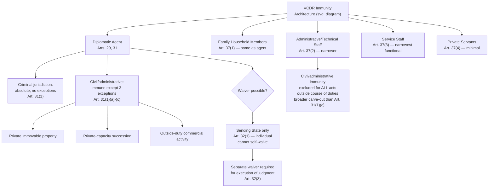

## Categories of Immunity Under the Vienna Convention on Diplomatic Relations

### Theoretical Foundation

Diplomatic immunity is not a single, undifferentiated legal status but a structured set of distinct protections, each grounded in a specific rationale and each attaching to a different combination of person, function, and property. Recall that persona non grata (Article 9 VCDR) provides the mechanism by which a receiving state can terminate an individual's diplomatic status and, through Article 9(2)'s non-recognition consequence, strip the immunities that status confers — but understanding what is actually being stripped requires unpacking immunity into its constituent categories, since the VCDR does not grant diplomats a single blanket protection but rather a carefully differentiated architecture of specific immunities, each with its own scope, its own theoretical justification, and, in several cases, its own express exceptions.

The VCDR's preamble itself supplies the governing theoretical rationale, stating that the purpose of diplomatic privileges and immunities is not to benefit individuals but "to ensure the efficient performance of the functions of diplomatic missions as representing States" — codifying what is generally called the **functional necessity theory** of diplomatic immunity, in contrast to two older, now largely superseded theoretical justifications: the **exterritoriality theory** (the historical fiction that a diplomatic mission's premises constitute an extension of the sending state's own territory, now generally rejected as a matter of legal doctrine though the term persists colloquially) and the **representative character theory** (which grounded immunity in the diplomat's status as the personal representative of the sending sovereign, a theory with roots in the personification-of-sovereignty ideas that also underlay the historical precedence disputes discussed in relation to the Congress of Vienna). The functional necessity rationale matters practically because it shapes how immunity provisions are interpreted in contested cases: an interpretation that best serves the mission's efficient functioning is generally favored over one that serves the individual diplomat's personal convenience or advantage, since the immunity's theoretical basis is instrumental to the mission's function, not a personal entitlement in the way (for instance) certain fundamental human rights are.

### Mechanism: Inviolability of the Person

**Article 29 VCDR** establishes the diplomatic agent's **personal inviolability**: the person of a diplomatic agent shall be inviolable, shall not be liable to any form of arrest or detention, and the receiving state shall treat the diplomat with due respect and take all appropriate steps to prevent any attack on their person, freedom, or dignity. This is the most fundamental and unconditional of the VCDR's protections — unlike several other immunities discussed below, Article 29 contains no express exception for any category of conduct, meaning a diplomatic agent enjoys absolute protection from arrest or detention by receiving-state authorities regardless of the severity of any alleged offense, with the receiving state's exclusive available remedy being the persona non grata mechanism (Article 9) rather than any form of direct law-enforcement action against the individual while their diplomatic status persists.

### Mechanism: Inviolability of the Diplomatic Mission's Premises

**Article 22 VCDR** establishes that the premises of the mission are inviolable, and that agents of the receiving state may not enter them except with the consent of the head of the mission. Article 22(2) imposes an affirmative obligation on the receiving state to take all appropriate steps to protect the mission's premises against any intrusion or damage, and to prevent any disturbance of the mission's peace or impairment of its dignity. Article 22(3) further provides that the premises, their furnishings, and other property on the premises, as well as the mission's means of transport, are immune from search, requisition, attachment, or execution. This premises inviolability is functionally distinct from, though closely related to, the historical exterritoriality fiction noted above — contemporary doctrine treats the inviolability as a specific, functionally justified protection against receiving-state law-enforcement intrusion, not as converting the embassy grounds into actual sending-state territory (a distinction with practical consequences, since, for instance, a birth occurring on embassy premises does not thereby confer the sending state's nationality by operation of territorial birthright rules, and criminal conduct occurring on embassy premises, while immune from receiving-state law-enforcement intrusion, is not thereby placed outside the receiving state's territorial jurisdiction as a matter of underlying sovereignty).

### Mechanism: Immunity from Criminal, Civil, and Administrative Jurisdiction

**Article 31 VCDR** is the Convention's central jurisdictional-immunity provision, and it is drafted with notably different scope across different categories of proceeding. Article 31(1) provides that a diplomatic agent enjoys immunity from the **criminal jurisdiction** of the receiving state **without any express exception** — paralleling Article 29's unconditional character. For **civil and administrative jurisdiction**, however, Article 31(1) immunity is subject to three specific exceptions: (a) a real action relating to private immovable property situated in the receiving state's territory, unless the diplomat holds it on behalf of the sending state for mission purposes; (b) an action relating to succession in which the diplomat is involved as executor, administrator, heir, or legatee as a private person rather than on behalf of the sending state; and (c) an action relating to any professional or commercial activity exercised by the diplomatic agent in the receiving state **outside their official functions** — this last exception addressing the situation where a diplomat engages in private business activity unconnected to their diplomatic role, a context in which the functional-necessity rationale for immunity does not apply, since such activity is by definition not part of the mission's official functioning.

Article 31(2) provides that a diplomatic agent is not obliged to give evidence as a witness — a further protection ensuring diplomats cannot be compelled into receiving-state judicial proceedings even in a non-party witness capacity, which could otherwise be used as an indirect means of subjecting diplomats to receiving-state judicial process notwithstanding the broader jurisdictional immunity.

**Article 32** governs **waiver**: immunity from jurisdiction of diplomatic agents may be waived by the **sending state** — critically, this is the sending state's right, not the individual diplomat's personal entitlement, directly reflecting the functional-necessity theory's premise that immunity exists to serve the mission's function and the sending state's interests, not the individual's personal convenience, and consequently the individual diplomat cannot unilaterally waive their own immunity. Article 32(2) requires waiver to be express. Article 32(3) addresses a frequently misunderstood point: waiver of immunity from jurisdiction in respect of civil or administrative proceedings does not, by itself, imply waiver of immunity in respect of the **execution** of any resulting judgment, for which a **separate waiver** is required — meaning a sending state permitting a diplomat to be sued does not thereby also consent to having any resulting judgment enforced against the diplomat's property, a distinction with real practical consequence for litigants who successfully sue a diplomat with immunity waived for the underlying suit but find enforcement of the judgment separately blocked absent a further, distinct waiver.

### Mechanism: Inviolability of Correspondence, Archives, and Diplomatic Bag

**Article 24 VCDR** establishes that the archives and documents of the mission are inviolable at any time and wherever they may be — a protection notably not limited to the mission premises, extending to mission documents wherever located. **Article 27** governs freedom of communication: the receiving state must permit and protect free communication by the mission for all official purposes, and the official correspondence of the mission is inviolable. Article 27(3) establishes that the **diplomatic bag** shall not be opened or detained, while Article 27(4) requires that packages constituting the diplomatic bag bear visible external marks of their character and may contain only diplomatic documents or articles intended for official use — this "official use only" limitation is the textual basis on which receiving states have, in specific and often controversial instances, alleged diplomatic-bag misuse (for instance, for smuggling), though the Article 27(3) inviolability protection means the receiving state's remedy for suspected misuse does not extend to unilaterally opening the bag, leaving diplomatic protest, demand for return of the bag to origin, or other indirect measures as the available responses.

### Mechanism: Family Members and Administrative/Technical Staff — Differentiated Coverage

The VCDR does not extend identical immunity coverage to every category of person connected with a mission. **Article 37(1)** extends the diplomatic agent's Article 29, 30, and 31 immunities (personal inviolability and jurisdictional immunity) to **family members forming part of the diplomatic agent's household**, provided they are not nationals of the receiving state. **Article 37(2)** extends immunity to **administrative and technical staff** and their households (again, if not receiving-state nationals or permanent residents), but with a materially narrower scope than that accorded to diplomatic agents themselves: Article 37(2) civil and administrative jurisdictional immunity does **not** extend to acts performed **outside the course of their duties** — a considerably broader carve-out than the narrow professional/commercial-activity exception applicable to full diplomatic agents under Article 31(1)(c), reflecting the functional-necessity rationale's graduated application: administrative and technical staff, whose functions are more clearly circumscribed and less inherently tied to broader representative functions than a diplomatic agent's role, receive correspondingly narrower immunity. **Article 37(3)** extends still narrower coverage to **service staff** of the mission (immunity only in respect of acts performed in the course of their duties, plus limited additional protections), and **Article 37(4)** extends the narrowest coverage of all to **private servants** of members of the mission, who receive only exemption from certain taxation, with other privileges and immunities extended only to the extent the receiving state admits.

### Tactical Implications for the Negotiator/Diplomat

- **The differentiated immunity architecture means a mission's staffing and role designations carry genuine legal consequence, not merely administrative or ceremonial significance.** A sending state structuring its mission should recognize that the immunity coverage an individual receives depends materially on their formal category (diplomatic agent, administrative/technical staff, service staff, private servant), and accurate, considered categorization at the time of notification to the receiving state has downstream legal consequences for that individual's protection.
- **The sending-state-only waiver rule (Article 32) is a critical point of legal and practical distinction that diplomats themselves, and receiving-state counterparts, should understand clearly.** An individual diplomat cannot bind the sending state to waiver merely by personal consent or apparent acquiescence in receiving-state proceedings, and receiving-state authorities or litigants should not assume an individual diplomat's cooperative posture in a legal matter constitutes an effective waiver absent the sending state's own express action.
- **The unconditional character of Articles 29 (personal inviolability) and 31(1) criminal jurisdiction immunity should not be conflated with the considerably narrower civil/administrative exceptions.** Diplomats and mission legal advisors should understand precisely which category of proceeding (criminal versus civil/administrative) and which specific factual exception (private immovable property, private-capacity succession matters, outside-official-function commercial activity) is implicated in any given legal exposure scenario, since the applicable immunity scope differs substantially across these categories.

### Diagram: VCDR Immunity Categories by Person and Proceeding Type

**Related Topics**

- Article 22 and Article 24 VCDR premises and archives inviolability as distinct protections
- Article 27 VCDR diplomatic bag inviolability and the "official use only" limitation
- Functional necessity theory versus exterritoriality and representative-character theories
- Article 32 VCDR waiver mechanics and the distinction between jurisdiction and execution waiver
- Article 9 VCDR persona non grata as the mechanism terminating immunity-bearing status
- Consular immunity under the VCCR as a materially narrower parallel regime