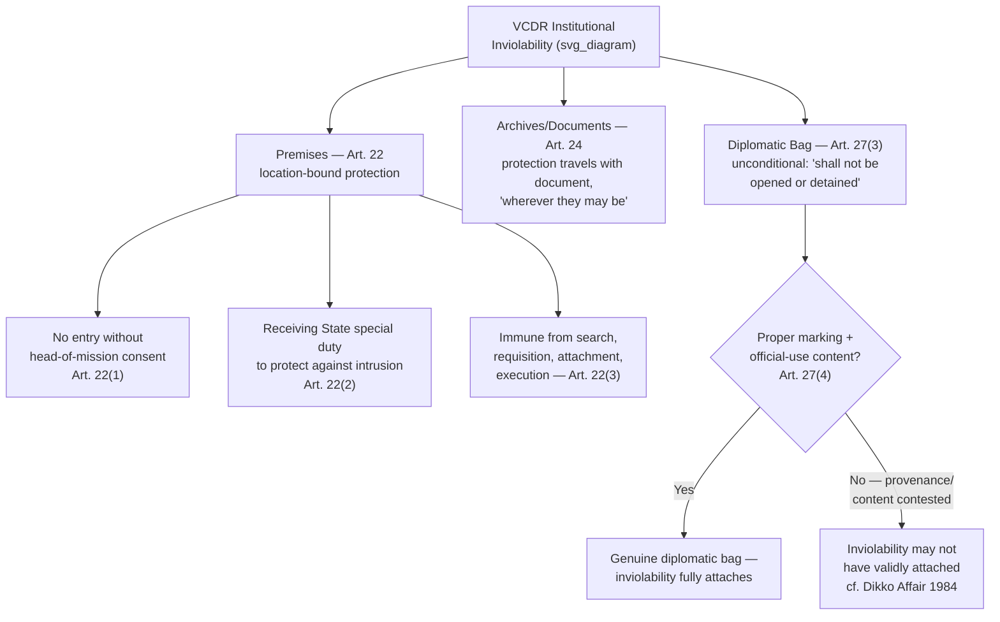

## Inviolability of Mission Premises, Archives, and the Diplomatic Bag

### Theoretical Foundation

Recall that the VCDR's overall immunity architecture rests on the **functional necessity theory** articulated in the Convention's preamble — protections exist to ensure the efficient performance of mission functions, not to confer personal advantage on individuals — and that this rationale applies with equal, and in some respects even sharper, force to the *institutional* protections addressed here as to the personal immunities of diplomatic agents examined in the categories-of-immunity discussion. Mission premises, archives, and the diplomatic bag together constitute the **physical and communicative infrastructure** through which a diplomatic mission actually functions: a mission whose premises could be entered at will by receiving-state authorities, whose documents could be seized, or whose official communications could be intercepted or opened, could not perform the confidential, autonomous representative functions the entire diplomatic system exists to enable. These three protections should therefore be understood as a coherent, mutually reinforcing set, addressing respectively the mission's physical space, its documentary records, and its ongoing communications — a gap in any one of the three would substantially undermine the protective value of the other two.

### Legal Basis: Article 22 VCDR — Premises Inviolability

**Article 22(1) VCDR** establishes that the premises of the mission are inviolable, and that agents of the receiving state may not enter them except with the consent of the head of the mission. This consent requirement is framed as genuinely discretionary on the mission's part — the receiving state has no independent legal basis, including a judicial warrant issued under its own domestic law, to compel entry, and the mission's consent, where given, is understood as a voluntary accommodation rather than a legal obligation the receiving state can enforce.

**Article 22(2)** imposes a distinct, affirmative obligation on the receiving state, running in the opposite direction from Article 22(1)'s restraint-on-entry rule: the receiving state is under a **special duty to take all appropriate steps to protect the premises of the mission against any intrusion or damage and to prevent any disturbance of the peace of the mission or impairment of its dignity**. This is a materially more demanding standard than the general due-diligence obligation a state owes toward foreign nationals or property generally — the "special duty" language, and the specific reference to preventing disturbance of the mission's "dignity," reflects the drafters' judgment that ordinary law-enforcement protection, of the kind extended to private property generally, is insufficient given the particular functional and symbolic significance of diplomatic premises, and that the receiving state must take *affirmative, proactive* measures (which in practice typically includes dedicated police presence, barrier or perimeter security, and rapid response protocols for demonstrations or threatened intrusions) rather than merely responding after the fact to completed violations.

**Article 22(3)** extends the inviolability protection to property: the premises of the mission, their furnishings and other property thereon, and the mission's means of transport, are immune from **search, requisition, attachment, or execution** — meaning that even where a mission or the sending state might otherwise be subject to civil legal process (for instance, following a valid waiver of jurisdictional immunity under Article 32, discussed in the immunity-categories analysis), the premises and associated property remain protected from the specific enforcement mechanisms of search and seizure, requiring separate consideration from jurisdictional immunity generally.

### Mechanism: The Historical Exterritoriality Fiction and Its Contemporary Rejection

Premises inviolability is frequently, and imprecisely, described in popular and even some diplomatic usage as embassies being "foreign soil" — a colloquial expression of the older **exterritoriality theory**, under which mission premises were historically conceived as a legal fiction extending the sending state's own territorial sovereignty into the receiving state. Contemporary international law doctrine, and the VCDR's own drafting, generally rejects this fiction as a matter of formal legal analysis: the prevailing modern position is that mission premises remain fully within the receiving state's territorial sovereignty and jurisdiction as a general matter, with Article 22's inviolability operating as a specific, functionally-grounded *restriction* on how the receiving state may exercise that underlying sovereignty (barring entry and certain enforcement actions), rather than as a transfer or suspension of sovereignty itself. This distinction carries genuine practical consequences: a birth occurring within an embassy's premises does not, contrary to the popular "foreign soil" intuition, confer the sending state's nationality by operation of territorial birthright principles (jus soli) the way an actual birth on the sending state's own territory would, and conduct occurring on embassy premises remains, as a matter of underlying territorial jurisdiction, subject to the receiving state's law even though Article 22 bars the receiving state's law-enforcement agents from physically entering to investigate or act upon it directly.

### Case Illustration: The 1984 Libyan Embassy (St James's Square) Shooting

The 1984 shooting of British police officer Yvonne Fletcher, killed by gunfire from within the Libyan People's Bureau (Libya's diplomatic mission) in London's St James's Square during a demonstration outside the building, is a frequently cited case illustrating the practical tension Article 22's premises inviolability can generate in acute circumstances. Despite the shooting having originated from within the mission premises, UK authorities did not forcibly enter the building, consistent with Article 22(1)'s consent requirement, and instead the incident was resolved through a diplomatic process — a siege of the building followed by the eventual, negotiated departure of Libyan mission personnel (under safe-conduct arrangements, without any of them being prosecuted for the shooting, since none was individually identified and immunity in any event would have applied to accredited personnel) and the United Kingdom's subsequent severance of diplomatic relations with Libya (a rupture that persisted until 1999). This case is instructive precisely because it demonstrates that Article 22's inviolability holds even in circumstances of serious ongoing criminal conduct with a fatality directly connected to activity inside the premises — the receiving state's remedy in such extreme cases lies not in a claimed law-enforcement exception to premises inviolability (which the VCDR does not provide), but in the broader diplomatic and political tools available to it: persona non grata declarations against individual mission personnel (where individually identifiable), diplomatic protest, or, as in this case, rupture of relations altogether.

### Legal Basis: Article 24 VCDR — Archives and Documents

**Article 24 VCDR** provides that the archives and documents of the mission shall be inviolable **at any time and wherever they may be**. The "wherever they may be" language is a deliberate and significant textual extension beyond premises inviolability's physical-location limitation: mission archives and documents retain their inviolable status even when they are outside the mission premises — for instance, in transit, in the possession of an individual diplomat traveling, or in other circumstances where the documents have left the physically protected mission building — meaning archive inviolability is a document-attached protection rather than a purely location-attached one, distinguishing it structurally from Article 22's premises-bound protection.

### Legal Basis: Article 27 VCDR — Freedom of Communication and the Diplomatic Bag

**Article 27(1) VCDR** establishes the receiving state's obligation to permit and protect free communication by the mission for all official purposes, including diplomatic couriers and messages in code or cipher, though Article 27(1) also permits the mission to install and use a wireless transmitter only with the consent of the receiving state — a notable qualification distinguishing this specific communication method from the otherwise general freedom-of-communication guarantee, reflecting particular receiving-state sensitivity around wireless transmission given its potential broadcast reach beyond the mission premises.

**Article 27(2)** establishes that the mission's official correspondence is inviolable, with "official correspondence" defined as all correspondence relating to the mission and its functions. **Article 27(3)** provides the core diplomatic-bag protection: the diplomatic bag **shall not be opened or detained** — a stronger, more absolute formulation than premises inviolability's consent-based structure, since Article 27(3) contains no express provision, analogous to Article 22(1)'s "except with consent" language, under which the bag might lawfully be opened even with the sending mission's cooperation being sought; the prohibition is stated in unconditional terms.

**Article 27(4)** imposes corresponding limits on what the bag may properly contain, and a marking requirement: packages constituting the diplomatic bag must bear visible external marks of their character and may contain only diplomatic documents or articles intended for official use. This "official use only" limitation is the textual hook receiving states have invoked, in periodic and sometimes serious controversies, when they suspect a diplomatic bag is being used to transport contraband, weapons, or even — in extreme and well-documented historical cases — to attempt to remove a person against their will. Because Article 27(3)'s inviolability is framed in unconditional terms, however, a receiving state suspecting misuse under Article 27(4) has no express VCDR-authorized mechanism to unilaterally open the bag to verify compliance — the Convention's own text does not resolve this tension by granting an inspection right conditioned on suspected misuse, leaving receiving states' practical responses limited to diplomatic protest, refusal of onward transit or clearance for the specific bag in question, or, in cases of sufficiently serious suspected misuse, broader escalatory measures including persona non grata action against implicated personnel — but not unilateral physical inspection consistent with the Convention's own terms.

### Case Illustration: The 1984 Dikko Affair

The 1984 attempted abduction of former Nigerian government minister Umaru Dikko from London — in which Nigerian and Israeli intelligence operatives attempted to smuggle a sedated Dikko out of the United Kingdom concealed in crates falsely presented as Nigerian diplomatic bags — is the standard reference case illustrating the practical limits and controversies surrounding Article 27(4)'s "official use only" restriction. UK customs officials, acting on intelligence suggesting the crates might contain Dikko rather than legitimate diplomatic cargo, intercepted and opened the crates at Stansted Airport, discovering Dikko drugged but alive inside, along with the individuals who had accompanied him. This action was subsequently defended, and is generally analyzed in the international-law literature, on the ground that the crates in question had not been properly accredited or documented as genuine diplomatic bags in the first place (having been prepared without the necessary advance notification and documentation ordinarily required for diplomatic bag treatment, and containing, on a straightforward factual level, a living kidnapped human being rather than any article that could plausibly qualify as a diplomatic document or article for official use) — meaning the case is generally understood not as an instance of a receiving state lawfully overriding genuine Article 27(3) inviolability, but rather as one in which the purported diplomatic-bag status was itself successfully contested as not having been validly established, illustrating that the formal requirements of Article 27(4) (proper marking, genuine diplomatic content) function as a threshold precondition for inviolability to attach in the first place, rather than as a substantive limitation a receiving state may invoke to override an otherwise validly constituted bag's protection.

### Tactical Implications for the Negotiator/Diplomat

- **Premises inviolability should be understood by receiving-state security and law-enforcement planners as imposing an affirmative protective obligation, not merely a restriction on their own conduct.** Article 22(2)'s "special duty" language means adequate mission security is a receiving-state legal obligation, not merely a courtesy, and a receiving state's failure to provide adequate protection against foreseeable threats (rather than merely refraining from unauthorized entry itself) can itself constitute a VCDR violation.
- **A sending state should recognize that Article 22's inviolability, while robust, does not eliminate accountability for serious misconduct occurring on mission premises — it channels that accountability into diplomatic and political mechanisms rather than direct receiving-state law enforcement.** The St James's Square case illustrates that even a fatal shooting from within a mission does not license forcible entry, but the receiving state retains substantial recourse through persona non grata action, diplomatic protest, and, in extreme cases, rupture of relations.
- **Diplomatic bag procedures should be followed with strict formal precision, since Article 27(4)'s marking and content requirements function as preconditions for inviolability rather than mere administrative formalities.** A mission seeking to ensure a shipment receives genuine Article 27(3) protection should ensure full compliance with proper marking, advance notification, and content-restriction requirements — the Dikko affair demonstrates that a receiving state confronting a bag whose provenance or compliance is genuinely contested may act, and have that action subsequently vindicated, on the ground that inviolability never validly attached in the first place.
- **Archive inviolability's location-independent character (Article 24) should inform how sending states handle mission documents in transit or outside the physical premises**, recognizing that this protection travels with the documents themselves rather than being lost upon removal from the mission building, distinguishing document handling considerations from the physically-bounded premises protection.

### Diagram: The Three Institutional Inviolability Protections

**Related Topics**

- Article 29 and Article 31 VCDR personal and jurisdictional immunity as the parallel personal-protection regime
- The 1984 St James's Square shooting and the limits of premises inviolability in extreme circumstances
- The 1984 Dikko Affair and the "official use only" precondition for diplomatic bag inviolability
- Rupture of diplomatic relations as the escalatory response beyond persona non grata
- Wireless transmitter consent requirements under Article 27(1) as a qualified communication freedom
- Functional necessity theory as the interpretive lens for resolving inviolability's practical limits