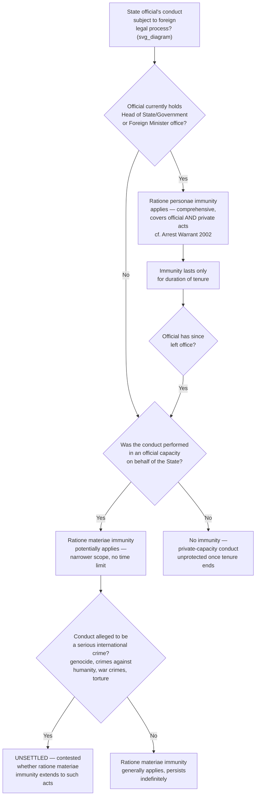

## Immunity Ratione Personae versus Ratione Materiae

### Theoretical Foundation

The categories of VCDR immunity already examined — personal inviolability, jurisdictional immunity, premises and archive protections — describe *what* is protected for accredited diplomatic mission personnel. A separate, cross-cutting analytical distinction, developed principally through customary international law and applied most prominently to heads of state, heads of government, and foreign ministers rather than to accredited diplomats specifically, addresses a different question: **why and for how long** immunity attaches to a particular class of official, and what happens to that immunity once the official leaves office. This is the distinction between immunity **ratione personae** (Latin: "by reason of the person," sometimes called personal or status-based immunity) and immunity **ratione materiae** (Latin: "by reason of the matter," sometimes called functional or subject-matter immunity).

**Define on first use**: immunity **ratione personae** is immunity attaching to an individual by virtue of the *office* or *status* they currently hold — it is comprehensive in scope (covering both official and private acts) but **temporally limited**, lasting only for the duration of the office-holder's tenure. Immunity **ratione materiae** is immunity attaching to the *official acts themselves*, performed in an official capacity on behalf of the state — it is narrower in scope (covering only conduct genuinely undertaken in an official capacity) but **potentially indefinite** in duration, since it protects the acts, not the person, and therefore persists after the individual leaves office, precisely because the underlying rationale is that an official act is properly attributed to the state itself, not personally to the individual who performed it.

### Mechanism: The Structural Trade-Off Between Breadth and Duration

The two immunity types are best understood as occupying opposite positions on a breadth-versus-duration trade-off, and this trade-off reflects two distinct underlying rationales. Ratione personae immunity is justified by the functional necessity of allowing a small category of the very highest state officials — those whose role requires them to represent and act on behalf of the state internationally without the risk of being detained, prosecuted, or otherwise obstructed by foreign legal process while performing that role — to travel, negotiate, and conduct the state's affairs internationally without fear of foreign legal process, and this necessity justifies covering *all* their conduct, official and private alike, precisely because distinguishing between the two categories in the moment would itself create the friction and uncertainty the immunity is designed to prevent; but because the justification is tied to the office itself, the immunity terminates when the office does. Ratione materiae immunity, by contrast, is justified by the principle that an official act, properly performed on behalf of the state, is legally attributable to the *state* rather than to the individual official personally — meaning subjecting the individual to foreign legal process for that act would, in substance, indirectly subject the state itself to that foreign jurisdiction, a result the customary law of state immunity generally aims to prevent regardless of whether the individual who performed the act remains in office; this rationale has no natural expiration date tied to tenure, since the act's proper attribution to the state does not change merely because the official who performed it later leaves their position.

### Legal Basis: The ICJ's *Arrest Warrant* Case (2002)

The **International Court of Justice's judgment in *Arrest Warrant of 11 April 2000 (Democratic Republic of the Congo v. Belgium)* (2002)** is the leading and most frequently cited authority articulating this distinction in binding international jurisprudence. The case arose from a Belgian investigating judge's issuance of an international arrest warrant against the Democratic Republic of the Congo's then-incumbent Minister for Foreign Affairs, Abdoulaye Yerodia Ndombasi, alleging grave breaches of the Geneva Conventions and crimes against humanity. The Court held that a sitting Minister for Foreign Affairs enjoys **full immunity from criminal jurisdiction and inviolability** in foreign states throughout their tenure, regardless of whether the acts in question were performed in an official or private capacity, and regardless of the gravity of the alleged conduct (including, notably, allegations of international crimes) — establishing that ratione personae immunity for this category of high office is, during the period of tenure, essentially absolute in scope, extending to acts performed before as well as during the individual's term of office and to acts performed in both official and private capacities.

Critically, however, the Court also clarified the **temporal limit** on this protection, addressing directly what happens once the individual leaves office: immunity from jurisdiction enjoyed by an incumbent Minister for Foreign Affairs does not mean that they enjoy impunity in respect of any crimes they might have committed, and after a person ceases to hold the office of Minister for Foreign Affairs, **they will no longer enjoy all of the immunities accorded by international law in other states** — a foreign court may, after the individual leaves office, exercise jurisdiction over them in respect of acts committed **prior to or subsequent to their period in office**, as well as in respect of acts committed **during their period of office in a private capacity**. This last clause is the Court's clearest articulation of the ratione personae/ratione materiae boundary: acts performed *in an official capacity* during the period of office remain protected by **ratione materiae** immunity even after the individual leaves office (since these acts are attributed to the state, and this attribution does not expire with the individual's tenure), while acts performed in a *private* capacity during the same period lose their (formerly ratione personae-based) protection entirely once tenure ends, becoming fully subject to foreign jurisdiction.

### Mechanism: The Categories of Official Covered by Ratione Personae Immunity

Customary international law, as clarified by *Arrest Warrant* and subsequent state practice and scholarship (including the International Law Commission's ongoing work on immunity of state officials from foreign criminal jurisdiction), generally recognizes ratione personae immunity as extending to what is often called the **"troika"**: the **Head of State**, the **Head of Government**, and the **Minister for Foreign Affairs** — the three offices whose functions are understood to require this comprehensive, tenure-linked protection given their central role in representing the state internationally. Whether the troika should be understood as a closed, exhaustive category or whether other very senior officials (for instance, certain other cabinet ministers whose functions involve substantial international representation) might also qualify remains a matter of some doctrinal debate and uneven state practice, though the ICJ's *Arrest Warrant* reasoning was framed specifically around the Foreign Minister's functions and has not been definitively extended by subsequent binding international jurisprudence to a clearly broader category.

This troika-based ratione personae immunity should be distinguished from the VCDR's Article 29/31 immunity for accredited diplomatic agents, discussed as the categories-of-immunity item in this chapter: diplomatic agent immunity is treaty-based (arising from VCDR accreditation to a *specific* receiving state) and territorially limited to that receiving state's jurisdiction, whereas troika ratione personae immunity is customary-international-law-based and operates **universally** — a sitting head of state or foreign minister enjoys this immunity in *any* foreign state's courts, not merely in a state to which they happen to be accredited as a diplomat, reflecting the different legal source and broader functional rationale of the two regimes.

### Mechanism: Ratione Materiae Immunity's Persistence and Its Limits

Because ratione materiae immunity protects the official *act* rather than the individual, it persists indefinitely after the official leaves office and, in principle, applies to a considerably broader class of state officials than the narrow troika — any state official acting in an official capacity may in principle claim ratione materiae protection for that official conduct, not merely the small category of officials who additionally enjoy ratione personae immunity while in office. This broader, act-based reach is precisely what makes ratione materiae immunity the more commonly litigated of the two categories in practice, since most disputes over foreign officials' immunity in domestic courts involve former officials, or officials below the troika level, for whom ratione personae protection either has already lapsed or never applied in the first place, leaving ratione materiae as the only potentially available protection.

Ratione materiae immunity's central and most contested limit concerns **serious international crimes**. A significant and evolving body of international jurisprudence and scholarly opinion — though not without genuine ongoing debate and inconsistent state practice — has increasingly questioned or denied the availability of ratione materiae immunity for the most serious international crimes (genocide, crimes against humanity, war crimes, and torture), on the theory that such conduct cannot properly be characterized as a legitimate "official act" attributable to the state for immunity purposes in the first place, or alternatively that international law has developed a specific exception to ratione materiae immunity for this category of conduct. This question remains genuinely unsettled at the level of general customary international law applicable in domestic courts generally (as distinct from the specific jurisdictional regimes of international criminal tribunals, which operate under their own governing statutes rather than the customary ratione materiae framework), and different domestic courts and international bodies have reached differing conclusions — representing one of the more actively contested frontiers of contemporary international law in this area, where the strongest form of each side's position deserves acknowledgment: proponents of an international-crimes exception argue that extending immunity to such conduct would be incompatible with the jus cogens character of the underlying prohibitions and would undermine accountability for the gravest violations of international law; defenders of the traditional, undiminished ratione materiae rule caution that carving out exceptions risks politicized prosecutions and erodes the predictability and reciprocal restraint the immunity system as a whole is designed to preserve among states.

### Tactical Implications for the Negotiator/Diplomat

- **A sitting head of state, head of government, or foreign minister should understand ratione personae immunity as comprehensive but strictly time-bound, with real planning consequences for post-tenure travel and legal exposure.** Because *Arrest Warrant* establishes that private-capacity conduct during tenure loses its protection entirely upon leaving office, an official (and their legal advisors) contemplating conduct that could give rise to foreign legal exposure should recognize that ratione personae immunity provides no permanent shield for private conduct, only a temporary one lasting as long as the office is held.
- **A former official assessing their own exposure to foreign legal process should analyze conduct act-by-act, official versus private, rather than assuming blanket continued protection.** Ratione materiae immunity's persistence covers only genuinely official conduct; private conduct during the individual's former tenure, once that tenure ends, is unprotected by either category of immunity.
- **Diplomatic and legal advisors evaluating a potential foreign legal action against a foreign official should identify precisely which immunity category, if any, is actually in play, since the applicable analysis differs substantially.** An action against a *sitting* troika-level official invokes the (near-absolute, but temporary) ratione personae framework; an action against a *former* official, or against a *sitting* non-troika official, invokes the narrower but more durable ratione materiae framework, and — where serious international crimes are alleged — potentially engages the genuinely unsettled question of whether ratione materiae immunity extends to such conduct at all.
- **Negotiators drafting instruments touching on international-crimes accountability (extradition treaties, mutual legal assistance agreements, instruments establishing international tribunals) should recognize the ratione materiae/international-crimes boundary as a live, contested area of international law**, and should anticipate that provisions addressing this boundary may require careful, deliberate drafting precisely because customary international law itself has not yet definitively resolved the underlying question.

### Diagram: Ratione Personae versus Ratione Materiae Immunity

**Related Topics**

- *Arrest Warrant of 11 April 2000 (DRC v. Belgium)* (ICJ 2002) as the foundational authority
- The "troika" (Head of State, Head of Government, Foreign Minister) as the customary ratione personae category
- State immunity in foreign domestic courts and its relationship to individual official immunity
- The contested international-crimes exception to ratione materiae immunity
- ILC work on Immunity of State Officials from Foreign Criminal Jurisdiction as ongoing codification effort
- Distinguishing customary-law troika immunity from VCDR treaty-based diplomatic agent immunity