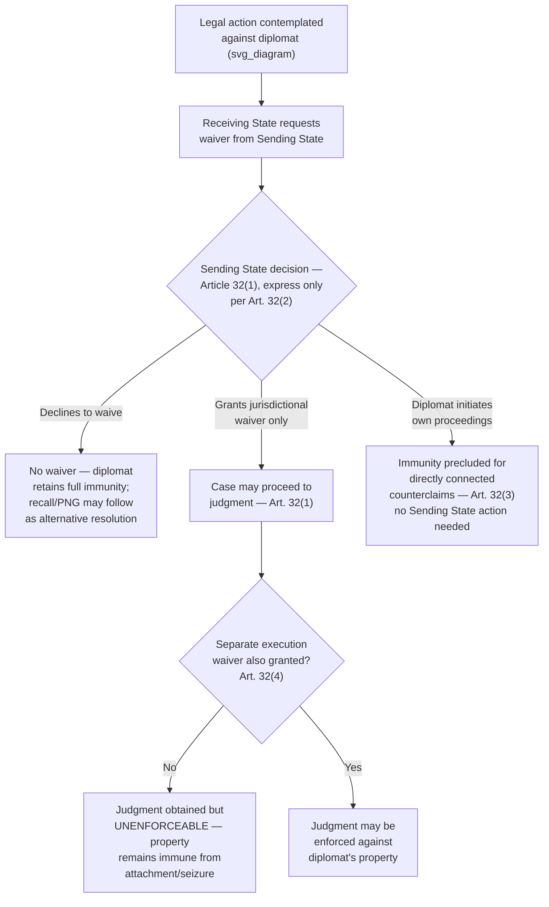

## Waiver of Immunity and Its Practical Limits

### Theoretical Foundation

Recall that diplomatic and official immunity, across both the VCDR's treaty-based framework and the customary-law ratione personae/ratione materiae distinction, is consistently justified by **functional necessity** rather than personal entitlement — immunity exists to enable the efficient performance of state representative functions, not to confer a private benefit on the individual official. This functional rationale has a direct and important structural consequence for how immunity may be given up: because the protection belongs, in a legal sense, to the *state* rather than to the individual, the power to waive it is correspondingly vested in the state, not in the individual official who happens to be shielded by it. Waiver doctrine is therefore best understood not as a question of individual consent (as waiver often is in ordinary civil law contexts, such as a contractual party waiving a right for their own benefit) but as an exercise of **sovereign discretion by the sending state**, deployed for reasons of state policy that may or may not align with the immunity-holder's own personal preference in a given case.

### Legal Basis: Article 32 VCDR

**Article 32(1) VCDR** provides that the immunity from jurisdiction of diplomatic agents, and of persons enjoying immunity under Article 37 (family members, administrative/technical staff, service staff), **may be waived by the sending State**. This allocation of the waiver power to the sending state — rather than to the individual diplomat — is the single most consequential structural feature of the waiver regime, and follows directly from the functional-necessity rationale: since the immunity exists to protect the mission's and the sending state's interests, only the entity whose interests are protected (the state) can properly consent to relinquishing that protection.

**Article 32(2)** requires that waiver **must always be express** — the Convention does not recognize implied or presumed waiver from a diplomat's conduct, however cooperative or acquiescent that conduct might appear. This express-waiver requirement is a deliberate protective device: because the consequences of losing immunity can be severe (full exposure to receiving-state criminal or civil jurisdiction), the Convention insists on a clear, affirmative, unambiguous act of waiver by the properly authorized state authority, avoiding any risk that a diplomat's informal statements, conduct suggestive of cooperation, or even an initial appearance in receiving-state proceedings could be construed as an inadvertent waiver.

**Article 32(3)** addresses a frequently overlooked but practically critical distinction: if a diplomatic agent or a person enjoying immunity under Article 37 **initiates proceedings**, they thereby **preclude themselves from invoking immunity from jurisdiction in respect of any counterclaim directly connected with the principal claim** — meaning that while the sending state alone can waive immunity affirmatively, an individual diplomat who chooses to bring their own civil suit in receiving-state courts (for instance, suing a receiving-state party in a contract or property dispute) cannot then invoke immunity to block a directly related counterclaim, since permitting selective use of receiving-state courts (as plaintiff, while retaining full immunity as potential defendant to directly connected claims) would allow the diplomat to weaponize the receiving state's own judicial system unilaterally while remaining shielded from its reciprocal application.

**Article 32(4)** contains the provision of greatest practical consequence for litigants and receiving-state authorities: **waiver of immunity from jurisdiction in respect of civil or administrative proceedings shall not be held to imply waiver of immunity in respect of the execution of the judgment, for which a separate waiver shall be necessary.** This two-tier waiver structure is one of the most consequential, and most frequently misunderstood, features of the entire immunity regime.

### Mechanism: The Jurisdiction/Execution Distinction and Its Practical Bite

Article 32(4)'s separation of waiver into two distinct stages — waiver permitting a case to be *heard* (jurisdictional waiver) and waiver permitting a resulting judgment to be *enforced* (execution waiver) — means that a sending state's decision to allow a diplomat to be sued does not, without an entirely separate and independently granted waiver, allow a successful plaintiff to actually collect on any judgment obtained. This produces a genuinely counterintuitive practical outcome for litigants unfamiliar with the immunity regime: a plaintiff may secure a full jurisdictional waiver, litigate a civil claim against a diplomat to a successful judgment, and then find that the judgment is effectively unenforceable — the diplomat's property, including bank accounts, vehicles, and personal effects, generally remains protected from attachment or seizure absent the sending state's further, distinct waiver of execution immunity, which sending states grant considerably less readily than jurisdictional waivers, since permitting a foreign court to seize a diplomat's property strikes more directly at the practical, day-to-day functional protection the immunity regime is designed to preserve.

This two-tier structure means that, in practice, sending states frequently grant jurisdictional waiver in circumstances where they judge the underlying claim to have merit or where declining to waive would generate disproportionate reputational or relationship cost, while withholding execution waiver even in the same case — leaving a successful plaintiff with a formally valid but practically unenforceable judgment, unless the diplomat or sending state voluntarily satisfies it despite the absence of any legal compulsion to do so. This dynamic gives sending states a further, more granular tool: rather than a binary waive/don't-waive decision, Article 32's two-tier structure allows a sending state to permit the receiving state's courts to adjudicate a matter (satisfying broader considerations of fairness, reciprocity, or relationship management) while still preserving the practical, functional protection against actual asset seizure that most directly implicates the diplomat's and mission's ongoing ability to operate.

### Mechanism: Waiver as a Discretionary Diplomatic-Political Decision, Not a Legal Entitlement of the Diplomat

Because Article 32(1) vests the waiver power exclusively in the sending state, an individual diplomat facing a serious allegation — criminal or civil — in the receiving state has **no personal legal mechanism** to compel their own government to waive immunity on their behalf, even where the diplomat might personally prefer to have their conduct adjudicated and, if applicable, publicly vindicated through receiving-state proceedings rather than remaining under an unresolved cloud of allegation. Sending states' waiver decisions in practice reflect a range of policy considerations extending well beyond the individual diplomat's own interests or preferences: the severity and public visibility of the alleged conduct, the state of the broader bilateral relationship, domestic political considerations within the sending state, the precedential effect a waiver decision might have for future cases, and the sending state's assessment of whether the receiving state's judicial process is likely to be conducted fairly. A sending state may decline to waive immunity even in cases involving serious allegations against a diplomat it privately believes to be guilty, calculating that the reputational and functional costs of exposing the individual (and, by extension, the broader diplomatic relationship and immunity system's mutual reciprocal value) to receiving-state jurisdiction outweigh the benefits of a public proceeding — a calculation the individual diplomat has no legal standing to override.

### Case Illustration: Recurring Vehicular and Criminal Incident Patterns

Diplomatic immunity waiver disputes recur with some frequency in a specific, well-documented pattern: incidents involving diplomats and serious traffic offenses (including fatal accidents) or other criminal conduct, where the receiving state formally requests waiver from the sending state and the sending state either grants or, more commonly in the most serious cases, declines the request, instead recalling the individual diplomat to the sending state where the receiving state's criminal process cannot reach them (Article 9's persona non grata mechanism, or simple withdrawal of the individual by the sending state, functioning as the practical resolution mechanism in lieu of waiver, since a sending state unwilling to waive immunity retains the alternative option of removing the individual from the receiving state's territory, ending the immediate diplomatic friction even without resolving the underlying legal claim). This recurring pattern — receiving-state request, sending-state refusal, recall rather than trial — has periodically generated significant public and diplomatic controversy in individual high-profile cases, illustrating the genuine tension between the immunity system's functional-necessity rationale (protecting diplomats from potentially harassing or politically motivated foreign legal process) and the receiving state's and victims' interest in accountability for serious harm, a tension the VCDR's waiver architecture does not resolve in favor of either interest categorically, instead leaving the outcome to case-by-case sending-state discretion.

### Tactical Implications for the Negotiator/Diplomat

- **A receiving state pursuing legal action against a diplomat should request waiver explicitly and specify precisely which tier — jurisdictional, execution, or both — it is seeking**, since Article 32(4)'s two-tier structure means a general or ambiguous waiver request risks yielding only jurisdictional waiver even where the receiving state's actual objective (satisfaction of a judgment) requires execution waiver as well, and clarity in the initial request may prompt earlier, more complete engagement with the sending state on the full scope of relief actually sought.
- **A sending state's foreign ministry should treat waiver decisions as genuinely two-tiered from the outset, considering jurisdictional and execution waiver as analytically separate decisions rather than a single bundled choice**, since granting jurisdictional waiver while withholding execution waiver is a legitimate, VCDR-consistent middle path that can serve diplomatic relationship-management interests (permitting adjudication) while preserving the diplomat's functional protection against asset seizure.
- **An individual diplomat should understand clearly that waiver is not a personal entitlement they can invoke or a decision available to them individually.** A diplomat facing allegations who wishes to see the matter resolved through receiving-state proceedings has no independent legal path to achieve that outcome absent the sending state's own affirmative decision, and diplomats and their legal counsel should manage expectations accordingly.
- **A diplomat contemplating initiating civil proceedings in receiving-state courts should be advised of Article 32(3)'s counterclaim-preclusion consequence before proceeding**, since doing so surrenders immunity specifically with respect to directly connected counterclaims — a consequence that may be significant in commercial or property disputes where the receiving-state counterparty has plausible grounds for a related counterclaim.

### Diagram: The Two-Tier Waiver Structure

**Related Topics**

- Article 31 VCDR jurisdictional immunity as the protection Article 32 waiver relinquishes
- Persona non grata and recall as the sending-state alternative to waiver in serious cases
- Functional necessity theory as the rationale for vesting waiver power in the State, not the individual
- Execution immunity in the broader context of state immunity from enforcement measures
- Counterclaim preclusion under Article 32(3) and its relevance to diplomat-initiated civil suits
- Recurring vehicular-incident waiver disputes as a documented pattern in state practice