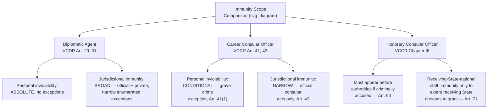

## Consular Immunity Distinguished from Diplomatic Immunity

### Theoretical Foundation

The immunity regimes examined thus far — VCDR diplomatic agent immunity and the customary-law ratione personae/ratione materiae framework for senior state officials — govern individuals whose function is fundamentally **representative and political**: diplomats and heads of state/government/foreign affairs represent the sending state's sovereign interests and conduct its relations with the receiving state as a whole. **Consular officers** perform a functionally distinct role, and this functional difference is the direct explanation for why consular immunity, codified separately in the **Vienna Convention on Consular Relations (VCCR, 1963)**, is deliberately narrower than diplomatic immunity across nearly every dimension. Consular functions, as enumerated in **Article 5 VCCR**, center on protecting the interests of the sending state and its nationals within specific, often technical and administrative domains — issuing passports and visas, assisting nationals in distress (including detained nationals, shipwrecked sailors, and deceased nationals' affairs), notarizing documents, registering births and deaths, and promoting commercial and economic relations — rather than on the comprehensive political representation and negotiation function that justifies diplomatic immunity's broader scope. Because the functional-necessity rationale underlying all immunity doctrine ties the scope of protection to what the function actually requires, and because consular functions are narrower and more administratively bounded than diplomatic representation, consular immunity is correspondingly narrower.

### Legal Basis: The VCCR's Parallel but Distinct Architecture

The VCCR, concluded two years after the VCDR and closely modeled on its structure, nonetheless diverges from the diplomatic regime in several specific and consequential ways, reflecting this different underlying functional rationale.

**Personal inviolability** under **Article 41 VCCR** is materially narrower than the VCDR's Article 29 absolute protection for diplomatic agents. Article 41(1) provides that consular officers **shall not be liable to arrest or detention pending trial, except in the case of a grave crime and pursuant to a decision by the competent judicial authority** — a significant express exception with no VCDR equivalent, since diplomatic agents enjoy unconditional protection from arrest or detention under Article 29 regardless of the alleged offense's gravity. Article 41(2) further provides that, except in the grave-crime circumstance addressed by Article 41(1), consular officers may be committed to prison or subjected to any other form of restriction of personal freedom only pursuant to a final judicial decision — meaning consular personal inviolability, while genuine, is a **conditional** protection built around a materially lower threshold of receiving-state intrusion than the diplomatic regime's essentially unconditional Article 29 protection.

**Jurisdictional immunity** under **Article 43 VCCR** is framed explicitly and narrowly around **official acts**: consular officers and consular employees are not amenable to the jurisdiction of the receiving state's judicial or administrative authorities **in respect of acts performed in the exercise of consular functions**. This is, in structural terms, a **ratione materiae-style, functional immunity** from the outset — unlike the VCDR's Article 31, which grants diplomatic agents broad jurisdictional immunity subject only to narrow, enumerated exceptions (private immovable property, private-capacity succession, outside-function commercial activity), Article 43 VCCR inverts this structure, granting immunity only for the *specific category* of official consular acts, with all other conduct — private conduct, and notably criminal conduct generally, which Article 43 does not shield at all — falling outside the immunity's scope from the start. This means consular officers, unlike diplomatic agents, generally enjoy **no immunity from criminal jurisdiction for conduct outside their official consular functions**, a sharp and consequential divergence from the diplomatic regime's unconditional Article 31(1) criminal immunity.

**Consular premises** receive inviolability broadly analogous to Article 22 VCDR under **Article 31 VCCR**, though Article 31(2)'s consent-to-entry rule contains its own qualification: consent to entry by receiving-state authorities in case of fire or other disaster requiring prompt protective action **may be assumed** in the absence of express consent — a specific, practical qualification to the entry-consent rule with no directly equivalent provision in the VCDR's Article 22, reflecting a somewhat more permissive baseline suited to the generally more administrative, less politically sensitive character of consular premises relative to a diplomatic mission's chancery.

### Mechanism: Honorary Consuls — A Further, Sharper Reduction in Protection

The VCCR contains an additional structural feature entirely absent from diplomatic practice: the **honorary consular officer**, a category of consular official (governed by Chapter III of the VCCR, Articles 58–68) who — unlike **career consular officers**, professional civil servants of the sending state serving as their principal occupation — typically holds consular office as a supplementary role while maintaining independent professional or business activities in the receiving state, is frequently (though not invariably) a national of the receiving state or a third state rather than of the sending state, and receives compensation, if any, on a substantially different basis than salaried career consular officers. Honorary consuls receive markedly reduced privileges and immunities relative to career consular officers across nearly every VCCR category: Article 63 VCCR provides that if criminal proceedings are instituted against an honorary consular officer, they **must appear before the competent authorities** (a materially weaker protection than even Article 41's grave-crime-and-judicial-decision threshold for career consular officers), and Article 71 VCCR clarifies that receiving-state nationals or permanent residents serving as members of consular posts (a circumstance more common among honorary consuls, given their frequent receiving-state-national status) enjoy only such privileges, immunities, and facilities as the receiving state chooses to grant, subject to the receiving state's discretion. This layered structure — diplomatic agents receiving the broadest protection, career consular officers receiving materially narrower functional protection, and honorary consular officers receiving the narrowest protection of all — reflects a consistent graduated application of the functional-necessity principle: the less a role's protection is genuinely required for the state's representative function to operate (honorary consuls' dual-occupation status and frequent receiving-state-national ties placing them furthest from the paradigm case the immunity system is designed around), the less extensive the protection the VCCR extends.

### Mechanism: The Consular-Assistance Function Itself as a Distinct Body of Obligation

Beyond the immunity questions addressed above, the VCCR imposes a distinct and increasingly significant body of receiving-state obligation directly connected to consular functions rather than to consular *officer* immunity as such: **Article 36 VCCR** establishes the receiving state's obligation, upon the arrest or detention of a foreign national, to inform that individual without delay of their right to have the sending state's consular post notified, and, if the individual so requests, to notify the consular post without delay and permit consular officers to visit, communicate with, and arrange legal representation for the detained national. This provision — the subject of significant international litigation, most notably the ICJ's judgments in *LaGrand (Germany v. United States)* (2001) and *Avena and Other Mexican Nationals (Mexico v. United States)* (2004), both arising from receiving-state failures to provide Article 36 consular notification to foreign nationals facing capital charges in the United States — addresses receiving-state obligations toward *detained individuals*, distinct from the immunity questions governing consular *officers* discussed above, but is frequently grouped with consular immunity topics given its shared VCCR origin and its centrality to how consular functions actually operate in practice, particularly in the criminal-justice context where the stakes for individual detained nationals can be severe.

### Tactical Implications for the Negotiator/Diplomat

- **A sending state should not assume its consular officers receive diplomatic-agent-equivalent protection, and should structure consular staffing and conduct guidance accordingly.** Given Article 41 VCCR's grave-crime exception to personal inviolability and Article 43's narrow functional-acts-only jurisdictional immunity, consular officers face materially greater exposure to receiving-state legal process — particularly for conduct outside strict official consular functions — than diplomatic agents accredited to the same receiving state, and sending-state guidance to consular personnel should reflect this reduced protective baseline explicitly.
- **The honorary/career consular distinction should inform recruitment and role-design decisions with immunity consequences squarely in view.** A sending state considering whether to establish a consular post through a career officer or an honorary consul should recognize the materially different protection each will receive, particularly Article 63's requirement that honorary consular officers appear before receiving-state authorities even for a mere accusation of criminal conduct — a consideration relevant both to the individual's personal risk calculus and to the sending state's assessment of how robustly it can protect its consular representation at a given post.
- **Article 36 consular notification compliance should be treated as a distinct and increasingly consequential receiving-state obligation, independent of consular officer immunity questions.** Given the *LaGrand* and *Avena* litigation history, receiving states — particularly those, like the United States, with a federal structure in which consular notification compliance depends on cooperation from state and local law-enforcement authorities not directly under central-government control — should recognize this as an area of genuine, recurring compliance risk requiring active institutional attention, distinct from the immunity-scope questions examined elsewhere in this analysis.
- **A negotiator drafting or advising on a bilateral consular convention (many pairs of states supplement or, less commonly, entirely displace VCCR default rules through bilateral consular treaties) should recognize the VCCR's default provisions as a floor from which bilateral arrangements may expand consular protections**, since Article 73 VCCR expressly permits the Convention's provisions to be confirmed, supplemented, extended, or amplified by bilateral international agreements between particular states.

### Diagram: Diplomatic versus Consular Immunity Comparison

**Related Topics**

- Article 5 VCCR enumerated consular functions as the basis for the narrower functional-immunity rationale
- *LaGrand* (ICJ 2001) and *Avena* (ICJ 2004) on Article 36 consular notification obligations
- Article 73 VCCR bilateral consular conventions supplementing the default multilateral framework
- Article 29 and Article 31 VCDR diplomatic immunity as the broader comparative baseline
- Grave-crime exception mechanics under Article 41(1) VCCR and judicial-decision requirements
- Honorary consul dual-occupation status and its structural link to reduced VCCR protection