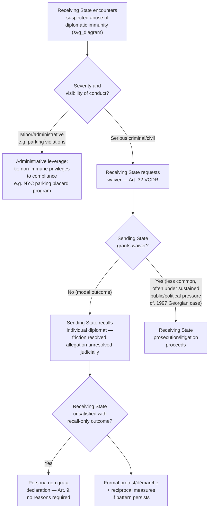

## State Responses to Abuse of Diplomatic Immunity

### Theoretical Foundation

Every immunity category examined across this chapter — personal inviolability, jurisdictional immunity, premises and archive inviolability, the diplomatic bag, and the waiver mechanism itself — shares the same underlying functional-necessity justification: protection exists to enable the mission's efficient functioning, not to confer personal license on individual diplomats. This foundational rationale generates an inherent, structurally unavoidable tension whenever immunity is invoked to shield conduct that bears little or no relationship to the diplomat's actual official function — conduct the VCDR's drafters did not intend the regime to protect, but which the regime's own textual breadth (particularly Article 29's unconditional personal inviolability and Article 31(1)'s unconditional criminal jurisdictional immunity) nonetheless formally shields as a practical matter, since the Convention draws its exceptions narrowly and largely by category of proceeding rather than by inquiry into the diplomat's actual motive or the conduct's genuine connection to mission functions. Understanding how receiving states have responded to this tension — given that the VCDR itself provides no receiving-state power to unilaterally override the immunity, as the personal-inviolability and criminal-jurisdiction protections examined in the categories-of-immunity discussion contain no abuse-based exception — is essential to understanding how the immunity regime actually operates in practice, as distinct from its formal textual scope.

### Mechanism: The VCDR's Own Internal Remedy — Article 9 as the Designed Response

The VCDR's drafters were not unaware of the abuse problem, and the Convention's own architecture supplies its intended primary remedy: **persona non grata**, already examined in detail. Because Article 9 permits a receiving state to declare any diplomat persona non grata **at any time and without having to explain its decision**, the Convention's design contemplates that a receiving state confronting a diplomat whose conduct it considers abusive of the diplomat's protected status has a ready, VCDR-sanctioned tool available immediately — the receiving state need not identify a specific abuse-of-immunity doctrine or satisfy any evidentiary threshold; it may simply declare the individual unwelcome and require their departure. This is the VCDR's structurally preferred response precisely because it operates *without* requiring any erosion of the underlying immunity protections themselves — Article 9 removes the individual from the receiving state's territory (ending the immediate friction) rather than attempting to carve out an exception to Article 29 or Article 31 immunity while the individual remains present, preserving the predictability and non-discretionary character of the core immunity provisions that the whole system depends upon for its reciprocal value to all states.

### Mechanism: Recall, Rather Than Waiver, as the Modal Sending-State Response

As already examined in the waiver discussion, sending states facing a receiving-state request to waive immunity in a serious case frequently decline to do so, instead **recalling** the individual diplomat to the sending state — removing them from the receiving state's jurisdiction before any legal process can be brought to bear, and thereby resolving the immediate diplomatic friction (the receiving state's specific objection to that individual's continued presence) without resolving the underlying substantive allegation through any judicial process at all. This pattern — recall in lieu of waiver — is the most common actual resolution mechanism for abuse-of-immunity controversies in practice, and reflects sending states' strong general preference for managing individual abuse allegations through withdrawal of the individual rather than through the precedentially significant step of formal waiver, since waiver in one case can create pressure (diplomatic, if not strictly legal, since no formal precedential doctrine binds sending states to consistency across cases) to waive in future cases, whereas recall resolves each incident individually without establishing any such pattern.

### Mechanism: Domestic Legislative and Administrative Responses in Receiving States

Beyond the VCDR's own Article 9 mechanism, receiving states have developed a range of **domestic administrative and legislative measures** aimed at managing diplomatic-immunity abuse within the bounds the Convention permits, since these measures operate alongside rather than in derogation of the underlying VCDR immunity itself:

- **Diplomatic parking-fine and minor-offense tracking systems.** Numerous capital cities hosting large diplomatic communities maintain administrative systems tracking unpaid parking fines, minor traffic violations, and similar low-level infractions attributable to diplomatic vehicles — New York City's long-running and periodically controversial diplomatic parking-fine accumulation (particularly prior to a mid-2000s program tying fine payment to the renewal of diplomatic parking placards, developed in coordination with the US State Department) is a frequently cited illustration of how receiving states have used administrative leverage (rather than any claimed override of formal immunity) to improve compliance with minor regulatory obligations, since Article 31(1)'s civil/administrative immunity does not prevent the receiving state from *declining to renew administrative privileges* (such as parking placards) pending resolution of outstanding fines, even though it does prevent direct legal enforcement of the fines themselves absent waiver.
- **Insurance and financial-responsibility requirements.** Several receiving states require diplomatic missions and individual diplomats to maintain liability insurance for vehicles and, in some cases, residential property, as a practical mechanism ensuring some avenue of financial recourse for third parties harmed by diplomatic conduct exists even where direct legal action against the immune individual is unavailable — insurance-based recovery operates through the insurer (a private commercial entity with no immunity of its own) rather than through direct legal process against the diplomat, sidestepping the immunity question for compensation purposes even where liability determination and enforcement against the individual remain blocked.
- **Bilateral reciprocity and formal protest channels.** Receiving states experiencing a pattern of abuse from a particular sending state's mission have periodically used formal diplomatic protest, démarche (examined earlier in this curriculum), and, in the most serious or persistent cases, reciprocal measures against the sending state's own diplomats abroad, leveraging the same reciprocity dynamics already observed in the persona non grata escalation context to create indirect pressure toward better compliance, given the absence of any direct enforcement mechanism against individual immune diplomats.

### Case Illustration: The 1997 Georgian Diplomat Vehicular Homicide Case

A frequently cited and unusually consequential illustration of the recall-versus-waiver dynamic, and of the political pressure such incidents can generate, is the January 1997 case in which a Georgian diplomat, driving at high speed in Washington, D.C., struck and killed a teenage pedestrian, Joviane Waltrick. Initial reliance on diplomatic immunity to shield the diplomat from prosecution generated substantial public and congressional criticism in the United States, and — in a comparatively unusual outcome relative to the more typical recall pattern — the **Georgian government, facing sustained diplomatic and political pressure, ultimately waived the diplomat's immunity**, permitting US prosecution; the diplomat was subsequently convicted of involuntary manslaughter. This case is frequently cited in the literature precisely because it represents a departure from the more common recall-without-waiver pattern, illustrating that sustained public and political pressure — including pressure exerted through the broader bilateral relationship, since Georgia had significant interest in maintaining good relations with, and continued assistance from, the United States at the time — can in specific, high-visibility cases shift a sending state's calculus toward waiver, even though the VCDR itself imposes no legal obligation to do so and the sending state's Article 32 discretion remains formally unconstrained throughout.

### Mechanism: Proposals for Reform and Their Limited Traction

Periodic public and scholarly controversy surrounding high-visibility immunity-abuse cases has generated recurring proposals for VCDR reform — including proposals for a receiving-state power to seek binding third-party adjudication of contested immunity claims, for mandatory liability insurance regimes with direct-action rights against insurers written into the Convention itself rather than left to individual receiving-state domestic legislation, or for a narrower categorical exception to Article 31(1) criminal immunity for particularly serious offenses. None of these reform proposals has achieved the broad multilateral consensus needed to amend the VCDR itself, and the Convention's core immunity provisions have remained textually unchanged since 1961 — a stability that reflects, in significant part, the same underlying calculation that has made rebus sic stantibus doctrine and other exceptions to pacta sunt servanda narrowly applied throughout treaty law generally: states with missions abroad (which is to say, essentially all VCDR parties) have a strong mutual interest in preserving the predictability and non-discretionary character of the core immunity provisions for their own diplomats' protection, even where they simultaneously experience frustration as receiving states confronting specific abuse cases involving other states' diplomats — the reciprocal structure of the diplomatic system means every state occupies both the sending and receiving role simultaneously across its many bilateral relationships, and this reciprocity has proven a durable check against unilateral erosion of the VCDR's protective core.

### Tactical Implications for the Negotiator/Diplomat

- **A receiving state confronting suspected abuse of immunity should recognize persona non grata as its primary, VCDR-sanctioned tool, and should not expect or seek a formal abuse-of-immunity exception the Convention's text does not provide.** Article 9's no-reasons-required structure makes it the most readily available and legally unimpeachable response, and receiving-state legal and protocol officers should generally default to this mechanism rather than attempting more legally contested approaches to directly override immunity.
- **A sending state should recognize that its default preference for recall over waiver, while legally unconstrained, carries cumulative reputational cost across repeated incidents, and that sustained high-visibility pressure can shift the underlying political calculus, as the Georgian case illustrates.** Sending-state foreign ministries managing a pattern of minor or serious immunity-related incidents should weigh the reputational and bilateral-relationship costs of consistent non-waiver against the precedential concerns that generally counsel against waiver, recognizing this as a genuine judgment call rather than a fixed rule.
- **Receiving states seeking practical compliance improvements for lower-stakes matters (parking violations, minor regulatory non-compliance) should consider administrative-leverage tools, such as tying non-immunity-dependent privileges to compliance, rather than attempting to directly challenge the underlying jurisdictional immunity**, following the New York City parking-fine program's model of working within, rather than against, the formal immunity architecture.
- **Negotiators or legal advisors encountering proposals for VCDR reform in this area should recognize the durable reciprocal-interest structure that has historically limited such reform's traction**, and should calibrate expectations about the near-term prospects for formal treaty-level change accordingly, focusing instead on domestic administrative measures and bilateral diplomatic tools as the more realistically available avenues for addressing specific abuse patterns.

### Diagram: Response Pathways to Suspected Immunity Abuse

**Related Topics**

- Article 9 VCDR persona non grata as the Convention's designed primary remedy for abuse
- Article 32 VCDR waiver mechanics and the jurisdiction/execution distinction
- The 1997 Georgian diplomat vehicular homicide case as a documented waiver-under-pressure precedent
- Reciprocity as the structural check limiting unilateral VCDR reform
- Liability insurance and administrative-leverage tools as non-immunity-dependent compliance mechanisms
- Reciprocal retaliatory expulsion patterns as an indirect pressure mechanism against persistent abuse