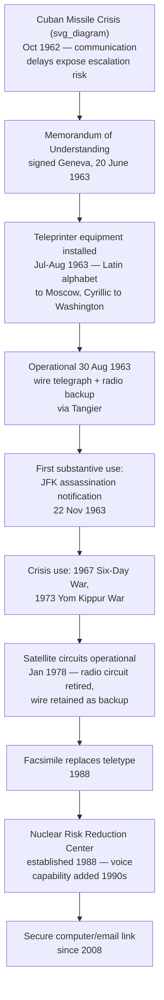

## The Washington-Moscow Direct Communications Link

### Theoretical Foundation

Recall that the reservations dialogue, the démarche, and the various signaling functions of diplomatic protocol all address, in different ways, how states communicate positions and manage relationships through *deliberate, considered* channels operating on ordinary diplomatic timescales — days, weeks, or months. The Washington-Moscow Direct Communications Link (DCL), popularly but inaccurately known as the "hotline," addresses a categorically different problem: how two nuclear-armed adversary states can communicate **rapidly and reliably enough to prevent a crisis from escalating into war through misperception, delay, or technical accident**, rather than through deliberate hostile intent. This distinction is theoretically significant because it identifies a specific, narrow failure mode the DCL was engineered to solve — not general diplomatic communication (which continued through ordinary embassy channels, summit diplomacy, and other means already examined), but the specific risk that in a fast-moving crisis, the *absence* of a reliable, sufficiently rapid communication channel could itself become a cause of war, independent of either side's actual intentions.

### Historical Origin: The Cuban Missile Crisis Communication Failures

The DCL's establishment is directly and explicitly traceable to specific, documented communication failures during the October 1962 Cuban Missile Crisis. The crisis exposed how ambiguous messages and communication delays between President Kennedy and Soviet Premier Khrushchev heightened the risk of nuclear escalation due to misperceptions of intent. During the crisis, official communications between Washington and Moscow relied on normal diplomatic and commercial channels — including, in one widely cited instance, messages transmitted via commercial telegraph services subject to ordinary transmission delays and, on at least one occasion, actual delivery delays measured in hours at a moment when the two governments' understanding of each other's intentions was changing by the hour. This experience convinced both governments that a crisis involving nuclear-armed adversaries required a communication mechanism categorically faster and more reliable than routine diplomatic channels could provide, precisely because the stakes of a multi-hour misunderstanding in such a crisis could be civilization-ending rather than merely diplomatically costly. [grokipedia](https://grokipedia.com/page/Hotline)

### Establishment: The 1963 Memorandum of Understanding

On June 20, 1963, the United States and the Soviet Union signed a Memorandum of Understanding to create a direct communications link aimed at preventing accidental war by enabling rapid, reliable exchanges between leaders. This memorandum — signed in Geneva by the two states' representatives to the Eighteen-Nation Disarmament Committee — is instructive as a treaty-drafting matter precisely because of its chosen instrument form: rather than a formally titled treaty requiring the more elaborate ratification processes examined in the treaty-conclusion chapter of this curriculum, the two governments used a memorandum of understanding, consistent with the general pattern (examined in relation to side letters and MOUs generally) of using lighter-weight instruments for technical, operational arrangements where the parties want rapid implementation and operational flexibility rather than the heavier procedural apparatus a full treaty would entail — an appropriate choice given the DCL's essentially technical and operational, rather than politically declaratory, character. [grokipedia](https://grokipedia.com/page/Hotline)

The official American name for the link is the Direct Communications Link (DCL), with US technicians commonly using the military-style abbreviation "MOLINK" for "Moscow-link." [electrospaces](https://www.electrospaces.net/2012/10/the-washington-moscow-hot-line.html)

### Mechanism: Original Technical Architecture — Deliberately Not a Telephone

Despite its popular characterization as a "red telephone," the hotline was never a telephone line, and no red phones were used. This design choice was itself a deliberate and theoretically significant decision: the system became operational using redundant teletypewriter circuits rather than a direct telephone to ensure reliability amid technical distrust, and, more fundamentally, the hotline was intended for record communications only, based on the idea that spontaneous verbal communications could lead to miscommunications and misperceptions. This is a crisis-communication design principle with genuine ongoing relevance beyond this specific case: a **written, translated, and recorded** communication format forces both the sending leader and the receiving government to formulate a considered, deliberate statement rather than risking the miscommunication potential of spontaneous, unscripted verbal exchange under acute crisis pressure — and, critically, creates a documentary record both governments can refer back to, reducing the risk of later disputes about what was actually communicated. Leaders would dictate their message in their native language, which would then be translated at the receiving end, with each side maintaining two teleprinters with the Latin alphabet and two with the Cyrillic alphabet, and messages sent and received in both Russian and English as a protection against translation errors. [Moscow–Washington hotline +4](https://military-history.fandom.com/wiki/Moscow%E2%80%93Washington_hotline)

On July 13, 1963, the United States sent four sets of Latin-alphabet teleprinters to Moscow for their terminal, delivered via US ambassador Averell Harriman's plane, and a month later, on August 20, the Soviet equipment — four sets of Cyrillic-alphabet teleprinters — arrived in Washington. The cipher machines used to encrypt hotline messages came from Norway — a detail with its own diplomatic significance, since sourcing the encryption equipment from a mutually trusted third party rather than from either superpower's own security services addressed the plausible concern that either side's own cryptographic equipment might not be fully trusted by the other to be free of hidden vulnerabilities. [electrospaces](https://www.electrospaces.net/2012/10/the-washington-moscow-hot-line.html)[electrospaces](https://www.electrospaces.net/2012/10/the-washington-moscow-hot-line.html)

Contrary to popular characterization connecting the White House to the Kremlin, the system's actual American terminal was located in the Pentagon, with the National Military Command Center (NMCC) responsible for the hotline's operation, maintenance, and testing — reflecting the system's design as a military-operational crisis-communication tool rather than a direct head-of-state conversational channel, notwithstanding its popular framing. [wordpress](https://nowweknowem.wordpress.com/2013/08/30/the-moscow-washington-hotline-that-linked-the-pentagon-with-the-kremlin-went-into-operation-today-in-1963/)

### Mechanism: Circuit Routing and Redundancy

The hotline comprised two terminal points, Washington and Moscow, connected by both a full-time duplex wire telegraph circuit with teletype equipment routed via London, Copenhagen, Stockholm, and Helsinki, and a full-time duplex radiotelegraph circuit routed through Tangier, with messages transmitted via the radio circuit if the wire circuit was interrupted. The Washington–London segment was originally carried over TAT-1, the first submarine transatlantic telephone cable. This deliberate dual-path, multi-relay-point architecture reflects a specific engineering response to the same underlying crisis-communication design problem: a single point of technical failure in a system meant to function reliably during the most acute moments of superpower crisis was judged an unacceptable risk, and the routing through multiple third-country relay points (rather than a hypothetical direct undersea or satellite link, technology not yet mature or available in 1963) was the best available redundancy solution given the era's communications technology. [armscontrol](https://www.armscontrol.org/factsheets/hotline-agreements)[wordpress](https://nowweknowem.wordpress.com/2013/08/30/the-moscow-washington-hotline-that-linked-the-pentagon-with-the-kremlin-went-into-operation-today-in-1963/)

### Mechanism: Activation and First Use

The hotline became operational on August 30, 1963, with the transmission of first test messages, Washington sending Moscow the text "The quick brown fox jumped over the lazy dog's back 1234567890" — a pangram deliberately chosen because it used every letter and number key on the teletype machine, allowing both sides to verify each key was in proper working order. The first substantively significant message transmitted over the line was notification of President Kennedy's assassination on November 22, 1963, just months after the DCL became operational. [Electrospaces.net: The Washington-Moscow Hotline +2](https://www.electrospaces.net/2012/10/the-washington-moscow-hot-line.html)

### Mechanism: Subsequent Technical Evolution

The DCL's technology evolved substantially over subsequent decades, reflecting both changing communications technology and lessons drawn from operational experience:

- Two satellite circuits became operational in January 1978, at which point the radio circuit established under the original 1963 agreement was terminated, though the wire telegraph circuit was retained as a backup. [sputniknews](https://en.sputniknews.africa/20230830/1061751607.html)
- The original teletype implementation was replaced by facsimile units in 1988. [fandom](https://military-history.fandom.com/wiki/Moscow%E2%80%93Washington_hotline)
- A separate, related hotline for record communications was established as part of the Nuclear Risk Reduction Center, initiated by President Reagan in 1988, and since the 1990s it has been possible to have a direct voice conversation as an additional capability. [wordpress](https://nowweknowem.wordpress.com/2013/08/30/the-moscow-washington-hotline-that-linked-the-pentagon-with-the-kremlin-went-into-operation-today-in-1963/)
- Since 2008, the Moscow–Washington hotline has operated as a secure computer link over which messages are exchanged by email, reflecting the most recent generational technology shift while preserving the original design principle of written, translated, recorded communication rather than spontaneous verbal exchange. [fandom](https://military-history.fandom.com/wiki/Moscow%E2%80%93Washington_hotline)

### Case Illustration: Subsequent Crisis Use

Beyond its initial establishment, the hotline's primary achievement lies in its role as a stabilizing mechanism during subsequent Cold War flashpoints, facilitating de-escalatory exchanges during the 1967 Six-Day War and the 1973 Yom Kippur War, where U.S. Presidents Lyndon Johnson and Richard Nixon used it to coordinate with Soviet counterparts and avert broader conflict. These episodes are instructive as case studies in crisis diplomacy precisely because they illustrate the DCL functioning as intended: providing a channel through which each superpower could communicate its intentions and constraints to the other rapidly enough to prevent a regional or proxy conflict from escalating into a direct superpower confrontation through misperception of the other side's posture or intentions — the specific risk the 1962 Cuban Missile Crisis experience had identified as the system's core design problem to solve. [grokipedia](https://grokipedia.com/page/Hotline)

### Tactical Implications for the Negotiator/Diplomat

- **The DCL's design — written, translated, recorded communication rather than spontaneous verbal exchange — reflects a durable crisis-communication principle applicable well beyond this specific bilateral case.** Negotiators designing crisis-communication mechanisms for other adversarial or high-stakes bilateral relationships should weigh the same trade-off the DCL's designers confronted: written record communication sacrifices the spontaneity and nuance of live conversation in exchange for reduced miscommunication risk and a stable documentary record, a trade-off particularly valuable in relationships where the parties' baseline mutual trust is low and the stakes of misunderstanding are severe.
- **Instrument-form choice (memorandum of understanding rather than a formally titled, ratification-heavy treaty) proved well-suited to a technical, operational arrangement requiring rapid implementation.** This illustrates the broader point, examined in relation to side letters and MOUs generally, that instrument-form selection should be driven by the arrangement's actual character and implementation needs, not by a reflexive assumption that more significant substantive stakes always require more formal instrument types.
- **Redundant, multi-path technical architecture — avoiding single points of failure — is a design principle with continuing relevance as such mechanisms are modernized.** The DCL's evolution from wire-and-radio redundancy to satellite and eventually secure computer-link technology illustrates the importance of periodically reassessing crisis-communication infrastructure against current technology, since a channel's crisis-reliability value depends on continuing confidence in its technical robustness, not merely its historical establishment.
- **The DCL's demonstrated use during the 1967 and 1973 Middle East crises illustrates that crisis-communication channels between principal adversaries retain value even, and especially, in conflicts where the two principal parties are not the direct belligerents but have interests and client relationships that create genuine escalation risk** — a consideration relevant to contemporary proposals for analogous crisis-communication mechanisms between other pairs of major powers with overlapping regional interests and proxy-conflict exposure.

### Diagram: DCL Technical Evolution Timeline

**Related Topics**

- The Nuclear Risk Reduction Center and its relationship to the original DCL mechanism
- Crisis-communication design principles: written/recorded versus spontaneous verbal channels
- The 1962 Cuban Missile Crisis as the formative case for Cold War crisis-management architecture
- Side letters and memoranda of understanding as instrument-form choices for technical arrangements
- Analogous hotline mechanisms between other major-power pairs in contemporary practice
- Track II and back-channel diplomacy as complementary, non-technical crisis-communication tools