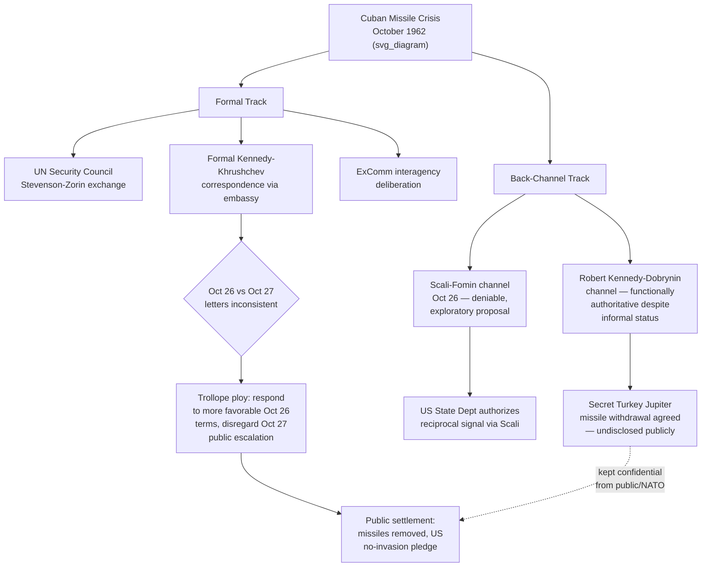

## Back-Channel Negotiation During the Cuban Missile Crisis

### Theoretical Foundation

Recall that the Washington-Moscow Direct Communications Link was established specifically to address the crisis-communication failures the Cuban Missile Crisis exposed between the two superpowers' *formal* governmental channels. The crisis itself, however, is at least as significant for what it demonstrates about **back-channel negotiation** — communication conducted outside a government's normal, formally accredited diplomatic apparatus, typically through trusted intermediaries operating with informal or deniable authorization, run in parallel with, rather than as a substitute for, ordinary diplomatic channels. **Define on first use**: a **back channel** is an informal, often secret or semi-secret, communication pathway between governments that operates outside the ordinary accredited diplomatic mission structure, typically used when the formal channel is judged too slow, too exposed to bureaucratic process or leaks, too constrained by the need for interagency coordination, or too laden with the accumulated positional rigidity that formal diplomatic exchanges — conducted on the record, subject to interagency clearance, and shaped by each side's need to avoid public retreat from previously stated positions — can generate, particularly under acute time pressure.

The theoretical case for back-channel negotiation rests on a structural feature of formal diplomacy already examined in this curriculum: formal diplomatic communication (a démarche delivered through accredited channels, a note verbale exchanged between foreign ministries) carries genuine value precisely because of its attributable, official, on-the-record character — but this same character imposes costs in a fast-moving crisis, since formal communications typically require interagency clearance, are more likely to leak or be observed by the counterpart's intelligence services (revealing positions or flexibility a leader may not wish to disclose prematurely), and, once made through a formal, attributable channel, are harder to walk back without public loss of face. A back channel trades away formal attributability and official status in exchange for speed, confidentiality, and — critically — the ability to explore potential compromise positions on a deniable, non-binding basis before either side commits to them through the formal channel, where a rejected or unsuccessful trial balloon can be disavowed rather than becoming a matter of public diplomatic record.

### Mechanism: The Scali-Fomin Channel

The most extensively documented back channel during the Cuban Missile Crisis operated through American Broadcasting Company (ABC) television news correspondent **John Scali** and **Aleksandr Fomin** (a KGB officer operating under diplomatic cover as counselor at the Soviet embassy in Washington, whom Scali had cultivated as a journalistic contact). On October 26, 1962 — during the most acute phase of the crisis, after US reconnaissance had confirmed Soviet missile installations in Cuba and while the US naval quarantine was in effect — Fomin contacted Scali and, in a meeting at a Washington restaurant, proposed a potential resolution framework: Soviet withdrawal of the missiles from Cuba under UN supervision, in exchange for a US public pledge not to invade Cuba. Scali relayed this proposal to the US State Department, which recognized its significance and directed Scali to convey back to Fomin, through the same informal channel, that the US government was seriously interested in such an arrangement.

This episode is instructive precisely because of its structurally deniable character: Fomin was not operating through the Soviet ambassador or any other formally accredited channel, and Scali was not a US government official — the channel allowed both governments to explore, on a genuinely deniable basis, whether a settlement along these lines was achievable, without either government committing itself through a formal diplomatic communication that would be considerably harder to walk back if the exploration proved unsuccessful or if either side's principal leadership rejected the terms once formally presented. The proposal explored through this channel closely paralleled, and is generally understood in the historical literature as having directly informed, the terms of the crisis's eventual public resolution — though subsequent scholarship has debated the precise degree to which the Scali-Fomin channel reflected authorized Kremlin policy as opposed to a more independent or exploratory KGB initiative, a genuine ambiguity that itself illustrates a recurring risk inherent in back-channel diplomacy generally, discussed further below.

### Mechanism: The Robert Kennedy-Dobrynin Channel

A second, more explicitly authoritative back channel operated through **Attorney General Robert F. Kennedy** (the President's brother, occupying no formal diplomatic role but possessing unmistakable direct access to and authorization from President Kennedy) and **Soviet Ambassador Anatoly Dobrynin**. This channel is distinguishable from the Scali-Fomin channel in a legally and diplomatically significant respect: although conducted outside the formal Department of State negotiating apparatus and outside the direct oversight of Secretary of State Dean Rusk's formal channel, the Kennedy-Dobrynin exchanges involved an individual (Robert Kennedy) whose closeness to the President gave his communications a functionally authoritative character despite his lack of formal diplomatic accreditation or State Department role — meaning this channel occupied an intermediate position between a fully deniable, informal back channel (Scali-Fomin) and the fully formal diplomatic apparatus, since Dobrynin could reasonably treat Robert Kennedy's statements as carrying direct presidential authorization even though the channel itself remained outside ordinary diplomatic protocol.

The Kennedy-Dobrynin channel was the vehicle through which the crisis's actual final resolution terms were communicated and confirmed, including the critical, explicitly secret element of the settlement: a US commitment to remove Jupiter intermediate-range ballistic missiles from Turkey within several months, an element the two governments **deliberately agreed to keep confidential** and did not disclose publicly at the time, precisely because the US did not wish the settlement's public framing to appear as a direct missile-for-missile trade (which could have been read domestically and among NATO allies as US capitulation, or as unilaterally compromising Turkish and broader NATO security interests without adequate consultation), while the Soviet side, for its own reasons connected to its broader positioning within the crisis's public narrative, did not object to this asymmetric public presentation. This secret element of the settlement — confirmed to the public and to historians only considerably later — is a paradigmatic illustration of a broader diplomatic technique already discussed in this curriculum, **constructive ambiguity** and its close relative, the use of a **side letter or unminuted understanding** to record a genuine commitment the parties do not wish to appear in the primary public settlement — here operationalized through an entirely informal, oral, back-channel exchange rather than any written instrument at all.

### Mechanism: Why Back Channels Proved Necessary Despite Active Formal Diplomatic Engagement

The Cuban Missile Crisis is instructive precisely because back-channel negotiation operated **in parallel with**, not instead of, extensive formal diplomatic activity — the crisis saw active exchanges through the UN Security Council (where US Ambassador Adlai Stevenson's confrontation with Soviet Ambassador Valerian Zorin over reconnaissance-photo evidence of the missile installations was a significant public diplomatic event in its own right), formal letters exchanged between Kennedy and Khrushchev through ordinary embassy channels, and extensive interagency deliberation within the US government's formally constituted crisis-management body, the Executive Committee of the National Security Council (ExComm). The back channels functioned as a **supplementary, faster, and more flexible mechanism** operating alongside this formal apparatus, precisely because the formal channels — while indispensable for establishing the crisis's public record, for engaging allies and the broader international community through the UN, and for the authoritative exchange of the two leaders' formal positions — were not well-suited to the specific task the back channels performed: rapidly exploring, on a deniable basis, whether a particular compromise framework might be acceptable to the other side before either government committed to that framework through the formal, harder-to-reverse diplomatic record.

A further complication the back-channel record illustrates concerns **message inconsistency across channels operating simultaneously under time pressure**: on October 26, 1962 (the same day as the Scali-Fomin exchange), a formal letter from Khrushchev proposing terms along similar lines to the Fomin proposal arrived through ordinary channels, but was followed on October 27 by a second, more formal and more demanding Soviet communication (broadcast publicly on Moscow radio, adding a demand for the removal of US Jupiter missiles from Turkey as an explicit, public condition, rather than an informally offered element) — creating a genuine and difficult problem for US crisis managers, who had to decide how to respond given apparently inconsistent signals arriving through different channels within a 24-hour period. The eventual American approach — sometimes called the **"Trollope ploy"** after a device used in Anthony Trollope's novels, in which a Victorian-era suitor's ambiguous words are deliberately construed by his intended as an actual marriage proposal — involved the US deliberately choosing to respond substantively to the more favorable October 26 letter while effectively disregarding the more demanding October 27 communication's public terms, a considered diplomatic choice to select the more workable of two inconsistent signals from the same adversary rather than treating the more recent or more public communication as necessarily superseding the earlier one.

### Tactical Implications for the Negotiator

- **Back channels should be understood as a deliberate complement to formal diplomacy, valuable specifically for exploring compromise positions on a deniable basis before formal commitment, not as a substitute for maintaining robust formal channels.** The Cuban Missile Crisis illustrates that even a crisis resolved substantially through back-channel exploration still required the formal apparatus (UN Security Council engagement, formal leader-to-leader correspondence, interagency deliberation) to establish the crisis's public record and to formally ratify and implement what the back channels had explored.
- **The choice of back-channel intermediary carries significant consequences for the channel's perceived authority and reliability, and negotiators should assess this deliberately.** The Kennedy-Dobrynin channel's greater authoritativeness relative to the more genuinely deniable Scali-Fomin channel reflects the difference between an intermediary with unmistakable direct access to top leadership (even without formal diplomatic role) and one whose authorization remains genuinely ambiguous — a negotiator establishing a back channel should recognize this trade-off between deniability (favoring a more distant, less obviously authoritative intermediary) and reliability (favoring a closer, more clearly authorized one).
- **A negotiator managing multiple simultaneous communication channels during a fast-moving crisis should anticipate the genuine risk of message inconsistency across channels, and should develop a deliberate framework for resolving apparent contradictions** — the Trollope ploy illustrates that selecting the more workable of two inconsistent adversary signals, rather than mechanically treating the most recent or most formal communication as controlling, can itself be a valid and consequential diplomatic technique under acute time pressure.
- **Secret or undisclosed elements of a settlement, of the kind negotiated through the Kennedy-Dobrynin channel regarding the Turkish Jupiter missiles, carry durable historical and alliance-management risk that should be weighed deliberately against their immediate crisis-resolution value.** A negotiator agreeing to keep a settlement element confidential from allies or domestic audiences should recognize that such elements are frequently eventually disclosed (as the Jupiter missile withdrawal was, considerably after the fact), with potential consequences for alliance trust and negotiator credibility once the concealment becomes known, even where the concealment served legitimate crisis-management purposes at the time.

### Diagram: Parallel Formal and Back-Channel Tracks During the Crisis

**Related Topics**

- The Trollope ploy as a technique for resolving inconsistent adversary signals under time pressure
- The Washington-Moscow Direct Communications Link as the crisis's formal-channel technological legacy
- Constructive ambiguity and undisclosed settlement elements as a recurring diplomatic technique
- Track II diplomacy and its distinction from authorized government back channels
- The ExComm as a model for formally constituted crisis-management decision bodies
- Secret side agreements and their durable disclosure and alliance-management risks