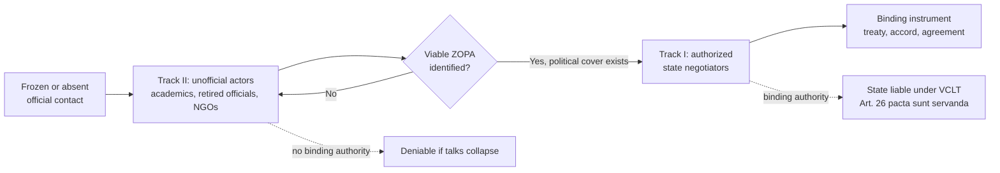

## Track I versus Track II Diplomacy

### Definitions and the Taxonomy's Origin

The Track I/Track II distinction originates in a 1981 Foreign Policy article by U.S. diplomat Joseph Montville, who coined "Track Two diplomacy" to describe unofficial, non-governmental interaction distinct from official state-to-state relations. **Track I diplomacy** is negotiation, communication, or coercive signaling conducted by authorized representatives of sovereign states or intergovernmental organizations acting in their official capacity, with the authority to make binding commitments. **Track II diplomacy** is conducted by non-official actors — academics, retired officials, religious leaders, NGO representatives, or businesspeople — who lack the authority to bind their governments but who exchange ideas, build relationships, and explore options that official channels cannot yet risk exploring.

The core structural difference is one of **authority and deniability**. A Track I negotiator's statements are attributable to the state and can create legal or political expectations (relevant here is the doctrine of unilateral declarations creating obligations, as recognized in the ICJ's *Nuclear Tests* cases). A Track II participant's statements carry no such attribution; if a proposal floated at a Track II meeting proves unacceptable, the government can disavow it without cost, since the participant never had the authority to commit the state in the first place.

### Theoretical Grounding: Why Track II Exists

Track II's value proposition rests on a negotiation-theory problem: **domestic and international audience costs**. A government official who is seen exploring a compromise position — even hypothetically — pays a political price if that exploration becomes public and the compromise later collapses. This is a variant of the "two-level game" framework (Putnam, 1988), in which negotiators must simultaneously satisfy an international counterpart (Level I) and a domestic ratification constituency (Level II). Official exploratory contact narrows a negotiator's *win-set* — the range of outcomes their domestic constituency will ratify — because any concession explored on the record becomes a data point domestic hardliners can weaponize.

Track II sidesteps this by removing attribution. Because Track II participants are not empowered to commit their states, floating an idea at a Track II workshop does not shrink either government's official win-set. This makes Track II a mechanism for **testing the shape of a possible Zone of Possible Agreement (ZOPA)** — the range of terms in which both parties' BATNAs (best alternative to a negotiated agreement — the outcome a party accepts if no deal is reached) are exceeded — without either side incurring the political cost of an official proposal.

### Track II Mechanisms in Practice

Track II typically operates through:

- **Problem-solving workshops**: small, sustained, facilitated dialogues among influential non-officials from opposing sides, often run by academic institutions, aimed at reframing how each side understands the other's interests rather than negotiating specific terms.
- **Interpretive/back-channel messaging**: retired officials or trusted intermediaries carry informal signals between governments that neither wants to send through formal diplomatic notes, because a formal démarche (a formal diplomatic representation or protest delivered through official channels) creates a paper trail and an expectation of response.
- **Norwegian-model facilitation**: a small state or NGO with limited strategic interest of its own provides a neutral, low-visibility venue, betting that discretion itself is the value-add.

### Case Study: The Oslo Channel (1992–1993)

The clearest documented case of Track II converting into Track I is the secret Israeli-Palestinian talks that produced the Oslo Accords. Beginning in January 1992, Norwegian academics Terje Rød-Larsen and Marianne Heiberg (Fafo Institute) convened informal, unofficial contacts between Israeli academics (Yair Hirschfeld, Ron Pundak) and PLO officials (Ahmed Qurei). Because Israeli law at the time formally criminalized contact with the PLO, the unofficial status of the initial meetings was not merely diplomatic convenience but a **legal necessity** — Track II was the only channel available. As the talks progressed and produced a viable draft framework, Israel's Deputy Foreign Minister Yossi Beilin authorized the upgrade to a quasi-official channel, and by May 1993 Foreign Ministry Legal Adviser Joel Singer joined, converting the process to Track I. The Declaration of Principles was signed in Washington on September 13, 1993. The case illustrates the canonical Track II-to-Track I handoff: unofficial actors build a framework and establish that a ZOPA exists; once political cover is available, Track I actors take over to finalize binding terms.

### Case Study: Pugwash Conferences and Nuclear Arms Control

The Pugwash Conferences on Science and World Affairs, founded in 1957 following the Russell-Einstein Manifesto, brought together scientists from NATO and Warsaw Pact states during periods when official contact was frozen. Pugwash participants are widely credited with contributing technical groundwork that fed into the 1963 Partial Test Ban Treaty and the 1972 Anti-Ballistic Missile Treaty, by allowing scientists — who retained technical credibility and often personal relationships with policymakers — to work through verification and technical feasibility questions that official negotiators could not discuss without prematurely signaling negotiating positions. Pugwash received the 1995 Nobel Peace Prize for this role.

### The Effectiveness Debate

**The optimistic case**: Track II's proponents (Montville, Herbert Kelman's interactive problem-solving school) argue it changes the underlying psychology of conflict — reducing dehumanization, building trust networks among future leaders, and generating substantive options that later become Track I fallback positions when official talks stall. The Oslo case is the strongest evidentiary anchor: it produced a signed, binding agreement that official channels had been unable to reach after decades of the Madrid Conference framework.

**The skeptical case**: Critics (notably realist scholars and some practitioners) argue Track II has no power to bind anyone and can be actively counterproductive. Three specific critiques recur in the literature:

1. **Ratification failure risk**: because Track II negotiators are typically drawn from more moderate, dialogue-inclined segments of a society, agreements they informally reach may not reflect what hardline domestic constituencies will actually ratify — precisely the two-level-game failure mode Track II is meant to avoid. Oslo itself is cited on both sides of this debate: the accords were signed, but the "spoiler" dynamics that followed (culminating in Rabin's 1995 assassination) are argued by critics to show Track II built elite consensus without adequate domestic buy-in.
2. **Legitimization without leverage**: authoritarian or non-state actors can use Track II access to gain international legitimacy and information about the other side's thinking without any obligation to reciprocate concessions, since they've made no binding commitment.
3. **Signal confusion**: multiple simultaneous Track II channels involving different informal actors can generate contradictory signals that official negotiators must then spend effort disentangling, an inefficiency largely absent from a single authorized Track I channel.

[Inference] Track II is generally best understood not as a substitute for Track I but as a mechanism that shifts the timing and cost structure of exploratory bargaining, most effective as a precursor or supplement to formal negotiation rather than as an independent path to a binding outcome.

### Comparative Structure

### Track I vs. Track II Attributes (svg_diagram)

<svg xmlns="http://www.w3.org/2000/svg" viewBox="0 0 760 340" font-family="Helvetica, Arial, sans-serif">
<text x="380" y="28" text-anchor="middle" font-size="18" font-weight="bold" fill="#1a1a1a">Track I vs. Track II Diplomacy (svg_diagram)</text>
<rect x="30" y="55" width="330" height="255" rx="8" fill="#eaf2fb" stroke="#3a6ea5" stroke-width="1.5" />
<text x="195" y="82" text-anchor="middle" font-size="15" font-weight="bold" fill="#1a3a5c">Track I</text>
<text x="55" y="112" font-size="12" fill="#222">• Actors: authorized state officials</text>
<text x="55" y="136" font-size="12" fill="#222">• Authority: can bind the state</text>
<text x="55" y="160" font-size="12" fill="#222">• Attribution: public, on-record</text>
<text x="55" y="184" font-size="12" fill="#222">• Legal effect: creates obligations</text>
<text x="55" y="208" font-size="12" fill="#222"> under VCLT Art. 26, 46</text>
<text x="55" y="232" font-size="12" fill="#222">• Audience cost: high (Putnam</text>
<text x="55" y="256" font-size="12" fill="#222"> two-level game, Level II)</text>
<text x="55" y="280" font-size="12" fill="#222">• Example: Camp David Accords</text>
<text x="55" y="298" font-size="12" fill="#222"> negotiators (Carter, Sadat, Begin)</text>
<rect x="400" y="55" width="330" height="255" rx="8" fill="#fbeee6" stroke="#a5623a" stroke-width="1.5" />
<text x="565" y="82" text-anchor="middle" font-size="15" font-weight="bold" fill="#5c341a">Track II</text>
<text x="425" y="112" font-size="12" fill="#222">• Actors: academics, retired officials,</text>
<text x="425" y="130" font-size="12" fill="#222"> NGOs, businesspeople</text>
<text x="425" y="154" font-size="12" fill="#222">• Authority: cannot bind the state</text>
<text x="425" y="178" font-size="12" fill="#222">• Attribution: deniable, off-record</text>
<text x="425" y="202" font-size="12" fill="#222">• Legal effect: none (no state</text>
<text x="425" y="220" font-size="12" fill="#222"> consent to be bound expressed)</text>
<text x="425" y="244" font-size="12" fill="#222">• Audience cost: low</text>
<text x="425" y="268" font-size="12" fill="#222">• Example: Fafo-brokered Oslo</text>
<text x="425" y="286" font-size="12" fill="#222"> back-channel, 1992–93</text>
</svg>

### Legal Threshold: When Track II Becomes Track I

The dispositive question in any given channel is not *who* is talking but whether a state has expressed **consent to be bound**, per VCLT Article 11, which permits consent to be expressed "by signature, exchange of instruments, ratification, acceptance, approval or accession." A Track II conversation, however substantively advanced, produces no instrument capable of triggering Article 11 unless and until a state actor with full powers (VCLT Art. 7 — an instrument showing a person is authorized to represent the state for adopting or authenticating treaty text) formally adopts it. This is precisely why the Oslo process required Joel Singer's entry as a government legal adviser before the Declaration of Principles could be authenticated and signed: no amount of Track II convergence substitutes for the formal authority Article 7 requires.

**Related Topics**

- Two-level games and the domestic ratification constraint (Putnam framework)
- BATNA and ZOPA analysis in pre-negotiation diplomacy
- VCLT Articles 7, 11, and 26: full powers, consent to be bound, and pacta sunt servanda
- Track 1.5 diplomacy (hybrid official/unofficial formats)
- Secret back-channel negotiations as a distinct crisis-diplomacy tool
- Interactive conflict resolution (Kelman) and problem-solving workshop methodology